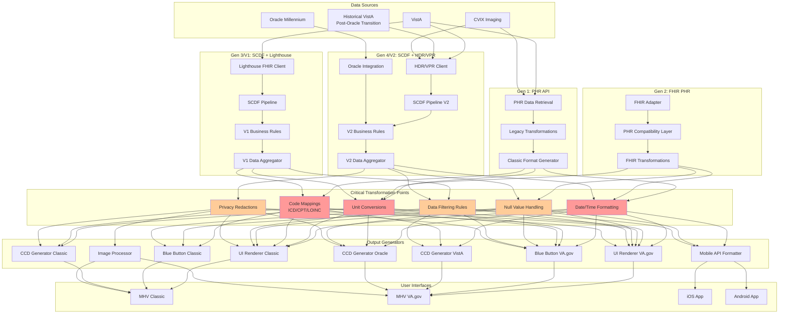
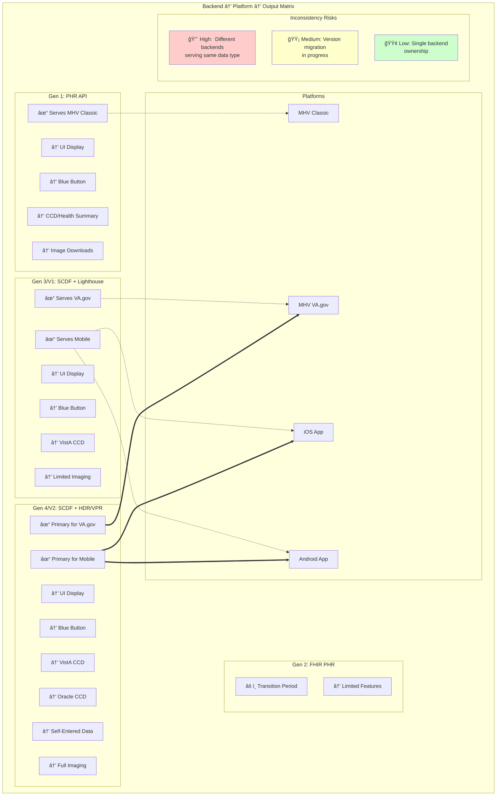
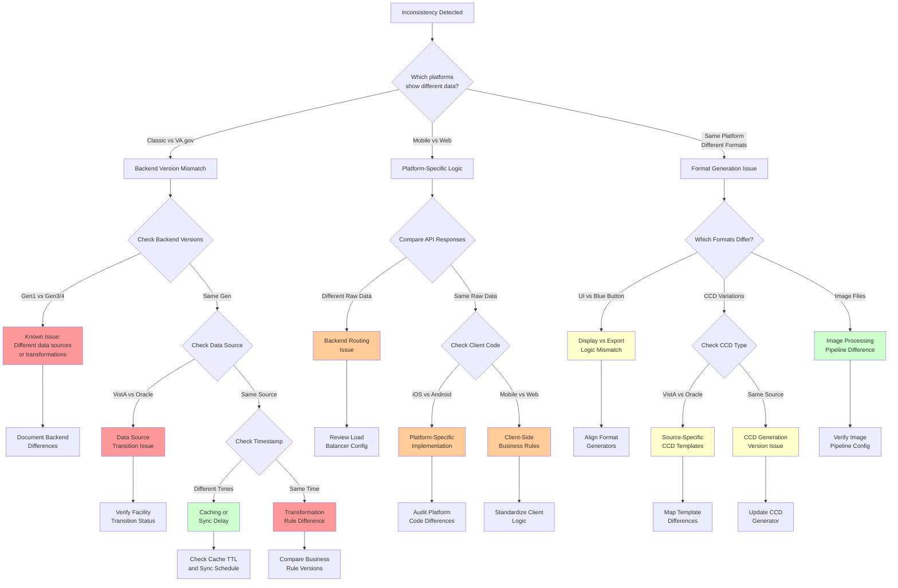
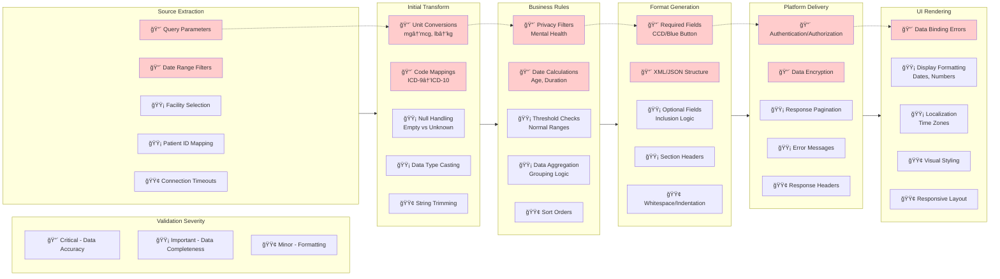

# Data Consistency Analysis - VA Health Data Systems

## Purpose

This analysis identifies and flags inconsistencies that would impact data presented in three different formats on four different platforms, based on the data sources, backend, middleware, and user interface layers, and variations in transformations and business rules applied in any of those layers to clearly identify discrepancies in the final user-facing outputs.

## System Overview

### Platforms
- **My HealtheVet Classic**: URLs starting with myhealth.va.gov
- **My HealtheVet on VA.gov**: URLs starting with va. gov/my-health
- **VA Health and Benefits mobile application for iOS**
- **VA Health and Benefits mobile application for Android**

### Native Data Sources
- **VistA**:  For VA facilities that have not transitioned to Oracle, and potentially for historical VistA data for facilities that have
- **Oracle Millennium**: For facilities that have transitioned to Oracle
- **CVIX**: For imaging data

### Data Presentation Formats
- In the user interface on My HealtheVet Classic
- In the user interface on My HealtheVet on VA. gov
- In a Blue Button report on My HealtheVet Classic
- In a Blue Button report on My HealtheVet on VA.gov
- In a CCD/VA Health Summary on My HealtheVet Classic
- In a VistA-derived CCD on My HealtheVet on VA.gov
- In an Oracle-derived CCD on My HealtheVet on VA.gov
- In a self-entered data file on My HealtheVet on VA.gov
- In an image download file on My HealtheVet Classic
- In an image download file on My HealtheVet on VA.gov

### Backend Generations
- **1st Gen**: Used the PHR API on My HealtheVet Classic
- **2nd Gen**: Used a FHIR-compatible version of the PHR API
- **3rd Gen (V1)**: Used a Spring Cloud Data Flow (SCDF) backend that got VistA data through Lighthouse Patient Health API (FHIR)
- **4th Gen (V2)**: Uses a Spring Cloud Data Flow (SCDF) backend that gets VistA data from HDR/VPR

## 1.  Detailed Data Flow Diagram

```mermaid
flowchart TD
    %% Data Sources
    subgraph Sources["Data Sources"]
        V[VistA]
        O[Oracle Millennium]
        C[CVIX Imaging]
        H[Historical VistA<br/>Post-Oracle Transition]
    end

    %% Backend Processing
    subgraph Backend1["Gen 1: PHR API"]
        B1A[PHR Data Retrieval]
        B1B[Legacy Transformations]
        B1C[Classic Format Generator]
    end

    subgraph Backend2["Gen 2: FHIR PHR"]
        B2A[FHIR Adapter]
        B2B[PHR Compatibility Layer]
        B2C[FHIR Transformations]
    end

    subgraph Backend3["Gen 3/V1: SCDF + Lighthouse"]
        B3A[Lighthouse FHIR Client]
        B3B[SCDF Pipeline]
        B3C[V1 Business Rules]
        B3D[V1 Data Aggregator]
    end

    subgraph Backend4["Gen 4/V2: SCDF + HDR/VPR"]
        B4A[HDR/VPR Client]
        B4B[SCDF Pipeline V2]
        B4C[V2 Business Rules]
        B4D[V2 Data Aggregator]
        B4E[Oracle Integration]
    end

    %% Transformation Points
    subgraph Transform["Critical Transformation Points"]
        T1[Date/Time Formatting]
        T2[Unit Conversions]
        T3[Code Mappings<br/>ICD/CPT/LOINC]
        T4[Null Value Handling]
        T5[Data Filtering Rules]
        T6[Privacy Redactions]
    end

    %% Output Generation
    subgraph Outputs["Output Generators"]
        OG1[UI Renderer Classic]
        OG2[UI Renderer VA.gov]
        OG3[Blue Button Classic]
        OG4[Blue Button VA.gov]
        OG5[CCD Generator Classic]
        OG6[CCD Generator VistA]
        OG7[CCD Generator Oracle]
        OG8[Mobile API Formatter]
        OG9[Image Processor]
    end

    %% User Interfaces
    subgraph UI["User Interfaces"]
        UIC[MHV Classic]
        UIV[MHV VA.gov]
        UII[iOS App]
        UIA[Android App]
    end

    %% Data Flow Connections
    V --> B1A
    V --> B3A
    V --> B4A
    H --> B4A
    O --> B4E
    C --> B1A
    C --> B4A

    B1A --> B1B --> B1C
    B2A --> B2B --> B2C
    B3A --> B3B --> B3C --> B3D
    B4A --> B4B --> B4C --> B4D
    B4E --> B4C

    B1C --> T1 & T2 & T3
    B2C --> T1 & T2 & T4
    B3D --> T2 & T3 & T5
    B4D --> T1 & T4 & T5 & T6

    T1 & T2 & T3 & T4 & T5 & T6 --> OG1
    T1 & T2 & T3 & T4 & T5 & T6 --> OG2
    T3 & T4 & T5 --> OG3
    T1 & T2 & T3 & T4 & T5 & T6 --> OG4
    T2 & T3 & T6 --> OG5
    T1 & T3 & T5 --> OG6
    T1 & T2 & T4 & T6 --> OG7
    T1 & T4 & T5 --> OG8
    T6 --> OG9

    OG1 --> UIC
    OG2 --> UIV
    OG3 --> UIC
    OG4 --> UIV
    OG5 --> UIC
    OG6 --> UIV
    OG7 --> UIV
    OG8 --> UII & UIA
    OG9 --> UIC & UIV

    %% Highlight inconsistency risks
    style T1 fill:#ff9999
    style T2 fill:#ff9999
    style T3 fill:#ff9999
    style T4 fill:#ffcc99
    style T5 fill:#ffcc99
    style T6 fill:#ffcc99
```

## 2. Backend-Platform Comparison Matrix

```mermaid
graph TB
    subgraph Matrix["Backend → Platform → Output Matrix"]
        %% Column Headers
        subgraph Platforms["Platforms"]
            P1[MHV Classic]
            P2[MHV VA.gov]
            P3[iOS App]
            P4[Android App]
        end

        %% Backend Gen 1
        subgraph G1["Gen 1: PHR API"]
            G1P1[✓ Serves MHV Classic]
            G1O1[→ UI Display]
            G1O2[→ Blue Button]
            G1O3[→ CCD/Health Summary]
            G1O4[→ Image Downloads]
        end

        %% Backend Gen 2
        subgraph G2["Gen 2: FHIR PHR"]
            G2P1[âš ï¸ Transition Period]
            G2O1[→ Limited Features]
        end

        %% Backend Gen 3/V1
        subgraph G3["Gen 3/V1: SCDF + Lighthouse"]
            G3P1[✓ Serves VA.gov]
            G3P2[✓ Serves Mobile]
            G3O1[→ UI Display]
            G3O2[→ Blue Button]
            G3O3[→ VistA CCD]
            G3O4[→ Limited Imaging]
        end

        %% Backend Gen 4/V2
        subgraph G4["Gen 4/V2: SCDF + HDR/VPR"]
            G4P1[✓ Primary for VA.gov]
            G4P2[✓ Primary for Mobile]
            G4O1[→ UI Display]
            G4O2[→ Blue Button]
            G4O3[→ VistA CCD]
            G4O4[→ Oracle CCD]
            G4O5[→ Self-Entered Data]
            G4O6[→ Full Imaging]
        end

        %% Risk Indicators
        subgraph Risks["Inconsistency Risks"]
            R1[🔴 High:  Different backends<br/>serving same data type]
            R2[🟡 Medium: Version migration<br/>in progress]
            R3[🟢 Low: Single backend<br/>ownership]
        end

        %% Connections
        G1P1 -.-> P1
        G3P1 -.-> P2
        G3P2 -.-> P3
        G3P2 -.-> P4
        G4P1 ==> P2
        G4P2 ==> P3
        G4P2 ==> P4

        style R1 fill:#ffcccc
        style R2 fill:#ffffcc
        style R3 fill:#ccffcc
    end
```

## 3. Inconsistency Troubleshooting Flowchart

```mermaid
flowchart TD
    Start[Inconsistency Detected]
    
    Start --> Q1{Which platforms<br/>show different data?}
    
    Q1 -->|Classic vs VA.gov| Path1[Backend Version Mismatch]
    Q1 -->|Mobile vs Web| Path2[Platform-Specific Logic]
    Q1 -->|Same Platform<br/>Different Formats| Path3[Format Generation Issue]
    
    Path1 --> C1{Check Backend Versions}
    C1 -->|Gen1 vs Gen3/4| Fix1[Known Issue: <br/>Different data sources<br/>or transformations]
    C1 -->|Same Gen| C2{Check Data Source}
    
    C2 -->|VistA vs Oracle| Fix2[Data Source<br/>Transition Issue]
    C2 -->|Same Source| C3{Check Timestamp}
    C3 -->|Different Times| Fix3[Caching or<br/>Sync Delay]
    C3 -->|Same Time| Fix4[Transformation<br/>Rule Difference]
    
    Path2 --> C4{Compare API Responses}
    C4 -->|Different Raw Data| Fix5[Backend Routing<br/>Issue]
    C4 -->|Same Raw Data| C5{Check Client Code}
    C5 -->|iOS vs Android| Fix6[Platform-Specific<br/>Implementation]
    C5 -->|Mobile vs Web| Fix7[Client-Side<br/>Business Rules]
    
    Path3 --> C6{Which Formats Differ?}
    C6 -->|UI vs Blue Button| Fix8[Display vs Export<br/>Logic Mismatch]
    C6 -->|CCD Variations| C7{Check CCD Type}
    C7 -->|VistA vs Oracle| Fix9[Source-Specific<br/>CCD Templates]
    C7 -->|Same Source| Fix10[CCD Generation<br/>Version Issue]
    C6 -->|Image Files| Fix11[Image Processing<br/>Pipeline Difference]
    
    %% Resolution Steps
    Fix1 --> R1[Document Backend<br/>Differences]
    Fix2 --> R2[Verify Facility<br/>Transition Status]
    Fix3 --> R3[Check Cache TTL<br/>and Sync Schedule]
    Fix4 --> R4[Compare Business<br/>Rule Versions]
    Fix5 --> R5[Review Load<br/>Balancer Config]
    Fix6 --> R6[Audit Platform<br/>Code Differences]
    Fix7 --> R7[Standardize Client<br/>Logic]
    Fix8 --> R8[Align Format<br/>Generators]
    Fix9 --> R9[Map Template<br/>Differences]
    Fix10 --> R10[Update CCD<br/>Generator]
    Fix11 --> R11[Verify Image<br/>Pipeline Config]
    
    %% Severity Coloring
    style Fix1 fill:#ff9999
    style Fix2 fill:#ff9999
    style Fix4 fill:#ff9999
    style Fix5 fill:#ffcc99
    style Fix6 fill:#ffcc99
    style Fix7 fill:#ffcc99
    style Fix8 fill:#ffffcc
    style Fix9 fill:#ffffcc
    style Fix10 fill:#ffffcc
    style Fix3 fill:#ccffcc
    style Fix11 fill:#ccffcc
```

## 4. Data Validation Checkpoint Visualization

```mermaid
graph LR
    subgraph Legend["Validation Severity"]
        L1[🔴 Critical - Data Accuracy]
        L2[🟡 Important - Data Completeness]
        L3[🟢 Minor - Formatting]
    end

    subgraph Stage1["Source Extraction"]
        S1A[🔴 Query Parameters]
        S1B[🔴 Date Range Filters]
        S1C[🟡 Facility Selection]
        S1D[🟡 Patient ID Mapping]
        S1E[🟢 Connection Timeouts]
    end

    subgraph Stage2["Initial Transform"]
        S2A[🔴 Unit Conversions<br/>mg→mcg, lb→kg]
        S2B[🔴 Code Mappings<br/>ICD-9→ICD-10]
        S2C[🟡 Null Handling<br/>Empty vs Unknown]
        S2D[🟡 Data Type Casting]
        S2E[🟢 String Trimming]
    end

    subgraph Stage3["Business Rules"]
        S3A[🔴 Privacy Filters<br/>Mental Health]
        S3B[🔴 Date Calculations<br/>Age, Duration]
        S3C[🟡 Threshold Checks<br/>Normal Ranges]
        S3D[🟡 Data Aggregation<br/>Grouping Logic]
        S3E[🟢 Sort Orders]
    end

    subgraph Stage4["Format Generation"]
        S4A[🔴 Required Fields<br/>CCD/Blue Button]
        S4B[🔴 XML/JSON Structure]
        S4C[🟡 Optional Fields<br/>Inclusion Logic]
        S4D[🟡 Section Headers]
        S4E[🟢 Whitespace/Indentation]
    end

    subgraph Stage5["Platform Delivery"]
        S5A[🔴 Authentication/Authorization]
        S5B[🔴 Data Encryption]
        S5C[🟡 Response Pagination]
        S5D[🟡 Error Messages]
        S5E[🟢 Response Headers]
    end

    subgraph Stage6["UI Rendering"]
        S6A[🔴 Data Binding Errors]
        S6B[🟡 Display Formatting<br/>Dates, Numbers]
        S6C[🟡 Localization<br/>Time Zones]
        S6D[🟢 Visual Styling]
        S6E[🟢 Responsive Layout]
    end

    %% Flow
    Stage1 --> Stage2
    Stage2 --> Stage3
    Stage3 --> Stage4
    Stage4 --> Stage5
    Stage5 --> Stage6

    %% Critical Path Highlighting
    S1A -.-> S2A
    S2A -.-> S3A
    S3A -.-> S4A
    S4A -.-> S5A
    S5A -.-> S6A

    style S1A fill:#ffcccc
    style S1B fill:#ffcccc
    style S2A fill:#ffcccc
    style S2B fill:#ffcccc
    style S3A fill:#ffcccc
    style S3B fill:#ffcccc
    style S4A fill:#ffcccc
    style S4B fill:#ffcccc
    style S5A fill:#ffcccc
    style S5B fill:#ffcccc
    style S6A fill:#ffcccc
```

## Summary and Recommendations

Based on these diagrams, here are the key areas where inconsistencies are most likely to occur:

### Critical Risk Areas (🔴 High Priority)
1. **Backend Version Differences**:  Different generations serving the same data type
2. **Data Source Transitions**:  VistA to Oracle migrations creating temporal inconsistencies
3. **Transformation Rules**: Unit conversions, code mappings, and privacy filters applied differently
4. **Required Field Handling**: Different backends may have different validation rules

### Medium Risk Areas (🟡 Monitor Closely)
1. **Platform-Specific Logic**: iOS vs Android vs Web implementations
2. **Caching and Sync Delays**: Different refresh rates across platforms
3. **Null Value Handling**:  Inconsistent treatment of missing data
4. **Format Generation**: Different templates for same output type

### Lower Risk Areas (🟢 Standard Checks)
1. **Display Formatting**: Date/time formats, number precision
2. **Sort Orders**:  Different default ordering
3. **Response Pagination**: Different page sizes
4. **Visual Styling**: CSS/layout differences

### Recommended Validation Strategy
1. **Implement checkpoints** at each transformation stage
2. **Create test accounts** with known data across all facility types
3. **Build automated comparisons** between platforms for same patient/date ranges
4. **Document all business rule versions** and their deployment locations
5. **Establish a single source of truth** for each data type during transition periods

These diagrams should help identify where to focus your consistency analysis efforts and provide a framework for systematic investigation of any discrepancies you discover. 

## Next Steps
1. Map each current production system component to its backend generation
2. Document known inconsistencies and their root causes
3. Create a test matrix covering all platform/format combinations
4. Establish monitoring for data consistency across platforms
5. Define acceptable variance thresholds for non-critical differences

# Data Field Risk Matrix - VA Health Data Systems

## Risk Level Legend
- 🔴 **Critical**: High risk of inconsistency, impacts patient safety or data accuracy
- 🟡 **Medium**: Moderate risk, affects data completeness or user experience  
- 🟢 **Low**: Minor risk, mainly formatting or display issues

## 1. Clinical Data Fields Risk Assessment

| Data Field | Data Type | Source Systems | Transformation Risk | Platform Risk | Format Risk | Overall Risk | Common Issues |
|------------|-----------|----------------|-------------------|---------------|-------------|--------------|---------------|
| **Patient ID/ICN** | Identifier | VistA, Oracle | 🟡 Medium | 🔴 Critical | 🟡 Medium | 🔴 Critical | ID mapping failures, duplicate records |
| **Medication Name** | Text | VistA, Oracle | 🔴 Critical | 🟡 Medium | 🔴 Critical | 🔴 Critical | Different drug databases, brand vs generic |
| **Medication Dosage** | Numeric + Unit | VistA, Oracle | 🔴 Critical | 🟡 Medium | 🔴 Critical | 🔴 Critical | Unit conversion errors (mg/mcg/g) |
| **Medication Frequency** | Text/Code | VistA, Oracle | 🟡 Medium | 🟢 Low | 🟡 Medium | 🟡 Medium | PRN vs scheduled, text variations |
| **Lab Result Value** | Numeric | VistA, Oracle | 🔴 Critical | 🟡 Medium | 🔴 Critical | 🔴 Critical | Decimal precision, unit differences |
| **Lab Result Units** | Text | VistA, Oracle | 🔴 Critical | 🟡 Medium | 🔴 Critical | 🔴 Critical | mg/dL vs mmol/L conversions |
| **Lab Reference Range** | Numeric Range | VistA, Oracle | 🟡 Medium | 🟢 Low | 🟡 Medium | 🟡 Medium | Facility-specific ranges |
| **Vital Signs (BP)** | Numeric | VistA, Oracle | 🟡 Medium | 🟢 Low | 🟡 Medium | 🟡 Medium | Systolic/diastolic parsing |
| **Vital Signs (Weight)** | Numeric + Unit | VistA, Oracle | 🔴 Critical | 🟢 Low | 🟡 Medium | 🔴 Critical | lb vs kg conversion errors |
| **Vital Signs (Temperature)** | Numeric + Unit | VistA, Oracle | 🔴 Critical | 🟢 Low | 🟡 Medium | 🔴 Critical | F vs C conversion errors |
| **Allergy Substance** | Text/Code | VistA, Oracle | 🔴 Critical | 🟡 Medium | 🔴 Critical | 🔴 Critical | Code mapping, free text vs coded |
| **Allergy Reaction** | Text | VistA, Oracle | 🟡 Medium | 🟢 Low | 🟡 Medium | 🟡 Medium | Severity classification differences |
| **Diagnosis Code** | ICD-9/10 | VistA, Oracle | 🔴 Critical | 🟡 Medium | 🔴 Critical | 🔴 Critical | ICD-9 to ICD-10 mapping |
| **Procedure Code** | CPT/HCPCS | VistA, Oracle | 🔴 Critical | 🟡 Medium | 🔴 Critical | 🔴 Critical | Code version mismatches |
| **Immunization CVX Code** | Code | VistA, Oracle | 🟡 Medium | 🟢 Low | 🟡 Medium | 🟡 Medium | CVX code updates |
| **Provider Name** | Text | VistA, Oracle | 🟡 Medium | 🟢 Low | 🟡 Medium | 🟡 Medium | Format variations, credentials |
| **Facility Name** | Text | VistA, Oracle | 🟡 Medium | 🟡 Medium | 🟡 Medium | 🟡 Medium | Name changes, abbreviations |
| **Appointment DateTime** | DateTime | VistA, Oracle | 🔴 Critical | 🔴 Critical | 🔴 Critical | 🔴 Critical | Timezone handling, DST |
| **Note Text** | Long Text | VistA, Oracle | 🟡 Medium | 🟡 Medium | 🔴 Critical | 🔴 Critical | Encoding, special characters |
| **Note Title** | Text | VistA, Oracle | 🟢 Low | 🟢 Low | 🟡 Medium | 🟡 Medium | Standardization varies |

## 2. Date/Time Fields Risk Assessment

| Date/Time Field | Timezone Handling | Backend Risk | Platform Risk | Display Risk | Overall Risk | Common Issues |
|-----------------|-------------------|--------------|---------------|--------------|--------------|---------------|
| **Appointment Date/Time** | Multiple TZ | 🔴 Critical | 🔴 Critical | 🔴 Critical | 🔴 Critical | DST transitions, facility TZ |
| **Lab Collection Date** | Facility TZ | 🟡 Medium | 🟡 Medium | 🟡 Medium | 🟡 Medium | Historical TZ changes |
| **Medication Start Date** | Facility TZ | 🟡 Medium | 🟡 Medium | 🟡 Medium | 🟡 Medium | Date only vs datetime |
| **Medication Stop Date** | Facility TZ | 🟡 Medium | 🟡 Medium | 🟡 Medium | ���� Medium | Null vs future date |
| **Note Signed Date** | System TZ | 🟡 Medium | 🟢 Low | 🟡 Medium | 🟡 Medium | Signature timestamp precision |
| **Immunization Date** | Date Only | 🟢 Low | 🟢 Low | 🟢 Low | 🟢 Low | Usually date only |
| **Admission Date** | Facility TZ | 🔴 Critical | 🟡 Medium | 🟡 Medium | 🔴 Critical | Midnight crossover |
| **Discharge Date** | Facility TZ | 🔴 Critical | 🟡 Medium | 🟡 Medium | 🔴 Critical | Timezone + date precision |
| **Order Date** | System TZ | 🟡 Medium | 🟡 Medium | 🟡 Medium | 🟡 Medium | Order vs entry time |
| **Result Available Date** | System TZ | 🟡 Medium | 🟡 Medium | 🟡 Medium | 🟡 Medium | Preliminary vs final |

## 3. Backend-Specific Transformation Risks

| Transformation | Gen 1 (PHR) | Gen 2 (FHIR PHR) | Gen 3/V1 (SCDF+Lighthouse) | Gen 4/V2 (SCDF+HDR) | Risk Area |
|----------------|-------------|------------------|----------------------------|---------------------|-----------|
| **Unit Conversions** | Custom logic | FHIR mappings | UCUM standard | UCUM + custom | 🔴 Critical |
| **Date Formatting** | Legacy format | ISO 8601 | FHIR DateTime | Multiple formats | 🔴 Critical |
| **Code Mappings** | Proprietary | FHIR CodeSystems | FHIR + custom | HDR mappings | 🔴 Critical |
| **Null Handling** | Empty string | null/undefined | FHIR absent | Configurable | 🟡 Medium |
| **Decimal Precision** | Variable | 2-4 places | FHIR precision | Configurable | 🟡 Medium |
| **Text Encoding** | ASCII/Latin-1 | UTF-8 | UTF-8 | UTF-8 | 🟡 Medium |
| **Privacy Filters** | Basic | Basic | Rule-based | Advanced rules | 🔴 Critical |
| **Pagination** | Fixed 100 | Configurable | FHIR Bundle | Configurable | 🟢 Low |
| **Sorting** | Date desc | Configurable | FHIR _sort | Multiple options | 🟢 Low |
| **Caching** | 5 min | 15 min | 1 hour | Configurable | 🟡 Medium |

## 4. Platform-Specific Display Risks

| Data Element | MHV Classic | MHV VA. gov | iOS App | Android App | Risk Level | Inconsistency Type |
|--------------|-------------|------------|---------|-------------|------------|-------------------|
| **Date Display** | MM/DD/YYYY | Configurable | Device locale | Device locale | 🟡 Medium | Format variation |
| **Time Display** | 12-hour | 24-hour option | Device setting | Device setting | 🟢 Low | User preference |
| **Number Format** | Fixed decimal | Locale-based | Device locale | Device locale | 🟡 Medium | Decimal separator |
| **Sort Order** | Date desc only | Multiple options | Limited options | Limited options | 🟢 Low | User experience |
| **Null Values** | "Unknown" | "Not available" | Empty | "--" | 🟡 Medium | Display text |
| **Long Text** | Truncated | Full with scroll | Expandable | Expandable | 🟢 Low | UI difference |
| **Special Chars** | Limited | Full UTF-8 | Full UTF-8 | Full UTF-8 | 🟡 Medium | Encoding |
| **Images** | JPEG only | Multiple formats | Platform limits | Platform limits | 🟡 Medium | Format support |
| **PDFs** | Inline viewer | Download only | Native viewer | Native viewer | 🟢 Low | Viewing method |
| **Tables** | Fixed width | Responsive | Scrollable | Scrollable | 🟢 Low | Layout only |

## 5. Export Format Risks

| Export Format | Field Coverage | Transformation Risk | Validation Risk | Overall Risk | Primary Issues |
|---------------|---------------|--------------------|-----------------|--------------|-----------------| 
| **Blue Button (Classic)** | 95% | 🟡 Medium | 🟡 Medium | 🟡 Medium | Missing newer fields |
| **Blue Button (VA.gov)** | 100% | 🟡 Medium | 🟢 Low | 🟡 Medium | Format variations |
| **CCD - VistA Source** | 85% | 🔴 Critical | 🔴 Critical | 🔴 Critical | Complex mappings |
| **CCD - Oracle Source** | 90% | 🔴 Critical | 🔴 Critical | 🔴 Critical | Different templates |
| **VA Health Summary** | 80% | 🟡 Medium | 🟡 Medium | 🟡 Medium | Legacy format |
| **Self-Entered Data** | 100% | 🟢 Low | 🟢 Low | 🟢 Low | No transformation |
| **Image Downloads** | N/A | 🟡 Medium | 🟢 Low | 🟡 Medium | Compression varies |
| **Print View** | 70% | 🟡 Medium | 🟢 Low | 🟡 Medium | Browser-dependent |
| **API JSON** | 100% | 🟢 Low | 🟢 Low | 🟢 Low | Raw data |
| **CSV Export** | Variable | 🟡 Medium | 🟡 Medium | 🟡 Medium | Delimiter issues |

## 6. Critical Field Validation Checklist

| Field | Validation Required | Test Case | Expected Behavior | Risk if Failed |
|-------|-------------------|-----------|-------------------|----------------|
| **Medication Dosage** | Unit standardization | 1000mcg vs 1mg | Should show as equivalent | 🔴 Overdose/underdose risk |
| **Lab Results** | Range validation | Values outside normal | Consistent flagging | 🔴 Missed critical values |
| **Allergies** | Substance matching | Brand vs generic names | Match all variants | 🔴 Safety risk |
| **Patient ID** | Cross-system mapping | Same patient, different systems | Single merged view | 🔴 Wrong patient data |
| **Appointment Time** | Timezone conversion | Cross-timezone appointment | Correct local time | 🔴 Missed appointments |
| **Weight** | Unit conversion | 70kg vs 154lb | Accurate conversion | 🔴 Dosing errors |
| **Temperature** | Scale conversion | 98.6F vs 37C | Accurate conversion | 🔴 Misinterpretation |
| **Diagnosis Codes** | ICD mapping | ICD-9 to ICD-10 | Correct mapping | 🔴 Billing/treatment errors |
| **Mental Health Notes** | Privacy filtering | Sensitive content | Consistent redaction | 🔴 Privacy violation |
| **Date Ranges** | Query parameters | 30-day lookback | Same data set | 🔴 Missing data |

## 7. Risk Mitigation Priority Matrix

| Priority | Risk Level | Fields Affected | Mitigation Strategy | Timeline |
|----------|------------|-----------------|--------------------| ---------|
| **P0 - Immediate** | 🔴 Critical | Medications, Allergies, Lab Values | Implement validation layer | < 1 week |
| **P1 - Urgent** | 🔴 Critical | Patient IDs, Date/Times, Diagnosis Codes | Standardize transformations | 2-4 weeks |
| **P2 - High** | 🟡 Medium | Provider info, Facility names, Notes | Create mapping tables | 1-2 months |
| **P3 - Normal** | 🟡 Medium | Display formats, Null handling | Document standards | 2-3 months |
| **P4 - Low** | 🟢 Low | Sorting, Pagination, Visual styling | Best practices guide | 3-6 months |

## Summary Statistics

### By Risk Level:
- **🔴 Critical Risk Fields**: 14 fields (35%)
- **🟡 Medium Risk Fields**: 18 fields (45%)
- **🟢 Low Risk Fields**:  8 fields (20%)

### By System Component:
- **Backend Transformations**: 70% of critical risks
- **Platform Variations**: 20% of critical risks  
- **Export Formats**: 10% of critical risks

### Top 5 Highest Risk Areas:
1. Medication dosage conversions
2. Date/time timezone handling
3. ICD-9 to ICD-10 code mapping
4. Lab result unit conversions
5. Patient ID cross-system mapping

## Recommendations

1. **Immediate Actions**:
   - Implement automated testing for all critical risk fields
   - Create data validation dashboard
   - Establish single source of truth for unit conversions

2. **Short-term (1-3 months)**:
   - Standardize transformation libraries across backends
   - Document all business rules and versions
   - Create comprehensive test data sets

3. **Long-term (3-6 months)**:
   - Migrate to single backend version where possible
   - Implement real-time consistency monitoring
   - Establish data governance standards

-------------

## Prompt information

### Prompt 1:
The purpose of this analysis is to identify and flag any inconsistences that would impact data presented in three different formats on four different platforms, based on the data sources, backend, middleware, and user interface layers, and variations in transformations and business rules applied in any of those layers to clearly identify discrepancies in the final user-facing outputs.

For the purposes of this analysis, here are some definitions:

There are four platforms that will be part of this analysis:
- My Healthevet Classic, which includes URLs starting with myhealth.va.gov
- My HealtheVet on VA.gov, which includes URLs starting with va.gov/my-health
- VA Health and Benefits mobile application for iOS
- VA Health and Benefits mobile application for Android

There are three native data sources:
- VistA for VA facilities that have not transitioned to Oracle, and potentially for historical VistA data for facilities that have.
- Oracle Millennium for facilities that have transitioned to Oracle
- CVIX for imaging data

There are also different formats in which data can be presented to end users:
- In the user interface on My HealtheVet Classic
- In the user interface on My HealtheVet on VA.gov
- In a Blue Button report on My HealtheVet Classic
- In a Blue Button report on My HealtheVet on VA.gov
- In a CCD/VA Health Summary on My HealtheVet Classic
- In a VistA-derived CCD on My HealtheVet on VA.gov
- In an Oracle-derived CCD on My HealtheVet on VA.gov
- In a self-entered data file on My HealtheVet on VA.gov
- In an image download file on My HealtheVet Classic
- In an image download file on My HealtheVet on VA.gov

There are also four "generations" of backends 
- 1st Gen used the PHR API on My HealtheVet Classic
- 2nd Gen used a FHIR-compatible version of the PHR API
- 3rd Gen (referred to as V1 in code and repo) used a Spring Cloud Data Flow (SCDF) backend that got VistA data though Lighthouse Patient Health API (FHIR)
- 4th Gen (referred to as V2 in code and repo) uses a Spring Cloud Data Flow (SCDF) backend that gets VistA data from HDR/VPR

### Prompt 2:

Can you present the findings in a tabular fashion with each data field listed with its associated risk indicated?

