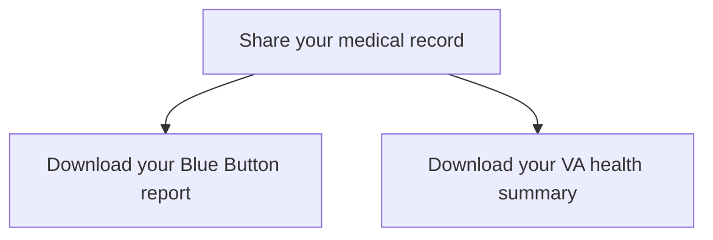

# Downloadable Reports: Domain Brief

Last updated: February 8, 2023 | [Change Log](#change-log)

## Table of Contents
- [Description of domain](#description-of-domain)
- [Use cases](#use-cases)
- [Requirements](#requirements)
- [Research to date](#research-to-date)
- [Relevant links](#relevant-links)
- [Questions to answer](#questions-to-answer)

Appendix
- [Detailed analysis of existing functionality](#detailed-analysis-of-existing-functionality)

## Description of domain
This brief describes a page from which users can download a Blue Button report (name subject to change) or a VA Health Summary report.

## Use Cases

Things to think about that inform use cases: 
- Privacy
  - VA Health Summary and Blue Button Report contain private data protected by federal privacy protections.
  - Users need to be aware that once they choose to save, print, or download their VA Health Summary data, it may no longer be protected by federal privacy protections.
  - Users need to be made aware that it is their responsibility to keep their health data safe once they download, print, or save it.

- Data Sources
  - Data for the VA Health Summary report is derived from the Veterans Health Information Exchange (VHIE)
  - Data for the Blue Button Report is derived from VistA, and also includes self-reported data.
  - The user owns their health data and is entitled to have access to it.

- Data Timeliness
  - The Blue Button Report selection/generation page displays several notices related to the timeliness of the data.  Some test data and VA Electronic Health Record data is only available after 36 hours, whereas Covid-19 test results are available immediately.
  - VA Health Summary Data may only be updated once every 24 hours.  This is currently achieved via an update button on the My VA Health Summary generation page.

**Common Use Cases**

What do people want to use their downloadable reports for? 
- To view current and/or past health information
- To share health informaton with non-VA health care providers to ensure they understand their health history
- To keep their own hard copy of their health information
- To save their own digital copy of their health information

**Edge Cases**
- To take a digital copy of their health information to a health care provider on a thumb drive or other portable storage device

## Requirements

### Includes
Blue Button reports
VA Health Summary
Manage your electronic medical record sharing options

### Information architecture and user flow
The current thinking is that we should allow users to access the different types of downloadable reports from the same screen and these should be framed as ways to share your information, rather than view your information. The primary way of viewing information should be by using Health History, Lab and Test Results, Medications, and Appointments. 

The downloadable reports setion will be called "Share your medical records" and it will have a total of three pages. 
* Share your medical record
* Download your Blue Button report
* Download your VA health summary

#### Page structure
Home > My Health > Share your medical record  
Home > My Health > Share your medical record > Download your Blue Button report  
Home > My Health > Share your medical record > Download your VA health summary

### Page 1: Share your medical record  
- **H1: "Share your medical record"**
- Below the H1, include explanatory text that says, "Download and share a copy of your VA medical records and personal health information."
- There should be three sections on this page
  - VA health summary
  - VA Blue Button report
  - Veterans Health Information Exchange
- **H2: "VA health summary"**
  - Below the H2, include explanatory text that says, "Your VA health summary provides a summary of health information that you can use to review your medical record and to share essential information with your health care providers."
  - There should then be a link to navigate to the download your VA health summary page, that says "Download your VA health summary"
- **H2: "VA Blue Button report"**
  - Below the H2, include explanatory text that says, "Your Blue Button report gives you detailed information from your VA medical records, personal health record, and in some cases your military service record."
  - There should then be a link to navigate to the download your Blue Button report page, that says "Download your VA Blue Button report"
- **H2: Veterans Health Information Exchange**
  - Below the H2, include explanatory text that says, "You can share your electronic health record with participating non-VA community providers through the Veterans Health Information exchange (VHIE). Sharing your information gives your health care providers a more complete understanding of your health record."
  - Include any additional information to help a user better understand this setting (work with content on this), what it enables, what opting into and out of this service means, and any additional information or links to learn about VHIE
  - Tell a user whether they are opted into electronic sharing, are not opted into electronic sharing, or that we cannot access their preference (edge case)
  - Include a button to edit their preference that when clicked allows the user to edit, save, or cancel a change in place.

### Page 2: Download your VA health summary
- H1: "Download your VA health summary"
- Include plain language explanatory intro text. This should include the categories that are included in your Health Summary report.
- Include when the health summary was last updated. 
- At the top of the page, a user should be able to quickly learn about disclaimers about the VA health summary.
- Form label question: "Choose the file format option that best meets your needs (*Required)"
    - Present three mutually exclusive options (i.e. radio buttons)
      - Option 1: "PDF document (best for printing)"
      - Option 2: "Text file (best for screen readers, screen enlargers, and refreshable Braille display)"
      - Option 3: "XML file (this file format is designed for computer systems to read, such as other electronic health records, personal health records, and applications."
- Include a button to download
- Other notes:
  - If possible, this download should be instantaneous. If it is not instanteous and the document must be generated, use an appropriate loading indicator to communicate the status of the generation and download. When the report has been generated, immediately launch browser based download controls. Do not require the user to click download again.
  - There will need to be error states if a user does not select an option for file format
  - There will need to be a success message when the file is downloaded, and an error message if not able to generate and download
  - We will NOT provide the ability to send a health summary as that capability is provided by Community Care via CCD Direct.

#### Requires further requirements gathering, usage exploration, and usability research
- During discovery research, it was not clear what the use case is for allowing a user to download their previous health summary. Therefore, unless we can identify a clear use case, we should not include this functionality. 
- Do not include the file format information that is currently included in the VA health summary grid. It is overly technical, and the information included does not clarify the actions available to the user. Therefore, unless we can identify a clear use case, we should not include this information on page. 

### Page 3: Download your VA Blue Button report
- H1: "Download your VA Blue Button report"
- Include plain language explanatory intro text. This should include the categories that are included in your Blue Button report.
- At the top of the page, a user should be able to quickly learn about disclaimers about the VA health summary.
- Question 1 Form label: "Select date range (*Required)"
  - Hint text: "Your report will only include information from the date range you select"
  - Present four mutually exclusive file format options (this should look similar to what was prototype for Secure Messaging)
    - Option 1: "Past 3 months"
    - Option 2: "Past 6 months"
    - Option 3: "Past 1 year"
    - Option 4: "Custom"
    - When Custom is selected, allow a user to specify a date range. 
- Question 2 Form label: "Choose the file format option that best meets your needs (*Required)"
    - Present three mutually exclusive options (i.e. radio buttons)
      - Option 1: "PDF document (best for printing)"
      - Option 2: "Text file (best for screen readers, screen enlargers, and refreshable Braille display)"
      - Option 3: "XML file (this file format is designed for computer systems to read, such as other electronic health records, personal health records, and applications."
- Include a button to download
- Other notes:
  - Because the document must be generated, use an appropriate loading indicator to communicate the status of the generation and download. When the report has been generated, immediately launch browser based download controls. Do not require the user to click download again as is the case in the product today.
  - There will need to be error states if a user does not select an option for date range
  - There will need to be error states if a user does not select an option for file format
  - There will need to be a success message when the file is downloaded, and an error message if not able to generate and download
  - We will NOT provide the ability to send a Blue Button report as that capability is provided by Community Care via CCD Direct.

#### Requires further requirements gathering, usage exploration, and usability research
- Because the new version of medical records allows users to find and view medical records information in the browser, we do not think there is as much of a use case for allowing users to select individual categories of information to include in their Blue Button report. These controls were originally included because Blue Button served as the primary way to view information, and therefore if you wanted to just see a single piece of information, the only way to do so was via BB by selecting that category. Because this is no longer the case, we do no believe there is as clear a use case for these additional controls. If we find that there is a requirement or user reason to include category selection, we can do so at that time. 
- Do not include the file format information that is currently included in the Blue Button report grid when the download is ready. It is overly technical, and the information included does not clarify the actions available to the user. Therefore, unless we can identify a clear use case, we should not include this information on page. 

### Sketch file
https://www.sketch.com/s/0803544d-e78c-423a-a70e-7db01a9a31c7

## Research to date

### Findings from card sort

_Cards included:_ 
  - Labs/ test cards: Antibody test, Blood sugar tests, Blood test, COVID-19 test result, Lab/ test results, Pathology results
  - Imaging cards: Dental x-rays, MRI results, Radiology results and images, Ultrasound results

_Findings:_
- Labs/ test category was the most common category, and roughly 52% of all cards were grouped in that category across the 13 participants
- Imaging cards were combined with labs/ test cards approximately 48% of the time (25 out of 52). 

### Findings from comparative analysis
[Comparative analysis of popular patient portals](https://app.mural.co/t/departmentofveteransaffairs9999/m/departmentofveteransaffairs9999/1659473055858/08b0e54ba40761f0893fc1c13454882a645e47ff?sender=u71ad98f94f5263595f9a4390) including Cerner's patient portal, Kaiser Permanente, BlueCross BlueShield, MyHealth powered by Epic, One Medical, Aetna OneRecord, and Apple Health, revealed that medical imaging and imaging reports are grouped with lab/test results.

### Accessibility considerations:
- [MyHealtheVet Section 508 Audit Report, August 2022](https://github.com/department-of-veterans-affairs/va.gov-team/blob/master/products/health-care/digital-health-modernization/mhv-to-va.gov/medical-records/downloadable-reports/31142%20My%20HealtheVet%20Interim%20Audit_20220831_V0.01.docx)
- [MyHealth*e*Vet (MHV) Heuristic Accessibility Evaluation, November 2022](https://github.com/department-of-veterans-affairs/va.gov-team/blob/master/teams/shared-support/accessibility/audits/2022-11-MHV/MHV-Heuristic-A11y-Audit_Evaluation-Summary.md)

### Desk research
See [Detailed analysis of existing functionality](#detailed-analysis-of-existing-functionality)

## Relevant links

- [Downloadable Reports decision log](https://github.com/department-of-veterans-affairs/va.gov-team/blob/master/products/health-care/digital-health-modernization/mhv-to-va.gov/downloadable-reports/decision-log.md)
- [Overall Initiative decision log](https://github.com/department-of-veterans-affairs/va.gov-team/blob/master/products/health-care/digital-health-modernization/mhv-to-va.gov/decision-log.md)

### User guides and related content

- The Blue Button Report generation pages links to several related pages and documents:
  -  Link to a [16-page user guide in PDF format](https://github.com/department-of-veterans-affairs/va.gov-team/blob/master/products/health-care/digital-health-modernization/mhv-to-va.gov/medical-records/data-domains/downloadable-reports/BlueButtonUserGuide.pdf).  If it is determined that user instructions are still necessary, they must be provided in an accessible format in addition to whatever print-formatted option is offered. PDF is not considered accessible.
  -  Link to a [Learn More](https://www.myhealth.va.gov/mhv-portal-web/learn-more-bb) MHV web page that provides an overview of Blue Button reports, and information about creating My VA Health Summmary Reports
  -  Link to [VA Continuity of Care Documents](https://www.myhealth.va.gov/va-continuity-of-care-document) (predecessor to VA Health Summary Reports) MHV web page 
  -  Link to [Frequently Asked Questions](https://www.myhealth.va.gov/faqs) MHV web page that has content related to Blue Button Reports.
  -  Several contextual links to a [Blue Button Availability page](https://www.myhealth.va.gov/mhv-portal-web/blue-button-availability) on MHV, which explains when certain types of data are made available to the user.
  -  Link to [Protecting Your Personal Health Information](https://www.myhealth.va.gov/mhv-portal-web/protecting-your-personal-health-information) page on MHV 

- The My VA Health Summary Generation page links to several related pages and documents:
  -  Link to a [13-page user guide in PDF format](https://github.com/department-of-veterans-affairs/va.gov-team/blob/master/products/health-care/digital-health-modernization/mhv-to-va.gov/medical-records/data-domains/downloadable-reports/VAHealthSummaryUserGuide.pdf).  If it is determined that user instructions are still necessary, they must be provided in an accessible format in addition to whatever print-formatted option is offered. PDF is not considered accessible.
  -  Link to a [Learn More](https://www.myhealth.va.gov/mhv-portal-web/health-summary-va-ccd-learn-more) MHV web page that provides an overview of VA Health Summary reports, and information about creating My VA Health Summmary Reports
  -  Link to [What's in the VA Health Summary?](https://www.myhealth.va.gov/mhv-portal-web/documents/314545/444506/MyHealtheVetVAHealthSummaryDataAndBusinessRules.pdf) document that explains data and business rules.
  -  Link to download an XML style sheet (the link currently displays a Not Found error page)
  -  Link to [Update your Profile](https://www.myhealth.va.gov/mhv-portal-web/profiles) on MHV to subscribe to VA Profile Delivery notifications.
  -  Link to [Protecting Your Personal Health Information](https://www.myhealth.va.gov/mhv-portal-web/protecting-your-personal-health-information) page on MHV 

### 2022 work
- [Use cases and user flows](https://app.mural.co/t/departmentofveteransaffairs9999/m/departmentofveteransaffairs9999/1670275244338/a7ecd52750cd539d1fceea40b1879336b8a339d2?invited=true&sender=u7de68ed54bc434b67b630908)
- [Medical Records Competitive Analysis](https://app.mural.co/t/departmentofveteransaffairs9999/m/departmentofveteransaffairs9999/1659473055858/08b0e54ba40761f0893fc1c13454882a645e47ff?wid=0-1663621688531&sender=u7de68ed54bc434b67b630908)
- [Medical Records Discovery Mural](https://app.mural.co/t/departmentofveteransaffairs9999/m/departmentofveteransaffairs9999/1661955319813/0edab3b186f83ecf243781fd24de5fc683a52266?sender=u7de68ed54bc434b67b630908)
- [Medical Records Generative Research Findings Readout](https://github.com/department-of-veterans-affairs/va.gov-team/blob/master/products/health-care/digital-health-modernization/mhv-to-va.gov/medical-records/research/2022-10_Generative-research/2022-11-medical-records-readout.md)
- [Meaningful use standards documents](https://github.com/department-of-veterans-affairs/va.gov-team/tree/master/products/health-care/digital-health-modernization/mhv-to-va.gov/medical-records/assets/meaningful-use-standards) - provided by Patty Henry between 1/12/2023 - 1/17/2023.  These standards originated during the Obama administration. MyHealtheVet used to get measured against these standards, and while they no longer do, these standards are still considered best practice and pertain to viewing, downloading, and transmitting.

## Questions to answer
- How can we make the selectio process on the BB download page as efficient and intuitive as possible?
- How closely do users associate the more comprehensive health report with the Blue Button name/brand? Is there a name that would be more intuitive?
- Are users able to easily discern the differences between a My VA Summary report vs. a VA Blue Button report?
- What information can we provide up front to help users quickly identify the type of report best fits their needs?  Possible examples - a comparison matrix showing which option can be customized, which has the option to download XML, which contains DoD information, etc.
- Is it necessary to have extensive user documentation if our usability testing finds that the tools are intuitive?
- What options are available for customizing the layout of each of these reports?
- Who do we need to get feedback from? 
   - Dr. Lorainne Josephs, Dr. Neil Evans, Theresa Hancock

## Change Log

|  Date           | Changed By       | Description of Change                                                                                               |
| ----------------| ---------------- | ------------------------------------------------------------------------------------------------------------------- |
| 2023/02/06      |Marci McGuire     | Added info about the VA Health Summary results page prior to updating data.                             |
| 2023/02/07      |Coulton Bunney    | Reorganized and started requirements section                                                            |
| 2023/02/07      |Marci McGuire     | Adding decision makers for electronic sharing options outstanding question.                             |
| 2023/02/07      |Marci McGuire     | Removed info related to the Send my Health Summary option since we are not moving forward with that.    |
| 2023/02/07      |Marci McGuire     | Corrected links after moving directory this where this doc is stored                                    |
| 2023/02/08      |Marci McGuire     | Added requirements sections for BB and VA Health Summary                                                |

# Appendix

## Detailed analysis of existing functionality

### UX considerations
- In the MyHealth*e*Vet site, the links for reports falls under Personal Information, which is not particularly intuitive.  In the new experience, these reports will be located within Medical Records as they are a form of medical record.

### When to show the downloadable reports section
- When a user with VA health care is logged in with an valid credential for MHV

### Where do downloadable reports fit within IA?
- In the MyHealth*e*Vet site, the links for reports falls under the Personal Information grouping, which is not particularly intuitive.  In the new experience, the current plan is to include reports within the Medical Records grouping as they are a form of medical record.

### Downloadable reports pages
This document describes the pages in the new health portal on VA.gov that will give users the ability to generate and download two different types of health record reports -- a *VA Health Summary* -- a summarized health record report that follows a pre-defined format, and a more comprehensive report currently referred to as a *VA Blue Button Report*, which can be customized to include or exclude certain pieces of health information.
- [Downloadable Reports Landing Page](#1-downloadable-reports-landing-page)
- [Blue Button Report generation page](#2-blue-button-report-generation-page)
- [Blue Button Download Results Page](#3-blue-button-download-results-page)
- [VA My Health Summary generation page](#4-va-my-health-summary-generation-page)
- [VA My Health Summary Results Page](#5-va-my-health-summary-results-page)

#### 1. Downloadable Reports Landing Page | [MyHealtheVet Screenshot](https://user-images.githubusercontent.com/69174644/217010319-28687c62-d1ca-4c95-a1ba-46243b88d565.png)
This page provides the ability for the user to select which type of report they wish to generate.   It also provides a brief overview of each.  In the current MHV site, the description of the Blue Button Report on the landing page fails to point out that the report is highly customizable.  It is not until the user accesses the report generation page that they see customization options.

##### How this page and navigation differs from the MyHealth*e*Vet Download My Data landing page
MyHealtheVet provides four primary links in the left navigation:
- VA Blue Button Report
- VA Health Summary
- VA Medical Images and Reports* 
- Electronic Record Sharing Options**

\*The information archicture strategy for downloadable reports at the time of this writing is to make VA Medical Images and Reports a subset of Labs and Tests rather than a subset of downloadable reports (referred to as Download My Data on MyHealth*e*Vet).  This approach is supported by tree testing, card sorting exercises, and user interviews where users indicated that they expected to find imaging results and reports with their lab and test results.

\*\*Electronic Record Sharing Options is a way to opt in or out of sharing one's electronic health record through the Veterans Health Information Exchange.   At the time of this writing, the information architecture strategy is to integrate this preference into the VA.gov Profile preferences, similar to Secure Messaging preferences, so that we can work toward encapsulating all user preferences in one place on VA.gov.

In summary, the downloadable reports landing page in the new experience need only give options for generating VA Blue Button Report and VA Health Summary report pages. 

 

#### 2. Blue Button Report generation page
This page provides the user with options to control the information that is included in their generated report.  Below details the selections and sub-selections presented, along with the form controls currently used on MyHealth*e*Vet.

##### `H1` Download My Selected Data

- `[info icon]` `[linked text]` VA Blue Button User Guide *links to: https://www.myhealth.va.gov/mhv-portal-web/documents/314545/444506/BlueButtonUserGuide-OzNR1OlR.pdf
- `[info icon]` `[linked text]` Learn More *links to: (https://www.myhealth.va.gov/mhv-portal-web/learn-more-bb)`
- `[info icon]` `[linked text]` Protecting Your Personal Health Information *links to: https://www.myhealth.va.gov/mhv-portal-web/protecting-your-personal-health-information`

##### 2.0. `[Step 1 indicator]` `[heading]` Select Date Range | [screen shot from MHV](https://user-images.githubusercontent.com/69174644/216336735-fa4d9156-d123-46ec-84e3-1b627aa2eb42.png) 

- 2.0.0 `[heading]` Date Range
  - `[radio]` 3 Months *Note - Selecting this option currently changes the Start and End dates (2.0.1 and 2.0.2) to reflect 3 months from current date.*
  - `[radio]` 6 Months *Note - Selecting this option currently changes the Start and End dates (2.0.1 and 2.0.2) to reflect 6 months from current date.*
  - `[radio]` 1 Year *Note - Selecting this option currently changes the Start and End dates (2.0.1 and 2.0.2) to reflect 3 months from current date.*
  - `[radio]` Custom *Note - Selecting this option means that the user needs to then manually select start and end dates (2.0.1 and 2.0.2), but there are no instructions to indicate this, such as "(Select desired start and end dates below)".*
- 2.0.1 `[date picker]` Start Date
- 2.0.2 `[date picker]` End Date

##### 2.1.`[Step 2 indicator]` `[heading]` Select Types of Information [screen shot from MHV](https://user-images.githubusercontent.com/69174644/216336735-fa4d9156-d123-46ec-84e3-1b627aa2eb42.png) 
`[text]` Information that you have entered into My HealtheVet is labeled as 'Self-Reported'. Information from the VA Electronic Health Record is labeled as 'VA'.
- 2.1.0. `[radio]` Select types of information to include
- 2.1.1. `[radio]` All types of information *Note: if All Types of Information is selected, all of the below selections and sub-selections will display a checkmark in its relevant checkbox, and the user need not make any further selections before clicking Submit at the bottom of the page.*

###### 2.1.00. `[heading]` Appointments

- 2.1.00.0. `[checkbox]` Future VA Appointments (may include Telephone, Video, In-Person Appointments)
- 2.1.00.1. `[checkbox]` Past VA Appointments (limited to past 2 years)
- 2.1.00.2. `[checkbox]` All of the Above *Note: this selection automatically selects the preceding options in this section*

###### 2.1.01. `[heading]` Medications (Automatically includes Allergy information)

- 2.1.01.0. `[checkbox]` VA Medication History
- 2.1.01.1. `[checkbox]` Medication and Supplements, Self-Reported 
- 2.1.01.2. `[checkbox]` All of the Above *Note: this selection automatically selects the preceding options in this section*

###### 2.1.02. `[heading]` Labs and Tests

- 2.1.02.0 `[checkbox]` VA Laboratory Results
- 2.1.02.1 `[checkbox]` VA Pathology Reports (available 35 hours after completion
- 2.1.02.2 `[checkbox]` VA Electrocardiogram (EKG) Historical Exam Dates (EKG dates are no longer updated. You may continue to view your historical EKG dates)
- 2.1.02.3 `[checkbox]` Labs and Tests, Self-Reported
- 2.1.02.4 `[checkbox]` All of the Above *Note: this selection automatically selects the preceding options in this section*

###### 2.1.03 `[heading]` VA Electronic Health Record History and Wellness Reminders

- 2.1.03.0 `[checkbox]` VA Problem List
- 2.1.03.1 `[checkbox]` VA Admissions and Discharges
- 2.1.03.2 `[checkbox]` VA Notes
- 2.1.03.3 `[checkbox]` VA Wellness Reminders
- 2.1.03.4 `[checkbox]` All of the Above *Note: this selection automatically selects the preceding options in this section*

###### 2.1.04 `[heading]` Allergies

- 2.1.04.0 `[checkbox]` VA Allergies and Adverse Reactions
- 2.1.04.1 `[checkbox]` Allergies, Self-Reported
- 2.1.04.2 `[checkbox]` All of the Above *Note: this selection automatically selects the preceding options in this section*

###### 2.1.05 `[heading]` Immunizations

- 2.1.05.0 `[checkbox]` VA Immunizations
- 2.1.05.1 `[checkbox]` Immunizations, Self-Reported
- 2.1.05.2 `[checkbox]` All of the Above *Note: this selection automatically selects the preceding options in this section*

###### 2.1.06 `[heading]` Vitals and Readings

- 2.1.06.00 `[checkbox]` VA Vitals and Readings
- 2.1.06.01 `[checkbox]` Vitals and Readings, Self-Reported
- 2.1.06.02 `[checkbox]` All of the above *Note: this selection automatically selects the preceding options in this section*

###### 2.1.07 `[heading]` Self-Reported Health History 

- 2.1.07.00 `[checkbox]` Medical Events, Self-Reported
- 2.1.07.01 `[checkbox]` Family Health History, Self-Reported
- 2.1.07.02 `[checkbox]` Military Health History, Self-Reported
- 2.1.07.03 `[checkbox]` Treatment Facilities, Self-Reported
- 2.1.07.04 `[checkbox]` Health Care Providers, Self-Reported
- 2.1.07.05 `[checkbox]` All of the above

###### 2.1.08 `[heading]` Food and Activity Journals 

- 2.1.08.00 `[checkbox]` Activity Journal, Self-Reported
- 2.1.08.01 `[checkbox]` Food Journal, Self-Reporte
- 2.1.08.02 `[checkbox]` All of the above *Note: this selection automatically selects the preceding options in this section*

###### 2.1.09 `[heading]` Goals

- 2.1.09.00 `[checkbox]` My Goals: Current Goals, Self-Reported
- 2.1.09.01 `[checkbox]` My Goals: Completed Goals, Self-Reported
- 2.1.09.02 `[checkbox]` All of the above *Note: this selection automatically selects the preceding options in this section*

###### 2.1.10 `[heading]` Demographics and Health Insurance

- 2.1.10.00 `[checkbox]` VA Demographics (Demographic information from VA Treating Facilities in the last 3 years)
- 2.1.10.01 `[checkbox]` Demographics, Self-Reported
- 2.1.10.02 `[checkbox]` Health Insurance, Self-Reported
- 2.1.10.03 `[checkbox]` All of the above *Note: this selection automatically selects the preceding options in this section*

###### 2.1.11 `[heading]` Department of Defense Information

- 2.1.11.00 `[checkbox]` Department of Defense Military Service Information

##### Form Controls
- `[button]` Submit
- `[button]` Reset
- `[button]` Cancel

##### Info boxes
_Info box 1_
- Heading: Protect your information and identity.
   - Text: Send your information to a safe site or device that you or someone you trust controls. Remember, once you have downloaded your information from My HealtheVet, it is your responsibility to keep it safe and private. Learn more about [protecting your personal health information](https://www.myhealth.va.gov/mhv-portal-web/protecting-your-personal-health-information).

_Info box 2_
- Heading: This is your personal health information.
   - Text: Your health care professional does not have access to this information unless you share it.

##### Page control
- `[button]` Back to Top

##### Feedback control
- `[button]`  Feedback *links to a [survey](https://survey.voice.va.gov/?jAM9oX-MyHealtheVet) hosted on survey.voice.va.gov

 

#### 3. Blue Button Download Results Page
- Provides a link to the Blue Button user guide
- Displays a status showing when the report has been generated
- Displays a warning that details any information that was unable to be updated. 
- Provides a disclaimer: "If you proceed with your download while updates are in progress, you may not get the most current information. Updates are done once a day."    This disclaimer liks to the [Blue Button Check Updates overview](https://www.myhealth.va.gov/mhv-portal-web/blue-button-check-updates-overview).

  -  `[Heading]` Personal Health Information of FIRST NAME LAST NAME  
  -  `[Heading]` DOWNLOAD YOUR DATA
  
  `[Table]`
  - TABLE HEADINGS
     - File Contents
     - File Name 
     - File Size 
     - Request Date 
     - I Want To...
     
  - TABLE ROW ONE (for PDF File) sample contents: 
     - Selected Health Data
     - mhv_MHVZZVISNFIFTEEN_20230203_1139.pdf
     - 6809 KB
     - 03 Feb 2023 @ 1139
     - `link text`View   `link text`Download PDF   *Note - `View` displays the PDF in the system's default PDF viewer or in the browser, depending on local system settings.  `Download` displays a modal with the following warning: "When you open or download a PDF file, a temporary file is created on this computer. Others accessing this computer may be able to view your personal health information. There is a risk of exposing your information when you download a PDF file, especially on public or shared computers." and `OK` and `Cancel` buttons.  `OK` downloads the file and `Cancel` closes the model with no further action.
     
  - TABLE ROW TWO (for Text file) sample contents: 
     - Selected Health Data
     - mhv_MHVZZVISNFIFTEEN_20230203_1139.txt
     - 6809 KB
     - 03 Feb 2023 @ 1139
     - `link text`View   `link text`Download TXT   *Note - `View` displays the TXT in an iframe on the page with `Print` and `Done` buttons above. `Download` downloads the TXT file.

#### 4. VA My Health Summary generation page
This page provides the ability for the user to generate a My VA Health Summary Report that follows a standard format and contains a standard set of data.  If a report has already been generated, this page will display the state described in the My VA Health Summary Results page below.

#### 5. VA My Health Summary results page
- Provides a link to the Blue Button user guide
- Displays a status showing when the report has been generated
- Displays a warning that details any information that was unable to be updated. 
- Provides a disclaimer: "If you proceed with your download while updates are in progress, you may not get the most current information. Updates are done once a day."    This disclaimer liks to the [Blue Button Check Updates overview](https://www.myhealth.va.gov/mhv-portal-web/blue-button-check-updates-overview).

  -  `[Heading]` Personal Health Information of FIRST NAME LAST NAME
  -  `[Heading]` Download Your VA Health Summary

 
##### `H1` My VA Health Summary Download Results | [Screen shot of MHV experience page](https://user-images.githubusercontent.com/69174644/217009547-68068663-2070-4cd9-bdc2-b687952f71a3.png)

- `[info icon]` `[linked text]` VA Health Summary User Guide *links to: https://www.myhealth.va.gov/mhv-portal-web/documents/314545/444506/VAHealthSummaryUserGuide.pdf*
- `[info icon]` `[linked text]` Learn More *links to https://www.myhealth.va.gov/mhv-portal-web/health-summary-va-ccd-learn-more*
- `[info icon]` `[linked text]` What's in the VA Health Summary *links to: https://www.myhealth.va.gov/mhv-portal-web/protecting-your-personal-health-information*

`[info block A]`   | [Screen shot from MHV ](https://user-images.githubusercontent.com/69174644/217013028-f27704aa-1d5a-4dc7-9e84-268118c97eb2.png
) *appears if data has NOT been updated in the last 24 hours*  
`[info block B]` `[check mark icon`] Your information update is complete. | [Screen shot from MHV](https://user-images.githubusercontent.com/69174644/217014078-c444ba03-15c2-47b7-b501-18bb5bc599a5.png)
)  *appears if data has been updated*

- `[Heading]` Personal Health Information of FIRSTNAME LASTNAME  
- `[Heading]` Download Your VA Health Summary

`[text]` The VA Health Summary contains specific information from your VA medical record. You can use it to review your VA care and to share your information with community providers, family, or others who help you with your health.

- `[Table]`
  - TABLE HEADINGS
     - File Contents
     - File Name 
     - Request Date 
     - Status 
     - I Want To...

 TABLE ROW ONE - Before updates have processed
 - Current Summary
 - mhv_VA_CCD_MHVZZVISNFIFTEEN_20230203_1718
 - 03 Feb 2023 @ 1218
 - Request Being Processed
     
TABLE ROW ONE sample contents (current health summary -- if updates are complete and report is ready to download}: 
 - Current Summary
 - mhv_VA_CCD_MHVZZVISNFIFTEEN_20230203_1718
 - 03 Feb 2023 @ 1218
 - Ready to Download
 - `link text`View   `link text`Download PDF   *Note - `View` displays the PDF in the system's default PDF viewer or in the browser, depending on local system settings.    `Download PDF` displays a modal with the following warning: "When you open or download a PDF file, a temporary file is created on this computer. Others accessing this computer may be able to view your personal health information. There is a risk of exposing your information when you download a PDF file, especially on public or shared computers." and `OK` and `Cancel` buttons.  `OK` downloads the file and `Cancel` closes the model with no further action.*  `link text`Download XML *Note: automatically downloads XML without a modal warning.
     
TABLE ROW TWO (for previous health summary) sample contents: 
 - Previous Summary
 - mhv_VA_CCD_MHVZZVISNFIFTEEN_20230201_1848
 - 01 Feb 2023 @ 1348
 - Ready to Download
 - `link text`View   `link text`Download PDF   *Note - `View` displays the PDF in the system's default PDF viewer or in the browser, depending on local system settings.    `Download PDF` displays a modal with the following warning: "When you open or download a PDF file, a temporary file is created on this computer. Others accessing this computer may be able to view your personal health information. There is a risk of exposing your information when you download a PDF file, especially on public or shared computers." and `OK` and `Cancel` buttons.  `OK` downloads the file and `Cancel` closes the model with no further action.*  `link text`Download XML *Note: automatically downloads XML without a modal warning. `
#### Navigation
- `[button]` Back (returns to the reports landing page)

#### Info boxes
_Info box 1_
- Heading: Options to Retrieve Data
   - `[Text]`: View:  View your VA Health Summary in the browser. 
   - `[Text]`Download PDF file:  Read, print or save your information in an easy to read and print Adobe PDF file format. Please be aware: anytime you open/download a PDF file you create a temporary file on the computer you are using. Your health information can be visible to other users of this computer.
   - `[Text]`Download XML file:  This file format is designed for computer systems to read, such as other electronic health records, personal health records, or applications. To view your .xml file, you may also need to [download the XML Style Sheet](https://www.myhealth.va.gov/mhv-portal-web/documents/25286/34031/cda.xsl), and place both files in the same folder on your computer.
   - `[Text]`Send My VA Health Summary:  Securely send your VA Health Summary to some [community (non-VA) providers, organizations, or other applications that are participating with VA](https://www.myhealth.va.gov/mhv-portal-web/ccd-direct-participating-providers-help) using Direct Messaging.

_Info box 2_
- Heading: Other VA Health Summary Options:
   - `[Text]` Set Up Email Notification:   [Update your profile](https://www.myhealth.va.gov/mhv-portal-web/profiles)  to subscribe to VA Health Summary delivery notifications.
   - `[Text]`View Status:  View the status of your recent requests: This link is disabled as it is not nested within a JSF form.  to send your VA Health Summary.

_Info box 3_
- Heading: Additional Tips
   - `[Text]`The information in your VA Health Summary can be updated once each day.
   - `[Text]`You can cancel your download at any time.
   - `[Text]`Be sure to save your downloads in a safe place.
   - `[Text]`All requests to download your personal health information from My HealtheVet are tracked. You can see these requests in your Account Activity History.
   - Once you have downloaded your information from My HealtheVet, it is your responsibility to keep it safe.

_Info box 4_
- Heading: Protect your information and your identity. 
`[Text]` Protect your information and your identity.
Send your information to a safe site or device that you or someone you trust controls. Remember, once you have downloaded your information from My HealtheVet, it is your responsibility to keep it safe and private. Learn more about protecting your personal health information.

#### Page control
- `[button]` Back to Top

#### Feedback control
- `[button]`  Feedback *links to a [survey](https://survey.voice.va.gov/?jAM9oX-MyHealtheVet) hosted on survey.voice.va.gov
