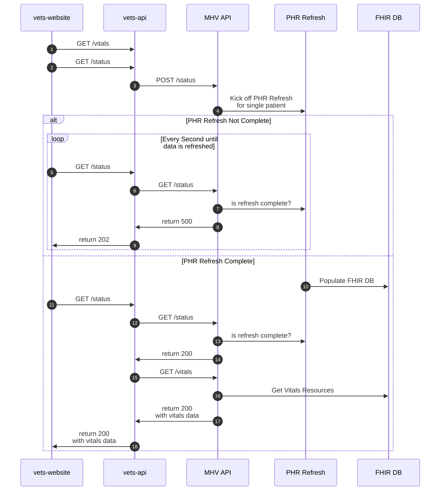

# PHR Refresh #

## VA.gov ##

### Structure ###

PHR refresh is initiated inside a [SideKiq job](https://github.com/department-of-veterans-affairs/vets-api/blob/master/app/sidekiq/mhv/phr_update_job.rb) and runs asynchronously, so as not to block any calling functions. Before initiating the refresh, it checks that the user has an MHV Correlation ID, which is our proxy for the user having an MHV account.

The actual refresh API call is made inside [phr_mgr/client.rb](https://github.com/department-of-veterans-affairs/vets-api/blob/master/lib/medical_records/phr_mgr/client.rb#L19), and connects to v2 of the MHV PHR refresh API. It uses the `X-Authorization-Key` header for authentication, and we store that value in the AWS parameter store. The refresh keys off of the user's ICN.

### Current Flow ###

Currently, the refresh [is initiated](https://github.com/department-of-veterans-affairs/vets-api/blob/master/lib/common/client/concerns/mhv_jwt_session_client.rb#L74) every time an MHV JWT-based session is created for the user.

The session is created when the user attemptes to access an MHV FHIR resource and does not have a session token currently stored in the redis cache. Once a session is created, the JWT is stored in redis for one-hour.

There are two consequences of this:
1. The PHR refresh will never be called more than once in any given 60-minute period.
1. The PHR refresh will not kick off until essentially the same moment a FHIR request is made, meaning that initial request will pull potentially out-of-date information.

### Desired Flow ###

We would like to move the refresh to the VA.gov login process, so that information is updated before a user ever gets to the Medical Records application. [Here is the PR](https://github.com/department-of-veterans-affairs/vets-api/pull/13693) for this work. This would represent a major change to the login process. See the following Slack threads pertaining to that discussion:
- [First](https://dsva.slack.com/archives/CSFV4QTKN/p1693234923978159)
- [Second](https://dsva.slack.com/archives/CSFV4QTKN/p1696623618380629)

## MHV ##

### Refresh delay for PHR refresh ###

### More Info ###

For more information on what happens in the backend when PHR refresh is initiated, see [this document](https://department-of-veterans-affairs.github.io/mhv-fhir-phr-mapping/background.html#general-processing-of-clinical-resources).

### Sequence Diagram ###
# TODO
- [ ] Add redis and 1 hour refresh data rule
- [ ] confirm current diagram is correct
- [ ] add `/session` call
- [ ] ???  

