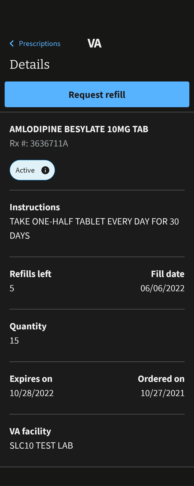

# VA: Health and Benefits Mobile App | Prescriptions details

## VA: Health and Benefits Mobile App | PrescriptionDetails component

[source code](https://github.com/department-of-veterans-affairs/va-mobile-app/blob/develop/VAMobile/src/screens/HealthScreen/Pharmacy/PrescriptionDetails/PrescriptionDetails.tsx)

| Name/Label | resource.property |
| ---------- | ----------------- |
| name | `prescriptionName` |
| rx # | `prescriptionNumber` |
| status | `refillStatus` |
| instructions | `instructions` |
| refills left | `refillRemaining` |
| fill date | `refillDate` |
| quantity | `quantity` |
| expires on | `expirationDate` |
| ordered on | `orderedDate` |
| va facility | `facilityName` |
