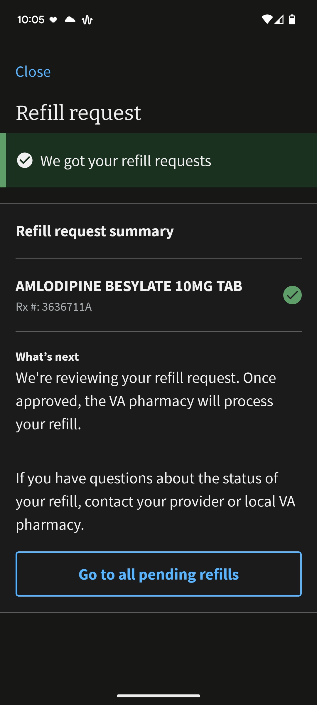

# VA: Health and Benefits Mobile App | Refill request

## VA: Health and Benefits Mobile App | RefillRequestSummary component

[source code](https://github.com/department-of-veterans-affairs/va-mobile-app/blob/develop/VAMobile/src/screens/HealthScreen/Pharmacy/RefillScreens/RefillRequestSummary.tsx)

[vets-api code for endpoint used](https://github.com/department-of-veterans-affairs/vets-api/blob/master/modules/mobile/app/controllers/mobile/v0/prescriptions_controller.rb)

Endpoint used `/v0/health/rx/prescriptions/refill`

| Name/Label | resource.property |
| ---------- | ----------------- |
| name | `prescriptionName` |
| rx # | `prescriptionNumber` |
