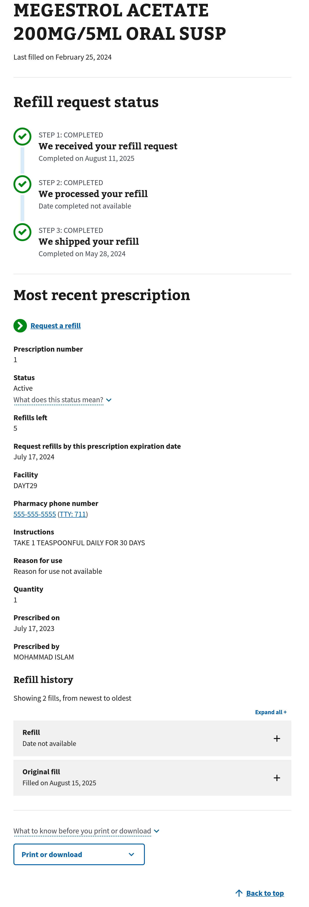

# Medications App | Prescription Path

[`/my-health/medications/prescription/1`](https://staging.va.gov/my-health/medications/prescription/1)

## Medications App | PrescriptionDetails Component

[source code](https://github.com/department-of-veterans-affairs/vets-website/blob/main/src/applications/mhv-medications/containers/PrescriptionDetails.jsx)

| Name/Label | data-test-id | resource.property |
| ---------- | ------------ | ----------------- |
| name | `prescription-name` | `rx?.prescriptionName` or `rx?.orderableItem` |
| documented on | `rx-last-filled-date` | `prescription?.orderedDate` |
| last filled | `rx-last-filled-date` | `prescription.sortedDispensedDate` |
| prescription number | `prescription-number` | `prescription.prescriptionNumber` |
| status | `status` | `prescription.dispStatus` |
| refills left | `refills-left` | `prescription.refillRemaining` |
| expiration date | `expiration-date` | ` prescription.expirationDate` |
| facility | `facility-name` | `prescription.facilityName` |
| pharmacy phone | `pharmacy-phone` | [`pharmacyPhoneNumber(rx)`](https://github.com/department-of-veterans-affairs/vets-website/blob/main/src/applications/mhv-medications/util/helpers/pharmacyPhoneNumber.js) |
| instructions | `rx-instructions` | `prescription?.sig` |
| reason for use | `rx-reason-for-use` | `prescription?.indicationForUse` |
| quantity | | `prescription.quantity` |
| prescribed on | `ordered-date` | `prescription.orderedDate` |
| prescribed by | `prescribed-by` | `prescription?.providerFirstName` `prescription?.providerLastName` |

### PrescriptionDetails Component | Variations

...
