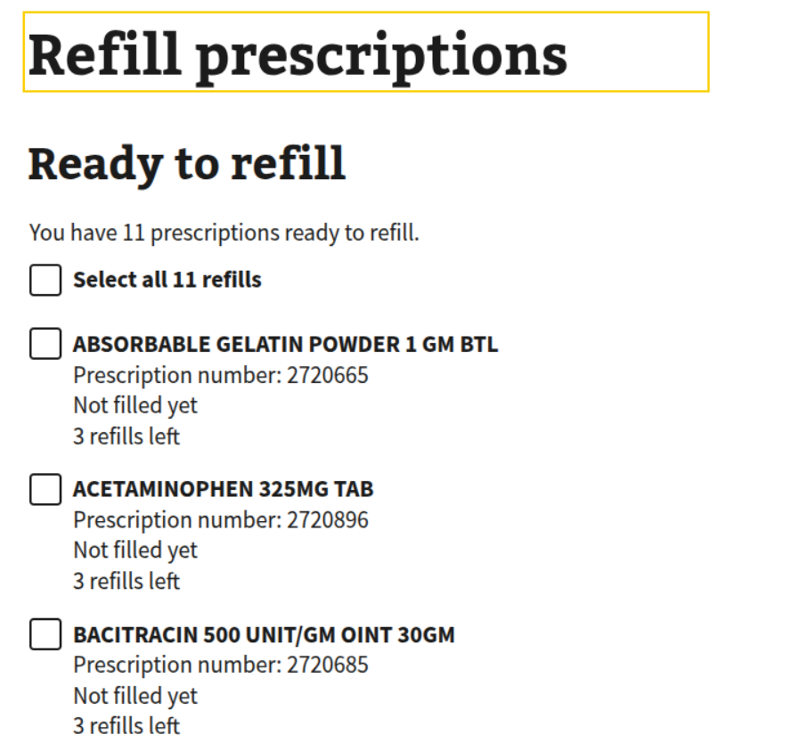

# Medications on VA.gov | Refill Path

[`/my-health/medications/refill`](https://staging.va.gov/my-health/medications/refill)

## Medications on VA.gov | RefillPrescriptions Component

[source code](https://github.com/department-of-veterans-affairs/vets-website/blob/main/src/applications/mhv-medications/containers/RefillPrescriptions.jsx)

[vets-api code for endpoint used](https://github.com/department-of-veterans-affairs/vets-api/blob/master/modules/my_health/app/controllers/my_health/v1/prescriptions_controller.rb)

Endpoint used `/my_health/v1/prescriptions/list_refillable_prescriptions`

| Name/Label | resource.property |
| ---------- | ----------------- |
| name | `prescriptionName` |
| prescription number | `prescriptionNumber` |
| last filled | [`prescription.sortedDispensedDate`](https://github.com/department-of-veterans-affairs/vets-api/blob/master/app/models/prescription_details.rb) |
| refills left | `refillRemaining` |
