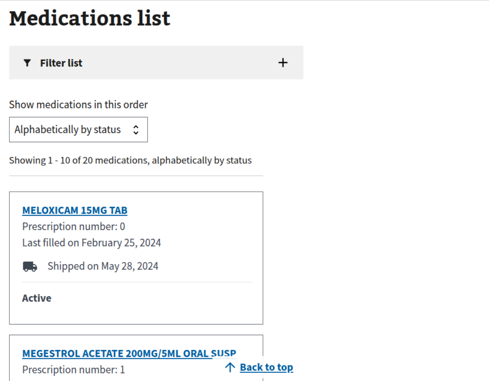
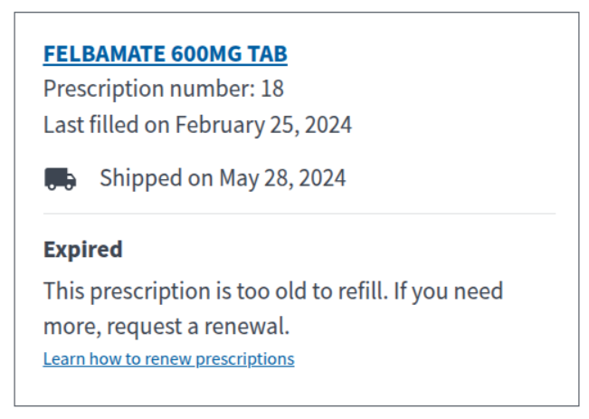
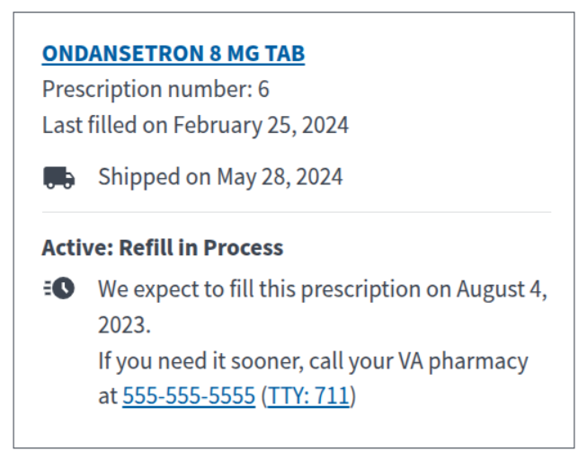
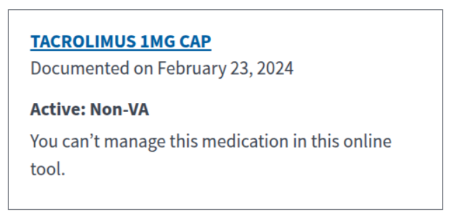

# Medications on VA.gov | Root Path

[`/my-health/medications/`](https://staging.va.gov/my-health/medications)

## Medications on VA.gov | MedicationsListCard Component

[source code](https://github.com/department-of-veterans-affairs/vets-website/blob/main/src/applications/mhv-medications/components/MedicationsList/MedicationsListCard.jsx)

[vets-api code for endpoint used](https://github.com/department-of-veterans-affairs/vets-api/blob/master/modules/my_health/app/controllers/my_health/v1/prescriptions_controller.rb)

Endpoint used `/my_health/v1/prescriptions`

| Name/Label | data-test-id | resource.property |
| ---------- | ------------ | ----------------- |
| name | `medications-history-details-link` | `rx?.prescriptionName` or `rx?.orderableItem` |
| link url | `medications-history-details-link` | `prescription/${rx.prescriptionId}` |
| number | `rx-number` | `rx.prescriptionNumber` |
| last filled | `rx-last-filled-date` | [`prescription.sortedDispensedDate`](https://github.com/department-of-veterans-affairs/vets-api/blob/master/app/models/prescription_details.rb) or `orderedDate` |
| shipped on | `rx-card-details--shipped-on` | `rx?.trackingList?.[0].completeDateTime` |
| status | `rxStatus` | `rx?.dispStatus` |

### MedicationsListCard Component | Variations

These render based on `rx.dispStatus`. See the [`ExtraDetails`](https://github.com/department-of-veterans-affairs/vets-website/blob/main/src/applications/mhv-medications/components/shared/ExtraDetails.jsx) component.

#### Expired

#### Active: Refill in Process

#### Active: Non-VA

