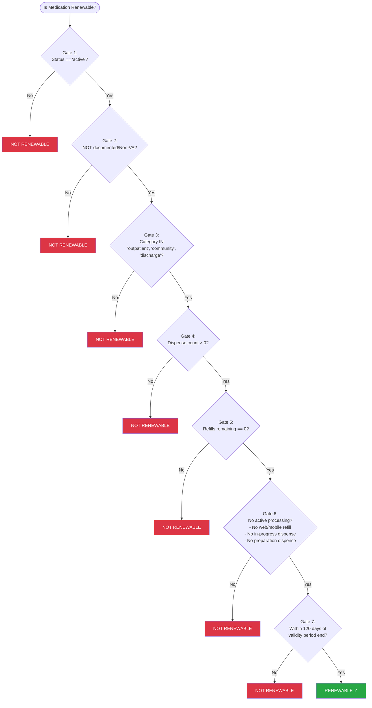

# Oracle Health VA Dispensed Medications - Renewability Specification

## Overview

A medication is **renewable** only if **ALL** of the following conditions are met. The checks are ordered from most fundamental to most specific.

---

## Renewability Gate Checks (In Order)

### Gate 1: MedicationRequest Status (Primary Gate)

**Condition:** `MedicationRequest.status` must be `'active'`

| Status | Renewable? |
|--------|------------|
| `active` | Continue to next gate |
| Any other status | **NOT RENEWABLE** |

*Rationale: Inactive, cancelled, or completed requests cannot be renewed.*

---

### Gate 2: Documented Medications

**Condition:** Must NOT be a documented/Non-VA medication (`MedicationRequest.reportedBoolean == true`)

| Medication Type | Renewable? |
|-----------------|------------|
| VA-dispensed medication | Continue to next gate |
| Documented/Non-VA medication | **NOT RENEWABLE** |

*Rationale: Medications documented from outside VA or non-VA sources are not managed through VA renewal process.*

---

### Gate 3: MedicationRequest Category

**Condition:** `MedicationRequest.category` must be one of the following:
- `outpatient`
- `community`
- `discharge`

| Category | Renewable? |
|----------|------------|
| `outpatient` | Continue to next gate |
| `community` | Continue to next gate |
| `discharge` | Continue to next gate |
| Any other category | **NOT RENEWABLE** |

*Rationale: Only outpatient-type prescriptions are eligible for patient-initiated renewals.*

---

### Gate 4: Dispense History

**Condition:** Must have at least one MedicationDispense associated with the request

| Dispense Count | Renewable? |
|----------------|------------|
| `> 0` | Continue to next gate |
| `0` | **NOT RENEWABLE** |

*Rationale: A medication that has never been dispensed cannot be renewed.*

---

### Gate 5: Refills Remaining

**Condition:** Must have zero refills remaining (use existing logic)

| Refills Remaining | Renewable? |
|-------------------|------------|
| `0` | Continue to next gate |
| `> 0` | **NOT RENEWABLE** |

*Rationale: If refills are available, patient should use the refill process, not renewal.*

---

### Gate 6: Active Processing

**Condition:** No active refill request or in-progress dispense

The medication is **NOT RENEWABLE** if ANY of the following are true:
- A refill has been requested via web or mobile
- Any dispense has status `in-progress`
- Any dispense has status `preparation`

| Processing State | Renewable? |
|------------------|------------|
| No active processing | Continue to next gate |
| Refill requested via web/mobile | **NOT RENEWABLE** |
| Any dispense `in-progress` | **NOT RENEWABLE** |
| Any dispense in `preparation` | **NOT RENEWABLE** |

*Rationale: Cannot request renewal while a previous request is still being processed.*

---

### Gate 7: Validity Period

**Condition:** Must NOT be more than 120 days past the validity period end date

A prescription is within the renewal window if:
- The validity period has not yet ended (prescription is not expired), OR
- The validity period ended within the last 120 days

| Time Relative to Validity End | Renewable? |
|-------------------------------|------------|
| Before validity end (not yet expired) | **RENEWABLE ✓** |
| 0-120 days after validity end | **RENEWABLE ✓** |
| More than 120 days after validity end | **NOT RENEWABLE** |

*Rationale: Prescriptions expired more than 120 days ago require a new prescription, not a renewal.*

---

## Decision Tree

---

## Summary Table

| Gate | Condition | Fail Result |
|------|-----------|-------------|
| 1 | `MedicationRequest.status == 'active'` | NOT RENEWABLE |
| 2 | Medication is NOT documented/Non-VA | NOT RENEWABLE |
| 3 | `MedicationRequest.category` IN (`outpatient`, `community`, `discharge`) | NOT RENEWABLE |
| 4 | Dispense count > 0 | NOT RENEWABLE |
| 5 | Refills remaining == 0 | NOT RENEWABLE |
| 6 | No web/mobile refill requested AND no dispense `in-progress` or `preparation` | NOT RENEWABLE |
| 7 | Current date - validity period end ≤ 120 days | NOT RENEWABLE |

**If all gates pass → RENEWABLE ✓**
