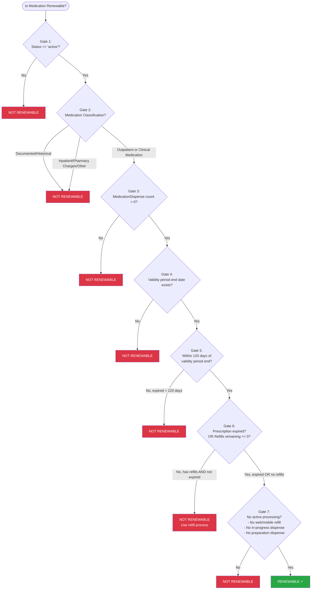

# Oracle Health VA Dispensed Medications - Renewability Specification

## Overview

A medication is **renewable** only if **ALL** of the following conditions are met. The checks are ordered from most fundamental to most specific.

---

## Renewability Gate Checks (In Order)

### Gate 1: MedicationRequest Status (Primary Gate)

**Condition:** `MedicationRequest.status` must be `'active'`

| Status | Renewable? |
|--------|------------|
| `active` | Continue to next gate |
| Any other status | **NOT RENEWABLE** |

*Rationale: Inactive, cancelled, or completed requests cannot be renewed.*

---

### Gate 2: Medication Classification

**Condition:** Must be classified as an **Outpatient Medication** or **Clinical Medication** (NOT Documented/Historical, Inpatient, or Pharmacy Charges)

Medication classification is determined by the `MedicationRequest.category` array. See [Oracle Health Medications - Categorization and Filtering Specification](oracle_health_categorization_spec.md) for complete categorization rules.

#### Classification for Renewability

| Display Category | Renewable? |
|------------------|------------|
| **Outpatient Medication** (`community` + `discharge`) | Continue to next gate |
| **Clinical Medication** (`outpatient`) | Continue to next gate |
| **Documented/Historical** (`community` + `patientspecified`) | **NOT RENEWABLE** |
| **Pharmacy Charges** (`charge-only`) | **NOT RENEWABLE** |
| **Inpatient Medication** (`inpatient`) | **NOT RENEWABLE** |
| **Uncategorized** | **NOT RENEWABLE** |

#### Additional Classification Criteria

Beyond category, the following `MedicationRequest` fields must also match for **Outpatient Medication**:
- `MedicationRequest.reportedBoolean == false`
- `MedicationRequest.intent == 'order'`

*Rationale: Outpatient Medications (prescriptions dispensed for home use) and Clinical Medications (administered in outpatient clinical settings) are eligible for renewal. Documented/Historical medications are patient-reported and not managed through VA renewal. Inpatient medications are administered during hospital stays and not self-managed.*

---

### Gate 3: Dispense History

**Condition:** Must have at least one `MedicationDispense` resource associated with the `MedicationRequest`

| MedicationDispense Count | Renewable? |
|--------------------------|------------|
| `> 0` | Continue to next gate |
| `0` | **NOT RENEWABLE** |

*Rationale: A medication that has never been dispensed cannot be renewed.*

---

### Gate 4: Validity Period Exists

**Condition:** `MedicationRequest.dispenseRequest.validityPeriod.end` must exist

| `MedicationRequest.dispenseRequest.validityPeriod.end` | Renewable? |
|--------------------------------------------------------|------------|
| Exists | Continue to next gate |
| Not available | **NOT RENEWABLE** |

*Rationale: Prescriptions without a validity period end date cannot be evaluated for renewal eligibility.*

---

### Gate 5: Validity Period Window

**Condition:** Must NOT be more than 120 days past `MedicationRequest.dispenseRequest.validityPeriod.end`

A prescription is within the renewal window if:
- The validity period has not yet ended (prescription is not expired), OR
- The validity period ended within the last 120 days

| Time Relative to `MedicationRequest.dispenseRequest.validityPeriod.end` | Renewable? |
|-------------------------------------------------------------------------|------------|
| Before validity end (not yet expired) | Continue to next gate |
| 0-120 days after validity end | Continue to next gate |
| More than 120 days after validity end | **NOT RENEWABLE** |

*Rationale: Prescriptions expired more than 120 days ago require a new prescription, not a renewal. This gate is evaluated before refills remaining because expired prescriptions (within 120 days) may still have refills remaining but should still be eligible for renewal.*

---

### Gate 6: Refills Remaining

**Condition:** Refills remaining must be zero OR prescription is expired (validity period has ended)

Refills remaining is calculated as:
`MedicationRequest.dispenseRequest.numberOfRepeatsAllowed` minus the count of associated `MedicationDispense` resources (excluding the original fill)

| Scenario | Renewable? |
|----------|------------|
| Refills remaining == 0 AND prescription is NOT expired | Continue to next gate |
| Refills remaining >= 0 AND prescription is expired (validity period ended) | Continue to next gate |
| Refills remaining > 0 AND prescription is NOT expired | **NOT RENEWABLE** |

*Rationale: If refills are available AND the prescription is still valid (not expired), patient should use the refill process instead of renewal. However, if the prescription is expired (even with zero or more refills remaining), renewal is the appropriate path since refills cannot be processed on an expired prescription.*

---

### Gate 7: Active Processing

**Condition:** No active refill request or in-progress dispense

The medication is **NOT RENEWABLE** if ANY of the following are true:
- A refill has been requested via web or mobile
- Any `MedicationDispense.status` == `in-progress`
- Any `MedicationDispense.status` == `preparation`

| Processing State | Renewable? |
|------------------|------------|
| No active processing | **RENEWABLE ✓** |
| Refill requested via web/mobile | **NOT RENEWABLE** |
| Any `MedicationDispense.status` == `in-progress` | **NOT RENEWABLE** |
| Any `MedicationDispense.status` == `preparation` | **NOT RENEWABLE** |

*Rationale: Cannot request renewal while a previous request is still being processed.*

---

## Decision Tree

---

## Summary Table

| Gate | Condition (must be TRUE to pass) | Fail Result |
|------|----------------------------------|-------------|
| 1 | `MedicationRequest.status == 'active'` | NOT RENEWABLE |
| 2 | Medication is classified as **Outpatient Medication** or **Clinical Medication** (see [categorization spec](oracle_health_categorization_spec.md)) | NOT RENEWABLE |
| 3 | `MedicationDispense` count > 0 | NOT RENEWABLE |
| 4 | `MedicationRequest.dispenseRequest.validityPeriod.end` exists | NOT RENEWABLE |
| 5 | Current date ≤ `MedicationRequest.dispenseRequest.validityPeriod.end` + 120 days | NOT RENEWABLE |
| 6 | Current date > `MedicationRequest.dispenseRequest.validityPeriod.end`, OR refills remaining == 0 | NOT RENEWABLE |
| 7 | No active processing (no web/mobile refill requested, no `MedicationDispense.status` == `in-progress` or `preparation`) | NOT RENEWABLE |

**If all gates pass → RENEWABLE ✓**
