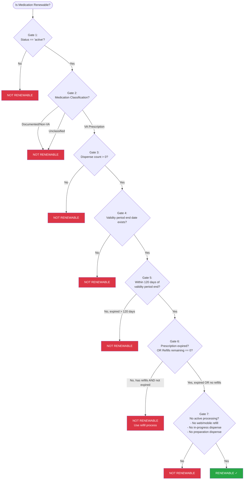

# Oracle Health VA Dispensed Medications - Renewability Specification

## Overview

A medication is **renewable** only if **ALL** of the following conditions are met. The checks are ordered from most fundamental to most specific.

---

## Renewability Gate Checks (In Order)

### Gate 1: MedicationRequest Status (Primary Gate)

**Condition:** `MedicationRequest.status` must be `'active'`

| Status | Renewable? |
|--------|------------|
| `active` | Continue to next gate |
| Any other status | **NOT RENEWABLE** |

*Rationale: Inactive, cancelled, or completed requests cannot be renewed.*

---

### Gate 2: Medication Classification

**Condition:** Must be classified as a **VA Prescription** (NOT a Clinic/Documented/Non-VA medication)

Medication classification is determined by the combination of `reportedBoolean`, `intent`, and `category` values:

#### Classification Rules

| reportedBoolean | intent | categories | Classification | Renewable? |
|-----------------|--------|------------|----------------|------------|
| `true` | `plan` | `community` AND `patient-specified` | **Documented/Non-VA Medication** | **NOT RENEWABLE** |
| `false` | `order` | `outpatient` | **Clinic Administered Medication** | **NOT RENEWABLE** |
| `false` | `order` | `community` AND `discharge` | **VA Prescription** | Continue to next gate |
| Any other combination | | | **Unclassified** | **NOT RENEWABLE** |

#### Detailed Classification Logic

**Documented/Non-VA Medication** (NOT RENEWABLE):
- `MedicationRequest.reportedBoolean == true`
- `MedicationRequest.intent == 'plan'`
- `MedicationRequest.category` includes BOTH `community` AND `patient-specified`

**Clinic Administered Medication** (NOT RENEWABLE):
- `MedicationRequest.reportedBoolean == false`
- `MedicationRequest.intent == 'order'`
- `MedicationRequest.category` is exactly `outpatient`

**VA Prescription** (May be renewable):
- `MedicationRequest.reportedBoolean == false`
- `MedicationRequest.intent == 'order'`
- `MedicationRequest.category` includes BOTH `community` AND `discharge`

*Rationale: Medications documented from outside VA or non-VA sources (Documented/Non-VA) are not managed through VA renewal process. Only VA Outpatient Prescriptions are eligible for renewal consideration.*

---

### Gate 3: Dispense History

**Condition:** Must have at least one MedicationDispense associated with the request

| Dispense Count | Renewable? |
|----------------|------------|
| `> 0` | Continue to next gate |
| `0` | **NOT RENEWABLE** |

*Rationale: A medication that has never been dispensed cannot be renewed.*

---

### Gate 4: Validity Period Exists

**Condition:** Must have a validity period end date

| Validity Period End Date | Renewable? |
|--------------------------|------------|
| Exists | Continue to next gate |
| Not available | **NOT RENEWABLE** |

*Rationale: Prescriptions without a validity period end date cannot be evaluated for renewal eligibility.*

---

### Gate 5: Validity Period Window

**Condition:** Must NOT be more than 120 days past the validity period end date

A prescription is within the renewal window if:
- The validity period has not yet ended (prescription is not expired), OR
- The validity period ended within the last 120 days

| Time Relative to Validity End | Renewable? |
|-------------------------------|------------|
| Before validity end (not yet expired) | Continue to next gate |
| 0-120 days after validity end | Continue to next gate |
| More than 120 days after validity end | **NOT RENEWABLE** |

*Rationale: Prescriptions expired more than 120 days ago require a new prescription, not a renewal. This gate is evaluated before refills remaining because expired prescriptions (within 120 days) may still have refills remaining but should still be eligible for renewal.*

---

### Gate 6: Refills Remaining

**Condition:** Must have zero refills remaining OR prescription is expired (validity period has ended)

| Scenario | Renewable? |
|----------|------------|
| Refills remaining == 0 AND prescription is NOT expired | Continue to next gate |
| Refills remaining >= 0 AND prescription is expired (validity period ended) | Continue to next gate |
| Refills remaining > 0 AND prescription is NOT expired | **NOT RENEWABLE** |

*Rationale: If refills are available AND the prescription is still valid (not expired), patient should use the refill process instead of renewal. However, if the prescription is expired (even with zero or more refills remaining), renewal is the appropriate path since refills cannot be processed on an expired prescription.*

---

### Gate 7: Active Processing

**Condition:** No active refill request or in-progress dispense

The medication is **NOT RENEWABLE** if ANY of the following are true:
- A refill has been requested via web or mobile
- Any dispense has status `in-progress`
- Any dispense has status `preparation`

| Processing State | Renewable? |
|------------------|------------|
| No active processing | **RENEWABLE ✓** |
| Refill requested via web/mobile | **NOT RENEWABLE** |
| Any dispense `in-progress` | **NOT RENEWABLE** |
| Any dispense in `preparation` | **NOT RENEWABLE** |

*Rationale: Cannot request renewal while a previous request is still being processed.*

---

## Decision Tree

---

## Summary Table

| Gate | Condition (must be TRUE to pass) | Fail Result |
|------|----------------------------------|-------------|
| 1 | `MedicationRequest.status == 'active'` | NOT RENEWABLE |
| 2 | Medication is classified as **VA Prescription** (see classification rules) | NOT RENEWABLE |
| 3 | Dispense count > 0 | NOT RENEWABLE |
| 4 | Validity period end date exists | NOT RENEWABLE |
| 5 | Prescription is not expired, OR expired ≤ 120 days ago | NOT RENEWABLE |
| 6 | Prescription is expired, OR refills remaining == 0 | NOT RENEWABLE |
| 7 | No active processing (no web/mobile refill requested, no dispense `in-progress` or `preparation`) | NOT RENEWABLE |

**If all gates pass → RENEWABLE ✓**
