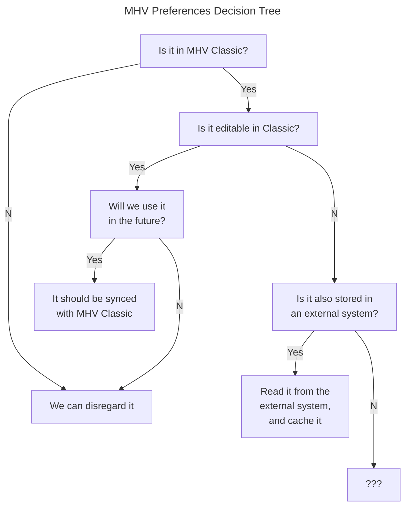
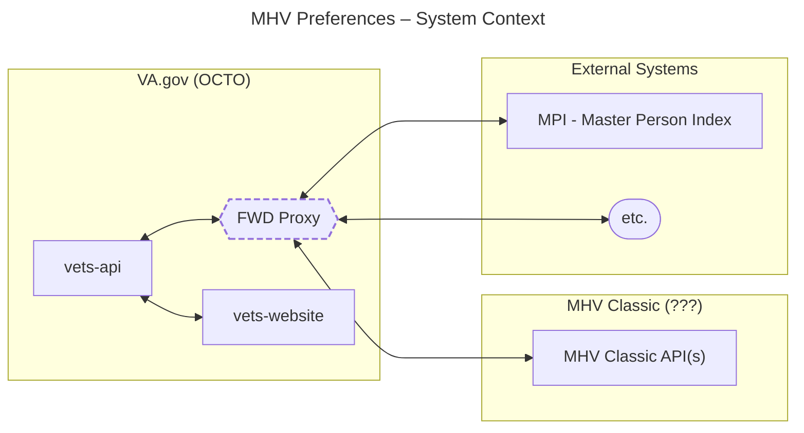

# MHV Preferences on VA.gov - Technical Approach

Created: 2023-04-03

This document is intended to capture knowledge related to the migration and merging of preferences from MHV Classic into the MHV-on-VA.gov experience.

A preference, or setting, represents a choice that a Veteran has about how certain features of VA.gov should function for them. This is different from a profile, which is a collection of information about a Veteran that may be used to enable functionality. Sometimes a piece of profile information can be used to set a preference, like using a profile email address to sign up for notifications. Account and authorization information is also a separate concern. However, preferences, profile information and authorization information could all be present in a single view.

During the transition of MHV products to VA.gov, there will be a period where MHV Classic and MHV-on-VA.gov will both exist and be accessible to Veterans. When it comes to preferences and profile information, we need to understand what information needs to exist in both places, and what information needs to be _editable_ in both places. This implies some sort of syncing needs to take place, and data integrity must be maintained between systems.

There are already systems external to VA.gov that serve as systems of record for certain information about Veterans. Many of these are listed on the ["External Integrations" page of the Platform docs](https://depo-platform-documentation.scrollhelp.site/developer-docs/external-integrations). One such system is Master Person Index (MPI), which is "authoritative identity service within the VA, establishing, maintaining and synchronizing identities for VA clients, Veterans and beneficiaries."

Another external system is called "VA Profile" (formerly Vet360), and not to be confused with [VA.gov Profile](https://github.com/department-of-veterans-affairs/va.gov-team/blob/master/teams/vsa/teams/authenticated-experience/roadmap/profile-roadmap.md). [Here is an explanation](https://github.com/department-of-veterans-affairs/va.gov-team/tree/master/products/identity-personalization/profile#is-va-profile-the-same-thing-as-the-vagov-profile) of the difference between the two.

## Existing MHV Preferences

See [MHV and New Profile and Preferences.xlsx (Sharepoint)](https://dvagov.sharepoint.com/:x:/r/sites/HealthApartment/Shared%20Documents/General/Preferences%20and%20Notifications/MHV%20and%20New%20Profile%20and%20Preferences.xlsx?d=wd9e64dc034eb48d7ae03abb11b731c78&csf=1&web=1&e=P5ZBMQ) for a listing of profile, preferences and some miscellaneous settings.

## Data sync decision tree

Briefly, we are asking for each preference/profile item if we keep it and so need to sync it, if we disregard it, or if it comes from another system of record (e.g. MPI stores person name information) that we pull it from and treat it as read-only data.

## Architecture

MHV Classic and VA.gov currently exist in different system contexts, with communications between contexts enabled by the VA.gov forward proxy. Any syncing between systems would depend on the Forward Proxy, in the VA.gov/OCTO context, to mediate.

## Architecture Thoughts

If MHV Classic APIs and `vets-api` provide authenticated endpoints that allow both systems to send updates to preferences/profile information, we can store of editable MHV preferences in both systems and sync them. Both systems will need to implement side effects to those values being updated in their system that trigger API calls to the other system.

For `vets-api`, that could mean that any time an mhv preference is saved, an asynchronous job would be added to the Sidekiq job scheduler that would call the appropriate API endpoint on MHV Classic. "Preferences sync" jobs should be performed as soon as possible.
- Timestamps: Changes should be timestamped, and APIs should only update if the incoming timestamp is newer
- Batch changes: It may be more performant if APIs handled all sync changes as batches, so multiple changes could be sent in one request.

## Questions/Challenges

During the transition of MHV products to VA.gov, there will

* What preferences, profile, etc. exist on MHV and VA.gov and need to be synced?
    * How is data stored in each system (field type, char length, etc.)? What is the data model for each system?
* Stakeholders may identify preferences or profile information that may not currently exist in any system.
* What preferences are sourced from an external system and must be read-only?
* What team/product should own the MHV profile and preferences when they live on VA.gov?
    * One candidate for profile information is the *VA.gov Profile*.
    * Some of this could involve a central "Profile/Preferences" center, but also features to edit certain pieces in/near the products whose functionality those preferences affect
    * Some preferences may be feature/product specific
