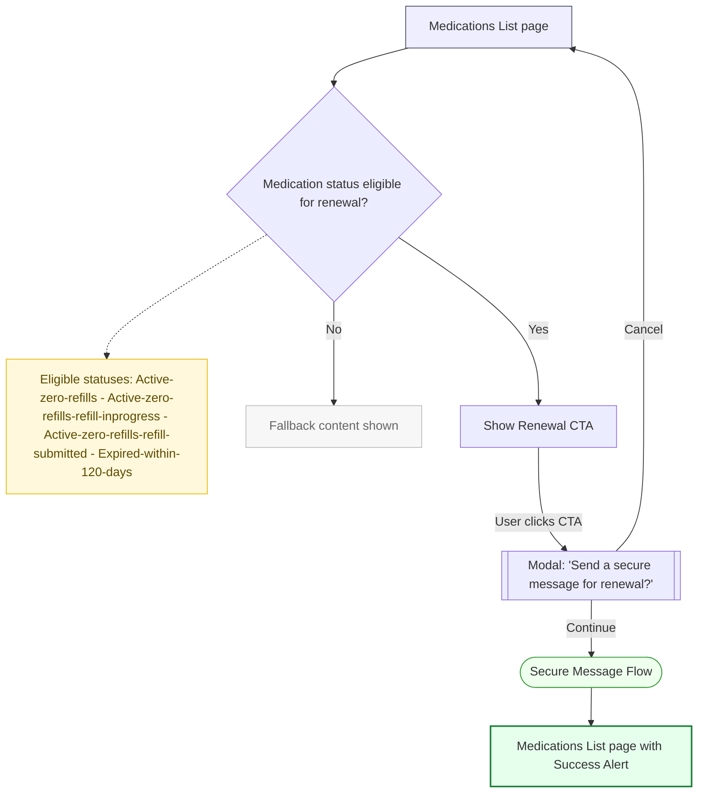

# MHV Medication List Page renewal flow

```mermaid
flowchart TD
  %% START
  A[Medications List page]:::page
  L[Medications List page with Success Alert]:::success

  %% STATUS CHECK
  A --> C{Medication status eligible for renewal?}

  %% ELIGIBILITY DETAILS
  C -.-> Cn[Eligible statuses: Active-zero-refills - Active-zero-refills-refill-inprogress - Active-zero-refills-refill-submitted - Expired-within-120-days]:::note

  %% OUTCOMES
  C -- No --> X[Fallback content shown]:::muted
  C -- Yes --> R[Show Renewal CTA]

  %% LINK ACTION
  R -- User clicks CTA --> M[[Modal: 'Send a secure message for renewal?']]

  %% MODAL ACTIONS
  M -- Continue --> SM([Secure Message Flow]):::external
  M -- Cancel --> A

  %% AFTER SUCCESS
  SM --> L

  %% STYLES
  classDef page fill:#eef,stroke:#446;
  classDef external fill:#efe,stroke:#393;
  classDef success fill:#e6ffed,stroke:#1a7f37,stroke-width:2px;
  classDef muted fill:#f7f7f7,stroke:#bbb,color:#666;
  classDef note fill:#fff8dc,stroke:#e6b800,color:#5c4b00;
```
