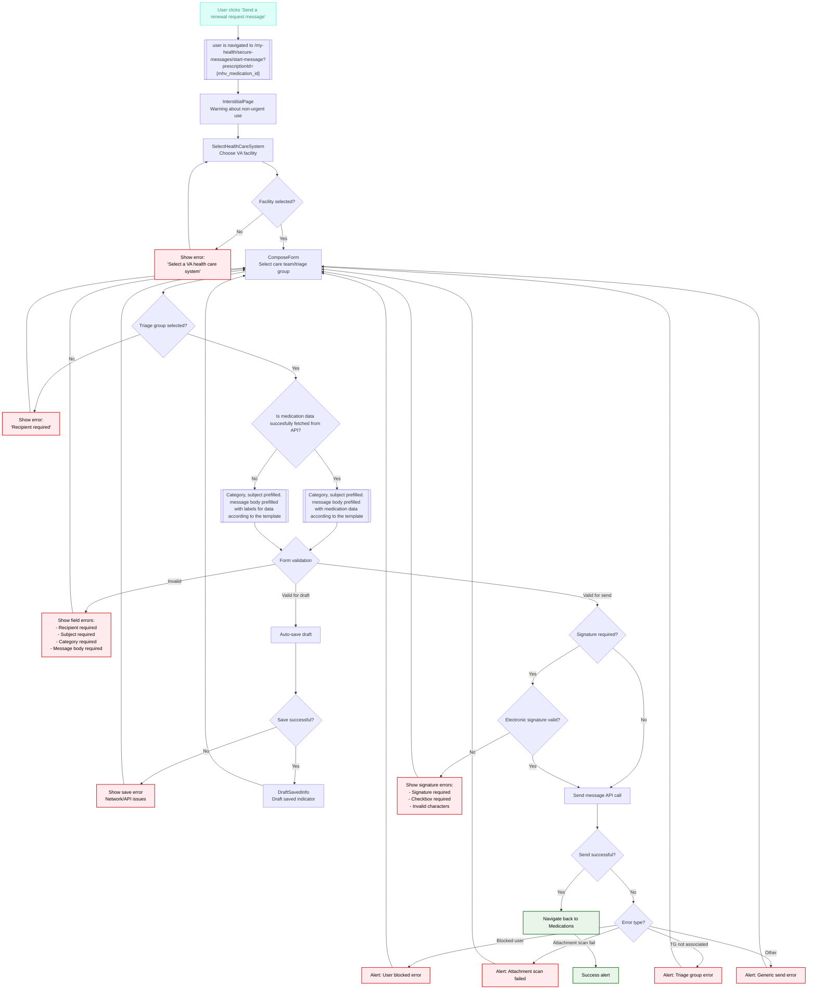

# MHV Secure Messaging - Medication renewal Flow diagram

```mermaid
graph TD
    D["InterstitialPage<br>Warning about non-urgent use"] --> E["SelectHealthCareSystem<br>Choose VA facility"]
    E --> F{"Facility selected?"}
    F -- No --> G@{ label: "Show error:<br>'Select a VA health care system'" }
    F -- Yes --> H["ComposeForm<br>Select care team/triage group"]
    G --> E
    H --> I{"Triage group selected?"}
    I -- No --> J@{ label: "Show error:<br>'Recipient required'" }
    I -- Yes --> n5["Is medication data succesfully fetched from API?"]
    J --> H
    K{"Form validation"} -- Invalid --> L["Show field errors:<br>- Recipient required<br>- Subject required<br>- Category required<br>- Message body required"]
    K -- Valid for draft --> M["Auto-save draft"]
    K -- Valid for send --> N{"Signature required?"}
    L --> H
    M --> O{"Save successful?"}
    O -- No --> P["Show save error<br>Network/API issues"]
    O -- Yes --> Q["DraftSavedInfo<br>Draft saved indicator"]
    N -- No --> R["Send message API call"]
    N -- Yes --> S{"Electronic signature valid?"}
    S -- No --> T["Show signature errors:<br>- Signature required<br>- Checkbox required<br>- Invalid characters"]
    S -- Yes --> R
    R --> U{"Send successful?"}
    U -- No --> V{"Error type?"}
    V -- Blocked user --> W["Alert: User blocked error"]
    V -- Attachment scan fail --> X["Alert: Attachment scan failed"]
    V -- TG not associated --> Y["Alert: Triage group error"]
    V -- Other --> Z["Alert: Generic send error"]
    U -- Yes --> AA["Navigate back to Medications"]
    T --> H
    P --> H
    Q --> H
    W --> H
    X --> H
    Y --> H
    Z --> H
    n1@{ label: "<span style=\"color:\">User clicks '</span><span style=\"white-space:\">Send a renewal request message'</span>" } --> n3["user is navigated to /my-health/secure-messages/start-message?prescriptionId={mhv_medication_id}"]
    AA --> n2["Success alert<br>"]
    n3 --> D
    n5 -- Yes --> n4["Category, subject prefilled. message body prefilled with medication data according to the template"]
    n5 -- No --> n6["Category, subject prefilled. message body prefilled with labels for data according to the template"]
    n4 --> K
    n6 --> K

    G@{ shape: rect}
    J@{ shape: rect}
    n5@{ shape: decision}
    n1@{ shape: proc}
    n3@{ shape: subproc}
    n2@{ shape: rect}
    n4@{ shape: subproc}
    n6@{ shape: subproc}
     n1:::Aqua
    classDef Aqua stroke-width:1px, stroke-dasharray:none, stroke:#46EDC8, fill:#DEFFF8, color:#378E7A
    style G fill:#ffebee,stroke:#d32f2f,stroke-width:2px,color:#000
    style J fill:#ffebee,stroke:#d32f2f,stroke-width:2px,color:#000
    style L fill:#ffebee,stroke:#d32f2f,stroke-width:2px,color:#000
    style P fill:#ffebee,stroke:#d32f2f,stroke-width:2px,color:#000
    style T fill:#ffebee,stroke:#d32f2f,stroke-width:2px,color:#000
    style W fill:#ffebee,stroke:#d32f2f,stroke-width:2px,color:#000
    style X fill:#ffebee,stroke:#d32f2f,stroke-width:2px,color:#000
    style Y fill:#ffebee,stroke:#d32f2f,stroke-width:2px,color:#000
    style Z fill:#ffebee,stroke:#d32f2f,stroke-width:2px,color:#000
    style AA fill:#e8f5e8,stroke:#2e7d32,stroke-width:2px,color:#000
    style n2 fill:#e8f5e8,stroke:#2e7d32,stroke-width:2px,color:#000
```
