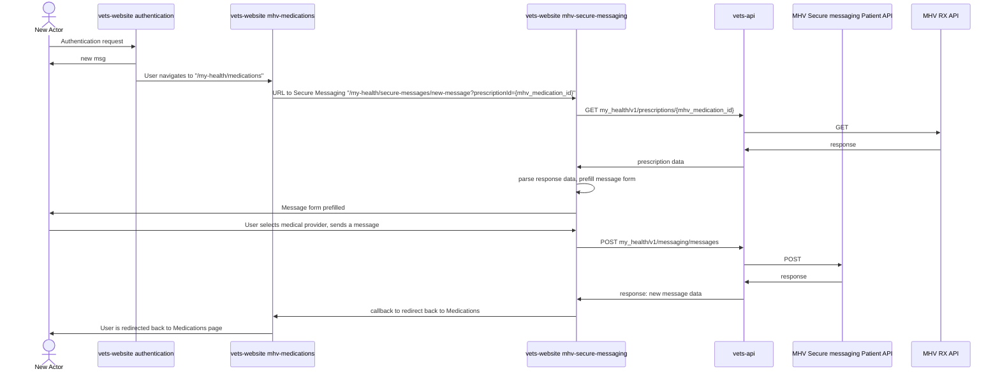

# MHV Secure Messaging - Medication renewal flow

```mermaid

sequenceDiagram
  actor A1 as New Actor
  participant P6 as vets-website authentication
  participant P4 as vets-website mhv-medications
  participant P5 as vets-website mhv-secure-messaging
  participant P1 as vets-api
  participant P2 as MHV Secure messaging Patient API
  participant P3 as MHV RX API

  A1 ->> P6: Authentication request
  P6 ->> A1: new msg
  P6 ->> P4: User navigates to "/my-health/medications"
  P4 ->> P5: URL to Secure Messaging "/my-health/secure-messages/new-message?prescriptionId={mhv_medication_id}"
  P5 ->> P1: GET my_health/v1/prescriptions/{mhv_medication_id}
  P1 ->> P3: GET
  P3 ->> P1: response
  P1 ->> P5: prescription data
  P5 ->> P5: parse response data, prefill message form
  P5 ->> A1: Message form prefilled
  A1 ->> P5: User selects medical provider, sends a message
  P5 ->> P1: POST my_health/v1/messaging/messages
  P1 ->> P2: POST
  P2 ->> P1: response
  P1 ->> P5: response: new message data
  P5 ->> P4: callback to redirect back to Medications
  P4 ->> A1: User is redirected back to Medications page
```
