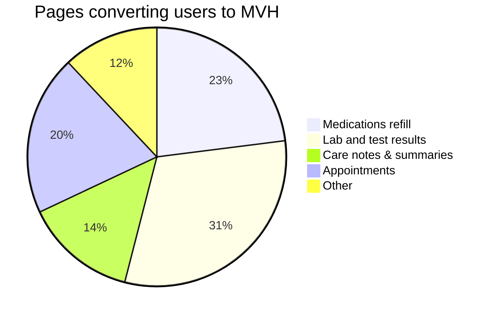

# My VA Health (OH) portal baseline metrics
Metrics and UX analysis prior to data integration with OH EHR and transitioning My VA Health (OH) users to My HealtheVet on VA.gov. 

By: Sara Sterkenburg

## On this page
**On this page:**
- [Who can access the My VA Health (OH) portal?](#access)
- [Methods to accessing the My VA Health (OH) portal](#methods)
- [Method A - Baseline data](#a)
- [Method B - Baseline data](#b)
- [Design / Sensemaking questions around planned tactics to address Method A & B users](#sensemaking)
- [Questions](#questions)

## <a name="access">Who can access the My VA Health (OH) portal?</a>
* Only users who received care at 1 or more of the following facilities (which utilize the Oracle Health EHR system) can get to the My VA Health portal. This patient-facing portal is the current front-end user experience for these facilities, but VA is working to transition users over to the My HealtheVet on VA.gov experience and phase out the My VA Health portal by 2027. 

OH Facilities that use the My VA Health patient portal: 
| Facility name | Facility location |facility_id |
|-----|------|-------|
| Chalmers P. Wylie Veterans Outpatient Clinic | Columbus OH | VHA_757 |
| VA Roseburg Healthcare System | Roseburg OR | VHA_653 | 
| Jonathan M. Wainwright Memorial VA Medical Center | Walla Walla OR | VHA_687 |
| White City VA Medical Center | White City OR | VHA_692 |
| Mann-Grandstaff Department of Veterans Affairs Medical Center | Spokane WA | VHA_668 |
| Captain James A. Lovell Federal Health Care Center | North Chicago IL | VHA_556 |

## <a name="methods">Methods to accessing the My VA Health (OH) portal</a>
There are two ways for users with Oracle Health facilities to access this portal: 
* **Method A** - Sign into VA.gov -> Go to My HealhteVet -> click on a My VA Health link from a My HealtheVet page -> land on My VA Health
* **Method B** - Use direct link (probably bookmarked) to My VA Health -> Authenticate via USiP sign-in -> land on My VA Health

## <a name="a">Method A data notes</a>
**Data retrieval method**: GA4 link analysis

* Based on GA4 data between January-April 2025, about 50% of My VA Health portal users got there from a link on the My VA (on VA.gov) page
  * This alert was **removed** from the My VA page per our instruction - I think in July
  * Background to that decision: Milestone 2 tactics (June 2025) surrounding the sunsetting of MHV Classic were to eliminate confusing "dual-portal" messaging alerts from VA.gov unauthenticate pages so that we wouldn't have to deal communicating how to access 3 different portals. More background on that decision [here](https://github.com/department-of-veterans-affairs/va.gov-team/blob/master/products/health-care/digital-health-modernization/mhv-to-va.gov/transition/benefit-hub-page-updates.md).
  * Open question: _should we bring it back & consider implementing an update to this alert as an additional tactic for the upcoming transition? Curious about helpdesk feedback from OH users if we have access to it._

* Interestingly, traffic to the My VA Health (OH) portal from VA.gov has **increased** roughly 40% since the MHV Classic sunset in June 2025. _Why?_
  * I have no explanation for this except for that it's possible our banners are clearer to users on VA.gov than the banner insanity was for them on Classic?
  * In June, OCTO received feedback from OH users that removing OH routing alerts from several places on VA.gov was problematic and frustrating for these users. While the alerts remain on all of the tool pages, users weren't going that deep and needed links on a higher-level parent page.
  * In July, a link was added to the MHV on VA.gov landing page to hopefully solve for this. But looking at the data, users are not utilizing this link (which is not among top 10 links).
    * This is surprising an potentially indicates that the current link solution on the main My HealtheVet landing page is not visually "loud" enough for users to notice.
 
## <a name="b">Method B data notes</a>
**Data retrieval method**: Log data on number of total hits to the USiP sign-in proxy page for My VA Health (OH) portal, provided by Identity team on 9/19/2025. [Slack thread here](https://dsva.slack.com/archives/CSFV4QTKN/p1758292182032149). 

* 0.52% of all total authentications on VA.gov come in via this method
* **January 2025 - present**
  * 757k successful logins over ~9 months (average ~84k/month) 
* **June 2025-present**
  * 275k successful logins over ~3 months (average ~91.5k/month)
* Values since June are about an 8% increase compared to whole year
  * These are averages, so that increase does not seem super statistically significant to me (compared with the 40% increase in traffic for Method A).
  * This method does NOT seem to be impacted by the sunsetting of Classic (which makes sense)
* While the data focus for this transition is around _successful logins_ via Method B, Patrick Bateman investigated a high frequency of unsuccessful logins via this method in May 2025, and determined that ~9k in a 15-day period were not succeeding. Some thoughts about how to handle that in FE UX are included in section below. 

## <a name="sensemaking">Design / Sensemaking questions around planned tactics to address Method A & B users</a>

### Method A
Planned tactic: 
* Update existing yellow warning alert banners on tool pages to blue expandable alerts
  * These alerts will default to a collapsed state at the start of any sign-in session and will need to be expanded manually by users. In order to see the link to the My VA Health portal, users must expand the component.
* Update existing link text on My HealtheVet on VA.gov landing page to a new solution (TBD - Florence has an upcoming ticket for this) 

Prediction: 
 * Due to the nature of expandable components (like the blue info alert planned for this transition) being more challenging for Veterans to understand / requiring expansion in order to reveal a link to the My VA Health portal, the amount of users who see this tactic + continue to access My VA Health should decrease dramatically
 * However, that is not necessarily _good_. It could indicate sensemaking problems, which are included under "Notes." 

Notes:
  * These users have been conditioned to look for yellow alerts that have "My VA Health" in the heading text.
  * Will they understand that the new expandable blue info alerts that no longer have "My VA Health" in the heading text are for them & are a replacement for the yellow alerts?
  * Carnetta raised something interesting in the OCC call this week, that many people call in and complain that they used to go to [X] facility 10 years ago that they're now being bombarded with information about & they do not care. Is there business value in figuring out if it's feasible to in  only display these things to folks who have had an appt at one of these OH facilities within [Y] period of time?
* Since we can't employ any tactics on the My VA Health portal directly, I am concerned about getting this wrong. I realize we are piloting with a small audience & can learn from them over time / adjust, but just wondering if this is worth a quick study to better understand?

### Method B
Planned tactic: 
* Introduce a new interstitial page into the post-authentication routing flow for these users.
* Prior to getting to My VA Health (OH portal), they'll hit this page, which will explain that they no longer need the portal & can stay on My HealtheVet on VA.gov instead. The primary call to action on the page is a hyperlink to My HealtheVet.
* An additional secondary link (lower on the page) will still offer them a route to the My VA Health (OH) portal if they wish to opt out of My HealtheVet for now.

Prediction: 
 * We can predict that the post-authentication interstitial page planned for these users will be viewed ~84-91k times/month
 * Over time, users should get "used to" VA.gov and might learn that they do not need to use the `patientportal.myhealth.va.gov` URL anymore, but many will likely continue to use their existing bookmarks. Thus, this portal will need to have a 301 redirect to `va.gov/my-health` at time of sunset.

Notes:
 * Users may "opt out" and continue to My VA Health (OH) portal, but change their minds once there and want a way to get to My HealtheVet on VA.gov. Since we are learning that fixes to the UI on My VA Health are a non-starter at this time, it will not really be possible to impact this space & it could be frustrating for users. 
 * We need to make sure that the 9k users with the My VA Health (OH) portal URL who should NOT be routed to My VA Health don't see this interstitial.
   * When users who have this URL (but don't have any affiliation with the 6 named VA healthcare facilities in the table at the top of this page) complete authentication, they'll hit an error page. Instead, I'd love to revisit that & discuss re-directing those users to `/my-health` (with an error alert) instead.

## <a name="questions">Questions</a>
Some key research questions remain around behaviors of OH health users and their sentiment toward more change around managing their healthcare / being bumped to another health portal again. 

Various users at different OH facilities could have varying opinions, for example Columbus OH users have been on My VA Health portal for a long time, but may already be "hybrid users" (may receive care at another VA in the state of Ohio, and all other facilities run on the VistA EHR system and use My HealtheVet on VA.gov) 

Questions: 
* How do Oracle health users access the My VA Health portal?
* Is it easy for them to get there?
* What do they think about My HealtheVet on VA.gov?
* How does a transition make them feel?
* What language would best explain the transition to them and motivate them to stay on VA.gov?
* What are consequences to making the My VA Health portal harder for them to use?
* What questions or frustrations do they have with the idea of a patient portal transition?

These questions will hopefully be answered in an upcoming study wtih OH users related to the transition to understand their sentiment / how they respond to low-fidelity prototypes that mimic the tactics we have planned for Dec 2025-Jan 2026. The study will take place in October 2025, and results of that study will be posted in the research folder. 
