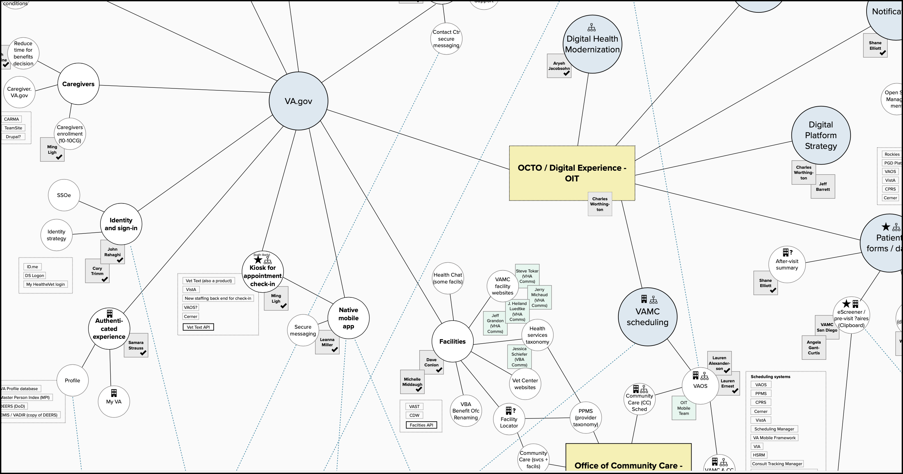
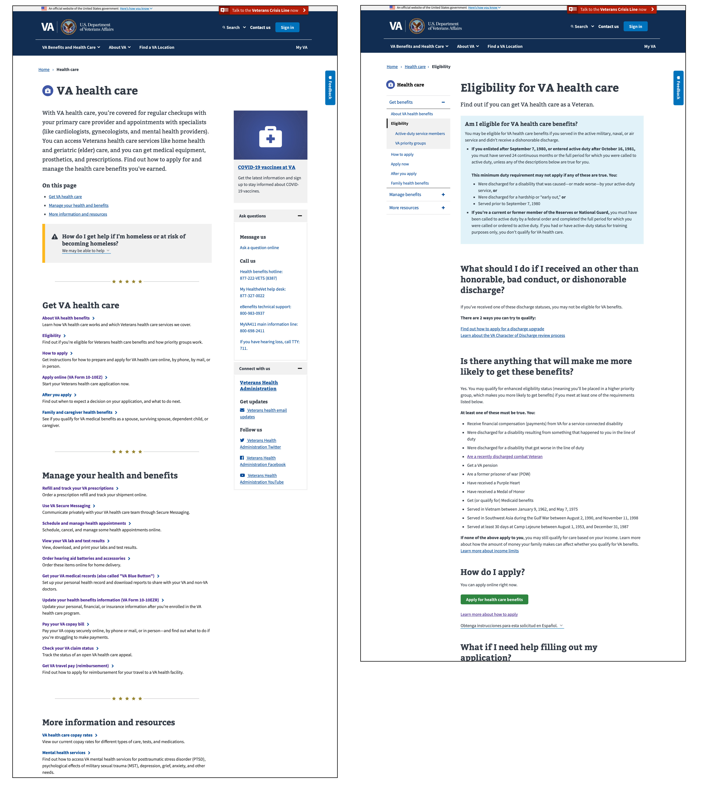

# Health Apartment Team Onboarding Guide
*The Health Apartment Team was created to help modernize, unify, and streamline the Veteran health experience.*

## Introduction
In November 2020, the Department of Veterans Affairs (VA) Office of the Chief Technology Officer (OCTO) created the Digital Health Modernization (DHM) Team to simplify Veterans’ health experience on the web. This document, written in August 2021, describes the history and implications of the DHM Team's work between November 2020 and August 2021. If you’re working on those implications, this was written for you. Thank you for your work.

## Goals of this onboarding guide
- That people working on the health apartment understand:
  - The vision
  - The concept
  - The health landscape at the VA

- That people working on the health apartment know:
  - Who decided we should do this
  - How they decided
  - Why they decided

- That people working on the health apartment:
  - Have clear roles
  - Have a clear list of problems that need to be solved
  - Know where to look or who to ask when they need something

## Table of Contents
* [Mission](#mission)
* [Vision](#vision)
  * [How do we get there?](#how-do-we-get-there)
  * [How should the work proceed?](#how-should-the-work-proceed)
  * [What success might look like](#what-success-might-look-like)
* [DHM Team history](#dhm-team-history)
  * [Key milestones](#key-milestones)
  * [OCTO-OCC vision workshops](#octo-occ-vision-workshops)
* [The bigger picture](#the-bigger-picture)
  * [Where is the health apartment work situated?](#where-is-the-health-apartment-work-situated)
  * [How does the health apartment intersect with other VA.gov work?](#how-does-the-health-apartment-intersect-with-other-vagov-work)
* [Appendix](#appendix)
  * [Reading material](#reading-material)
  * [Recommendations](#recommendations)

# Mission
The Health Apartment Team’s mission is to simplify Veterans’ health experience on the web, picking up where the DHM Team left off. The original DHM Team has fulfilled its mission. Going forward, work on the health apartment will be one of many digital health modernization efforts.

To get the health care they need, Veterans must find, register for, and learn to use a number of different websites and software products. [Our generative research from late 2020](https://github.com/department-of-veterans-affairs/va.gov-team/blob/master/products/health-care/digital-health-modernization/research/generative-research-study-1/research-findings.md) shows that Veterans find it extremely difficult to navigate commonplace interactions with VA health care. The VA ecosystem is so complex that Veterans feel discouraged to apply for, manage, and maximize their benefits.

Consider booking a doctor’s appointment: One system locates nearby facilities. Another schedules appointments. Another handles follow-ups like messages and prescriptions. And another reimburses travel expenses. That’s a lot for Veterans to learn. It’s also difficult for VA staff to support so many siloed systems.

We aim to reduce the number of websites, products, and interfaces Veterans must use in order to get health care and manage their health — and we aim to make those experiences easy and intuitive.

# Vision
With this mission in mind, in Spring 2021 the DHM Team held a series of workshops with the leadership of OCTO (which owns [VA.gov](https://www.va.gov)) and the Office of Connected Care (OCC owns [My HealtheVet](https://www.myhealth.va.gov/mhv-portal-web/home) and is part of VHA, Veterans Health Administration). OCTO and OCC leadership aligned on a vision we call the "health apartment." This concept will unify all health things from My HealtheVet, eBenefits, and VA.gov into a distinct section of VA.gov branded as "My HealtheVet." As a result, Veterans will be able to manage all of their benefits, including health care, from VA.gov.

In conversations with OCTO and OCC staff, we heard that the health apartment idea appealed to them for a few reasons:
- All things health are in one place.
- The concept scales to provide a holistic experience with other VA benefits.
- For users, it will feel similar to My HealtheVet.
- It makes it easier for My HealtheVet to retain its brand.

The wireframe below illustrates what the health apartment could look like.

*Above, the “health apartment” concept that the Health Apartment Team will design and test as a proof of concept, then iterate on and build. See [this Mural](https://app.mural.co/t/departmentofveteransaffairs9999/m/departmentofveteransaffairs9999/1620410062494/ebd48844ad82c50d028818c677a26faab827cfb3?sender=megpeters0505).*

The vision is to move the following things into the health apartment:
- [My HealtheVet](https://www.myhealth.va.gov/mhv-portal-web/home) content and functionality (starting with Appointments, Prescriptions, Secure Messaging, and Medical Records — we call these top tasks the "big four”)
- Health-related things on [VA.gov](https://www.va.gov/) (examples: apply for health care, medical copays, travel pay, and order hearing aid batteries)
- Any health related things left on [eBenefits](https://www.ebenefits.va.gov/ebenefits/homepage), the VA/Department of Defense website for benefits managed by VBA, Veterans Benefits Administration. Most VBA benefits are not related to health, with the exception of prosthetic socks and hearing aid batteries. For the past year or so, OCTO has gradually been moving eBenefits functionality and content to VA.gov.

*Above, the My HealtheVet (https://www.myhealth.va.gov/) and VA.gov homepages in early August 2021. (The user is not signed in.)*

Since things like disability compensation and claims relate closely to health, the health apartment will have intuitive and meaningful pathways to this content, which lives elsewhere on VA.gov. (Note that VBA, not VHA, administers disability compensation. Also, most claims by Veterans are disability claims, but a Veteran can file a claim related to any VA benefit: health care, pension, housing assistance, etc.)

As the Health Apartment Team, you will design the health apartment and test it with Veterans to see how well it meets their needs before taking expensive and difficult-to-revoke steps to rebuild the My HealtheVet website inside VA.gov. Your team will validate or invalidate the health apartment vision and ship a proof of concept to production.

## How do we get there?
Incrementally. It will take intense collaboration and planning, with the Health Apartment Team working closely with multiple teams in OCTO and OCC. As part of the Health Apartment Team, these 3 VA employees will help guide the work and connect you to VA partners and subject-matter experts:
- A product person from OCC
- An engineer from OCC
- A designer from OCTO

In the workshops, OCTO-OCC leadership decided to move appointments into the health apartment first for a few reasons:
- Appointments is one of the “big four” Veteran top task areas. (Appointments functionality includes scheduling, managing, cancelling, rescheduling, and more.)
- Both My HealtheVet and VA.gov have appointments functionality (some of it redundant).
- [VA Online Scheduling (VAOS)](https://www.va.gov/health-care/schedule-view-va-appointments/), the appointments tool with more functionality than [My HealtheVet Appointments](https://www.myhealth.va.gov/mhv-portal-web/web/myhealthevet/keeping-up-with-your-va-appointments), is already part of VA.gov.

With consensus on appointments, OCTO and OCC are taking the first steps towards the health apartment concept. In August 2021, the My HealtheVet and VAOS Teams started comparative analyses of their appointments tools and notifications. The purpose of this work is to:
- Find gaps in appointments functionality between My HealtheVet and VAOS
- Understand user needs
- Recommend ways to address gaps
- Propose what functionality in My HealtheVet should not move into the apartment (if applicable)
- Define the core functionality for appointments and appointments notifications to move into the health apartment

At the same time, the appointments roadmap points of contact from OCTO and OCC began aligning their roadmaps and creating a plan to move My HealtheVet appointments functionality into VAOS, which is on VA.gov.

This summer, the My VA Team has been working on notifications and alerts. In the health apartment vision, centralized notifications are a key driver of value for Veterans. The health apartment will help us implement notifications in a way that maximizes their usefulness and minimizes duplication.

As the Health Apartment Team, before moving any My HealtheVet and VAOS products into production, you will design and test the apartment concept to ensure that it’s viable, intuitive, easy to use and navigate, and clearly understood by Veterans.

## How should the work proceed?
The DHM Team communicated the model below to the My HealtheVet Team. This model should not be rethought until a proof of concept has been shipped. In the model, the work proceeds this way:

- Now / this quarter / **planned work**
  - Ship an apartment proof of concept
  - Analyze differences in appointments functionality between My HealtheVet and VAOS
- Next / after this quarter / **intended work**
  - Create a detailed plan to rebuild the My HealtheVet website MVP inside the VA.gov health apartment
  - Presumed MVP scope: Make the happy paths for appointments, prescriptions, medical records and secure message functional on VA.gov
- Later / 2-5 year time horizon / **envisioned work**
  - Integrate or deprecate the long tail of My HealtheVet tools and content
  - Integrate Community Care (VA-funded healthcare at non-VA facilities)
  - Integrate Cerner electronic health record management system (There is a long-term effort to install this at all VA facilities.)

The Health Apartment Team can use this model over time, always having buckets of planned, intended, and envisioned work.

*Above, a slide from the DHM Team’s presentation to the My HealtheVet Team about the health apartment concept on July 15, 2021.*

## What success might look like
We envision the Health Apartment Team evaluating and learning as they iterate, asking after each planned phase:
- What went well?
- What did not?
- Should we adjust the health apartment vision?

In this context of continuous iteration, the DHM Team shared the following thoughts about what success might look like with the My HealtheVet Team.

*Above, a slide from the DHM Team’s presentation to the My HealtheVet Team about the health apartment concept on July 15, 2021.*

Here’s the thinking behind the graphic above.

### Why was the planned work planned first?
- It’s critical to validate the design with real user feedback before jumping in headfirst.
- VA.gov’s information architecture and navigation system need love before they are ready to integrate the health apartment concept.
- Creating the “apartment” before we move products onto VA.gov means products can move asynchronously. This simplifies planning a lot.
- Moving products from My HealtheVet to VA.gov will succeed only if we collaborate with the My HealtheVet Team.

Since the work for appointments and appointments notifications started before the Health Apartment Team will onboard, it will pave the way for the health apartment in a few important ways:
- The work will be done by the first blended team between OCTO and OCC.
- We will understand the My HealtheVet appointments infrastructure better.
- We will have more insight into the needs of users of appointments functionality.

### What’s the thinking behind the intended work?
Because some work needs more planning and validation before it’s actionable, the DHM Team recommends these activities (shown as “intended” above):
- Adopt formal, shared success metrics.
- Move or rebuild Prescriptions, Secure Messaging, and Medical Records functionality into the health apartment.
- Do an opt-in beta test for users of My HealtheVet Appointments, Prescriptions, Secure Messaging, and Medical Records as these products (the "big four") move into the health apartment.
- Follow with an opt-out beta test for My HealtheVet users of the "big four."
- Formally launch the My HealtheVet apartment on VA.gov and deactivate the instances of those products on My HealtheVet.

Making the intended work actionable requires (a) learnings from shipping the health apartment, and (b) that OCTO-OCC leadership help with planning. The leadership group plans to meet every 6 weeks to check in with the Health Apartment Team and the points of contact for aligning these OCTO and OCC roadmaps:
- Appointments
- Notifications
- PGHD (patient-generated health data)
- Secure messaging
- Pharmacy

### What’s the thinking behind the envisioned work?
Since this is a Herculean effort, it's important to have a North Star to guide decisions and focus the work. All along, our North Star has been to unify, streamline, and consolidate the Veteran health experience, and we see the health apartment concept as the first big step in that direction. We envision:
- An accessible, usable, discoverable My HealtheVet-branded section of VA.gov that contains all web health tools.
- That the Health Apartment Team will continue to define and consolidate the Veteran health experience on VA.gov after validating or invalidating the health apartment concept.  
- That teams who own health tools on My HealtheVet and VA.gov will help move them to VA.gov and will continue to own them afterwards.

Going forward, the Health Apartment Team will partner with OCTO and OCC staff to guide the work on the VA.gov health experience, including all planned, intended, and envisioned work.

# DHM Team history
The Digital Health Modernization Team formed in late 2020 to create a product strategy for Veterans to manage their health care on VA.gov. Following the vision set forth in the [Digital Modernization Strategy](https://github.com/department-of-veterans-affairs/va.gov-team/blob/master/products/va-gov-relaunch-2018/va-gov-strategy/digitalmodernizationstrategy.pdf), we aim to give Veterans one website to manage all of their VA benefits.

The following describes the key milestones of the team’s journey.

## Key milestones
**Mapping the Health Landscape | October - November 2020**
- Conducted OCTO stakeholder interviews to understand the intersection of health and VA.gov.
- [Gathered web analytics for My HealtheVet](https://github.com/department-of-veterans-affairs/va.gov-team/blob/master/products/health-care/digital-health-modernization/analytics/my-healthevet/MHV-Google_Analytics_Late-2020.pdf)
- Began mapping the VA health landscape: people, products, and systems. For the full view, [go to the health landscape Mural](https://app.mural.co/t/departmentofveteransaffairs9999/m/departmentofveteransaffairs9999/1606314329344/1d6343c768f02ec0ab12eab999c331b3c64b29eb).
  

*Above, a partial view of the VA health landscape, intended to convey its vastness and complexity. [Go to the health landscape Mural](https://app.mural.co/t/departmentofveteransaffairs9999/m/departmentofveteransaffairs9999/1606314329344/1d6343c768f02ec0ab12eab999c331b3c64b29eb).*

**Discovery research | December 2020**
- [Conducted generative research with Veterans and caregivers to understand how they think about and manage health care](https://github.com/department-of-veterans-affairs/va.gov-team/blob/master/products/health-care/digital-health-modernization/research/generative-research-study-1/research-findings.md).

**OCTO big rock planning | January 2021**
- [Planned OCTO Health big rocks](https://app.mural.co/t/departmentofveteransaffairs9999/m/departmentofveteransaffairs9999/1611253339753/84f8b6fe7d254477f57aa7215f7b953428149a62?sender=uaf2e527a10dad9fb94a02129).
- [Cocreated recommendations with OCTO Digital Experience crews](https://app.mural.co/t/departmentofveteransaffairs9999/m/departmentofveteransaffairs9999/1610571571747/efaae198a64701c8eee8dd5efe8bf85657d39c1c?sender=uaf2e527a10dad9fb94a02129).

**DHM product strategy | February - March 2021**
- Created product strategy and roadmap documents.
  - [GitHub product repo](https://github.com/department-of-veterans-affairs/va.gov-team/tree/master/products/health-care/digital-health-modernization/product)
  - [Microsoft Teams: Digital Health Modernization Phase 1](https://teams.microsoft.com/l/file/36FF257E-4366-4D29-9D0B-A1F5207F3F4A?tenantId=e95f1b23-abaf-45ee-821d-b7ab251ab3bf&fileType=docx&objectUrl=https%3A%2F%2Fdvagov.sharepoint.com%2Fsites%2FOCTO-Health%2FShared%20Documents%2FDigital%20Health%20Modernization%2FDigital%20Health%20Modernization%20Phase%201.docx&baseUrl=https%3A%2F%2Fdvagov.sharepoint.com%2Fsites%2FOCTO-Health&serviceName=teams&threadId=19:4966c5d6e2334740a84fd1b4fcb107f7@thread.skype&groupId=d0a820a4-a7fc-4c92-9f4a-a866363c2818)

**DHM product vision | April - June 2021**
- Designed and held vision workshops with OCTO and OCC leadership.

**Appointments consolidation | July 2021**
- Began collaborating with My HealtheVet.

**Prep for onboarding the Health Apartment Team | August - September 2021**
- Wrote this onboarding guide.
- Created a [health apartment site map](https://app.mural.co/t/departmentofveteransaffairs9999/m/departmentofveteransaffairs9999/1630530056765/d3d8cdb3f341d709f2f6b6658bbd7d6b6c50bf75).
- Gathered [analytics (page views and search terms)](https://github.com/department-of-veterans-affairs/va.gov-team/blob/master/products/health-care/digital-health-modernization/analytics/Analytics.md).
- Sketched out user research studies.

## OCTO-OCC vision workshops
From April to June 2021, the DHM Team led a series of 4 workshops with OCTO and OCC leadership to define a vision to simplify Veterans’ health experience on the web, as well as a path forward for realizing that vision.

The workshop series was designed to help OCTO and OCC align and work together. In the past, OCTO and OCC have operated independently, both creating software, often with overlapping or redundant content and functionality. Equally dedicated to improving the health experience for Veterans, OCTO and OCC have complementary skill sets:
- **OCC** has medical expertise and has cultivated a vision for patient engagement. For over 15 years, OCC has managed VA’s patient portal, My HealtheVet, with 5 million registered users (about half of the Veterans who get health care from VA). In addition to medical expertise, OCC has deep technical expertise and knowledge of VistA, VA’s electronic health records system, slated to be replaced by Cerner.
- **OCTO** has design and technical expertise, which have led to success in tackling difficult user experience challenges using modern technologies and processes.

The 4 workshops yielded the vision for the health apartment, and OCTO and OCC leadership aligned on next steps. Here’s a summary of what we covered with links to the workshop agendas:
- [**Workshop 1:**](https://github.com/department-of-veterans-affairs/va.gov-team/blob/master/products/health-care/digital-health-modernization/workshops/vision/DHM%20Workshop%201.pdf) Discussed existing fragmented health landscape and brainstormed what success looks like as OCTO and OCC work together going forward.
- [**Workshop 2:**](https://github.com/department-of-veterans-affairs/va.gov-team/blob/master/products/health-care/digital-health-modernization/workshops/vision/DHM%20Workshop%202.pdf) Considered 3 concepts for moving My HealtheVet and the health-related things on VA.gov to a new health section of VA.gov. The health apartment concept won 80% consensus.
- [**Workshop 3:**](https://github.com/department-of-veterans-affairs/va.gov-team/blob/master/products/health-care/digital-health-modernization/workshops/vision/DHM%20Workshop%203.pdf) Reviewed project ideas and decided these 3 were top priority: notifications, appointments, and the health apartment.
- [**Workshop 4:**](https://github.com/department-of-veterans-affairs/va.gov-team/blob/master/products/health-care/digital-health-modernization/workshops/vision/DHM%20Workshop%204.pdf) Looked at OCC’s and OCTO’s roadmaps and chose these areas to align on: appointments, notifications, PGHD (patient-generated health data), secure messaging, and pharmacy. We also designated OCTO and OCC points of contact for each of these 5 areas.

The workshops brought OCTO and OCC together on a shared vision and path forward. Since our 2 offices have different cultures and ways of working, the Health Apartment Team will need to be flexible and creative as they collaborate with partners throughout OCTO and OCC.  

In our first workshop with OCTO and OCC leadership, we asked the group what it would look like if we succeeded in unifying the health experience. During that brainstorm, the theme “hide the plumbing” emerged. ([See the Mural from that brainstorming session](https://app.mural.co/t/departmentofveteransaffairs9999/m/departmentofveteransaffairs9999/1617049140406/7f90489c0db15b1f5843e5b7bb360661040ac818?sender=uaf2e527a10dad9fb94a02129).) In other words, if we design an exceptional health experience, Veterans will not need to navigate the VA and its product silos. Instead there will be one user experience — no redundant tasks or multiple communication channels. During the leadership workshops, someone expressed it this way:  

> *"Veterans do not need to know that we are several different teams. To them, their digital interactions feel created by the same VA."*

In addition to hiding the plumbing, leadership agreed that VA should provide a personalized experience for all benefits, in line with the Digital Modernization Strategy below. In [our generative research](https://github.com/department-of-veterans-affairs/va.gov-team/blob/master/products/health-care/digital-health-modernization/research/generative-research-study-1/research-findings.md), we observed participants struggling to understand their eligibility for VA benefits. In particular, participants were confused about the nuanced ways eligibility for health care and disability benefits differ. These findings underscore the value of a personalized view of VA benefits that shows the connections between health care and disability.   

For the second OCTO-OCC leadership workshop, we evaluated [3 concepts for how to “hide the plumbing” and connect health with other VA benefits related to health.](https://app.mural.co/t/departmentofveteransaffairs9999/m/departmentofveteransaffairs9999/1619564345817/2907c538199617dfdbae8131d8c806083b4025f2?sender=uaf2e527a10dad9fb94a02129) All the concepts would:
- Improve the Veteran health experience
- Make My HealtheVet’s and VA.gov’s designs more similar, with both using the [VA.gov Design System](https://design.va.gov/)
- Result in the My HealtheVet and VA.gov teams working together more closely

Leadership evaluated the 3 concepts anonymously during the workshop, with 80% consensus on the health apartment concept. They based their evaluation on these criteria:
- How well each concept supported specific top tasks or scenarios; and
- Which concept best fits user needs.

To prepare for workshop 3, we met with 13 key teams/stakeholders in OCTO and OCC to get their feedback on the health apartment concept, discuss their roadmaps, and hear project ideas to move us towards the health apartment. The DHM Team synthesized what we heard and in workshop 3 presented the OCTO-OCC leadership group with a list of project ideas. Leadership chose to immediately focus on notifications, appointments, and the health apartment. They also expresssed a strong desire to align the OCTO and OCC roadmaps.

Our goal for workshop 4 was twofold: 1) compare OCTO and OCC roadmaps and designate points of contact, and 2) align on the role of the OCTO-OCC leadership group. We emerged from workshop 4 with [these next steps](https://github.com/department-of-veterans-affairs/va.gov-team/blob/master/products/health-care/digital-health-modernization/workshops/vision/DHM-plan-after-4th-workshop%20v2.pdf) and points of contact for appointments, notifications, PGHD, secure messaging, and pharmacy (voted as top priority). And the OCTO-OCC leadership group agreed to meet about every 6 weeks to help drive the health apartment, roadmap alignment, and collaboration between OCTO and OCC.

# The bigger picture
OCTO's Digital Health Modernization efforts extend way beyond the scope of the DHM Team's work. Besides requiring close partnership with My HealtheVet and the Office of Connected Care, this work will impact most VA.gov teams.

Read on for the mission, vision, and goals behind all work in OCTO; the overarching Digital Modernization Strategy; and ways the health apartment concept intersects with other VA.gov efforts.

## Where is the health apartment work situated?

### OCTO
The vision for the health apartment supports OCTO’s mission, vision, and North Star goals for serving Veterans.

**OCTO mission:** Continuously deliver high-quality digital experiences for the benefit of all Veterans and their families.

**OCTO vision:** Every Veteran is guaranteed access to self-service benefits and accurate data.

**OCTO North Star goals:**
- Increase the usage and throughput of VA services.
- Decrease the time Veterans spend waiting for an outcome.
- Increase the quality and reliability of VA services.

### Digital Modernization Council
For the past few years, OCTO has led the Digital Modernization Council, working with executives across VA to modernize online services for Veterans. The [Digital Modernization Strategy,](https://github.com/department-of-veterans-affairs/va.gov-team/blob/master/products/va-gov-relaunch-2018/va-gov-strategy/digitalmodernizationstrategy.pdf) defined in July 2017, continues to guide our design and technology decisions:
- VA will deliver self-service tools on par with top private sector companies and will have the best online experience in the federal government.
- Every digital service will be customized to the individual using it.
- Interacting with VA digital services will feel like navigating TurboTax, not filling out a form.

## How does the health apartment intersect with other VA.gov work?

### Appointments
As part of planned work for the health apartment, the VAOS Team and the My HealtheVet Team are collaborating on a gap analysis and user research in order to consolidate the appointment experience into VAOS on VA.gov. Appointments/VAOS will be the first tool to move into the health apartment.

[Go to the Microsoft Teams channel where VAOS and My HealtheVet are collaborating on appointments analysis.](https://teams.microsoft.com/l/channel/19%3a75a7b4c89a6148c784e0336ecc42c339%40thread.t[…]-071bbc4e7ea3&tenantId=e95f1b23-abaf-45ee-821d-b7ab251ab3bf)

### Notifications
After consolidating appointments into VAOS, the team will do a gap analysis and user research in preparation for moving all appointment-related notifications to VA.gov. This work will involve not only My HealtheVet and VAOS, it will involve two other VA.gov teams: My VA and VA Notify.

**My VA** is a personalized landing page on VA.gov. That team is [exploring how to better elevate action items within My VA.](https://github.com/department-of-veterans-affairs/va.gov-team/tree/master/products/identity-personalization/my-va/action-items-discovery) This exploratory design research will lay the foundation for how VA.gov will show notifications — a key part of the Veteran health experience (and thus the health apartment concept).

*Above, a mockup of the My VA page that's similar to what launched in Summer 2021.*

**VANotify** is a standardized, self-service platform VA offices can use to implement notifications. The My VA Team will build an MVP for notifications supported by VANotify. [See what products are currently supported on VANotify.](https://github.com/department-of-veterans-affairs/va.gov-team/tree/master/products/va-notify#see-who-we-are-working-with)

As part of the DHM Team's workshop series, OCC agreed to leverage the VANotify platform moving forward. My VA, VANotify, and the Health Apartment Team will work together to provide centralized notifications on VA.gov.

### Sign in
In January 2021, the OCTO Identity Team spearheaded a strategy to consolidate pathways and tools for Veterans to sign in to VA products and services. This strategy will help deliver on the promise of this Digital Modernization principle: “Every service is accessible from a single 'front door' experience.”

Veterans will be directed to VA.gov/sign-in to authenticate, regardless of which VA website they are on. The identity strategy identifies one private credential (ID.me) and one public credential (Login.gov) for Veterans to choose from. Over the long term, existing credentials (including My HealtheVet and DSLogon) will be deprecated.

Starting in January 2021, the Identity Team formed an Identity Working Group to coordinate across lines of business to realize this vision. They have an ATO for Login.gov and are beginning [discovery research about Veteran attitudes toward the public credential.](https://github.com/department-of-veterans-affairs/va.gov-team/tree/master/products/identity-personalization/login.gov)

Several ongoing privacy and security initiatives support the identity strategy and health apartment vision, including:
- **Consolidating Terms of Service (ToS):** Currently My HealtheVet and VA.gov have different ToS. We need a single ToS for users to authenticate at VA.gov/sign-in from both VA.gov and My HealtheVet. This will also pave the way for moving My HealtheVet health products into VA.gov.
- **Deprecating “Advanced” My HealtheVet Accounts:** To comply with NIST security guidelines, My HealtheVet is deprecating its advanced level accounts. This is intended to nudge more Veterans to identity proof, a critical step as we migrate to ID.me and Login.gov.

The DHM Team created the health apartment design concept with the assumption that a sign-in solution will be implemented before products are moved from My HealtheVet to VA.gov. We recommend that the Health Apartment Team coordinate with the OCTO Identity Team to share updates and research findings, as well as coordinate on key initiatives.

### Flagship mobile app
In June 2021, the OCTO Mobile Team launched the flagship mobile app MVP. Combining both VA benefits and health care tools in a single interface, the app is an early proof of concept for the health vision. While DHM aligned OCC and OCTO leadership on this vision, the Mobile Team created momentum bottom-up by [co-designing with Veterans](https://github.com/department-of-veterans-affairs/va.gov-team/blob/master/products/va-mobile-app/ux-research/prototype-testing/testing-summary.md) and collaborating directly with the My HealtheVet team. Secure messaging was part of the flagship mobile app MVP.

### Medical finances
[In our generative research study,](https://github.com/department-of-veterans-affairs/va.gov-team/blob/master/products/health-care/digital-health-modernization/research/generative-research-study-1/research-findings.md) we learned that a major pain point for Veterans was having to navigate outside of My HealtheVet for medical financial tasks. Two common tasks include 1) viewing and paying a medical copayment, and 2) requesting travel pay. The VA reimburses Veterans for expenses incurred traveling to any VA appointment.

The Debt Resolution Team has created a tool on VA.gov to help Veterans quickly and easily understand if and why they owe VA money and how to work with VA to pay it.

In Summer 2021, the team has been [designing the medical copayment tool MVP on VA.gov.](https://github.com/department-of-veterans-affairs/va.gov-team/tree/master/products/Debt%20Resolution/Medical_Copays) Their discovery research validated findings from our study: that Veterans expect to find information about their VA medical bills with the rest of their health tools and information on My HealtheVet.

In the short term, the Debt Resolution Team will coordinate with My HealtheVet to provide meaningful connections between My HealtheVet and VA.gov. Long term, the Health Apartment Team will coordinate with the Debt Resolution Team to design financial information and tools in the apartment.

As of August 2021, OCTO is exploring consolidating the travel pay experience in VA.gov. Although VA.gov provides content about travel pay, Veterans must navigate to another website--access.va.gov--to submit a request through the Beneficiary Travel Self-Service System (BTSSS). At the time of writing, work has yet to begin.

### Check in for appointments
The Check-in Team is reimagining the ecosystem that allows a Veteran to check in for a VA medical appointment. As of August 2021, the team aimed to pilot an MVP of the product before the end of August. [Go to the team's GitHub repo.](https://github.com/department-of-veterans-affairs/va.gov-team/tree/master/products/health-care/checkin)

The product allows Veterans to use their mobile device to let VA know they have arrived for their appointment (to check in) via VA.gov. The Health Apartment Team should coordinate with this team to consider how to support the entire appointment journey.

### Authenticated home page
The unauthenticated and authenticated VA.gov homepage currently share the same design. At this time, the My VA dashboard is separate from the authenticated homepage. The future vision is for My VA evolve into the authenticated homepage for VA.gov. [Read the background here.](https://github.com/department-of-veterans-affairs/va.gov-team/blob/master/products/identity-personalization/my-va/2.0-redesign/README.md#logged-in-homepage--my-va-pivot)

This summer, the team launched My VA 2.0. This second iteration has already seen some [early success](https://github.com/department-of-veterans-affairs/va.gov-team/tree/master/products/identity-personalization/my-va#what-we-can-do-in-the-next--1--2-quarters-100-foot-view-q2--q3-2021) with Veterans engaging with the new My VA.

To design a cohesive authenticated experience, the Health Apartment Team will need to collaborate with the My VA Team and others on the Account Experience Crew. Work on authenticated and unauthenticated navigation strategy and implementation will also involve the Sitewide Crew.

### Content and navigation
The [Health Care benefit hub on VA.gov](https://www.va.gov/health-care/) (below) gives Veterans the information and tools they need to apply for and manage health benefits. While VAOS is located in the Health Care benefit hub, the hub links to My HealtheVet for Prescriptions, Secure Messaging, and Medical Records. And it links to AccessVA for travel pay.

*Above, August 2021 screen grabs of the Health Care hub page and the Eligibility page, which is on the next level.*

In the health apartment vision, everything in the Health Care hub would move to the health apartment. Because the first flyout menu link on the main navigation for VA.gov is "VA Benefits and Health Care," it would be best to migrate the Health Care hub content early to avoid confusing Veterans by having 2 places on the VA.gov navigation for health ("VA Benefits and Health Care" and "My HealtheVet").

To move the Health Care hub into the health apartment, the Health Apartment Team will need to work closely with the Content Team on the Sitewide Crew. This team manages the content in the Health Care hub, working closely with business stakeholders.

The [navigation system used in the benefit hubs](https://www.va.gov/health-care/about-va-health-benefits/) differs from the [navigation system used for the VA Medical Center websites](https://www.va.gov/pittsburgh-health-care/). It's possible that neither of these navigation systems will work well for the health apartment for various reasons. At a minimum, work on the health apartment will most likely require the evolution or extension of one of these navigation systems.  

---

# Appendix
## Reading material
Reading these documents may help with general context. If you are unable to download or view anything below, any OCTO employee can help you get access to these documents.

### "Parent" initiatives
Older projects that directly or indirectly contributed to digital health modernization.

[Digital Modernization Strategy](https://github.com/department-of-veterans-affairs/va.gov-team/blob/master/products/va-gov-relaunch-2018/va-gov-strategy/digitalmodernizationstrategy.pdf)

[Web Brand Consolidation](https://github.com/department-of-veterans-affairs/va.gov-team/blob/master/products/va-gov-relaunch-2018/readme.md)

### The long game
Major programs at the VA which we may be able to make much more accessible to Veterans in the future if we succeed with this work.
- **Cerner EHR Migration:** VA has been implementing Cerner, an electronic health record (EHR) system, at its health care facilities, one by one. Currently only a few of VA’s ~1,300 facilities have migrated to Cerner. VA’s previous EHR system, [VistA], still holds most of the patient data. Veterans can see their health data from both VistA and Cerner on VA.gov.
  -  [About VA EHR modernization (Cerner implementation)](https://www.ehrm.va.gov/)
  -  [About VistA](https://www.va.gov/health/imaging/)
- **Mission Act and Community Care:** The MISSION Act gives Veterans greater access to health care in VA facilities and the community, expands benefits for caregivers, and improves VA’s ability to recruit and retain the best medical providers. For example, a Veteran who lives far from a VA Medical Center (VAMC) and needs specialty care may qualify to see a non-VA provider nearby through the Community Care program.
  - [MISSION Act legislation](https://www.congress.gov/115/bills/s2372/BILLS-115s2372enr.pdf)
  - [MISSION Act fact sheets on Community Care](https://www.va.gov/COMMUNITYCARE/pubs/factsheets.asp)
  - [General information on Community Care](https://www.va.gov/COMMUNITYCARE/docs/pubfiles/factsheets/VHA-FS_MISSION-Act.pdf)

### Deep cuts
Strategies from previous attempts to do similar projects.
- [Ad Hoc](https://github.com/department-of-veterans-affairs/va.gov-team-sensitive/blob/master/products/health-care/digital-health-modernization/documents/VA.gov%20Health%20Portal.docx)
- [VA OCTO](https://github.com/department-of-veterans-affairs/va.gov-team-sensitive/blob/master/products/health-care/digital-health-modernization/documents/2020.1.10%20readout%20%20(1).pptx)
- [By Light](https://github.com/department-of-veterans-affairs/va.gov-team-sensitive/blob/master/products/health-care/digital-health-modernization/documents/MHV_Going%20Forward_White_Paper_Dec_20.2019.docx)

### Background on Veterans and VA
[Ad Hoc's "VA 101"presentation](https://github.com/department-of-veterans-affairs/va.gov-team/blob/master/products/health-care/digital-health-modernization/assets/VA%20101%20-%20External%20-%20Aug%202021.pdf) gives detailed info on: 
- Veteran demographics
- Veteran benefit usage, journeys, and pain points with VA
- VA benefits and services, budget and staffing, and key policies

## Directory of points of contact
Use this to connect with teams referenced throughout this document.

| Team | OCTO Crew | Slack Channel | GH Repo | Relevant Projects |
| ---- | ---- | ---- | ---- | ---- |
| My VA | Account Experience | [@vsa-authd-exp](https://dsva.slack.com/archives/C909ZG2BB) | [My VA repo](https://github.com/department-of-veterans-affairs/va.gov-team/tree/master/products/identity-personalization/my-va) | auth homepage; notifications; check in; appointments; medical finances |
| VANotify | Account Experience | [@va-notify-public](https://dsva.slack.com/archives/C010R6AUPHT) | [VANotify repo](https://github.com/department-of-veterans-affairs/va.gov-team/blob/master/products/va-notify/README.md) | notifications; auth homepage; check in; appointments; mobile |
| VEText | Account Experience | [@vetext-notifications](https://dsva.slack.com/archives/C01D2T36XLL) | [VEText repo](https://github.com/department-of-veterans-affairs/va.gov-team/tree/master/products/vetext) | notifications; appointments; check in |
| Mobile | Mobile Experience | [@va-mobile-app](https://dsva.slack.com/archives/C018V2JCWRJ) | [Mobile repo](https://github.com/department-of-veterans-affairs/va.gov-team/tree/master/products/va-mobile-app) | mobile; notifications; sign-in; appointments |
| VSP Identity | Account Experience | [@vsp-identity](https://dsva.slack.com/archives/CSFV4QTKN) | [Identity repo](https://github.com/department-of-veterans-affairs/va.gov-team/tree/master/products/identity-personalization/login)| sign-in; mobile |
| VAOS | Health | [@vaos-team](https://dsva.slack.com/archives/CMNQT72LX) | [VAOS repo](https://github.com/department-of-veterans-affairs/va.gov-team/tree/master/products/health-care/appointments/va-online-scheduling)| appointments; notifications; check in |
| Check in (VSA Healthcare Experience team) | Health | [@check-in-experience](https://dsva.slack.com/archives/C022AC2STBM) | [Check-in repo](https://github.com/department-of-veterans-affairs/va.gov-team/blob/master/products/health-care/checkin/product/product-outline.md) | check in; appointments; medical finances |
| Debt Resolution (Benefits and Memorials 2) | Benefits | [@vsa-debt](https://dsva.slack.com/archives/CPE4AJ6Q0) | [Debt Resolution repo](https://github.com/department-of-veterans-affairs/va.gov-team/tree/master/products/Debt%20Resolution) | medical finances; check in; auth homepage |

## Org charts
Here are some org charts that should prove useful.  
- [OCTO-DE strategic hierarchy](https://github.com/department-of-veterans-affairs/va.gov-team/blob/master/strategy/OCTO-DE%20Strategic%20Hierarchy.pdf) (Note that "DE" refers to the Digital Experience part of OCTO, which overlaps with the Health Delivery part of OCTO.)
- [My HealtheVet org chart](assets/MHV-Org-Chart.docx)

## Recommendations
If the current product person were to remain in his role, this is what he’d advocate.

### Team
- **Planning:** Do something scrum-like rather than Kanban-like for iteration planning. The org understands it better. You’ll have an easier time partnering with feds.
- **Project management:** Use GitHub Issues or Max.gov JIRA for project management. Those two tools are open to all people you will collaborate with eventually. No other tool is.
- **Document collaboration:** Use Microsoft Teams and Mural for document collaboration. Do not use Google Docs. Many VA feds cannot use Google Docs. It’s perceived as rude.
- **Meetings:** Use Zoom or Teams for video meetings. Those tools work for virtually all VA feds. Other tools may not.
- **Weekly updates:** Send a weekly email explaining what the team worked on and why you did it that way (ex., this is why we did a concept test; this is what we learned). Part of the value of this engagement is patterning good product development behavior. OCTO product owners tell us they appreciate our weekly email, that they value being in the loop with our work. Regular communication helps us all "connect the dots" between various health efforts.   

### Product
- **Technical risks:** Early on in proof of concept design, inventory and prioritize technical risks. The concept was developed by non-technical staff and does not account for them.
- **Handling risks:** People will throw risks and concerns at you left and right. To the maximum extent possible, address these by shrinking the problem rather than growing the solution.
- **Metrics:** Early on in proof of concept design, identity metrics we think (1) can actually be measured without earth-shattering effort, and (2) reasonably capture Veteran-facing benefit or harm plausibly caused by software we release.
- **Ownership:** Identify a fed (strongly preferably a Veteran, mildly preferably a member of Office of Connected Care / VHA) and groom them to own the resulting health apartment on VA.gov from a strategic product management perspective. This thing will grow large and complex. Minimally, it will need someone at the helm able to make difficult decisions in order to keep it maintainable and consistent. Ideally a steward / champion will evolve and disseminate the vision.
- **Data and systems:** When building, bear in mind that the front-end-as-perceived-by-Veterans may later need to draw data from several unrelated back-end systems (ex., facilities using VistA as their EHR, and facilities using Cerner — and potentially Community Care facilities using a variety of EHRs, though that’s more pie in the sky at this point).

### Organization
- **Planning:** Adopt an OCTO-wide planning cadence (probably quarterly) so that cross-team consequences of doubling the complexity and user count of VA.gov can be planned and prioritized in a way that respects teams’ existing commitments.
- **Prioritization:** Adopt a formal top-down method for prioritizing cross-team work in OCTO, in sync with the planning cadence. This initiative will not always be in individual teams’ best interest to work on, but it will be in the office’s best interest to override that kind of local optimization.

### Communication
We cannot underscore the need for good communication strongly enough. It has been a long road to get here. For several years, OCTO and OCC have been trying to work together in a meaningful and productive way. Both groups have tried hard and felt frustrated and discouraged. Trust has been a major issue.

As the Health Apartment Team onboards, we are at an exciting and critical stage. We need to nurture the trust we have built between OCTO and OCC over the past few months. We need to be open and honest yet tread carefully. We need to communicate clearly and often, keeping in mind that many in OCC and OCTO, both federal employees and contractors, have worked years to get to this point.

Besides sending a weekly email explaining what we worked on and why we did it that way, we have had success doing "tours" or "roadshows." If we need feedback or find ourselves at a decision point, we schedule quick sessions with teams doing related work. Before each tour, we usually prepare a Mural board with activities/questions and use it to guide the discussion. We have learned very important things during these sessions and also made strong connections with other teams in the health space.

In our conversations across OCC and OCTO, we have found that certain words and ideas resonate with people, while others definitely do not. For example:
- The phrase “digital front door strategy” has been used at VA for years and resonates widely. In certain contexts, this extends beyond health, meaning that Veterans would use the same digital front door both when they are Veterans (getting benefits from VA) and previously when they are on active service duty (getting benefits from DoD, the Department of Defense).
- Everyone believes that Veterans should not have to think about what software they use to fulfill their health care needs. We talk often about creating a unified health experience. Words like "streamlined," "seamless," and "intuitive" resonate.
- When talking about My HealtheVet going to VA.gov, the idea of "retiring" My HealtheVet has created confusion, and it's not accurate. Instead we talk about:
  - Reimagining the My HealtheVet *website* as a 'My HealtheVet' section of VA.gov
  - Moving the My HealtheVet *website* into a 'My HealtheVet'-branded section of VA.gov
  - Keeping the My HealtheVet brand and moving things between *websites*.
 - Moving the people with the products, from My HealtheVet to VA.gov.

At VA, you might hear the phrase "single source of truth." In general, the word "single" does not work well for a couple reasons. One, the flagship mobile app is different from the website, so there will not be a "single" experience. Two, the health experience is so huge, with so many moving parts, that it will take years to unify it.

### Portfolio
Assuming the health apartment is (viable and) a vehicle for perhaps the most important Veteran benefit, health care, we believe that the following aspects of VA.gov will figure heavily into the Veteran and caregiver health experience. Our belief is not supported by specific research, testing, or ideation. The intent in writing this down is to spark thinking about how the apartment, and the promise of the apartment, might inspire us to change other aspects of VA.gov.

#### Authenticated experience / My VA / VA.gov homepage
- Make My VA (or something that replaces it) the home / destination page for users who create an account and for users who sign in from the homepage. Currently the VA.gov homepage does not have a logged-in state. The Account Experience Crew is using the My VA page to test ideas for a logged-in homepage; eventually they envision that an iteration of My VA will become the logged-in homepage.
- Ensure that the home page does not contradict information in the health apartment (ex., if there are 2 unread health messages that show in the apartment, and the home page displays unread message count, there should be at least 2 unread messages indicated on the home page).

The logged-in homepage should not otherwise be constrained by the apartment vision. The team that owns the authenticated home should be free to determine the most valuable things to put on it based on Veteran research and best judgment.

#### Sitewide navigation
- Conduct primary taxonomy research (ex., card sorts) based on hypothetical future available tasks and topics, including the health apartment tasks and tools, not “top tasks” currently on VA.gov. Analytics don’t see what people can’t find in navigation.
- Re-organize main navigation based on ^
- Regarding the VA.gov navigation systems, see the "Content and navigation" section above.

#### Notifications
- Scope sitewide notifications to transactional notifications only. Use other channels for marketing. Don’t yield on this. Respect Veterans’ attention. We need to preserve an effective communication channel for things that really matter.
- If there’s a sitewide UX component, put it in the nav / header (rendered on every page). Do not bury it on a page. That defeats the purpose.
- Consider being opinionated rather than implementing user preferences, or configurability may become a quagmire and our users may shoot themselves (and us) in the foot by making bad decisions. For example, if there's a change in your claim status:
  - We notify you immediately on all applicable channels (there is no setting for this); versus
  - You have the option for notifications for ANY claims changes; versus
  - You get a notification only if it has reached final status or needs an action from you.

#### Profile
- Read and update [previous thinking](https://github.com/department-of-veterans-affairs/va.gov-team-sensitive/blob/master/products/health-care/digital-health-modernization/documents/MHV%20profile%20recommendations.pdf) on how to consolidate MHV and VA.gov profiles (this is out of date).

#### Login
- Support Identity Team as needed in implementing universal single sign-on between VA.gov and My HealtheVet. It will make transition far easier if both tech stacks can consistently agree upon the identity of a user and always present the same data.

#### Legal and privacy
- Support Identity Team and Carnetta Scruggs as needed in consolidating My HealtheVet and VA.gov Terms of Service; if this is not done, it will block the health apartment release.

#### Marketing
- Plan to market these changes continuously for several months:
  - Directly to Veterans
  - To VSOs
  - To My HealtheVet Coordinators
  - To support / help desk staff

#### Support
- Lobby aggressively for all of VA.gov to be on the same first-tier support contract, including My HealtheVet; otherwise debugging issues and measuring customers' problems will be intractable (connect with the Identity Team for history lessons on why this matters).
- During transition, invest in high-quality how-to guides for Veterans going from Legacy My HealtheVet to "apartment" My HealtheVet. Writing quality is higher in OCTO for this sort of thing, and it will make it easier to sell the health apartment transition to VSOs, My HealtheVet Coordinators, etc. if we can write a lot of the collateral for them.
