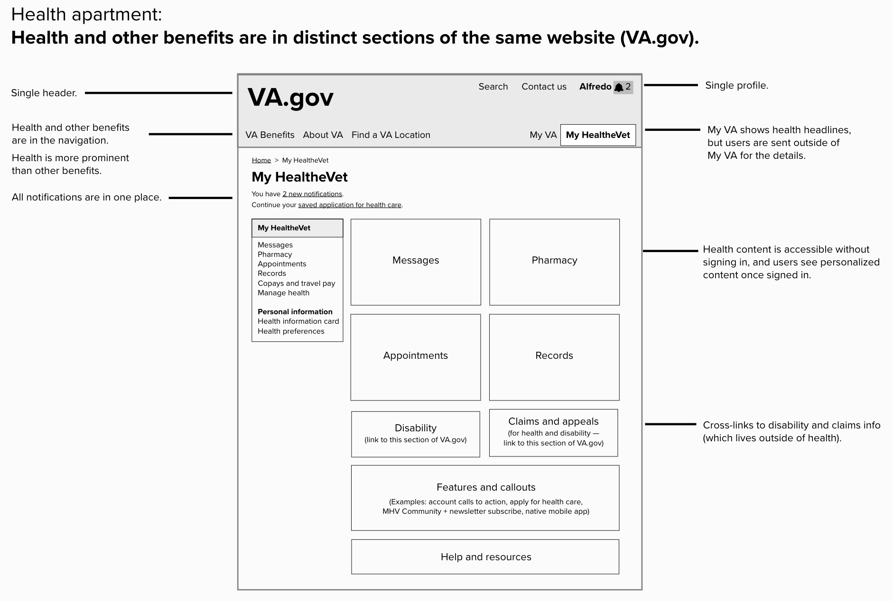

# Health Apartment Team Onboarding Guide
*The Health Apartment Team was created to help modernize, unify, and streamline the Veteran health experience.*

## Introduction
In November 2020, the Department of Veterans Affairs (VA) Office of the Chief Technology Officer (OCTO) created the Digital Health Modernization (DHM) Team to simplify Veterans’ online health experience. This document describes the history and implications of this team’s work between November 2020 and August 2021. If you’re working on those implications, this was written for you. Thank you for your work.

## Goals of This Onboarding Guide
1) That people working on the health apartment understand:
- The vision
- The concept
- The health landscape at the VA

2) That people working on the health apartment know:
- Who decided we should do this
- How they decided
- Why they decided

3) That people working on the health apartment:
- Have clear roles
- Have a clear list of problems that need to be solved
- Know where to look or who to ask when they need something

# Executive Summary
TBD

# Mission
The Health Apartment Team’s mission is to simplify Veterans’ online health experience, picking up where the DHM Team left off.

To get the health care they need, Veterans must find, register for, and learn to use a number of different websites and software products. [Our generative research from late 2020](https://github.com/department-of-veterans-affairs/va.gov-team/blob/master/products/health-care/digital-health-modernization/history/research/generative-research-study-1/research-findings.md) shows that Veterans find it extremely difficult to navigate commonplace interactions with VA health care. The VA ecosystem is so complex that Veterans feel discouraged to apply for, manage, and maximize their benefits.

Consider booking a doctor’s appointment: One system locates nearby facilities. Another schedules appointments. Another handles follows-ups like messages and prescriptions. And another reimburses travel expenses. That’s a lot for Veterans to learn. It’s also difficult for VA staff to support so many siloed systems.

We aim to reduce the number of websites, products, and interfaces Veterans must use in order to get health care and manage their health.

# Vision
With this mission in mind, the DHM Team held a series of workshops held in Spring 2021 with the leadership of OCTO (which owns [VA.gov](https://www.va.gov)) and the Office of Connected Care (OCC, which owns [My HealtheVet](https://www.myhealth.va.gov/mhv-portal-web/home)). OCTO and OCC leadership aligned on a vision we call the "health apartment." This concept will unify all health things from My HealtheVet (MHV) and VA.gov into a distinct section of VA.gov branded as "My HealtheVet." As a result, Veterans will be able to manage all of their benefits, including health care, from VA.gov. The wireframe below illustrates what this could look like.

*The “health apartment” concept that the Health Apartment Team will design and test as a proof of concept, then iterate on and build. See [this Mural](https://app.mural.co/t/departmentofveteransaffairs9999/m/departmentofveteransaffairs9999/1620410062494/ebd48844ad82c50d028818c677a26faab827cfb3?sender=megpeters0505).*

These things will move into the health apartment, which will be branded as “My HealtheVet”:
- My HealtheVet content and functionality (starting with Appointments, Prescriptions, Secure Messaging, and Records — known as “the big four” since they are top tasks)
- Health-related things on VA.gov (examples: apply for health care, medical copays, travel pay, order hearing aid batteries and prosthetic socks)

The health apartment will have intuitive and meaningful pathways to content closely related to health, content that lives elsewhere on VA.gov (examples: disability, claims, Veterans Health Library).

In conversations with OCTO and OCC staff, we heard that the “health apartment” appealed to them for a few reasons:
- All things health are in one place.
- The concept scales to provide a holistic experience with other VA benefits.
- For users, it will feel similar to My HealtheVet.
- It makes it easier for My HealtheVet to retain its brand.

As the Health Apartment Team, you will design the health apartment and test it with Veterans to see how well it meets their needs before we take expensive and difficult-to-revoke steps to rebuild MHV’s website inside VA.gov. Your team will validate or invalidate the health apartment vision and ship a proof of concept to production.

## How do we get there?
Incrementally. It will take intense collaboration and planning, with the Health Apartment Team working closely with multiple teams in OCTO and OCC. These 3 VA employees will support and guide the Health Apartment Team:
- A product person from OCC
- An engineer from OCC
- A designer from OCTO

In the workshops, OCTO-OCC leadership supported the idea of moving appointments into the health apartment first for a few reasons:
- Appointments is one of the “big four” Veteran top task areas (scheduling, managing, cancelling, rescheduling, etc.).
- Both My HealtheVet and VA.gov have appointments functionality (some of it redundant).
- VA Online Scheduling (VAOS), the appointments tool with more functionality than My HealtheVet, is already part of VA.gov.

With the consensus on appointments, OCTO and OCC began to move toward the health apartment concept beginning in late July 2021. The MHV and VAOS teams have started to conduct comparative analyses of existing appointments tools and their notifications. The purpose of this work is to:
- Find gaps in functionality between MHV appointments and VAOS
- Understand user needs
- Recommend ways to address gaps
- Propose functionality in MHV that should not move into the apartment (if applicable)
- Define the core sets of functionality for appointments and appointments notifications

At the same time, the points of contact for aligning the appointments roadmaps are creating a plan to consolidate web appointments into VAOS and retire My HealtheVet appointment functionality.

Also the VA.gov team is working on sitewide notifications. In the health apartment vision, centralized notifications are a key driver of Veteran value. The health apartment will help us implement them in a way that maximizes value and minimizes duplicate notifications.

Before moving any My HealtheVet and VAOS products in production, the Health Apartment Team will design and test the apartment concept to ensure that it’s viable, intuitive, easy to use and navigate, and clearly understood by Veterans.

## How should the work proceed?
The DHM Team communicated the model below to the MHV team. This model should not be rethought until a proof of concept has been shipped. In the model, the work proceeds this way:

- Now / this quarter / planned work
  - Ship an apartment proof of concept (that’s you, dear reader)
  - Analyze differences between the MHV and VAOS appointments tools and their notifications
- Next / after this quarter / intended work
  - Detailed plan to rebuild MHV website MVP inside VA.gov apartment
  - Presumed MVP scope is appointments, prescriptions, medical records and secure message happy paths all functional on VA.gov
- Later / 2-5 year time horizon / envisioned work
  - Integrate or deprecate the long tail of MHV tools and content
  - Integrate Community Care (VA-funded healthcare at non-VA facilities)
  - Integrate Cerner electronic health record management system (there is a long-term effort to install this at all VA facilities)

The Health Apartment Team can use this model over time, always having buckets of planned, intended, and envisioned work.

*Slide from the DHM Team’s presentation to the My HealtheVet Team about the health apartment concept on July 15, 2021.*

## What success might look like
We envision the Health Apartment Team evaluating and learning as they iterate, asking after each planned phase:
- What went well?
- What did not?
- Should we adjust the health apartment vision?

In this context of continuous iteration, the DHM Team shared thoughts with the MHV Team about what success might look like.

*Slide from the DHM Team’s presentation to the My HealtheVet Team about the health apartment concept on July 15, 2021.*

Here’s the thinking behind the graphic above.

### Why was the planned work planned first?
- It’s critical to validate the design with real user feedback before jumping in headfirst.
- VA.gov’s information architecture and navigation need love before they’re ready to integrate the health apartment concept.
- Creating the “apartment” before we move products onto VA.gov means products can move asynchronously. This simplifies planning, a lot.
- Moving products from My HealtheVet to VA.gov will succeed only by collaborating with the My HealtheVet Team.

Since the work for appointments and appointment notifications will start before the Health Apartment Team onboards, it will pave the way for the health apartment in a few important ways:
- The work will be done by the first blended team between OCTO and OCC/My HealtheVet.
- We will understand the My HealtheVet appointments infrastructure better.
- We will have more insight into the needs of users of appointments functionality.

### What’s the thinking behind the intended work?

Because some work needs more planning and validation before it’s actionable, the Digital Health Modernization Team recommends these activities (shown as “intended” above):
- Adopt formal, shared success metrics.
- Move or rebuild Secure Message, Prescription Refill and Medical Records functionality into the “apartment.”
- Do an opt-in beta test for My HealtheVet users of the products in the second bullet above.
- Follow with an opt-out beta test for My HealtheVet users of the products in the second bullet above.
- Formally launch the My HealtheVet apartment on VA.gov and deactivate non-apartment instances of those products on My HealtheVet.

Making the intended work actionable requires (a) learnings from shipping the “apartment” section and (b) that OCTO-OCC leadership help with planning. The leadership group plans to meet every 6 weeks to check in with the Health Apartment Team and the points of contact for aligning these sections of the OCTO and OCC roadmaps:
- Appointments
- Notifications
- PGHD (patient-generated health data)
- Secure messaging
- Pharmacy

### What’s the thinking behind the envisioned work?
Since this is a Herculean effort, it's important to have a North Star to guide decisions and focus the work. All along, our North Star has been to unify, streamline, and consolidate the Veteran health experience, and we see the health apartment concept as the first step in that direction. We envision:
- An accessible, usable, discoverable My HealtheVet-branded section of VA.gov that contains all web health tools.
- That the Health Apartment Team will continue to define and consolidate the Veteran health experience on VA.gov after validating or invalidating the health apartment concept.  
- That teams who own health tools on My HealtheVet and VA.gov will help move them to VA.gov and will continue to own them afterwards.

Going forward, the Health Apartment Team will partner with OCTO and OCC staff to guide the work on the VA.gov health experience, including all planned, intended, and envisioned work.

# Team History
The Digital Health Modernization team formed in late 2020 to create a product strategy for Veterans to manage their health care on VA.gov. Following the vision set forth in the Digital Modernization Strategy, we aim to give Veterans one place to manage all of their VA benefits.

The following describes the key milestones of the team’s journey.

## Key Milestones
Mapping the Health Landscape | October - November 2020
- Conducted OCTO stakeholder interviews to understand the intersection of health and VA.gov
- [Began mapping the health landscape](https://github.com/department-of-veterans-affairs/va.gov-team/tree/master/products/health-care/digital-health-modernization/history/information-architecture)
- Gathered baseline web analytics

Discovery Research | December 2020
- [Conducted generative research with Veterans and caregivers](https://github.com/department-of-veterans-affairs/va.gov-team/blob/master/products/health-care/digital-health-modernization/history/research/generative-research-study-1/research-findings.md)

OCTO Big Rock Planning | January 2021
- [OCTO Health Big Rocks planning](https://app.mural.co/t/departmentofveteransaffairs9999/m/departmentofveteransaffairs9999/1611253339753/84f8b6fe7d254477f57aa7215f7b953428149a62?sender=uaf2e527a10dad9fb94a02129)
- [Co-created recommendations with OCTO-DE crews](https://app.mural.co/t/departmentofveteransaffairs9999/m/departmentofveteransaffairs9999/1610571571747/efaae198a64701c8eee8dd5efe8bf85657d39c1c?sender=uaf2e527a10dad9fb94a02129)

DHM Product Strategy | February - March 2021:
- Created product strategy and roadmap documents
  - [Github product repo](https://github.com/department-of-veterans-affairs/va.gov-team/tree/master/products/health-care/digital-health-modernization/product)
  - [Microsoft Teams: Digital Health Modernization Phase 1](https://teams.microsoft.com/l/file/36FF257E-4366-4D29-9D0B-A1F5207F3F4A?tenantId=e95f1b23-abaf-45ee-821d-b7ab251ab3bf&fileType=docx&objectUrl=https%3A%2F%2Fdvagov.sharepoint.com%2Fsites%2FOCTO-Health%2FShared%20Documents%2FDigital%20Health%20Modernization%2FDigital%20Health%20Modernization%20Phase%201.docx&baseUrl=https%3A%2F%2Fdvagov.sharepoint.com%2Fsites%2FOCTO-Health&serviceName=teams&threadId=19:4966c5d6e2334740a84fd1b4fcb107f7@thread.skype&groupId=d0a820a4-a7fc-4c92-9f4a-a866363c2818)

DHM Product Vision | April - June 2021:
- Designed and held vision workshops

Appointments Consolidation | July 2021:
- Began collaborating with MHV

## Vision Workshops
From April to June 2021, OCTO’s Digital Health Modernization (DHM) Team led a series of 4 workshops with OCTO and OCC leadership to define a vision for simplifying the health experience for Veterans, as well as a path forward for realizing that vision.

The workshop series was designedThe DHM Team formed in late 2020 to help OCTO and OCC align and work together. In the past, OCTO and OCC have operated independently, both creating software, often with overlapping content and functionality. Equally dedicated to improving the health experience for Veterans, OCTO and OCC have complementary skill sets:
- OCC has medical expertise and has cultivated a vision for patient engagement. This office manages VA’s patient portal, My HealtheVet, which has 5 million registered users (about half of the Veterans who get health care from VA). In addition to medical expertise, OCC has deep technical expertise and knowledge of VistA, VA’s electronic health records system slated to be replaced by Cerner.
- OCTO has design and technical expertise, which have led to success in tackling difficult user experience challenges using modern technologies and processes.

The 4 workshops yielded the vision for the health apartment, and OCTO and OCC leadership aligned on next steps. Here’s a summary of what we covered:
- Workshop 1: Discussed existing fragmented health landscape and brainstormed what success looks like as OCTO and OCC work together going forward.
- Workshop 2: Considered 3 concepts for combining My HealtheVet and the health-related things on VA.gov into a new health section of VA.gov. The health apartment concept gleaned 80% consensus. After this workshop, the DHM Team met with groups in OCTO to get feedback on the health apartment concept and get their ideas on projects that would move us towards the apartment.
- Workshop 3: Reviewed project ideas and decided these 3 areas are top priority: notifications, appointments, and the health apartment.
- Workshop 4: Looked at OCC’s and OCTO’s roadmaps and chose these areas to align our roadmaps on in the near term: appointments, notifications, PGHD (patient-generated health data), secure messaging, and pharmacy. And we designated OCTO and OCC points of contact for each of these 5 areas.

The workshops brought OCTO and OCC together on vision and a path forward. Since these two offices have different cultures and ways of working, the Health Apartment Team will need to be flexible and creative as they collaborate with partners throughout OCTO and OCC.  

In our first workshop with OCTO and OCC leadership, the theme “hide the plumbing” emerged. If we design an exceptional health experience, Veterans will not need to navigate the VA and its product silos. Instead there will be one user experience — no redundant tasks or multiple communication channels. We heard this during the leadership workshops:  

> *"Veterans do not need to know that we are several different teams. To them, their digital interactions feel created by the same VA."*

In addition to hiding the plumbing, leadership agreed that VA should provide a personalized experience for all benefits. In [our generative research](https://github.com/department-of-veterans-affairs/va.gov-team/blob/master/products/health-care/digital-health-modernization/history/research/generative-research-study-1/research-findings.md), we observed that participants struggled to understand their eligibility for VA benefits. In particular, participants were confused about the nuanced ways health care and disability eligibility differ. These findings underscore the value of providing a personalized view of VA benefits that also shows the connections between health care and disability benefits.   

For the second OCTO-OCC leadership workshop, we created 3 concepts for how to “hide the plumbing” and connect health with other VA benefits. All the concepts would:
- Improve the Veteran health experience
- Make My HealtheVet’s and VA.gov’s designs more similar
- Result in the My HealtheVet and VA.gov teams working together more closely

Leadership evaluated the 3 concepts anonymously, and there was 80% consensus on the “health apartment” concept. Their evaluation was based on these criteria:
How well each concept supported specific top tasks or scenarios
Which concept best fits user needs

… following this style, we’ll want to add details for workshops 3-4 here.

# The Bigger Picture

The Digital Health Modernization program is much bigger than the initial DHM team. In addition to requiring a close partnership with My HealtheVet and the Office of Connected Care, this work will impact most VA.gov teams. The following describes how the Health Apartment™ work is situated within the Office of the CTO’s strategic initiatives, and how it intersects with ongoing work on VA.gov.

## Where is this work situated?

### OCTO
The vision for the health apartment supports OCTO’s mission, vision, and North Star goals for serving Veterans.

OCTO vision: Every Veteran is guaranteed access to self-service benefits and accurate data.
OCTO mission: Continuously deliver high-quality digital experiences for the benefit of all Veterans and their families.
OCTO’s North Star goals:
- Increase the usage and throughput of VA services.
- Decrease the time Veterans spend waiting for an outcome.
- Increase the quality and reliability of VA services.

### Digital Modernization Council
For the past few years, OCTO has led the Digital Modernization Council, working with executives across VA to modernize online services for Veterans. The Digital Modernization Strategy, defined in July 2017, continues to guide our design and technology decisions:

- VA will deliver self-service tools on par with top private sector companies and will have the best online experience in the federal government.
- Every digital service will be customized to the individual using it.
- Interacting with VA digital services will feel like navigating TurboTax, not filling out a form.

### How does this intersect with other VA.gov work?

#### Appointment consolidation

As part of our planned work, the VA Online Scheduling (VAOS) team and MHV team are collaborating to conduct a gap analysis and user research in order to consolidate the appointment experience into a single tool on VA.gov. As such, this is the first tool to move into the apartment.

*(Can link to Teams channel, etc. where collaboration is taking place.)*

#### Notifications

After consolidating appointments in VAOS, the team will then conduct gap analysis and user research to consolidate all appointment-related notifications in VA.gov. This work will involve not only MHV and VAOS, but two other VA.gov teams: My VA and VA Notify.

My VA is an authenticated product on VA.gov that offers Veterans a personalized landing page. The team is [exploring how to better elevate action items within My VA.](https://github.com/department-of-veterans-affairs/va.gov-team/tree/master/products/identity-personalization/my-va/action-items-discovery) This exploratory design research will lay the foundation for how VA.gov will surface notifications -- a key part of the Health Apartment design concept.

VANotify is a standardized, self-service notifications platform. The My VA team will build an MVP for notifications that are currently supported by VANotify. [See what products are currently supported on VANotify.](https://github.com/department-of-veterans-affairs/va.gov-team/tree/master/products/va-notify#see-who-we-are-working-with)

As part of the Digital Health Modernization workshop series, OCC agreed to leverage the VANotify platform moving forward. My VA, VANotify, and the Health Apartment team will need to work together to provide centralized notifications in the apartment.

#### Sign-in

In January 2021, the OCTO Identity team spearheaded a strategy to consolidate pathways and tools for Veterans to sign in to VA products and services.This strategy is a main driver in delivering the promise of the Digital Modernization principle: “Every service is accessible from a single “front door” experience.”

Veterans will be directed to VA.gov/sign-in to authenticate, regardless of web property. The identity strategy identifies one private (ID.me) and one public (Login.gov) credential that Veterans can choose from. Long-term, this will mean existing credentials including MHV and DSLogon will be deprecated.

Starting in January, the Identity team instituted a Identity Working Group to coordinate across lines of business to realize this vision. They have received an ATO for Login.gov, and are [beginning discovery research about Vetearn attitudes toward the public credential.](https://github.com/department-of-veterans-affairs/va.gov-team/tree/master/products/identity-personalization/login.gov)

Several privacy and security initiatives are ongoing to support the identity strategy and apartment vision, including:
- **Consolidating Terms of Service:** Currently, MHV and VA.gov have different ToS. A single ToS is needed for authentication to occur on VA.gov/sign-in for both sites. This will also pave the way for moving MHV health products into VA.gov.
- **Deprecating “Advanced” MHV Accounts:** To comply with NIST security guidelines, MHV is deprecating its advanced level accounts. This is intended to nudge more Veterans to identity proof, a critical step in the identity strategy migration.

For purposes of good governance, the Digital Health Modernization team created the Health Apartment design concept under the assumption that a sign-in solution will be implemented before products are moved from My HealtheVet to VA.gov. However, we recommend that the Health Apartment team continues to coordinate with the OCTO Identity team to share updates, research findings, and coordinate on key initiatives to realize both teams’ vision.

#### Flagship mobile app

In June 2021, the OCTO Mobile team launched the MVP native mobile app. Combining both VA benefits and health care tools in a single interface, the app is an early proof of concept for the health vision. While DHM aligned OCC and OCTO leadership on this vision, the Mobile team created momentum bottom up through [co-designing with Veterans](https://github.com/department-of-veterans-affairs/va.gov-team/blob/master/products/va-mobile-app/ux-research/prototype-testing/testing-summary.md) and collaborating directly with the MHV team.

#### Medical finances

[In our generative research study,](https://github.com/department-of-veterans-affairs/va.gov-team/blob/master/products/health-care/digital-health-modernization/history/research/generative-research-study-1/research-findings.md) we learned that a major pain point for Veterans was having to navigate outside of MHV for medical financial related tasks. Two common tasks include 1) Viewing and paying a medical copayment, and 2) Requesting travel pay, a reimbursement issued by VBA for travel expenses to VA appointments.

The Debt Resolution team has created a debt management tool on VA.gov that allows Veterans to quickly and easily understand if and why they have debt with the VA, and how to work with the VA to resolve them.

The team is currently [designing the medical copayment tool MVP on VA.gov.](https://github.com/department-of-veterans-affairs/va.gov-team/tree/master/products/Debt%20Resolution/Medical_Copays) Their discovery research validated findings from our study: that Veterans expect to find information about their VA medical bills with the rest of their health tools on My HealtheVet.

In the short term, the Debt Resolution team will coordinate with My HealtheVet to provide meaningful connections between My HealtheVet and VA.gov. Long term, the Health Apartment team will coordinate with Debt Resolution to design financial information and tools in the apartment.

*Talk to Chris J about progress on BTSSS travel pay work.*

#### Authenticated home page

The unauthenticated and authenticated VA.gov homepage currently share the same design. In the future, My VA is intended to evolve into the authenticated homepage for VA.gov. However, the current iteration of My VA is a separate dashboard that lives side-by-side with the authenticated homepage. [Read more about this distinction here.](https://github.com/department-of-veterans-affairs/va.gov-team/blob/master/products/identity-personalization/my-va/2.0-redesign/README.md#logged-in-homepage--my-va-pivot)

This year, the team iterated on the overall design of My VA, which launched in June. The team has already seen some [early success](https://github.com/department-of-veterans-affairs/va.gov-team/tree/master/products/identity-personalization/my-va#what-we-can-do-in-the-next--1--2-quarters-100-foot-view-q2--q3-2021) in engagement with the product as a result.

The health apartment team will need to collaborate with My VA to design a cohesive authenticated experience.

#### Content and navigation

*Emily to chat with Meg to get this section right*

# Recommendations
If the current product person were to remain in his role, this is what he’d advocate.

## Team
- Do something scrum-like rather than kanban-like for iteration planning. The org understands it better. You’ll have an easier time partnering with feds.
- Use Github Issues or Max.gov JIRA for project management. Those two tools are open to all people you will collaborate with eventually. No other tool is.
- Use MS Teams and Mural for document collaboration. Do not use Google Docs. Many VA feds cannot use Google Docs. It’s perceived as rude.
- Use Zoom or Teams for video meetings. Those tools work for virtually all VA feds. Other tools may not.
- Send a weekly email explaining what the team worked on and why you did it that way (ex., this is why we did a concept test; this is what we learned). Part of the value of this engagement is patterning good product development behavior.

## Product
- Early on in proof of concept design, inventory and prioritize technical risks. The concept was developed by non-technical staff and does not account for them.
- Early on in proof of concept design, identity metrics we think (1) can actually be measured without earth-shattering effort and (2) reasonably capture Veteran-facing benefit or harm plausibly caused by software we release.
- Identify a Fed (strongly preferably a Veteran, mildly preferably a member of Office of Connected Care / VHA) and groom them to own the resulting health “apartment” on VA.gov from a strategic product management perspective. This thing will grow large and complex. Minimally, it will need someone at the helm able to make difficult decisions in order to keep it maintainable and consistent. Ideally, it will need a steward / champion to evolve and disseminate the vision.
- People will throw risks and concerns at you left and right. To the maximum extent possible, address these by shrinking the problem rather than growing the solution.
- Build bearing in mind that the front-end-as-perceived-by-Veterans may later need to draw data from several, unrelated backend systems (ex., facilities using VistA as their EHR, and those using Cerner — as well as potentially Community Care facilities using a variety of EHRs, though that’s more pie in the sky at this point)

## Organization
- Adopt an OCTO-wide planning cadence (probably quarterly) so that cross-team consequences of doubling the complexity and user count of VA.gov can be planned and prioritized in a way that respects teams’ existing commitments
- Adopt a formal top-down method for prioritizing cross-team work in OCTO, in sync with the planning cadence. This initiative will not always be in individual teams’ best interest to work on, but it will be in the office’s best interest to override that kind of local optimization.

## Portfolio
The following are descriptions of what we believe would result in a coherent and cohesive user experience for Veterans, assuming the health apartment is (viable and) a vehicle for perhaps the most important Veteran benefit: Healthcare. These are not supported by specific research, testing or ideation. The intent in writing this down is to spark thinking about how the apartment, and the promise of the apartment, might inspire us to change other aspects of VA.gov.

### Authenticated Experience / My VA / Home
- My VA (or something that replaces it) becomes the home / destination page for users who complete sign up, and users who sign in from the homepage
- The home page must not contradict information displayed in the health apartment (ex., if there are 2 unread health messages that show in the apartment, and the home page displays unread message count, there should be at least 2 unread messages indicated on the home page)
- The authenticated homepage should not otherwise be constrained by the apartment vision. The team that owns the authenticated home should be free to determine the most valuable things to put on it based on Veteran research and best judgment

### Sitewide Navigation
- Conduct primary taxonomy research (ex., card sorts) based on hypothetical future available tasks and topics, including the health apartment tasks and tools, not “top tasks” currently on VA.gov. Analytics don’t see what people can’t find in nav.
- Re-organize main nav based on ^

### Notifications
- Scope sitewide notifications to transactional notifications only. Use other channels for marketing. Don’t yield on this. Respect Veterans’ attention, and our need to preserve an effective communication channel for things that really matter.
- If there’s a sitewide UX component, put it in the nav / header (rendered on every page). Do not bury it on a page.That defeats the purpose.
- Consider being opinionated rather than implementing user preferences or configurability may become a quagmire and our users may shoot themselves (and us) in the foot by making bad decisions (yes, I am the nanny state). Ex., if your appointment was canceled we are going to notify you immediately on all applicable channels there is no setting for this; vs. option for notification for ANY claims changes vs. only if it has reached final status or needs an action from you.

### Profile
- ADD LINKS TO PREVIOUS MHV PROFILE CONSOLIDATION RESEARCH ARYEH

### Login
- Support Identity team as needed in implementing universal single sign-on between VA.gov and MHV; it will make transition far easier if both tech stacks can consistently agree upon the identity of a user, and present the same data consistently

### Legal and Privacy
- Support Identity team and Carnetta Scruggs as needed in consolidating MHV and VA.gov Terms of Service; if not done, it will block apartment release

### Marketing
- Plan to market these changes continuously for several months
  - Direct to Veterans
  - To VSOs
  - To MHV Coordinators
  - To support / help desk staff

### Support
- Lobby aggressively for all of VA.gov to be on the same first-tier support contract, including My HealtheVet; otherwise debugging issues and measuring customers' problems will be intractable (connect with the Identity team for history lessons on why this matters)
- During transition, invest in high-quality publications of how-to guides for Veterans transitioning from Legacy MHV to "apartment" MHV; writing quality is higher in OCTO for this sort of thing and it will make it easier for us to sell transition to VSOs, MHV Coordinators, etc. if we can write a lot of the collateral for them

---

# Appendix
[Digital Modernization Strategy](https://github.com/department-of-veterans-affairs/va.gov-team/blob/master/products/va-gov-relaunch-2018/va-gov-strategy/digitalmodernizationstrategy.pdf)

[Web Brand Consolidation](https://github.com/department-of-veterans-affairs/va.gov-team/blob/master/products/va-gov-relaunch-2018/readme.md)

Cerner EHR Migration

Mission Act and Community Care

Previous Digital Health Modernization strategies (kindly request these from a VA OCTO employee if you are not one):
- [Ad Hoc](https://github.com/department-of-veterans-affairs/va.gov-team-sensitive/blob/master/products/health-care/digital-health-modernization/documents/VA.gov%20Health%20Portal.docx)
- [VA OCTO](https://github.com/department-of-veterans-affairs/va.gov-team-sensitive/blob/master/products/health-care/digital-health-modernization/documents/2020.1.10%20readout%20%20(1).pptx)
- [By Light](https://github.com/department-of-veterans-affairs/va.gov-team-sensitive/blob/master/products/health-care/digital-health-modernization/documents/MHV_Going%20Forward_White_Paper_Dec_20.2019.docx)
