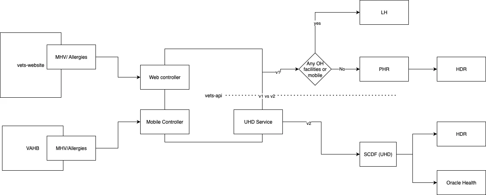

# Allergies

## Key terms

- v1 == current version of the API, this is what is live in production
- v2 == next version of the API, for this case this is SCDF

## Diagram

## Filter rules

- For allergies we get from HDR for v1, in PHR, we only showing allergies that have a status of `F` (for final)
- In  SCDF we are mapping `F` to `active` for the verification status
- We only display allergies to users when the verification status is `F` (or `active` in SCDF)

## Questions

> Does a status of `F` from HDR mean that its signed off by a provider?

Yes, we assume.
