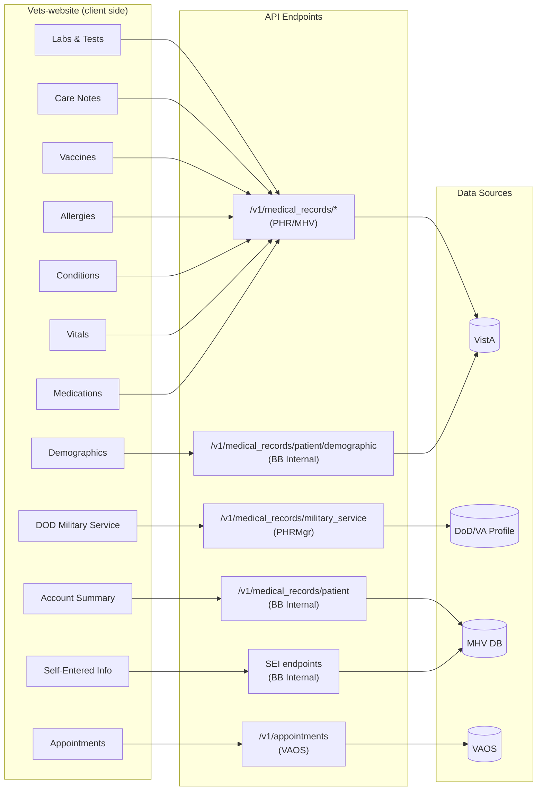

# Health Records Architecture

## Blue Button Data Flow

```mermaid
flowchart LR
    subgraph BB["Vets-website (client side)"]
        direction TB
        Labs["Labs & Tests"]
        Notes["Care Notes"]
        Vaccines["Vaccines"]
        Allergies["Allergies"]
        Conditions["Conditions"]
        Vitals["Vitals"]
        Meds["Medications"]
        Appts["Appointments"]
        Demo["Demographics"]
        MilSvc["DOD Military Service"]
        AcctSum["Account Summary"]
        SEI["Self-Entered Info"]
    end

    subgraph APIs["API Endpoints"]
        PHRAPI["/v1/medical_records/*<br/>(PHR/MHV)"]
        DemoAPI["/v1/medical_records/patient/demographic<br/>(BB Internal)"]
        MilAPI["/v1/medical_records/military_service<br/>(PHRMgr)"]
        PatAPI["/v1/medical_records/patient<br/>(BB Internal)"]
        SEIAPI["SEI endpoints<br/>(BB Internal)"]
        VAOSAPI["/v1/appointments<br/>(VAOS)"]
    end

    subgraph Sources["Data Sources"]
        VistA[(VistA)]
        DoD[(DoD/VA Profile)]
        MHV[(MHV DB)]
        VAOSDb[(VAOS)]
    end

    Labs --> PHRAPI --> VistA
    Notes --> PHRAPI
    Vaccines --> PHRAPI
    Allergies --> PHRAPI
    Conditions --> PHRAPI
    Vitals --> PHRAPI
    Meds --> PHRAPI
    
    Appts --> VAOSAPI --> VAOSDb
    Demo --> DemoAPI --> VistA
    MilSvc --> MilAPI --> DoD
    AcctSum --> PatAPI --> MHV
    SEI --> SEIAPI --> MHV
```
