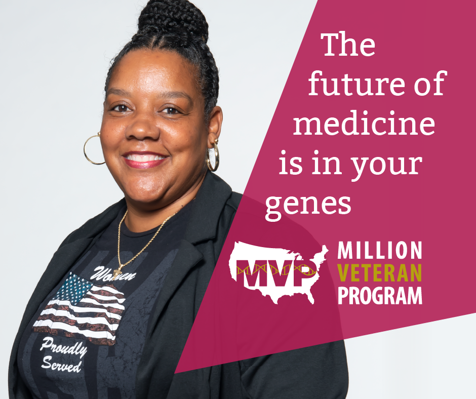
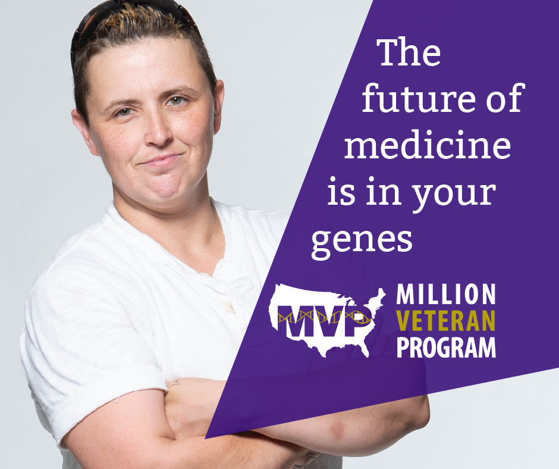
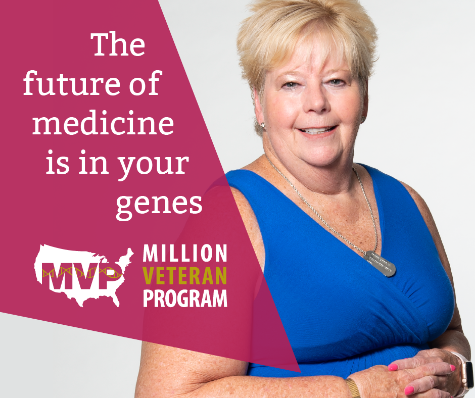
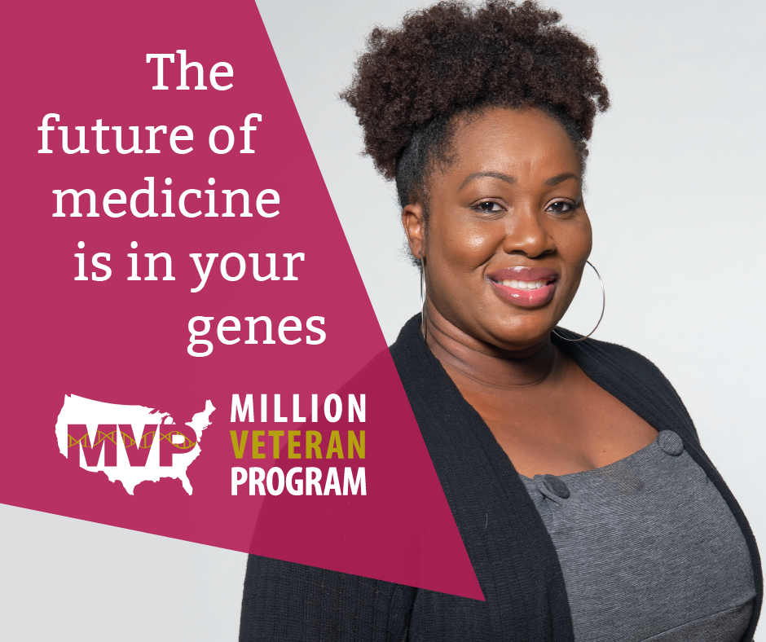
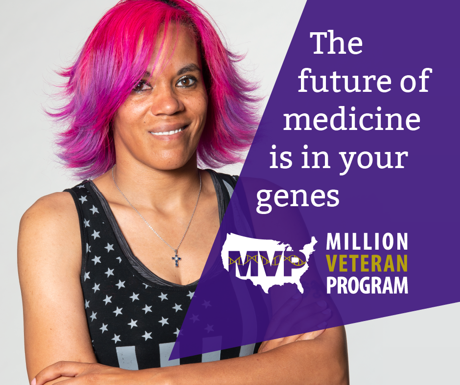

# Million Veterans Program (MVP) Women’s Campaign 

## Communications Toolkit

The Million Veteran Program invites you to join our campaign to engage and enroll more women Veterans. 

**Campaign Goal:** To increase awareness among women Veterans, advocates, and other stakeholders about the MVP program, with the ultimate goal of increasing the number and diversity of women enrolled. For more information on the campaign, and the importance of engaging more women Veterans, please read our <a href="https://github.com/department-of-veterans-affairs/va.gov-team/raw/master/products/health-care/mvp-collateral/assets/pdf/2021-02-MVP-Women-1sheet.pdf">one-page briefer (PDF)</a>.

**Campaign Duration:** March 1, 2021 (Women’s History Month) – September 30, 2021 

You can help by sharing the materials uploaded to this communication toolkit:
1. Flyers
2. One-pager
3. Text for physician instructions
4. Facebook posts 
5. Social media assets 

Below you’ll also find links to additional stories, news releases, podcasts, and other content featured as part of this campaign. Please feel free to distribute and share as appropriate. 

**Questions?** Contact Jennifer.Deen@va.gov or Shakeria.Cohen@va.gov

## Flyers

Each PDF flyer has the same content but different portraits. Please use whichever flyer best reflects the audience you’re engaging or wish to engage. 

Flyers can also be printed as posters. 

We recommend placing flyers/posters in highly visible locations, such as COVID-19 vaccination waiting areas and staff break rooms, and areas frequented by women Veterans, such as women’s clinics and mobile mammogram units.

All PDF flyers:

- [Gwendolyn](https://github.com/department-of-veterans-affairs/va.gov-team/raw/master/products/health-care/mvp-collateral/assets/pdf/2021-02-MVP-Women-flyer-Gwendolyn.pdf)
- [Jennifer](https://github.com/department-of-veterans-affairs/va.gov-team/raw/master/products/health-care/mvp-collateral/assets/pdf/2021-02-MVP-Women-flyer-Jennifer.pdf)
- [Jessica](https://github.com/department-of-veterans-affairs/va.gov-team/raw/master/products/health-care/mvp-collateral/assets/pdf/2021-02-MVP-Women-flyer-Jessica.pdf)
- [Linda](https://github.com/department-of-veterans-affairs/va.gov-team/raw/master/products/health-care/mvp-collateral/assets/pdf/2021-02-MVP-Women-flyer-Linda.pdf)
- [Sandrene](https://github.com/department-of-veterans-affairs/va.gov-team/raw/master/products/health-care/mvp-collateral/assets/pdf/2021-02-MVP-Women-flyer-Sandrene.pdf)
- [Shavone](https://github.com/department-of-veterans-affairs/va.gov-team/raw/master/products/health-care/mvp-collateral/assets/pdf/2021-02-MVP-Women-flyer-Shavone.pdf)
- [Shyla](https://github.com/department-of-veterans-affairs/va.gov-team/raw/master/products/health-care/mvp-collateral/assets/pdf/2021-02-MVP-Women-flyer-Shyla.pdf)
- [Teresa](https://github.com/department-of-veterans-affairs/va.gov-team/raw/master/products/health-care/mvp-collateral/assets/pdf/2021-02-MVP-Women-flyer-Teresa.pdf)

## One-Pager

This one-pager is meant to be shared with patients or women Veterans for more information about the program. Healthcare providers, Women Veteran Program Coordinators, Minority Veteran Program Coordinators, MVP Coordinators, Red Coat volunteers, and others. 

- <a href="https://github.com/department-of-veterans-affairs/va.gov-team/raw/master/products/health-care/mvp-collateral/assets/pdf/2021-02-MVP-Women-1sheet.pdf">MVP one-pager (PDF)</a>

## Text for patient instructions

To assist with referrals, healthcare providers can copy/paste this text into their patient instructions following appointments when MVP was discussed.

- Text for patient instructions

## Facebook posts

Below is a Word document with 12 Facebook posts that can be shared by any VA account. You can either copy/paste from this document into your Facebook account,or post directly from VA’s Social Studio.

If you copy/paste from the Word document, choose an image to accompany the post from any of the social media assets in the next section below. 

- 12 Facebook posts

## Social media assets

Below are 16 images that can be used to accompany the above Facebook posts. Eight images have the MVP logo with no text, eight images include the campaign slogan “the future of medicine is in your genes”. These images feature eight womenVeterans, photographed by Candace Woods, Visual Information Specialist at the Lexington VA Health Care System.

### Facebook with text

- [Gwendolyn](assets/png/FB-Gwendolyn.png)
- [Jennifer](assets/png/FB-Jennifer.png)
- [Jessica](assets/png/FB-Jessica.png)
- [Linda](assets/png/FB-Linda.png)
- [Sandrene](assets/png/FB-Sandrene.png)
- [Shavone](assets/png/FB-Shavone.png)
- [Shyla](assets/png/FB-Shyla.png)
- [Teresa](assets/png/FB-Teresa.png)

### Facebook without text

- [Gwendolyn](assets/png/FB-Gwendolyn-NoText.png)
- [Jennifer](assets/png/FB-Jennifer-NoText.png)
- [Jessica](assets/png/FB-Jessica-NoText.png)
- [Linda](assets/png/FB-Linda-NoText.png)
- [Sandrene](assets/png/FB-Sandrene-NoText.png)
- [Shavone](assets/png/FB-Shavone-NoText.png)
- [Shyla](assets/png/FB-Shyla-NoText.png)
- [Teresa](assets/png/FB-Teresa-NoText.png)

### Twitter with text

- [Gwendolyn](assets/png/Twitter-Gwendolyn.png)
- [Jennifer](assets/png/Twitter-Jennifer.png)
- [Jessica](assets/png/Twitter-Jessica.png)
- [Linda](assets/png/Twitter-Linda.png)
- [Sandrene](assets/png/Twitter-Sandrene.png)
- [Shavone](assets/png/Twitter-Shavone.png)
- [Shyla](assets/png/Twitter-Shyla.png)
- [Teresa](assets/png/Twitter-Teresa.png)

### Twitter without text

- [Gwendolyn](assets/png/Twitter-Gwendolyn-NoText.png)
- [Jennifer](assets/png/Twitter-Jennifer-NoText.png)
- [Jessica](assets/png/Twitter-Jessica-NoText.png)
- [Linda](assets/png/Twitter-Linda-NoText.png)
- [Sandrene](assets/png/Twitter-Sandrene-NoText.png)
- [Shavone](assets/png/Twitter-Shavone-NoText.png)
- [Shyla](assets/png/Twitter-Shyla-NoText.png)
- [Teresa](assets/png/Twitter-Teresa-NoText.png)

## Other content

- [Press release: VA to increase participation of women Veterans in genetic research to aid in improving women's health](https://www.va.gov/opa/pressrel/pressrelease.cfm?id=5627)

---

<table>
  <tr>
    <td>Name</td>
    <td>Photo</td>
    <td>Assets</td>
  </tr>
    <tr>
      <td>Gwendolyn</td>
      <td>
          
      </td>
      <td>
        <ul>
            <li><a href="assets/png/FB-Gwendolyn.png">Facebook with text</a> 
            <li><a href="assets/png/FB-Gwendolyn-NoText.png">Facebook without text</a> 
            <li><a href="assets/png/Twitter-Gwendolyn.png">Twitter with text</a> 
            <li><a href="assets/png/Twitter-Gwendolyn-NoText.png">Twitter without text</a> 
            <li><a href="https://github.com/department-of-veterans-affairs/va.gov-team/raw/master/products/health-care/mvp-collateral/assets/pdf/2021-02-MVP-Women-flyer-Gwendolyn.pdf">Download PDF flyer</a>
      </td>
    </tr>
    <tr>
      <td>Jennifer</td>
      <td>
          
      </td>
        <td>
          <ul>
            <li><a href="assets/png/FB-Jennifer.png">Facebook with text</a> 
            <li><a href="assets/png/FB-Jennifer-NoText.png">Facebook without text</a> 
            <li><a href="assets/png/Twitter-Jennifer.png">Twitter with text</a> 
            <li><a href="assets/png/Twitter-Jennifer-NoText.png">Twitter without text</a> 
            <li><a href="https://github.com/department-of-veterans-affairs/va.gov-team/raw/master/products/health-care/mvp-collateral/assets/pdf/2021-02-MVP-Women-flyer-Jennifer.pdf">Download PDF flyer</a>
      </td>
    </tr>
    <tr>
      <td>Jessica</td>
      <td>
          
      </td>
      <td>
          <ul>
            <li><a href="assets/png/FB-Jessica.png">Facebook with text</a> 
            <li><a href="assets/png/FB-Jessica-NoText.png">Facebook without text</a> 
            <li><a href="assets/png/Twitter-Jessica.png">Twitter with text</a> 
            <li><a href="assets/png/Twitter-Jessica-NoText.png">Twitter without text</a> 
            <li><a href="https://github.com/department-of-veterans-affairs/va.gov-team/raw/master/products/health-care/mvp-collateral/assets/pdf/2021-02-MVP-Women-flyer-Jessica.pdf">Download PDF flyer</a>
        </ul>
      </td>
    </tr>
    <tr>
      <td>Linda</td>
      <td>
          
      </td>
      <td>
        <ul>
            <li><a href="assets/png/FB-Linda.png">Facebook with text</a> 
            <li><a href="assets/png/FB-Linda-NoText.png">Facebook without text</a> 
            <li><a href="assets/png/Twitter-Linda.png">Twitter with text</a> 
            <li><a href="assets/png/Twitter-Linda-NoText.png">Twitter without text</a> 
            <li><a href="https://github.com/department-of-veterans-affairs/va.gov-team/raw/master/products/health-care/mvp-collateral/assets/pdf/2021-02-MVP-Women-flyer-Linda.pdf">Download PDF flyer</a>
      </td>
    </tr>
    <tr>
      <td>Sandrene</td>
      <td>
          
      </td>
      <td>
        <ul>
            <li><a href="assets/png/FB-Sandrene.png">Facebook with text</a> 
            <li><a href="assets/png/FB-Sandrene-NoText.png">Facebook without text</a> 
            <li><a href="assets/png/Twitter-Sandrene.png">Twitter with text</a> 
            <li><a href="assets/png/Twitter-Sandrene-NoText.png">Twitter without text</a> 
            <li><a href="https://github.com/department-of-veterans-affairs/va.gov-team/raw/master/products/health-care/mvp-collateral/assets/pdf/2021-02-MVP-Women-flyer-Sandrene.pdf">Download PDF flyer</a>
      </td>
    </tr>
    <tr>
      <td>Shavone</td>
      <td>
          
      </td>
      <td>
        <ul>
            <li><a href="assets/png/FB-Shavone.png">Facebook with text</a> 
            <li><a href="assets/png/FB-Shavone-NoText.png">Facebook without text</a> 
            <li><a href="assets/png/Twitter-Shavone.png">Twitter with text</a> 
            <li><a href="assets/png/Twitter-Shavone-NoText.png">Twitter without text</a> 
            <li><a href="https://github.com/department-of-veterans-affairs/va.gov-team/raw/master/products/health-care/mvp-collateral/assets/pdf/2021-02-MVP-Women-flyer-Shavone.pdf">Download PDF flyer</a>
      </td>
    </tr>
    <tr>
      <td>Shyla</td>
      <td>
          
      </td>
      <td>
        <ul>
            <li><a href="assets/png/FB-Shyla.png">Facebook with text</a> 
            <li><a href="assets/png/FB-Shyla-NoText.png">Facebook without text</a> 
            <li><a href="assets/png/Twitter-Shyla.png">Twitter with text</a> 
            <li><a href="assets/png/Twitter-Shyla-NoText.png">Twitter without text</a> 
            <li><a href="https://github.com/department-of-veterans-affairs/va.gov-team/raw/master/products/health-care/mvp-collateral/assets/pdf/2021-02-MVP-Women-flyer-Shyla.pdf">Download PDF flyer</a>
      </td>
    </tr>
    <tr>
      <td>Teresa</td>
      <td>
          
      </td>
      <td>
        <ul>
            <li><a href="assets/png/FB-Teresa.png">Facebook with text</a> 
            <li><a href="assets/png/FB-Teresa-NoText.png">Facebook without text</a> 
            <li><a href="assets/png/Twitter-Teresa.png">Twitter with text</a> 
            <li><a href="assets/png/Twitter-Teresa-NoText.png">Twitter without text</a> 
            <li><a href="https://github.com/department-of-veterans-affairs/va.gov-team/raw/master/products/health-care/mvp-collateral/assets/pdf/2021-02-MVP-Women-flyer-Teresa.pdf">Download PDF flyer</a>
      </td>
    </tr>
</table>
          

### VAntage Point banners

- [Keisha Bellamy](assets/png/VAntagePoint-KeishaBellamy.png)
- [Morgan Danowski](assets/png/VAntagePoint-MorganDanowski.png)
- [Sedra Graves](assets/png/VAntagePoint-SedraGraves.png)

### Instagram post images

- [Sumita Muralidhar](assets/png/IG-SumitraMuralidhar.png)

### MVP website article image 
- [Three women Veterans](assets/png/MVP-article-image.png)

## Zoom/Teams backgrounds

### Photo
- [Photo, light blue](assets/png/zoom-bg-mvp-photo-light.png)
- [Photo, dark blue, logo 75% opacity](assets/png/zoom-bg-mvp-photo-75.png)
- [Photo, dark blue, logo 100% opacity](assets/png/zoom-bg-mvp-photo-100.png)

### Strands
- [Strands, light blue](assets/png/zoom-bg-mvp-strands-light.png)
- [Strands, dark blue, logo 75% opacity](assets/png/zoom-bg-mvp-strands-75.png)
- [Strands, dark blue, logo 100% opacity](assets/png/zoom-bg-mvp-strands-100.png)
