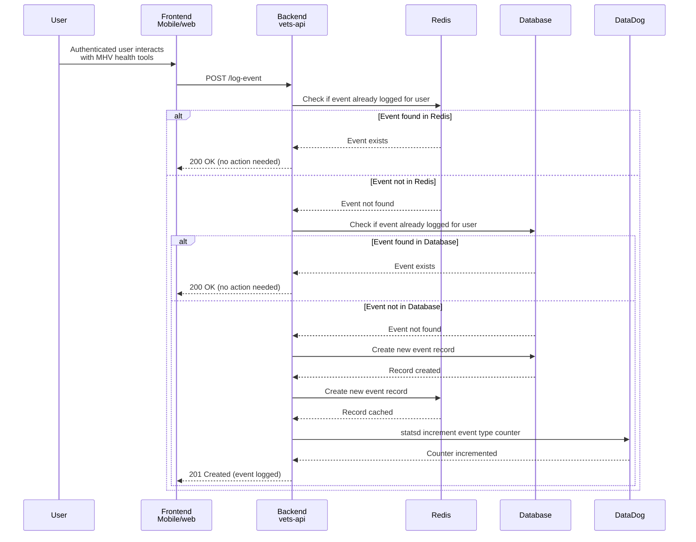
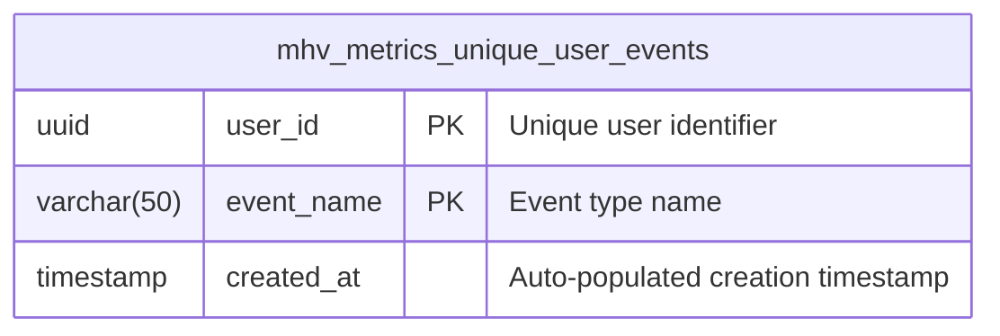

# Unique User Metrics for the MHV Portal

The goal of the Unique User Metrics (UUM) for the My HealtheVet (MHV) Portal is to collect unique user metrics on how many users have accessed the MHV health tools. The MHV health tools are any application that is accessed via the `/my-health` root URL and includes the MHV landing page. Note that Google Analytics can collect these same metrics, but this effort aims to provide more accurate metrics since we do not want users to be able to opt out of these analytics.

### A Note on Account Activity Logs
Account Activity Logs (AAL) reside in MHV Classic and have been used to generate unique user metrics in the past. However, there are storage limitations in AAL that do not allow us to add more logs to perform all the desired metrics.

## Unique Logged Events
We define a Unique Logged Event as an event that is logged only once for a given user. Initially, these unique user events will be logged when a user accesses an MHV tool and/or the MHV portal itself, but the events are not limited to just page or application views. However, other tools like Google Analytics should be prioritized as adding unique user events will significanly increase the size of the required database table that tracks the events. Events should be kept to the required minimum for performance reasons.

### Architecture
This effort will provide:
- A new `vets-api` authenticated endpoint to allow a frontend to log events (e.g. when viewing the MHV Landing Page, we can call this new logging API to log an "MHV Landing Page accessed" event in vets-api)
- A new `vets-api` library to allow logging events directly from other code (e.g. when viewing the secure messages app, the application always fetches messages from vets-api, hence we can log an "SM accessed" event in vets-api)

### Sequence Diagram

Notes:
- Logged events include a unique user ID taken from the authenticated user
- We use Redis for performance reasons, to limit database reads when checking for duplicate events from the same user
- We use the database as a permanent record of each event for each user since Redis cache entries will expire or could be purged 
- One can recreate the metrics from the data stored in the database if needed
- We increment a statsd counter for the given event once per user. This will result in a counter with the number of unique users per event.
- DataDog takes care of persisting the cumulative metric for the event

### Database Diagram

#### Database Design Notes

**Table: `mhv_metrics_unique_user_events`**
- **Compound Primary Key**: `(user_id, event_name)`
  - Ensures one record per user per event type
  - Provides optimal performance for lookups: `WHERE user_id = ? AND event_name = ?`
  - No additional unique indexes needed
- **Fields**:
  - `user_id` (UUID): Unique identifier for the user
    - **UUID benefits in PostgreSQL**: Native support with optimized 16-byte storage, better index performance for compound keys, fixed-size storage (vs. variable varchar), and built-in comparison operators
  - `event_name` (VARCHAR(50)): Name/type of the event being tracked (e.g., "login", "view_appointments", "download_records")
    - **VARCHAR(50) optimization**: Limited length improves storage efficiency and index performance for the compound primary key, while maintaining flexibility to add new event types without schema changes
  - `created_at`: Auto-populated timestamp for when the event was first logged for this user

**Performance Considerations**:
- The compound primary key creates a clustered index that's perfect for the primary query pattern
- Minimal storage footprint - only essential data
- Fast INSERT operations with automatic duplicate prevention
- Efficient for generating metrics: `SELECT event_name, COUNT(*) FROM mhv_metrics_unique_user_events GROUP BY event_name`

**No Foreign Key Design Decision**:
- `user_id` intentionally has **no foreign key constraint** to any users table
- **Benefits**:
  - **Performance**: No foreign key constraint checking on high-volume inserts
  - **Historical preservation**: Metrics remain intact even if users are deleted from the system
  - **Operational simplicity**: No cascading deletes or referential integrity concerns
  - **Write optimization**: Critical for a logging/metrics table with potentially millions of records
- **Trade-offs**: Theoretical possibility of invalid user_ids, but this is acceptable for a metrics table
- **Pattern**: This follows standard practices for analytics/audit tables where historical data preservation and write performance are prioritized over strict referential integrity

#### Database Sizing

The `mhv_metrics_unique_user_events` table is expected to grow significantly based on VA user statistics:

**User Base Estimates**:
- **My HealtheVet registered users**: Over 5 million by late 2019 (likely higher now)
- **VA.gov monthly logins**: 1.5 million users in January 2022 (likely higher now)
- **Growth trend**: Numbers continue to increase as more veterans adopt digital health tools

**Event Volume Projections**:
- **Current tracked tools**: 6 MHV health tools planned for initial tracking
- **Theoretical maximum records**: ~30 million rows (5M users × 6 events)
- **Realistic estimate**: Likely 10-20 million rows considering:
  - Not all registered users actively use all tools
  - Some users may only access a subset of the 6 tracked tools
  - Growth beyond 2019/2022 baseline numbers

**Storage Calculations** (per record):
- `user_id` (UUID): 16 bytes
- `event_name` (VARCHAR(50)): ~10-20 bytes average
- `created_at` (TIMESTAMP): 8 bytes
- **Total per record**: ~35-45 bytes + PostgreSQL overhead
- **Estimated table size**: 350MB - 900MB for 10-20 million records (data only)
- **With indexes**: Expect 2-3x larger (1-3GB total including primary key index)

**Performance Implications**:
- High-volume INSERT operations (potentially millions of new records over time)
- Compound primary key index will be substantial but manageable
- Regular database maintenance (VACUUM, ANALYZE) will be important
- Consider partitioning strategies if growth exceeds projections

### Other considerations
- Using a Sidekiq job - We could use a Sidekiq job in `vets-api` to asynchronously perform the logging operation, so not to incurr a performance hit on the backend, but it is expected that this operation will take a minimal amount of time to perform and hence can be done inline. Regardless, we could migrate in the future to using a Sidekiq job if we find the burden is too high.
