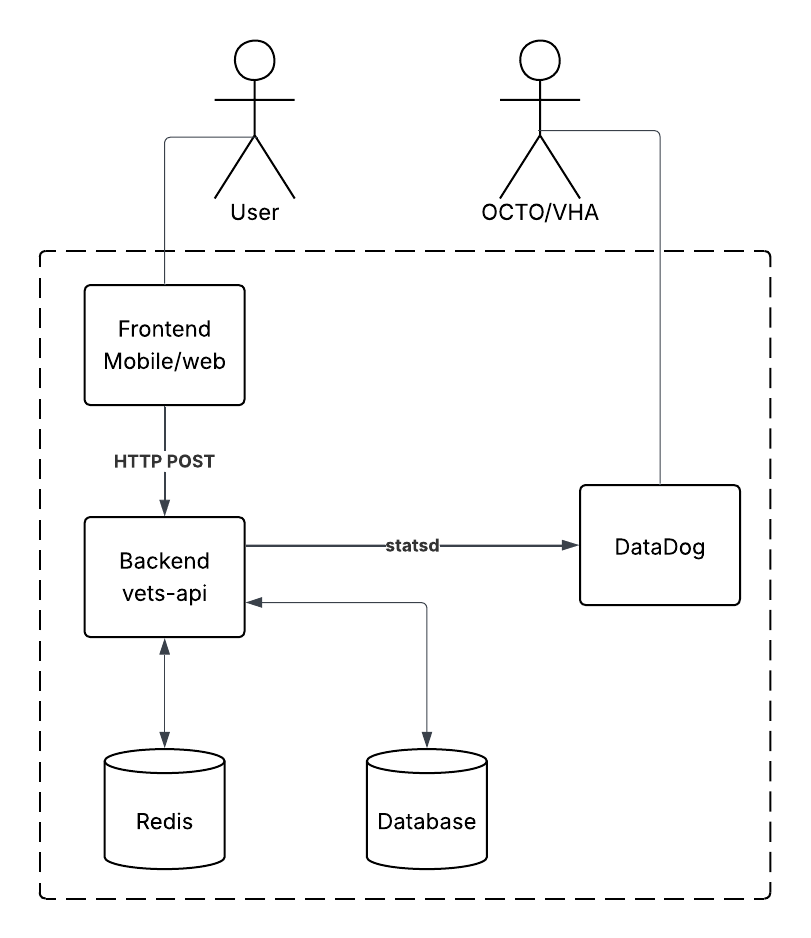
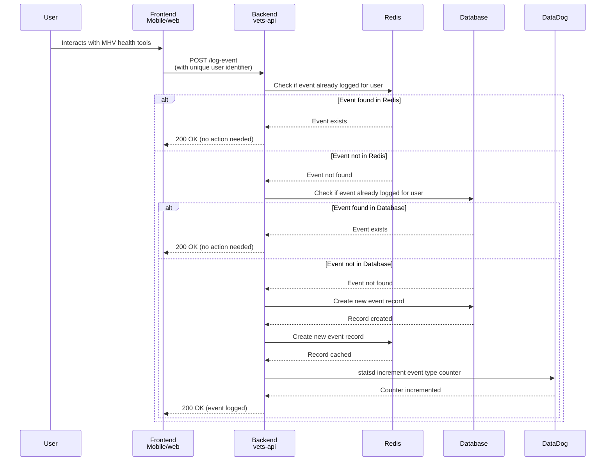
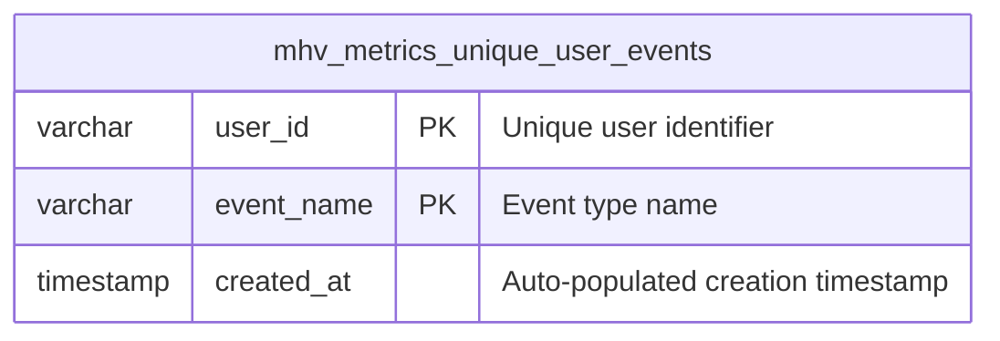

# Unique User Metrics for the MHV Portal

The Unique User Metrics (UUM) for the My HealtheVet (MHV) Portal goal is to collect unique user metrics on how many users have accessed the MHV health tools. THe MHV health tools are any application that is accessed via the `/my-health` root URL includes the MHV landing page. Note that Google Analytics can collect these same metric, but this effort aims to provide more accurate metrics (e.g. we do not want users to opt-out of these metrics).

## A Note on Account Activity Logs
Account Activity Logs (AAL) reside in MHV Classic and have been used to generate unique user metrics in the past. However, there are storage limitations in AAL that do not allow us to add more logs to perform all the desired metrics.

## Architecture

## Sequence Diagram

Notes:
- Logged events include a unique user ID
- We use Redis for performance reasons, to limit the reads from the database for event logs for the same event from the same user
- We use the database as a permanent record of each event for each user since the Redis cache will expire or could be purged 
- One can recreate the metrics from the data stored in the database if needed
- We increment a statsd counter for the given event once per user. This will result in a counter with the number of unique users per event.
- DataDog takes care of persisting the cumulative metric for the event

## Database Diagram

### Database Design Notes

**Table: `mhv_metrics_unique_user_events`**
- **Compound Primary Key**: `(user_id, event_name)`
  - Ensures one record per user per event type
  - Provides optimal performance for lookups: `WHERE user_id = ? AND event_name = ?`
  - No additional unique indexes needed
- **Fields**:
  - `user_id`: Unique identifier for the user (e.g., UUID, ICN, or other VA identifier)
  - `event_name`: Name/type of the event being tracked (e.g., "login", "view_appointments", "download_records")
  - `created_at`: Auto-populated timestamp for when the event was first logged for this user

**Performance Considerations**:
- The compound primary key creates a clustered index that's perfect for the primary query pattern
- Minimal storage footprint - only essential data
- Fast INSERT operations with automatic duplicate prevention
- Efficient for generating metrics: `SELECT event_name, COUNT(*) FROM mhv_metrics_unique_user_events GROUP BY event_name`

**No Foreign Key Design Decision**:
- `user_id` intentionally has **no foreign key constraint** to any users table
- **Benefits**:
  - **Performance**: No foreign key constraint checking on high-volume inserts
  - **Historical preservation**: Metrics remain intact even if users are deleted from the system
  - **Operational simplicity**: No cascading deletes or referential integrity concerns
  - **Write optimization**: Critical for a logging/metrics table with potentially millions of records
- **Trade-offs**: Theoretical possibility of invalid user_ids, but this is acceptable for a metrics table
- **Pattern**: This follows standard practices for analytics/audit tables where historical data preservation and write performance are prioritized over strict referential integrity
