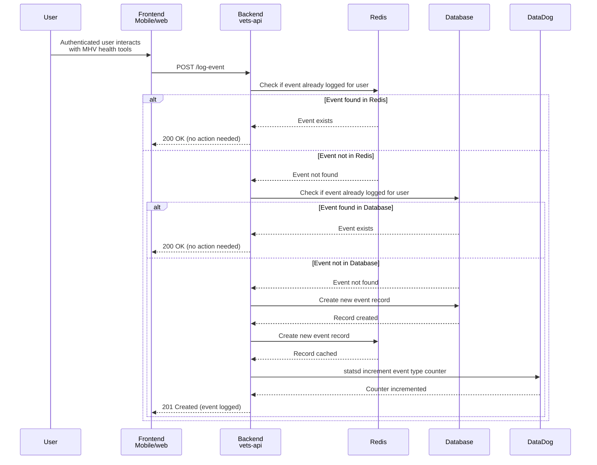
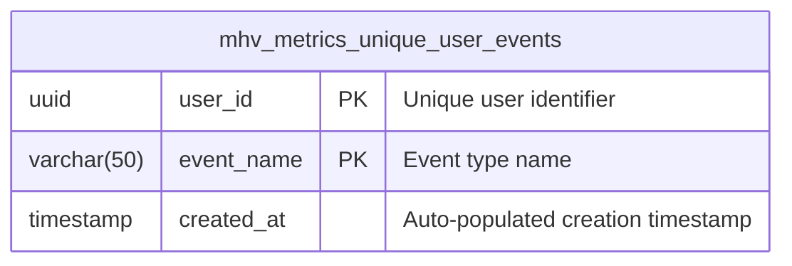
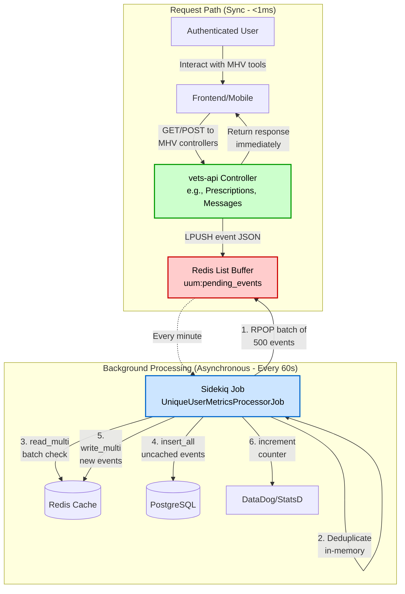
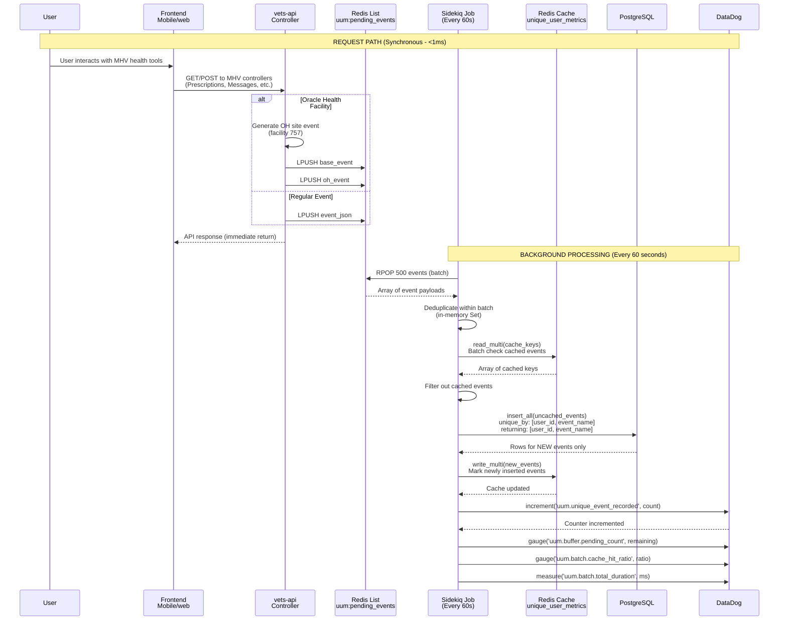

# Unique User Metrics for the MHV Portal

## Table of Contents
- [Unique Logged Events](#unique-logged-events)
- [Re-architecture: Asynchronous Batch Processing (December 2025)](#re-architecture-asynchronous-batch-processing-december-2025)

The goal of the Unique User Metrics (UUM) for the My HealtheVet (MHV) Portal is to collect unique user metrics on how many users have accessed the MHV on VA.gov patient portal. The patient portal is comprised of any application that is accessed via the `/my-health` root URL and includes the MHV landing page. Note that Google Analytics can collect these same metrics, but this effort aims to provide more accurate metrics since we do not want users to be able to opt out of these analytics.

### A Note on Account Activity Logs
Account Activity Logs (AAL) reside in MHV Classic and have been used to generate unique user metrics in the past. However, there are storage limitations in AAL that do not allow us to add more logs to perform all the desired metrics.

## Unique Logged Events
We define a Unique Logged Event as an event that is logged only once for a given user. Initially, these unique user events will be logged when a user accesses an MHV tool and/or the MHV portal itself, but the events are not limited to just page or application views. However, other tools like Google Analytics should be prioritized as adding unique user events will significanly increase the size of the required database table that tracks the events. Events should be kept to the required minimum for performance reasons.

### Architecture
This effort will provide:
- A new `vets-api` authenticated endpoint to allow a frontend to log events (e.g. when viewing the MHV Landing Page, we can call this new logging API to log an "MHV Landing Page accessed" event in vets-api)
- A new `vets-api` library to allow logging events directly from other code (e.g. when viewing the secure messages app, the application always fetches messages from vets-api, hence we can log an "SM accessed" event in vets-api)


### Sequence Diagram



Notes:
- Logged events include a unique user ID taken from the authenticated user
- We use Redis for performance reasons, to limit database reads when checking for duplicate events from the same user
- We use the database as a permanent record of each event for each user since Redis cache entries will expire or could be purged 
- One can recreate the metrics from the data stored in the database if needed
- We increment a statsd counter for the given event once per user. This will result in a counter with the number of unique users per event.
- DataDog takes care of persisting the cumulative metric for the event

### Database Diagram



#### Database Design Notes

**Table: `mhv_metrics_unique_user_events`**
- **Compound Primary Key**: `(user_id, event_name)`
  - Ensures one record per user per event type
  - Provides optimal performance for lookups: `WHERE user_id = ? AND event_name = ?`
  - No additional unique indexes needed
- **Fields**:
  - `user_id` (UUID): Unique identifier for the user
    - **UUID benefits in PostgreSQL**: Native support with optimized 16-byte storage, better index performance for compound keys, fixed-size storage (vs. variable varchar), and built-in comparison operators
  - `event_name` (VARCHAR(50)): Name/type of the event being tracked (e.g., "login", "view_appointments", "download_records")
    - **VARCHAR(50) optimization**: Limited length improves storage efficiency and index performance for the compound primary key, while maintaining flexibility to add new event types without schema changes
  - `created_at`: Auto-populated timestamp for when the event was first logged for this user

**Performance Considerations**:
- The compound primary key creates a clustered index that's perfect for the primary query pattern
- Minimal storage footprint - only essential data
- Fast INSERT operations with automatic duplicate prevention
- Efficient for generating metrics: `SELECT event_name, COUNT(*) FROM mhv_metrics_unique_user_events GROUP BY event_name`

**No Foreign Key Design Decision**:
- `user_id` intentionally has **no foreign key constraint** to any users table
- **Benefits**:
  - **Performance**: No foreign key constraint checking on high-volume inserts
  - **Historical preservation**: Metrics remain intact even if users are deleted from the system
  - **Operational simplicity**: No cascading deletes or referential integrity concerns
  - **Write optimization**: Critical for a logging/metrics table with potentially millions of records
- **Trade-offs**: Theoretical possibility of invalid user_ids, but this is acceptable for a metrics table
- **Pattern**: This follows standard practices for analytics/audit tables where historical data preservation and write performance are prioritized over strict referential integrity

#### Database Sizing

The `mhv_metrics_unique_user_events` table is expected to grow significantly based on VA user statistics:

**User Base Estimates**:
- **My HealtheVet registered users**: Over 5 million by late 2019 (likely higher now)
- **VA.gov monthly logins**: 1.5 million users in January 2022 (likely higher now)
- **Growth trend**: Numbers continue to increase as more veterans adopt digital health tools

**Event Volume Projections**:
- **Current tracked tools**: 6 MHV health tools planned for initial tracking
- **Theoretical maximum records**: ~30 million rows (5M users × 6 events)
- **Realistic estimate**: Likely 10-20 million rows considering:
  - Not all registered users actively use all tools
  - Some users may only access a subset of the 6 tracked tools
  - Growth beyond 2019/2022 baseline numbers

**Storage Calculations** (per record):
- `user_id` (UUID): 16 bytes
- `event_name` (VARCHAR(50)): ~10-20 bytes average
- `created_at` (TIMESTAMP): 8 bytes
- **Total per record**: ~35-45 bytes + PostgreSQL overhead
- **Estimated table size**: 350MB - 900MB for 10-20 million records (data only)
- **With indexes**: Expect 2-3x larger (1-3GB total including primary key index)

**Performance Implications**:
- High-volume INSERT operations (potentially millions of new records over time)
- Compound primary key index will be substantial but manageable
- Regular database maintenance (VACUUM, ANALYZE) will be important
- Consider partitioning strategies if growth exceeds projections


### Other considerations
- Using a Sidekiq job - We could use a Sidekiq job in `vets-api` to asynchronously perform the logging operation, so not to incurr a performance hit on the backend, but it is expected that this operation will take a minimal amount of time to perform and hence can be done inline. Regardless, we could migrate in the future to using a Sidekiq job if we find the burden is too high.

---

## Re-architecture: Asynchronous Batch Processing (December 2025)

### Problem Statement

After deploying the initial synchronous UUM implementation, we observed significant performance issues at scale:

**Performance Bottlenecks:**
- **High latency**: Event processing reaching 100ms during peak usage
- **Database load**: High number of INSERT transactions (~240 events/min at peak, 10.7M+ records in table)
- **Synchronous blocking**: Each API request waits for database write to complete
- **Scaling concerns**: Millions of users × multiple events = exponential growth in database transactions

**Usage Patterns:**
- Peak activity around noonish (240 recorded events/min)
- Lowest activity at night
- Multiple events logged per user session (e.g., Medical Records pages log 2 events per request)
- Oracle Health facility tracking generates additional events (E.g. for facility 757)

**Key Insight**: With millions of users and multiple events per session, the cumulative database write load became a bottleneck.

### Proposed Solution: Redis List Buffering + Batch Processing

The re-architected approach decouples event capture from database persistence using asynchronous batch processing:

1. **Immediate buffering**: Push events to Redis list (< 1ms)
2. **Return immediately**: API request completes without waiting for database
3. **Batch processing**: Sidekiq job processes events in configurable batches every minute
4. **Bulk operations**: Reduce database transactions by 100-500x through batching

**Expected Performance Improvements:**
- **API latency**: Reduced from 100ms to ~1ms (99% reduction)
- **Database load**: Reduced from 240 transactions/min to ~0.5-2.4 transactions/min (100-500x reduction)
- **Redis cache load**: Reduced from 240 writes/min to batch-marking only new events
- **Scalability**: Can handle 10x traffic growth without database impact

### Updated Architecture



### Updated Sequence Diagram



### Configuration

The system uses configurable settings in `config/settings.yml`:

```yaml
unique_user_metrics:
  processor_job:
    # Configurable batch size (tune based on load)
    batch_size: <%= ENV['unique_user_metrics__processor_job__batch_size'] || 500 %>

    # Maximum queue depth before alerting
    max_queue_depth: <%= ENV['unique_user_metrics__processor_job__max_queue_depth'] || 10000 %>
```

**AWS Parameter Store Configuration:**
- Values for `batch_size` and `max_queue_depth` are managed via AWS Parameter Store
- Allows rapid tuning of performance parameters without code deployment
- Defaults provided as fallbacks if Parameter Store values unavailable

**Tuning Parameters:**
- **batch_size**: Start at 500, increase to 1000 if queue depth grows
- **job_interval_seconds**: Reduce to 30 if processing lags behind

### Implementation Components

#### 1. Redis List Buffer (`lib/unique_user_events/buffer.rb`)

**Responsibilities:**
- Accept event payloads from API controllers
- LPUSH to Redis list `uum:pending_events`
- Return immediately without blocking
- Handle Oracle Health site-specific event generation

#### 2. Sidekiq Processor Job (`app/sidekiq/unique_user_metrics_processor_job.rb`)

**Responsibilities:**
- Run every 60 seconds (configurable)
- Pop batch of events from Redis list
- Deduplicate within batch (in-memory)
- Batch-check Redis cache (read_multi)
- Bulk insert to database (insert_all)
- Batch-mark Redis cache (write_multi)
- Emit StatsD metrics

**Processing Flow:**
1. **Pop batch**: `RPOP uum:pending_events 500` (atomic)
2. **In-memory dedup**: Use `Set` to remove duplicates within batch
3. **Cache check**: `Rails.cache.read_multi(keys)` - batch check existing events
4. **Filter uncached**: Remove events already in cache
5. **Bulk insert**: `insert_all(..., unique_by: [:user_id, :event_name], returning: true)`
6. **Cache new events**: `Rails.cache.write_multi(...)` - mark newly inserted
7. **Increment StatsD**: Only for rows actually inserted (new events)

**Performance Optimization:**
- Redis pipelining via `read_multi`/`write_multi` reduces round-trips from 500 to 1
- Database `insert_all` with `ON CONFLICT DO NOTHING` handles DB-level deduplication
- In-memory dedup reduces unnecessary cache/DB operations

#### 3. Monitoring & Alerting

**Key Metrics:**

| Metric | Type | Description | Alert Threshold |
|--------|------|-------------|-----------------|
| `uum.unique_user_metrics..buffer.pending_count` | Gauge | Events waiting in Redis list | > 10,000 for 5 min |
| `uum.unique_user_metrics.batch.cache_hit_ratio` | Gauge | % of events already cached | N/A (informational) |
| `uum.unique_user_metrics.batch.db_insert_count` | Gauge | New events inserted to DB | N/A (informational) |
| `uum.unique_user_metrics.batch.total_duration` | Measure | Total batch processing time (ms) | > 5000ms |
| `uum.unique_user_metrics.batch.db_insert_duration` | Measure | Database insert time (ms) | > 3000ms |
| `uum.unique_user_metrics.unique_event_recorded` | Increment | Counter for new unique events | N/A (analytics) |

**DataDog Alerts:**
- **Queue Depth Alert**: If `pending_count > 10,000` for 5+ minutes → Processing falling behind
- **Processing Duration Alert**: If `total_duration > 5000ms` → Batch size too large or DB slow

**Runbook Actions:**
1. Check `uum.unique_user_metrics.buffer.pending_count` trend
2. If growing: Reduce `job_interval_seconds` to 30 OR increase `batch_size` to 1000

### Migration Strategy

**Phase 1: Deploy Buffer + Processor (Staging Validation)**
- Deploy Redis buffer code + Sidekiq processor job together
- Keep feature flag `unique_user_metrics_async_buffering` disabled in production
- Enable feature flag in staging environment only
- Validate complete end-to-end flow
- Load test by generating a plethora of events and monitoring (e.g. using ArgoCD)

**Phase 2: Production Rollout (Gradual User Enablement)**
- Enable feature flag for 1% of production users
- Monitor latency improvements and queue depth closely
- Verify metrics appear in DataDog
- Gradually increase rollout: 1% → 10% → 50% → 100%
- Each rollout stage: Monitor before increasing

**Phase 3: Remove Synchronous Path**
- After stable async operation at 100%
  - Remove legacy synchronous database writes from codebase
  - Clean up feature flag code

**Rollback Plan:**
- Disable feature flag to revert to synchronous writes
- Sidekiq job continues to drain Redis buffer (no data loss)

### Benefits & Trade-offs

**Performance Improvements:**
- ✅ **API Latency**: Reduced from 100ms to ~1ms (99% faster)
- ✅ **Database Transactions**: Reduced from 240/min at peak to 0.5-2.4/min (100-500x fewer)
- ✅ **Redis Cache Writes**: Reduced from 240/min to ~10-50/min batch marking only (5-24x fewer)
- ✅ **Database Load**: From high contention to minimal impact, sustainable at 10x traffic scale
- ✅ **User Experience**: Immediate response instead of blocking waits

**Operational Benefits:**
- ✅ **No data loss**: Redis persistence + Sidekiq retry logic ensures reliability
- ✅ **Configurable tuning**: AWS Parameter Store allows rapid performance adjustments without deployment
- ✅ **Horizontal scalability**: Can handle 10x traffic growth without infrastructure changes

**Trade-offs:**
- ⚠️ **Metric delay**: Up to 60-second delay before metrics appear in DataDog (acceptable for analytics use case)
- ⚠️ **Redis memory**: Additional ~50KB per 500 events buffered (minimal compared to database savings)
- ⚠️ **Monitoring overhead**: New component to monitor (Redis list queue depth)
- ⚠️ **System complexity**: Two-phase system (buffer + processor) vs single-phase synchronous approach
