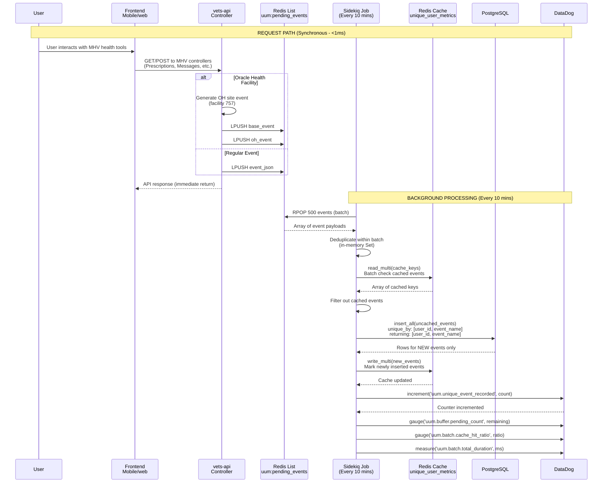

# Unique User Metrics for the MHV Portal

## Table of Contents
- [Unique Logged Events](#unique-logged-events)
- [Re-architecture: Backend-Only Event Logging (November 2025)](#re-architecture-backend-only-event-logging-november-2025)
- [Re-architecture: Asynchronous Batch Processing (December 2025)](#re-architecture-asynchronous-batch-processing-december-2025)
- [Re-architecture: API Simplification (January 2026)](#re-architecture-api-simplification-january-2026)

The goal of the Unique User Metrics (UUM) for the My HealtheVet (MHV) Portal is to collect unique user metrics on how many users have accessed the MHV on VA.gov patient portal. The patient portal is comprised of any application that is accessed via the `/my-health` root URL and includes the MHV landing page. Note that Google Analytics can collect these same metrics, but this effort aims to provide more accurate metrics since we do not want users to be able to opt out of these analytics.

### A Note on Account Activity Logs
Account Activity Logs (AAL) reside in MHV Classic and have been used to generate unique user metrics in the past. However, there are storage limitations in AAL that do not allow us to add more logs to perform all the desired metrics.

## Unique Logged Events
We define a Unique Logged Event as an event that is logged only once for a given user. Initially, these unique user events will be logged when a user accesses an MHV tool and/or the MHV portal itself, but the events are not limited to just page or application views. However, other tools like Google Analytics should be prioritized as adding unique user events will significanly increase the size of the required database table that tracks the events. Events should be kept to the required minimum for performance reasons.

### Architecture
This effort will provide:
- A new `vets-api` authenticated endpoint to allow a frontend to log events (e.g. when viewing the MHV Landing Page, we can call this new logging API to log an "MHV Landing Page accessed" event in vets-api)
- A new `vets-api` library to allow logging events directly from other code (e.g. when viewing the secure messages app, the application always fetches messages from vets-api, hence we can log an "SM accessed" event in vets-api)


### Sequence Diagram


Notes:
- Logged events include a unique user ID taken from the authenticated user
- We use Redis for performance reasons, to limit database reads when checking for duplicate events from the same user
- We use the database as a permanent record of each event for each user since Redis cache entries will expire or could be purged 
- One can recreate the metrics from the data stored in the database if needed
- We increment a statsd counter for the given event once per user. This will result in a counter with the number of unique users per event.
- DataDog takes care of persisting the cumulative metric for the event

### Database Diagram


#### Database Design Notes

**Table: `mhv_metrics_unique_user_events`**
- **Compound Primary Key**: `(user_id, event_name)`
  - Ensures one record per user per event type
  - Provides optimal performance for lookups: `WHERE user_id = ? AND event_name = ?`
  - No additional unique indexes needed
- **Fields**:
  - `user_id` (UUID): Unique identifier for the user
    - **UUID benefits in PostgreSQL**: Native support with optimized 16-byte storage, better index performance for compound keys, fixed-size storage (vs. variable varchar), and built-in comparison operators
  - `event_name` (VARCHAR(50)): Name/type of the event being tracked (e.g., "login", "view_appointments", "download_records")
    - **VARCHAR(50) optimization**: Limited length improves storage efficiency and index performance for the compound primary key, while maintaining flexibility to add new event types without schema changes
  - `created_at`: Auto-populated timestamp for when the event was first logged for this user

**Performance Considerations**:
- The compound primary key creates a clustered index that's perfect for the primary query pattern
- Minimal storage footprint - only essential data
- Fast INSERT operations with automatic duplicate prevention
- Efficient for generating metrics: `SELECT event_name, COUNT(*) FROM mhv_metrics_unique_user_events GROUP BY event_name`

**No Foreign Key Design Decision**:
- `user_id` intentionally has **no foreign key constraint** to any users table
- **Benefits**:
  - **Performance**: No foreign key constraint checking on high-volume inserts
  - **Historical preservation**: Metrics remain intact even if users are deleted from the system
  - **Operational simplicity**: No cascading deletes or referential integrity concerns
  - **Write optimization**: Critical for a logging/metrics table with potentially millions of records
- **Trade-offs**: Theoretical possibility of invalid user_ids, but this is acceptable for a metrics table
- **Pattern**: This follows standard practices for analytics/audit tables where historical data preservation and write performance are prioritized over strict referential integrity

#### Database Sizing

The `mhv_metrics_unique_user_events` table is expected to grow significantly based on VA user statistics:

**User Base Estimates**:
- **My HealtheVet registered users**: Over 5 million by late 2019 (likely higher now)
- **VA.gov monthly logins**: 1.5 million users in January 2022 (likely higher now)
- **Growth trend**: Numbers continue to increase as more veterans adopt digital health tools

**Event Volume Projections**:
- **Current tracked tools**: 6 MHV health tools planned for initial tracking
- **Theoretical maximum records**: ~30 million rows (5M users × 6 events)
- **Realistic estimate**: Likely 10-20 million rows considering:
  - Not all registered users actively use all tools
  - Some users may only access a subset of the 6 tracked tools
  - Growth beyond 2019/2022 baseline numbers

**Storage Calculations** (per record):
- `user_id` (UUID): 16 bytes
- `event_name` (VARCHAR(50)): ~10-20 bytes average
- `created_at` (TIMESTAMP): 8 bytes
- **Total per record**: ~35-45 bytes + PostgreSQL overhead
- **Estimated table size**: 350MB - 900MB for 10-20 million records (data only)
- **With indexes**: Expect 2-3x larger (1-3GB total including primary key index)

**Performance Implications**:
- High-volume INSERT operations (potentially millions of new records over time)
- Compound primary key index will be substantial but manageable
- Regular database maintenance (VACUUM, ANALYZE) will be important
- Consider partitioning strategies if growth exceeds projections


### Other considerations
- Using a Sidekiq job - We could use a Sidekiq job in `vets-api` to asynchronously perform the logging operation, so not to incurr a performance hit on the backend, but it is expected that this operation will take a minimal amount of time to perform and hence can be done inline. Regardless, we could migrate in the future to using a Sidekiq job if we find the burden is too high.

---

## Re-architecture: Backend-Only Event Logging (November 2025)

### Background

The initial UUM implementation included two mechanisms for logging events:
1. **Frontend API endpoint**: A dedicated `POST /my_health/v1/metrics/log_event` endpoint that the frontend could call to log events
2. **Backend inline logging**: Direct event logging from existing vets-api controllers (e.g., Prescriptions, Secure Messaging)

### Change: Deprecation of Frontend API Endpoint

On **November 24, 2025**, we removed the use of the frontend API endpoint for UUM event logging. Events are now logged **exclusively from existing backend endpoints**.

**Rationale:**
- **Reduced network overhead**: Eliminated extra HTTP round-trips from the frontend to log events
- **Simplified frontend code**: Removed the need for frontend logic to determine when to call the logging endpoint
- **UUM changes made only in one repo**: This limits duplication of code on both `vets-website` and the mobile app

**Implementation:**
- All MHV health tool controllers (Prescriptions, Secure Messaging, Medical Records, etc.) now log UUM events inline when serving requests
- The `UniqueUserEvents.log_event` method is called directly from controller actions
- The frontend logging endpoint remains available but is no longer used by the MHV portal frontend

---

## Re-architecture: Asynchronous Batch Processing (December 2025)

### Problem Statement

After deploying the initial synchronous UUM implementation, we observed significant performance issues at scale:

**Performance Bottlenecks:**
- **High latency**: Event processing reaching 100ms during peak usage
- **Database load**: High number of INSERT transactions (~240 events/min at peak, 10.7M+ records in table)
- **Synchronous blocking**: Each API request waits for database write to complete
- **Scaling concerns**: Millions of users × multiple events = exponential growth in database transactions

**Usage Patterns:**
- Peak activity around noonish (240 recorded events/min)
- Lowest activity at night
- Multiple events logged per user session (e.g., Medical Records pages log 2 events per request)
- Oracle Health facility tracking generates additional events (E.g. for facility 757)

**Key Insight**: With millions of users and multiple events per session, the cumulative database write load became a bottleneck.

### Proposed Solution: Redis List Buffering + Batch Processing

The re-architected approach decouples event capture from database persistence using asynchronous batch processing:

1. **Immediate buffering**: Push events to Redis list (< 1ms)
2. **Return immediately**: API request completes without waiting for database
3. **Batch processing**: Sidekiq job processes events in configurable batches every minute
4. **Bulk operations**: Reduce database transactions by 100-500x through batching

**Expected Performance Improvements:**
- **API latency**: Reduced from 100ms to ~1ms (99% reduction)
- **Database load**: Reduced from 240 transactions/min to ~0.5-2.4 transactions/min (100-500x reduction)
- **Redis cache load**: Reduced from 240 writes/min to batch-marking only new events
- **Scalability**: Can handle 10x traffic growth without database impact

### Updated Architecture


### Updated Sequence Diagram



### Configuration

The system uses configurable settings in `config/settings.yml`:

```yaml
unique_user_metrics:
  processor_job:
    # Events processed per iteration (tune based on DB write performance)
    batch_size: <%= ENV['unique_user_metrics__processor_job__batch_size'] || 500 %>
    
    # Maximum iterations per job run (safeguard against runaway execution)
    # 20 iterations × 500 batch = 10,000 events max per job
    max_iterations: <%= ENV['unique_user_metrics__processor_job__max_iterations'] || 20 %>
    
    # Maximum queue depth before alerting (buffer backup detection)
    max_queue_depth: <%= ENV['unique_user_metrics__processor_job__max_queue_depth'] || 10000 %>
```

**AWS Parameter Store Configuration:**
- All values are managed via AWS Parameter Store environment variables
- Allows rapid tuning of performance parameters without code deployment
- Defaults provided as fallbacks if Parameter Store values unavailable
- All values are validated at class load time to be positive integers

**Tuning Parameters:**
- **batch_size** (default: 500): Events per iteration. Increase to 1000 if queue depth grows.
- **max_iterations** (default: 20): Safeguard to cap events per job run (20 × 500 = 10,000 max). Handles 4x peak load.
- **max_queue_depth** (default: 10,000): Alert threshold for buffer backup detection.
- **Job frequency**: Fixed at every 10 minutes via Sidekiq Enterprise periodic jobs (hardcoded in `lib/periodic_jobs.rb`)

### Configuration Sizing Analysis

Based on production metrics, we observed a **maximum of 74,000 events in a 10-minute window** at peak times (before deduplication).

#### Redis List Capacity

Redis list size is **not a concern**:
- 74k events × ~150 bytes each = ~11 MB
- Redis lists handle millions of items easily
- Memory footprint is trivial

#### Processing Capacity Calculation

The key constraint is ensuring the job can process all incoming events within the 10-minute window:

| Parameter | Recommended |
|-----------|--------------|-------------|
| batch_size | 1,000 |
| max_iterations |150 | 10,000 | **150,000** |
| Handles 74k peak? |✅ Yes (~100% headroom) |

**Why these values:**

| Metric | Value |
|--------|-------|
| Capacity per run | 150,000 events |
| Peak load | 74,000 events (74% capacity) |
| Iterations at peak | ~74 |
| Estimated job duration | ~3-5 seconds |
| Postgres insert_all @ 1000 records | ~20-50ms |

#### Database Performance

`insert_all` with 1,000 records remains very fast because:
- Single round-trip to Postgres
- Bulk insert is O(n) not O(n²)
- `unique_by` constraint handles duplicates server-side
- No ActiveRecord object instantiation overhead

**Note:** If sustained traffic exceeds capacity, the `max_queue_depth` alert fires, signaling the need to increase `batch_size` or `max_iterations` via AWS Parameter Store.

### Implementation Components

#### 1. Redis List Buffer (`lib/unique_user_events/buffer.rb`)

**Responsibilities:**
- Accept event payloads from API controllers
- LPUSH to Redis list `uum:pending_events`
- Return immediately without blocking
- Handle Oracle Health site-specific event generation

#### 2. Sidekiq Processor Job (`app/sidekiq/mhv/unique_user_metrics_processor_job.rb`)

**Responsibilities:**
- Run every 10 mins via Sidekiq Enterprise periodic jobs
- **Loop until queue is empty** (with configurable safeguards)
- Pop batch of events from Redis list per iteration
- Deduplicate within batch (in-memory)
- Batch-check Redis cache (read_multi)
- Bulk insert to database (insert_all)
- Batch-mark Redis cache (write_multi)
- Emit StatsD metrics

**Looping Architecture:**

The job processes events in a loop until the queue is empty or safeguard limits are reached:

```ruby
loop do
  break if iterations >= MAX_ITERATIONS           # Default: 20
  
  events = peek_events_from_buffer(BATCH_SIZE)    # Default: 500
  break if events.empty?
  
  process_events(events)
  trim_processed_events(events.size)
  
  iterations += 1
end
```

**Why looping?**
- **Faster queue drain**: With 10-min job intervals and 2,400 peak events, a single-batch approach would leave 1,900 events waiting 10+ minutes
- **Smaller DB writes**: 500 events per INSERT instead of 2,400+ (reduces transaction size and lock contention)
- **Configurable limits**: Safeguards prevent runaway execution while allowing growth headroom

**Processing Flow (per iteration):**
1. **Peek batch**: `LRANGE uum:pending_events -500 -1` (non-destructive)
2. **In-memory dedup**: Use `uniq` to remove duplicates within batch
3. **Cache check**: `Rails.cache.read_multi(keys)` - batch check existing events
4. **Filter uncached**: Remove events already in cache
5. **Bulk insert**: `insert_all(..., unique_by: [:user_id, :event_name], returning: true)`
6. **Cache new events**: `Rails.cache.write_multi(...)` - mark newly inserted
7. **Increment StatsD**: Only for rows actually inserted (new events)
8. **Trim batch**: `LTRIM uum:pending_events 0 -(count+1)` (remove processed events)
9. **Repeat** until queue empty or safeguard limit reached

**Performance Optimization:**
- Redis pipelining via `read_multi`/`write_multi` reduces round-trips from 500 to 1
- Database `insert_all` with `ON CONFLICT DO NOTHING` handles DB-level deduplication
- In-memory dedup reduces unnecessary cache/DB operations
- Looping drains queue in a single job run (typically 5-10 iterations at peak)

#### 3. Monitoring & Alerting

**Key Metrics:**

| Metric | Type | Description | Alert Threshold |
|--------|------|-------------|-----------------|
| `uum.processor_job.iterations` | Gauge | Number of batch iterations completed this job run | N/A (informational) |
| `uum.processor_job.total_events_processed` | Gauge | Total events processed across all iterations | N/A (informational) |
| `uum.processor_job.total_db_inserts` | Gauge | Total events inserted to database (new unique events) | N/A (tuning) |
| `uum.processor_job.db_queries` | Gauge | Total event queries to the database | N/A (tuning) |
| `uum.processor_job.queue_depth` | Gauge | Events remaining in Redis buffer after processing | > 10,000 for 5 min |
| `uum.processor_job.job_duration_ms` | Histogram | Total job processing time across all iterations (ms) | N/A (informational) |
| `uum.processor_job.events_at_risk` | Gauge | Events remaining in buffer when job failed | N/A (diagnostic) |
| `uum.unique_user_metrics.event` | Increment | Counter for new unique events (tagged by event_name) | N/A (analytics) |

**Batch Size Tuning:**

The ratio of `total_db_inserts` to `total_events_processed` indicates deduplication effectiveness:
- **High ratio** (close to 1.0): Most events are new unique users → batch size is appropriate
- **Low ratio** (< 0.1): High cache/DB hit rate → consider increasing batch size to reduce iterations

**Buffer Backup Detection:**

The `queue_depth` gauge is emitted every job run to detect when processing can't keep up with incoming events. If the buffer grows unbounded, this metric will trend upward. The `queue_overflow` counter fires when depth exceeds `max_queue_depth` (default 10,000), providing an immediate alert signal.

**DataDog Alerts:**
- **Queue Depth Alert**: If `queue_depth > 10,000` for 5+ minutes → Processing falling behind
- **Queue Overflow Alert**: If `queue_overflow` increments → Immediate action needed

**Runbook Actions:**
1. Check `uum.processor_job.queue_depth` trend in DataDog
2. If growing: Increase `batch_size` to 1000 via AWS Parameter Store

### Migration Strategy

**Phase 1: Deploy Buffer + Processor (Staging Validation)**
- Deploy Redis buffer code + Sidekiq processor job together
- Keep feature flag `unique_user_metrics_async_buffering` disabled in production
- Enable feature flag in staging environment only
- Validate complete end-to-end flow
- Load test by generating a plethora of events and monitoring (e.g. using ArgoCD)

**Phase 2: Production Rollout (Gradual User Enablement)**
- Enable feature flag for 1% of production users
- Monitor latency improvements and queue depth closely
- Verify metrics appear in DataDog
- Gradually increase rollout: 1% → 10% → 50% → 100%
- Each rollout stage: Monitor before increasing

**Phase 3: Remove Synchronous Path**
- After stable async operation at 100%
  - Remove legacy synchronous database writes from codebase
  - Clean up feature flag code

**Rollback Plan:**
- Disable feature flag to revert to synchronous writes
- Sidekiq job continues to drain Redis buffer (no data loss)

### Benefits & Trade-offs

**Performance Improvements:**
- ✅ **API Latency**: Reduced from 100ms to ~1ms (99% faster)
- ✅ **Database Transactions**: Reduced from 240/min at peak to 0.5-2.4/min (100-500x fewer)
- ✅ **Redis Cache Writes**: Reduced from 240/min to ~10-50/min batch marking only (5-24x fewer)
- ✅ **Database Load**: From high contention to minimal impact, sustainable at 10x traffic scale
- ✅ **User Experience**: Immediate response instead of blocking waits

**Operational Benefits:**
- ✅ **Resilient to transient failures**: Sidekiq retry logic handles temporary DB/Redis issues
- ✅ **Configurable tuning**: AWS Parameter Store allows rapid performance adjustments without deployment
- ✅ **Horizontal scalability**: Can handle 10x traffic growth without infrastructure changes

**Trade-offs:**
- ⚠️ **Metric delay**: Delay before metrics appear in DataDog (acceptable for analytics use case)
- ⚠️ **Redis memory**: Additional ~50KB per 500 events buffered (minimal compared to database savings)
- ⚠️ **Monitoring overhead**: New component to monitor (Redis list queue depth)
- ⚠️ **System complexity**: Two-phase system (buffer + processor) vs single-phase synchronous approach
- ⚠️ **Potential event loss on failure**: See Failure Handling below

### Failure Handling

**Peek-then-Trim Pattern (Safe Processing)**

To minimize event loss, the processor uses a **peek-then-trim** pattern instead of destructive pops:

```ruby
# 1. PEEK: Read events without removing them
events = redis.lrange('uum:pending_events', -batch_size, -1)

# 2. PROCESS: Insert to database, update cache, emit metrics
process_events(events)

# 3. TRIM: Only remove events after successful processing
redis.ltrim('uum:pending_events', 0, -(events.count + 1))
```

**Why this is safer:**
- Events remain in Redis until processing succeeds
- If the job fails mid-processing, events are still in the list
- Next job run will re-process the same events (idempotent due to `unique_by` constraint)
- Only successful completion removes events from the buffer

**Trade-off**: Potential for duplicate processing if job fails after DB insert but before trim. This is acceptable because:
- Database `insert_all` with `unique_by: [:user_id, :event_name]` is idempotent
- StatsD increments may double-count on retry, but this is rare and acceptable for analytics

**Failure Tracking & Alerting**

All job failures are tracked with metrics and logging:

| Metric | Type | Description | Alert Threshold |
|--------|------|-------------|-----------------|
| `uum.processor_job.failure` | Increment | Fires when job fails (tagged by error class) | Any increment |
| `uum.processor_job.events_at_risk` | Gauge | Number of events in batch when failure occurred | N/A (diagnostic) |

**Failure Logging:**
```ruby
# On any job failure, log details for investigation
Rails.logger.error(
  'UniqueUserMetricsProcessorJob failed',
  error: exception.class.name,
  message: exception.message,
  events_at_risk: batch_size,
  queue_depth: remaining_events
)
```

**DataDog Alerts:**
- **Job Failure Alert**: If `uum.processor_job.failure` increments → Immediate PagerDuty notification
- **Sustained Failures**: If 3+ failures in 30 minutes → Escalate to on-call engineer

**Failure scenarios and impact:**

| Scenario | Events Lost | Mitigation |
|----------|-------------|------------|
| Job fails before DB insert | **None** | Peek-then-trim pattern; events remain in buffer for retry |
| Job fails after DB insert, before trim | **None** | Events re-processed on retry; DB insert is idempotent |
| Redis crashes | All buffered events | Redis persistence (RDB/AOF) minimizes window; `uum.processor_job.failure` metric fires |
| Database unavailable | **None** | Job fails, events remain in buffer; Sidekiq retries |
| Sidekiq worker crashes mid-trim | Partial batch | Rare edge case; some events may be lost or duplicated |

**With 10-minute intervals**: At peak (~240 events/min), the buffer may contain ~2,400 events. The peek-then-trim pattern ensures these events survive most failure scenarios. Only catastrophic Redis failure or the rare trim-interrupt edge case can cause data loss.

**Acceptable risk**: The combination of peek-then-trim, idempotent processing, and failure alerting reduces event loss to edge cases representing < 0.1% of total events — negligible impact on monthly unique user counts.

### Alternative Storage Considerations: S3 Migration

Two brief options were considered for using S3 to reduce database size. Both have important drawbacks because the metrics system requires a reliable way to determine whether an event was *ever* recorded for a user.

- **Option A — Keep the DB for active queries, periodically migrate rows to S3 for archival**: this reduces the live table size, but it violates the core requirement that "event ever recorded" be readily answerable from the database. Once records are archived to S3 they are no longer available for fast existence checks; reinstating that capability requires an additional index (DynamoDB/Redis) or expensive S3 lookups and complex reconciliation logic — added operational complexity we want to avoid.

- **Option B — Store everything in S3 (per-event objects or batch files)**: S3 can hold the data cheaply, but it does not provide low-latency indexed existence checks or simple deduplication. Per-event PUTs are slow and costly at scale; batch-file writes are efficient but require an external index for deduplication and queryability (e.g., DynamoDB or a separate database), which reintroduces the complexity we were trying to remove.

Both approaches move complexity elsewhere and make the "was this event ever recorded" query either slow or dependent on additional systems.

---

## Re-architecture: API Simplification (January 2026)

### Background

We want to simplify certain aspects of this code as described below.

### Changes

#### 1. Simplified Return Values

**Before:**
```ruby
# Returns detailed hash for each event
UniqueUserEvents.log_event(user:, event_name:)
# => [{ event_name: 'rx_accessed', status: 'buffered', new_event: nil }]

# When disabled
# => [{ event_name: 'rx_accessed', status: 'disabled', new_event: false }]
```

**After:**
```ruby
# Returns simple array of buffered event names
UniqueUserEvents.log_event(user:, event_name:)
# => ['rx_accessed', 'rx_accessed_oh_757']

# When disabled
# => []
```

**Rationale:**
- Does not affect any current callers
- Eliminates `Service.build_*_result` methods
- Simpler interface for future callers

#### 2. Batch Redis LPUSH

The `Buffer.push_batch` method pushes all events in a single Redis call, reducing round-trips from N to 1.

### Updated API Interface
Only the return values are changed.

```ruby
module UniqueUserEvents
  # Log a single event (delegates to log_events)
  # @return [Array<String>] Event names buffered (empty if disabled)
  def self.log_event(user:, event_name:)
  
  # Log multiple events in a single Redis call
  # @return [Array<String>] Event names buffered (empty if disabled)
  def self.log_events(user:, event_names:)
  
  # Check if event exists (unchanged)
  # @return [Boolean]
  def self.event_logged?(user:, event_name:)
end
```

### Migration Notes

**Breaking change for `UniqueUserMetricsController`:**

The controller uses the return value to determine HTTP status code. Update required:

```ruby
# Before
results = event_names.flat_map { |name| UniqueUserEvents.log_event(...) }
new_events_count = results.count { |r| r[:new_event] }

# After
buffered_events = event_names.flat_map { |name| UniqueUserEvents.log_event(...) }
# Can't determine new_event status until batch processing completes
# Return 202 Accepted with buffered event names
render json: { buffered_events: }, status: :accepted
```
