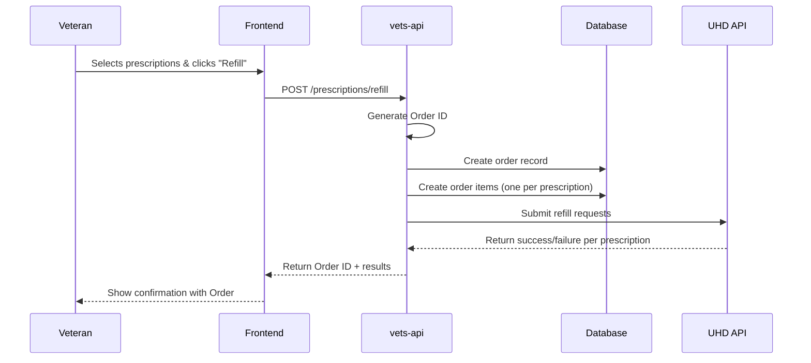
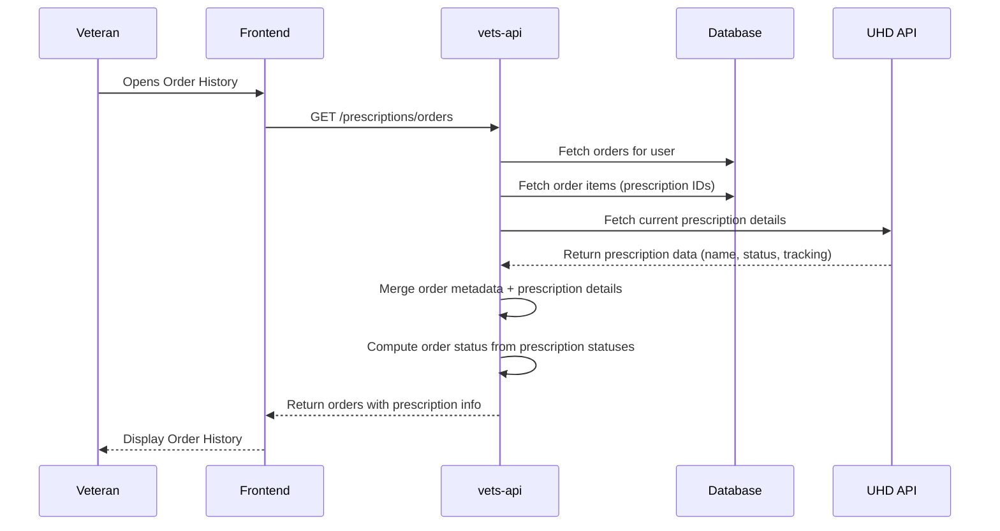
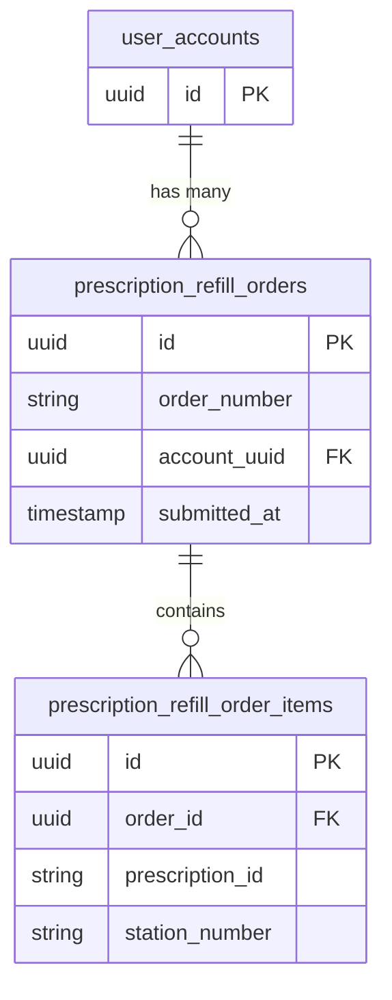

# Prescription Refill Order Tracking Analysis

## Table of Contents

- [Introduction](#introduction)
- [Existing Data Analysis](#existing-data-analysis)
- [Unified Prescription Model Output](#unified-prescription-model-output)
- [Order Tracking Proposed Solution](#order-tracking-proposed-solution)

## Introduction

### Problem Statement

Veterans using VA.gov can submit bulk prescription refill requests by multi-selecting medications and submitting them as a single order. However, the current system processes these as **individual refill requests** to the backend pharmacy systems, with no concept of a unified "order" that groups them together.

After submitting a bulk refill:
- The veteran receives the status of each prescription refill request only at the time of submission
- To check the status of their refills later, veterans must navigate to their full prescription list
- They must remember which prescriptions they ordered and manually locate each one
- The prescription list can be large, making it difficult to find specific refill information

This document will analyze:
1. What data is currently available from the pharmacy systems
2. How we can provide order tracking data to support the Order History view
3. Design options for implementing order tracking in vets-api

### Desired User Experience

We define an **order** as a group of one or more prescription refill requests submitted together in a single action by the veteran.

A dedicated **Order History** screen would allow veterans to:
- View all past refill requests grouped by order
- See an order confirmation number (e.g., "Order #099247")
- See when the order was placed
- View the status of each medication within that order:
- Filter orders by date range (e.g., "Last 30 days")

### Current API Limitations

**There is currently no API to support this order view.** 

The existing prescription refill flow is:
1. Frontend sends array of prescription IDs to refill
2. Backend submits individual refill requests to source pharmacy systems (Vista, Oracle Health)
3. Backend returns a list of per-prescription success/failure status

## Existing Data Analysis

This section analyzes the data currently available from both Oracle Health (OH) and Vista prescription sources.

### Data Sources Overview

The Unified Health Data (UHD) service aggregates prescription data from two primary sources:

1. **Vista** - Legacy VA pharmacy system, returns structured JSON via MHV API
2. **Oracle Health (OH)** - Modern FHIR R4-based pharmacy system (Cerner)

Both data sources are parsed by adapters in vets-api:
- [`VistaPrescriptionAdapter`](https://github.com/department-of-veterans-affairs/vets-api/tree/master/lib/unified_health_data/adapters/vista_prescription_adapter.rb)
- [`OracleHealthPrescriptionAdapter`](https://github.com/department-of-veterans-affairs/vets-api/tree/master/lib/unified_health_data/adapters/oracle_health_prescription_adapter.rb)

### Vista Data Structure

Vista returns prescription data in a flat JSON structure with nested `rxRFRecords.rfRecord[]` for refill history.

**Sample Vista Prescription (from VCR cassette):**
```json
{
  "prescriptionId": 25804848,
  "prescriptionName": "ABACAVIR SO4 600MG/LAMIVUDINE 300MG TAB",
  "prescriptionNumber": "2721173",
  "refillStatus": "refillinprocess",
  "refillSubmitDate": "Wed, 13 Aug 2025 00:00:00 EDT",
  "refillDate": "Wed, 13 Aug 2025 00:00:00 EDT",
  "refillRemaining": 0,
  "dispensedDate": "Wed, 25 Sep 2024 00:00:00 EDT",
  "orderedDate": "Tue, 24 Sep 2024 00:00:00 EDT",
  "expirationDate": "Thu, 25 Sep 2025 00:00:00 EDT",
  "quantity": "30",
  "stationNumber": "989",
  "facilityName": "DAYT29",
  "facilityApiName": "Dayton Medical Center",
  "isRefillable": false,
  "isTrackable": false,
  "isRenewable": true,
  "dispStatus": "Active: Refill in Process",
  "prescriptionSource": "RX",
  "sig": "TAKE 10MG BY MOUTH DAILY FOR 30 DAYS",
  "providerFirstName": "MOHAMMAD",
  "providerLastName": "ISLAM",
  "rxRFRecords": {
    "rfRecord": [
      {
        "prescriptionId": 26020143,
        "refillStatus": "suspended",
        "refillSubmitDate": "Wed, 13 Aug 2025 00:00:00 EDT",
        "orderedDate": "Wed, 13 Aug 2025 00:00:00 EDT",
        "dispensedDate": null,
        "dispStatus": "Suspended",
        "prescriptionNumberIndex": "RF3"
      }
    ]
  }
}
```

### Oracle Health (FHIR) Data Structure

Oracle Health returns FHIR R4 `MedicationRequest` resources with contained `MedicationDispense` resources for dispense history.

**Sample Oracle Health Prescription (from VCR cassette):**
```json
{
  "resourceType": "MedicationRequest",
  "id": "15216187241",
  "status": "active",
  "authoredOn": "2025-07-11T17:50:57Z",
  "medicationCodeableConcept": {
    "text": "atorvastatin (atorvastatin 10 mg tablet)"
  },
  "dispenseRequest": {
    "validityPeriod": {
      "start": "2025-07-11T17:50:57Z",
      "end": "2026-05-01T04:59:59Z"
    },
    "numberOfRepeatsAllowed": 3,
    "quantity": { "value": 90.0, "unit": "EA" },
    "expectedSupplyDuration": { "value": 90, "unit": "day(s)" }
  },
  "contained": [
    {
      "resourceType": "MedicationDispense",
      "id": "1461548858",
      "status": "completed",
      "type": {
        "coding": [{ "code": "FFC", "display": "First Fill - Complete" }],
        "text": "FIRST_FILL_COMPLETE"
      },
      "quantity": { "value": 90.0, "unit": "EA" },
      "daysSupply": { "value": 90.0, "unit": "days" },
      "whenHandedOver": "2025-06-01T17:50:04.000Z"
    },
    {
      "resourceType": "MedicationDispense",
      "id": "1461537023",
      "status": "in-progress",
      "type": {
        "coding": [{ "code": "RFC", "display": "Refill - Complete" }],
        "text": "REFILL_COMPLETE"
      },
      "quantity": { "value": 90.0, "unit": "EA" },
      "daysSupply": { "value": 90.0, "unit": "days" }
    }
  ]
}
```

### Data Comparison Table

The following table compares data availability between Vista and Oracle Health sources. Fields marked with ⚠️ require further investigation in Staging.

| Data Field | Vista | Oracle Health | Notes |
|------------|-------|---------------|-------|
| **Prescription Identification** ||||
| Prescription ID | ✅ `prescriptionId` | ✅ `MedicationRequest.id` | Different ID formats (string vs integer) |
| Prescription Number (Rx#) | ✅ `prescriptionNumber` | ⚠️ Not in VCR | May be the same as Prescription ID |
| **Prescription Details** ||||
| Medication Name | ✅ `prescriptionName` | ✅ `medicationCodeableConcept.text` | |
| Quantity | ✅ `quantity` | ✅ `dispenseRequest.quantity.value` | |
| Instructions (Sig) | ✅ `sig` | ✅ `dosageInstruction[].text` | |
| **Status Information** ||||
| Refill Status | ✅ `refillStatus` | ✅ Derived from `status` + dispenses | OH requires computation |
| Display Status | ✅ `dispStatus` | ✅ Derived by adapter | e.g., "Active: Refill in Process" |
| Refill Submit Date | ✅ `refillSubmitDate` | ✅ From `Task.executionPeriod.start` | OH uses contained Task resources |
| **Refill Information** ||||
| Refills Remaining | ✅ `refillRemaining` | ✅ Computed from `numberOfRepeatsAllowed` - dispenses | |
| Refill Date | ✅ `refillDate` | ✅ `MedicationDispense.whenHandedOver` | |
| Is Refillable | ✅ `isRefillable` | ✅ Derived by adapter | |
| Is Renewable | ✅ `isRenewable` | ✅ Derived by adapter | |
| **Dispense History** ||||
| Dispense Records | ✅ `rxRFRecords.rfRecord[]` | ✅ Contained `MedicationDispense[]` | Different structures |
| Dispense Status | ✅ `rfRecord[].dispStatus` | ✅ `MedicationDispense.status` | |
| Dispense Date | ✅ `rfRecord[].dispensedDate` | ✅ `MedicationDispense.whenHandedOver` | |
| Dispense Type | ❌ Not available | ✅ `MedicationDispense.type.text` | "FIRST_FILL_COMPLETE", "REFILL_COMPLETE" |
| Days Supply | ❌ Not in VCR | ✅ `MedicationDispense.daysSupply.value` | ⚠️ Verify Vista in Staging |
| **Facility Information** ||||
| Facility Name | ✅ `facilityName` / `facilityApiName` | ✅ Derived from Location reference | |
| Station Number | ✅ `stationNumber` | ✅ Extracted from Location display | e.g., "556" from "556-RX-MAIN-OP" |
| **Dates** ||||
| Ordered Date | ✅ `orderedDate` | ✅ `authoredOn` | |
| Expiration Date | ✅ `expirationDate` | ✅ `dispenseRequest.validityPeriod.end` | |
| Dispensed Date | ✅ `dispensedDate` | ✅ `MedicationDispense.whenHandedOver` | |
| **Tracking Information** ||||
| Is Trackable | ✅ `isTrackable` | ✅ Derived from dispense identifiers | |
| Tracking Number | ✅ `trackingList[].trackingNumber` | ⚠️ From dispense identifiers | Need to verify OH tracking data |
| Shipped Date | ✅ `trackingList[].shippedDate` | ⚠️ From dispense identifiers | Need to verify OH tracking data |
| Carrier | ✅ `trackingList[].deliveryService` | ⚠️ From dispense identifiers | Need to verify OH tracking data |
| **Provider Information** ||||
| Provider Name | ✅ `providerFirstName` + `providerLastName` | ✅ `requester.display` | |
| **Additional Fields** ||||
| NDC Number | ✅ `cmopNdcNumber` | ❌ Not available | CMOP data not in OH yet |
| CMOP Division Phone | ✅ `cmopDivisionPhone` | ❌ Not available | CMOP data not in OH yet |
| Category | ✅ `category` | ✅ Extracted from categories | |
| Prescription Source | ✅ `prescriptionSource` | ✅ Derived (VA, NV) | |
| Remarks | ✅ `remarks` | ⚠️ Not in VCR | May be in extensions |

### Data Available for Order Tracking

Based on the analysis, the following data is available to support an Order History view:

| Order History Requirement | Data Available | Source |
|---------------------------|----------------|--------|
| Order Confirmation Number | ❌ **Not available** | Would need to be generated by vets-api |
| Order Placed Date | ✅ `refillSubmitDate` (Vista) / `Task.executionPeriod.start` (OH) | Both sources |
| Medication Name | ✅ Available | Both sources |
| Rx Number | ✅ Available | Vista; OH needs verification |
| Per-Rx Status | ✅ Available | Both sources (computed for OH) |
| Shipped Date | ✅ Available | Both sources (OH needs verification) |
| Tracking Number | ✅ Available | Both sources (OH needs verification) |
| Quantity | ✅ Available | Both sources |
| Refills Remaining | ✅ `refillRemaining` (Vista) / Computed (OH) | Both sources |
| Total Refills Allowed | ✅ Computed (Vista) / `numberOfRepeatsAllowed` (OH) | Both sources |

### Dispense Record Unique IDs

Both Vista and Oracle Health provide unique identifiers for each dispense event. This could be useful for the Order History view, as it could allow veterans to click on a specific refill to navigate to detailed dispensing information.

Vista refill records (`rxRFRecords.rfRecord[]`) contain:
```json
{
  "rfRecord": [
    {
      "prescriptionId": 26020143,
      "refillStatus": "suspended",
      "prescriptionNumberIndex": "RF3",
      ...
    }
  ]
}
```

- Each refill event has its own `prescriptionId` (different from parent prescription)
- `prescriptionNumberIndex` shows the refill sequence (e.g., "RF3" = 3rd refill), but need to verify the format.

Oracle Health dispenses (`contained MedicationDispense[]`) contain:
```json
{
  "resourceType": "MedicationDispense",
  "id": "1461548858",
  "status": "completed",
  "type": { "text": "FIRST_FILL_COMPLETE" },
  ...
}
```

- Each dispense event has its own FHIR `id`
- The adapter extracts this into the `dispenses` array with `id` field

### Items Requiring Further Verification

The following items were not present in VCR cassettes and should be verified:

1. **Oracle Health Tracking Data** - Verify `MedicationDispense.identifier[]` contains tracking number, shipped date, and carrier
2. **Oracle Health Prescription Number** - Verify presence in `MedicationRequest.identifier[]`
3. **Vista Days Supply** - Verify if available in full API response
4. **Oracle Health Remarks/Notes** - Check for extensions containing remarks

## Unified Prescription Model Output

After both adapters process their respective source data (Vista or Oracle Health), they output a unified `UnifiedHealthData::Prescription` model. This section documents what data is available in this common format and identifies gaps for the Order History feature.

### Prescription Model Attributes

The unified prescription model contains the following key data fields for Order History:

| Category | Field | Used For |
|----------|-------|----------|
| **Identification** | `id` | Link to prescription detail view |
| **Identification** | `prescription_number` | Display Rx# to user |
| **Medication Info** | `prescription_name` | Display medication name |
| **Status** | `refill_status` / `disp_status` | Show current status (shipped, in review, etc.) |
| **Dates** | `refill_submit_date` | When refill was requested |
| **Refill Info** | `dispenses[]` | History of all fills/refills |
| **Tracking** | `tracking[]` | Shipment tracking information |

### Dispenses Array Structure

Each item in the `dispenses` array represents a single fill or refill event:

| Field | Vista | Oracle Health | Description |
|-------|-------|---------------|-------------|
| `id` | ✅ `prescriptionId` | ✅ `MedicationDispense.id` | Unique dispense ID |
| `status` | ✅ `refillStatus` | ✅ `status` | "completed", "in-progress", etc. |
| `refill_date` | ✅ `refillDate` | ✅ `whenHandedOver` | Date dispensed to patient |
| `dispensed_date` | ✅ `dispensedDate` | ❌ Not mapped | Date dispensed (Vista only) |
| `when_prepared` | ❌ Not available | ✅ `whenPrepared` | Date pharmacy prepared |
| `when_handed_over` | ❌ Not available | ✅ `whenHandedOver` | Date patient received |
| `refill_submit_date` | ✅ `refillSubmitDate` | ❌ `nil` | When refill was requested |
| `facility_name` | ✅ `facilityApiName` | ✅ Resolved from Location | Dispensing facility |
| `instructions` | ✅ `sig` | ✅ From dosage | Medication instructions |
| `quantity` | ✅ `quantity` | ✅ `quantity.value` | Quantity dispensed |
| `medication_name` | ✅ `prescriptionName` | ✅ `medicationCodeableConcept.text` | Medication name |
| `prescription_number` | ✅ `prescriptionNumber` | ❌ `nil` | Rx number |
| `cmop_division_phone` | ✅ `cmopDivisionPhone` | ❌ `nil` | CMOP phone |
| `cmop_ndc_number` | ✅ `cmopNdcNumber` | ❌ `nil` | NDC number |
| `remarks` | ✅ `remarks` | ❌ `nil` | Additional remarks |
| `disclaimer` | ✅ `disclaimer` | ❌ `nil` | Disclaimer text |
| `dial_cmop_division_phone` | ✅ `dialCmopDivisionPhone` | ❌ `nil` | Dialable phone |

### Data NOT Currently in Unified Model

The following data exists in the source systems but is **not extracted** into the unified model:

| Missing Data | Available In | Impact on Order History |
|--------------|--------------|-------------------------|
| Dispense Type (FFC/RFC) | Oracle Health `MedicationDispense.type` | Cannot distinguish first fill vs refill |
| Days Supply | Oracle Health `MedicationDispense.daysSupply` | Cannot show how long supply lasts |
| Performer (who dispensed) | Oracle Health `MedicationDispense.performer` | Cannot show pharmacist info |
| Dispense Location | Oracle Health `MedicationDispense.location` | Cannot show specific pharmacy location |
| Prescription Number Index | Vista `prescriptionNumberIndex` ("RF1", "RF2") | Cannot show refill sequence |

### Gap Analysis Summary

#### ✅ Available in Current Model

| Data Field | Notes |
|------------|-------|
| Prescription ID | For navigation to detail view |
| Medication Name | |
| Rx Number | Vista only |
| Dispense Status | "completed", "in-progress", etc. |
| Refill Date / Dispensed Date | |
| Quantity | |
| Facility Name | |
| Station Number | |
| Tracking Information | When available |

#### ⚠️ Available in Source But Not Extracted

| Data Field | Source | Notes |
|------------|--------|-------|
| Dispense Type (First Fill vs Refill) | Oracle Health only | `MedicationDispense.type` |
| Days Supply | Oracle Health only | `MedicationDispense.daysSupply` |
| Refill Sequence Index ("RF1", "RF2") | Vista only | `prescriptionNumberIndex` |

### Conclusion

The current unified prescription model contains sufficient data to display individual prescription details within an order (medication name, status, quantity, tracking). However, **the concept of an "order" that groups multiple prescriptions together does not exist**. The following section explores what additional data and infrastructure is needed to support the Order History feature.

## Order Tracking Proposed Solution

This section proposes a solution for tracking prescription refill orders.

### Data Needed for Order Tracking

To support the Order History view, the following data must be captured and stored:

#### Order-Level Data (Must Create)

| Data Field | Source | Description |
|------------|--------|-------------|
| Order ID | Generated by vets-api | Unique confirmation number (e.g., "099247") |
| User ID | From authenticated session | Link to veteran's account (UUID or ICN) |
| Submitted At | Captured at submission time | Timestamp when order was placed |
| Order Status | Computed | Overall status: `submitted`, `partial_success`, `complete`, `failed` |

#### Order Item Data (Must Create)

| Data Field | Source | Description |
|------------|--------|-------------|
| Prescription ID | From refill request | ID of the prescription being refilled |
| Station Number | From refill request | VA station for routing |
| Initial Status | From UHD API response | `success` or `failed` at submission time |
| Error Message | From UHD API response | Reason for failure (if applicable) |

#### Prescription Data (Already Available)

The following data is already available via the existing prescription API and does **not** need to be duplicated in order storage:

- Medication name
- Rx number
- Current refill status
- Shipped date / tracking information
- Quantity
- Facility name

### Proposed Solution

#### Approach: Lightweight Order Tracking with Real-Time Status

Store only the order grouping and submission timestamp in vets-api. **All status information is fetched real-time** from the source pharmacy systems when displaying Order History - this ensures data is never stale.

**Order Submission Flow:**



**Order History View Flow:**



#### Database Schema

Two new tables are needed. Note that **no status fields are stored** - all status is computed real-time from source systems.

**`prescription_refill_orders`** - Stores order-level data

| Column | Type | Description |
|--------|------|-------------|
| `id` | UUID | Primary key |
| `order_number` | String | Human-readable confirmation number (e.g., "099247") |
| `account_uuid` | UUID | Foreign key to `user_accounts.id` |
| `submitted_at` | Timestamp | When order was placed (also serves as record creation time) |

**`prescription_refill_order_items`** - Stores per-prescription data

| Column | Type | Description |
|--------|------|-------------|
| `id` | UUID | Primary key |
| `order_id` | UUID | Foreign key to `prescription_refill_orders` |
| `prescription_id` | String | Prescription ID from source system |
| `station_number` | String | VA station number |

**Entity Relationship Diagram:**



> **Note:** The database records are write-once and never updated. All status, error messages, and tracking information are fetched real-time from the UHD API.

#### API Endpoints

| Method | Endpoint | Description |
|--------|----------|-------------|
| `POST` | `/my_health/v2/prescriptions/refill` | **Modify**: Return `order_id` in response |
| `GET` | `/my_health/v2/prescriptions/orders` | **New**: List veteran's orders (paginated, filterable by date) |

#### Response Format for Orders Endpoint

**GET /my_health/v2/prescriptions/orders**

```json
{
  "data": [
    {
      "id": "a1b2c3d4-e5f6-7890-abcd-ef1234567890",
      "type": "prescription_order",
      "attributes": {
        "order_number": "099247",
        "submitted_at": "2024-02-11T14:30:00Z",
        "status": "partial_success",
        "prescription_count": 3,
        "prescriptions": [
          {
            "prescription_id": "90281734",
            "prescription_name": "IBUPROFEN 200 MG TAB",
            "prescription_number": "2721173",
            "quantity": 60,
            "refill_number": 3,
            "total_refills": 5,
            "dispense_id": "26020143",
            "status": "shipped",
            "shipped_date": "2024-02-17T00:00:00Z",
            "tracking_number": "9400111899223033335555"
          },
          {
            "prescription_id": "73288394",
            "prescription_name": "TACROLIMUS 25 MG TAB",
            "prescription_number": "2721174",
            "quantity": 20,
            "refill_number": 1,
            "total_refills": 3,
            "dispense_id": "1461548858",
            "status": "in_pharmacy_review",
            "shipped_date": null,
            "tracking_number": null
          },
          {
            "prescription_id": "312437777",
            "prescription_name": "METFORMIN HYDROCHLORIDE 50 MG TAB",
            "prescription_number": "2721175",
            "quantity": 20,
            "refill_number": 2,
            "total_refills": 4,
            "dispense_id": "1461537023",
            "status": "in_pharmacy_review",
            "shipped_date": null,
            "tracking_number": null
          }
        ]
      }
    }
  ],
  "meta": {
    "pagination": {
      "current_page": 1,
      "per_page": 10,
      "total_entries": 4,
      "total_pages": 1
    }
  }
}
```

### Benefits of This Approach

| Benefit | Description |
|---------|-------------|
| **Minimal storage** | Only store IDs and submission timestamp, not prescription details or status |
| **Always fresh status** | Prescription status is always current (fetched real-time from source) |
| **No data duplication** | Medication names, quantities, statuses stored only in source systems |
| **Simple schema** | Two write-once tables with straightforward relationships |
| **PII minimization** | No medication names or health details in order tables |
| **No stale data** | Since status is never stored, it can never become stale |

### Considerations

| Consideration | Mitigation |
|---------------|------------|
| **API latency** | Fetching prescription details adds latency |
| **Source system availability** | If UHD API is down, can show order metadata with "status unavailable" |
| **Order number generation** | Need strategy for generating unique, human-readable numbers |
| **Data retention** | Define policy for how long to retain order records |
| **No historical status** | Cannot show "what was the status on date X" (acceptable trade-off) |

### Caching Strategy

To limit database queries, we can implement simple caching for order data as orders are immutable and caching will reduce database queries.

> **Note:** Prescription data is NOT cached due to PHI concerns (medication names). Prescription details are always fetched real-time from the UHD API.

**Implementation Notes:**
- Use Redis for caching
- Cache key should include user identifier (e.g., `prescriptions:orders:{account_uuid}`)
- Cache TTL is configurable via settings

### Security and Privacy

#### Database Storage

The order tracking tables store minimal data to avoid PII/PHI:

| Column | PII/PHI? | Notes |
|--------|----------|-------|
| `id` (UUID) | No | System-generated identifier |
| `order_number` | No | System-generated confirmation number |
| `account_uuid` | No | References `user_accounts.id`, not directly identifying |
| `submitted_at` | No | Timestamp only |
| `prescription_id` | No | Opaque identifier from source system, not PHI |
| `station_number` | No | VA facility identifier |

#### Redis (Cache) Storage

We would store the same data as in the database, so the analysis is the same as above.
