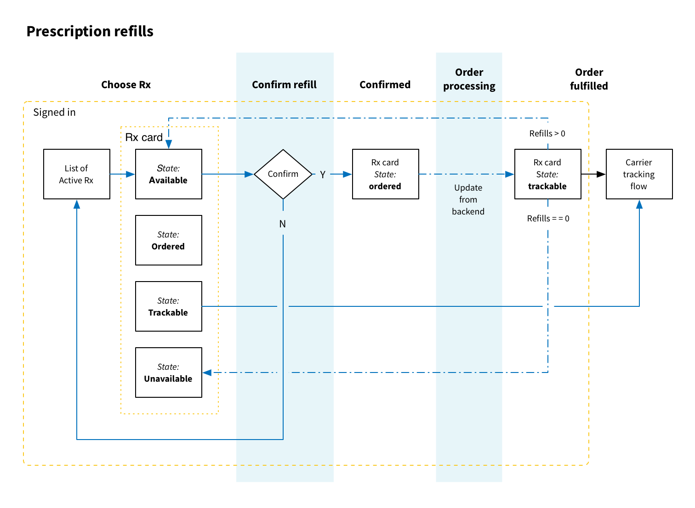
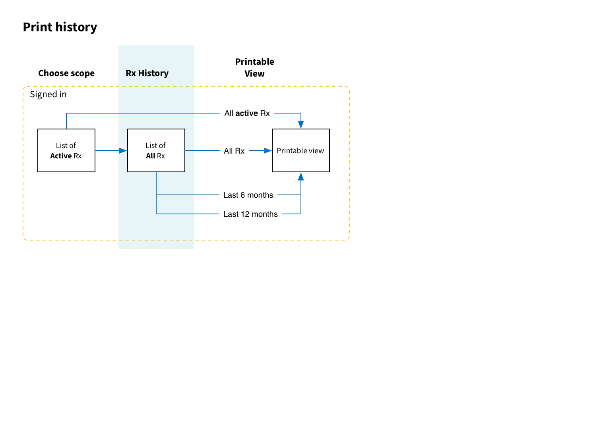
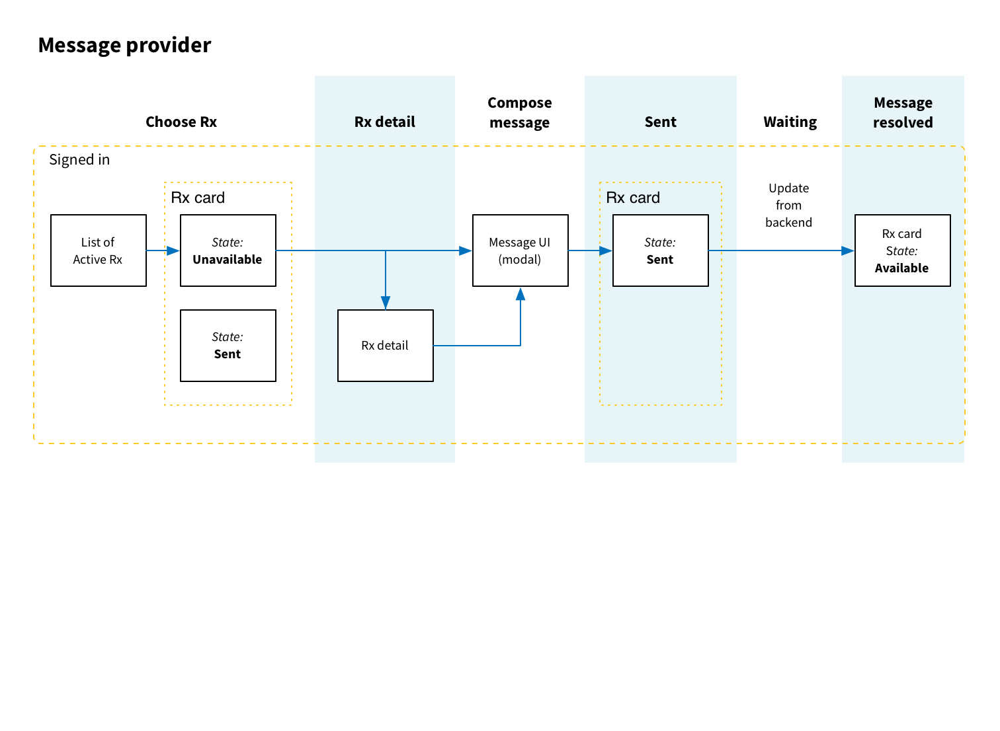

# Rx refill scenarios

## My prescription is running low
I know that I'm going to run out of Lipitor soon. So I log into vets.gov and navigate to My Prescriptions. I locate the Lipitor on the first screen (it’s ordered alphabetically). There is a refill button in the Lipitor “card” and I click it. A window pops up and asks me to confirm the refill of Lipitor. I click “Order refill”. The pop-up goes away and I see a banner on the screen that tells me I have successfully ordered a refill. It says tracking info is pending, so I can come back later to check on progress. I don’t have any more prescriptions to refill today so I sign out.

1. Go to vets.gov
1. Choose Rx tool
1. Sign in
1. Find prescription in question
1. Request refill
1. Confirm

## I wonder when my refill will arrive
I ordered a refill of Lipitor a day or two ago and I want to know when it will arrive. I log into vets.gov and navigate to My Prescriptions. I see that there is a shipment notice at the top of the screen. It includes a track package button. I click it and a new window opens with a USPS package tracking screen in it. I can see that they know about my package but it hasn’t been shipped out yet. I’ll have to check back later.

1. Go to vets.gov
1. Choose Rx tool
1. Sign in
1. Find Rx in question
1. Track package (external) link goes to carrier tracking flow

## My doctor wants to know what drugs I’m taking
I’m seeing a doc about a shoulder injury and she wants to know what other meds I'm on. I log into my account and see my current prescriptions. I click the print link and a printable list opens up in a new tab on my browser. As I'm looking at it I remember that she asked for the last three months. I close the window and then click over to the Prescription history tab. At the top I see a couple links. "last 6 months" is close to what I need so I click that. Like before I get a list in a new tab but this one is a little longer. I print it out and close out the window. I've got what I need for my appointment.

1. Go to vets.gov
1. Choose Rx tool
1. Sign in
1. Click "Print List"

_For full history_
1. Choose "History"
  1. Decide on time period (we offer a short list)
  1. Click appropriate print link

## I’m out of refills for a prescription
I’m running low on Lipitor again and I log in to order a refill. When I get to the refill page I see that I am out of refills for Lipitor. The Prescription card doesn't have a refill option but there is a button "message provider". I click that and see a pop-up window that I can type a message into. I ask how to get more refills and click send. After the pop-up closes I see a notification that the message was sent. I'll check back later.

1. Go to vets.gov
1. Choose Rx tool
1. Sign in
1. Find prescription in question
1. Click "Request renewal" link
1. Fill out modal contact form

