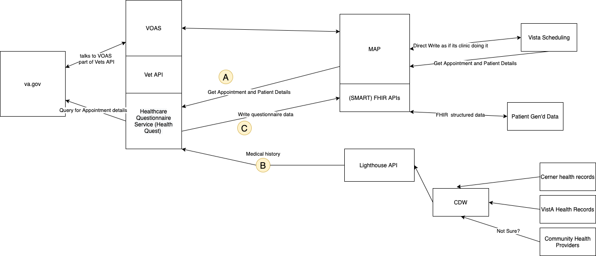

# Architecture Diagram [WIP ]



[link to draw.io diagram](https://viewer.diagrams.net/?highlight=0000ff&edit=_blank&layers=1&nav=1&title=Untitled%20Diagram.drawio#R3Vzfc5s4EP5rPNc%2B2IMQP8yj7TRJZ5peWt9c23sjIGxNMbggx3b%2F%2BpMAYZBwTDDYpHnIIAkE2v20u%2Fq08gDOVru7yF4vH0IX%2BQNVcXcDeDNQVUsz6H9WsU8rDKClFYsIu2kVOFTM8W%2BUVSpZ7Qa7KC7dSMLQJ3hdrnTCIEAOKdXZURRuy7d5oV9%2B69peIKli7ti%2BXPsNu2SZ1o515VB%2Fj%2FBiyd8MlKxlZfObs4p4abvhtlAFPwzgLApDkl6tdjPkM9lxuaTP3R5pzT8sQgGp88Dn%2B1%2Fb4ae%2FvS%2F%2Bx%2Bn%2BA%2F6PfPHDYdbLs%2B1vsgE%2F26NF%2BDxQDZ%2F2On2K6NWCXWWDIHsume0SEzRf2w4rb6ny6U1LsvJpCdBLO16n%2BvDwDtFPmOIVldWE1yq0Zo0ivEIERbQc0Wo7WPjo8VA5lYfIvxdFBO0KVdmQ71BIn4329JasVcukn8EPcMVtD8oE%2FJ5lUZG80s4AtMi7PsiYXmRifoXIVUnk%2FyJCKyaPHyUZR%2BEmcJn0EnmdkHgL0oJAEJdRIS61QlzjrqQFZWn9PZmfDcYOZKXVFFVe2bqsNFlWOCY2rZo7S%2BRufBwsrg4xAHRrpOsl0Vk1RWd0JTldkpwkJxS4E%2BZPaMnx7TjGDpUHlW5E5OqCxNAOk%2B%2BF6x9M0CNVz4o3u0zwSWHPCwEd1PdiIX3M1Hn58FxS4g8e1U8cbiIHnXYEdDwLRE7PR%2BSW3Kas7YIq9QpN8roI%2BTbBz2VnW6Xe7A2PIQ7IAUw5IjIgDU0BIem4s6eKzlHoSJzMQwCFnlLJSD0lcMvH3RyBhoRAYvs%2F4yTcof9So6fIbpnqmg0j9NhNiMRHHAnT1yf7icZmZbvo40XAoEvxknhcNo8xjX4mWcMKuy7rYxqhGP%2B2n5L%2BEt%2FNBJGIRp8O9JtK7L041USDkYdw2UsGxSipypAMlZFiKWYrOBqPFK1szEeWWe4k9LwYdaJ688LGp5ntUbuzPbCu7QG9Mj66aDNMONKhVfhrZov08Qmj1rEpGr8JPHYIx7q%2BUOsVHA0RNsa4DEejGRxNTYSj8Gkdw9GS4HiD2WqR1n2LaLSafgnthLlAnHhAh0a6FHuq4oZJyEure%2BwR%2BXxrwyOqhmGWtaWeB67u3R%2B3oiV7k4Y58doOSlozfm0YXTJ1Qj%2BkypmwgS2e3ilJaERfrxSu3rNLpgTFCwMy9OwV9vfpM7Qje7VOGiHUGACQ%2F4yYmqWWcidxwk%2BxLoC63glt6VeyxiCMVrZfbt5mM561a%2Bl3Jo0%2BIhRoQzpUh2G16nkKCzLMgMmaM2yWmjFdxAVZ90rh05JGEtlB7NFOefcBym%2FYhpFbfnvx8Sfb%2BblIlohDQeaqNs5lrWrW4VovSN7F8dq3M6njgE7Lw4s9P7RJ8YO4cnloe49snywdOn3oLV82KCaYzgcbJ%2BU5ip6xw67epffxe97nKgye4lSTKZgoOFM8tcRnHXUwzSmEHnAIQGYEP7H3LsNNjPjiQhTwlSkFU%2FB8sIq1qvK8YmDVnhQrSD4cE4b1HK1fkUOnXnx16QFVKYtPq0v6dUbHAJn1m6EoSGzekssv6qv84NXpLCAzgbObb1eXlGUKQNP0awuqKfFXXNTwBUpeqLdA4Yshfl1nMXRUCaf5vQwSJxc1oF%2BLbNOS2OJ83f3alcxYk%2FrSRGh1vJgBMs%2FXHHDKSDuwMgw%2BjBLrAnZJD4WNuXOxWJfwAf1aYQMgxGtQJIlrI9EUAz%2B9FgwpLux94bZszdkFUJuykhV0z6uh1sCanoFG9a2iUSBmpHC2LhqBImyjSA73%2BnCUSclZuFptAkz2xaD6MQqfsYuiHoaFOrx6WChTaZed04Vp%2FKM4xduf0%2BM3OqcVXQCN6BjqzmlLXJSI%2BSxXn9Ic%2BgU0fg7ZCOabiJZvZWj2hrHNJ1IblC2wzHFJVXwvvr%2BUrSqTRC0ZErNZdNDl5mTd3SAeG%2FbElAicWN7tq4MDKHSkXHbFxKFVwNpdmi%2B3TubvCqWgD1zm%2FqnE0vINIjb25TCgP0bkaEjxaiOijKBeTl9QW4EQ1EaKIe9n5%2FuLI01XCn%2Bw3H%2BH5kemBw%2BKv0PBXwwKNzbLfLt2ECjNnqtzq6rMDdaz3c2290E9e365zf26qz21X5luhpiZ23SxZwhrPWkrqWt7LlOut%2Fcfv8qbShSQ0cYhNBhk09mtms49MuZ8VrVgzBU4LpOUbyAgbJPWFGK7k0mvFybSlZoGpF88uphUBkQHU9t%2BCB4NiGx81%2FZDJia%2FbFAiSS%2BMpLjQ7X8cyOdOG6bDsGBZO723HE2zDU9ajlPs0mXNBrTqmo1%2BLSN1YadCbxx3qEJHl447ZPLzAblsajPB4ZiEWXDdUyvRZpYgMPmxzJayBDnnAMq9jkc6KK4QBS6zO6vCfdRLVoWlta2PTujz5WwKM8esWPlVTVxVdKjtnaWTabuHyaMkmPMT4V7WyenV8ykRAZHMak9EMtv0bv4w%2BfoPy2lM1yksBa717aVzJfbS8dYqCXZGL0CZm%2BEJmCwNtiQ0nvApptZaLAFVzAadFPI4056O5HHSj8TrGJ3WggRkD%2Fv%2BLM1ypR1Bz%2FNUJ2U%2BovAnKrS4xpOhG%2B1QROIpElCRPQYrNCimHrSnwaYEURW5n8dTr%2BCCXrv%2BO6qEk0FZ3Zyonh08AoqYPmI1DMoAEKIyteY2YWuOWmaD%2Fgx2H7ZICGlwXKbez1zVcctjjJTyzqMyEs4IdRihtcEYVR4nM8bwZTtDC2Iu2%2BV56No0Eo9IemJ7xFNmsKnpMQUeqW6CQmsAlHkkfpzsl3DWJOWeTxx66JHpaZVQMgUuGp4HI4HSvoChqSKY2ghIZ39qQCqkIEHl2gFpVdpaGxqc%2FqkatAQNjq%2BsQW7aazr75Djg1c5Y0A%2B5xWx853r42j%2BpYvXKw0un6ayGKYia6OFbO2tBi4ffTUtvP%2Fz4HPzwPw%3D%3D)

## Legend
### A : Communication with MAP to get Appointment details 

The Vets APi will use an exchange of JWT to create a secure connection. Using this connection, we can get access to an appointment's details based on on the AppointmentID. The questionnaire trigger will send us the appointment Id. 

This connection is how we are accessing VistA Scheduling data. 

This appointment will not be in FHIR format, but could be 

### B: Lighthouse 

Our preliminary idea is to use the Lighthouse Health API to access a vet's medical history. This API connects us to VistA health data. Not yet, but someday, we plan on using Lighthouse Health API to pull in items such as medications, allergies. and other important health information.

As of Sept 2nd, the Lighthouse team is looking into how to solve the Cerner integration problem. 

We have future plans (in pink) to use the FHIR abilities of Lighthouse. Lighthouse plans to have have read and write of FHIR data for appointments, questionnaires and other relevant healthcare information.  The APIs are not yet created, but we will start to utilize them when they are released.

Check out more in out [tech doc](README.md)

### C: Writing Questionnaire data.  

*This is the most fuzzy for me and will need to most work*

The Vets APi will use an exchange of JWT to create a secure connection.

These endpoints use the FHIR spec to communicate. We plan on using the [questionnaire](https://www.hl7.org/fhir/questionnaire.html) to create [QuestionnaireResponses](https://www.hl7.org/fhir/questionnaireresponse.html) that will take the form of JSON Objects, that looks like this example object, note that not every field is required: 

```js
{
  "resourceType" : "QuestionnaireResponse",
  // from Resource: id, meta, implicitRules, and language
  // from DomainResource: text, contained, extension, and modifierExtension
  "identifier" : { Identifier }, // Unique id for this set of answers
  "basedOn" : [{ Reference(CarePlan|ServiceRequest) }], // Request fulfilled by this QuestionnaireResponse
  "partOf" : [{ Reference(Observation|Procedure) }], // Part of this action
  "questionnaire" : { canonical(Questionnaire) }, // Form being answered
  "status" : "<code>", // R!  in-progress | completed | amended | entered-in-error | stopped
  "subject" : { Reference(Any) }, // The subject of the questions
  "encounter" : { Reference(Encounter) }, // Encounter created as part of
  "authored" : "<dateTime>", // Date the answers were gathered
  "author" : { Reference(Device|Practitioner|PractitionerRole|Patient|
   RelatedPerson|Organization) }, // Person who received and recorded the answers
  "source" : { Reference(Patient|Practitioner|PractitionerRole|RelatedPerson) }, // The person who answered the questions
  "item" : [{ // Groups and questions
    "linkId" : "<string>", // R!  Pointer to specific item from Questionnaire
    "definition" : "<uri>", // ElementDefinition - details for the item
    "text" : "<string>", // Name for group or question text
    "answer" : [{ // The response(s) to the question
      // value[x]: Single-valued answer to the question. One of these 12:
      "valueBoolean" : <boolean>,
      "valueDecimal" : <decimal>,
      "valueInteger" : <integer>,
      "valueDate" : "<date>",
      "valueDateTime" : "<dateTime>",
      "valueTime" : "<time>",
      "valueString" : "<string>",
      "valueUri" : "<uri>",
      "valueAttachment" : { Attachment },
      "valueCoding" : { Coding },
      "valueQuantity" : { Quantity },
      "valueReference" : { Reference(Any) },
      "item" : [{ Content as for QuestionnaireResponse.item }] // Nested groups and questions
    }],
    "item" : [{ Content as for QuestionnaireResponse.item }] // Nested questionnaire response items
  }]
}

```

The MAP API supports FHIR Specs for questionnaires. When the VETS API sends data to the FHIR API on MAP using the above format. It will reference a Questionnaire that is designated per location

*initial thoughts with current understanding*

**Questions about FHIR**
- When and where is the `Questionnaire` initially defined and stored?
  - *Current Answer:* In PGD
  

## Outstanding Topics

- How are doing the triggering system? 
  - How do we know a questionnaire needs to be filled out
- How are integrating with a facility? 
- How are are setting up Appointment types? 
