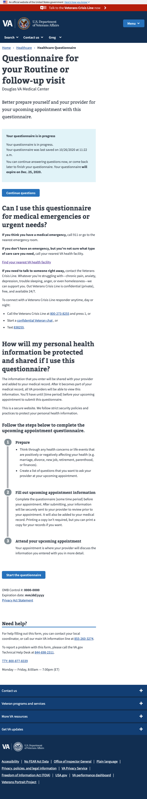

# Dynamic title

> [Ticket](https://github.com/department-of-veterans-affairs/va.gov-team/issues/14869)

## Question

Can we make the title dynamic for the form

## Answer

Short answer; 

Yes

screenshot

Long Answer;

In order do this, when we load the appointment on the introduction page, we also set values for the formConfig.

In order to reflect those changes though, we first have to store the formConfig in local state.

Check out this file for a simple implantation.

https://github.com/department-of-veterans-affairs/vets-website/blob/2acc681ff4049dce2b393cffcc137a2a8612ff09/src/applications/healthcare/questionnaire/containers/App.jsx

This can allow us to change the title base on appointment type, facility, clinic, user and anything else we want to load on the introduction page. 

## Next steps

We would need to figure out what exactly we would want displayed. 
