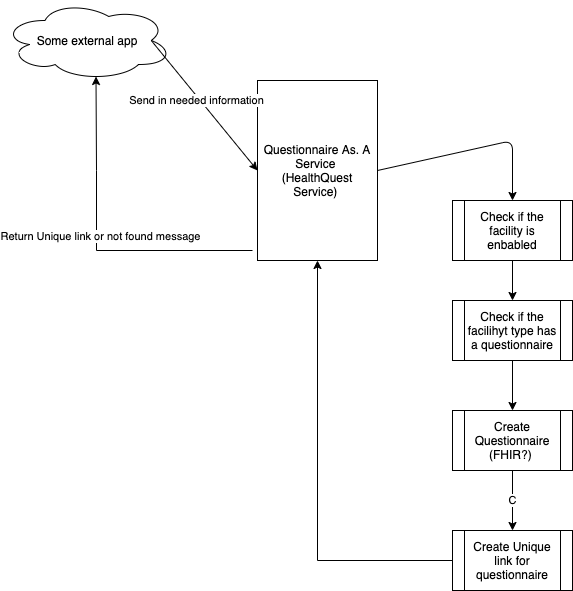

# Questionnaire as a service 
> WARNING: EXTREME WIP

## Description
This is the early plan for what we are called "Clipboard as a serivce" and relates to the trigger idea that is on our road-map for Q4, 2020 

## Big Idea

Is that we would provide an API, that a client application could call with some set of data, and we would then check if the facility, appointment type and any other details, warrant a clipboard to be created. 