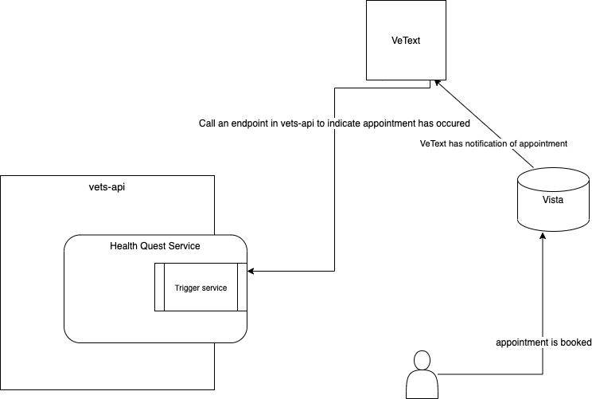

## Notification of Appointment through VetText

VetText is SMS based but has no API to use currently for triggers. There has been thoughts of providing a general use trigger API, but there is no current roadmap for this and the API is vurrently only internal to VetText. 

The idea to provide the desired trigger would be to have VetText make a call to an API service inside of the health quest service or something similar. As long as the patient can be ascertained from the API call, the health quest service could then save that information so that when the patient is getting prepared for their appointment, the health quest service can then find the pertinent information. Another idea is to create a clickable link that generates the trigger if we can guarantee that the link would be clicked. In that case it may be that no information needs to be saved

#### Issues

We need to ensure that trigger approach also works for veterans who have opted out of SMS text messages through VeText.

