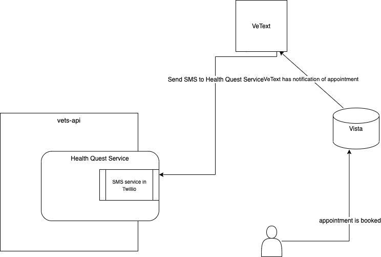

## Notification of Appointment through VetText

VetText is SMS based but has no API to use currently for triggers. There has been thoughts of providing a general use trigger API, but there is no current roadmap for this and the API is internal to VetText. 

Since VetText is SMS based, one idea would be to have VetText send an SMS message to a service inside of the health quest service. This could be the same or very similar to other types of SMS messages it sends. As long as the patient can be ascertained from the SMS message, the health quest service could then save that information so that when the patient is getting prepared for their appointment, the health quest service can then find the pertinent information 

Twillio is a Ruby gem that allows the use of progromatic SMS messaging once an account is set up: https://github.com/twilio/twilio-ruby
