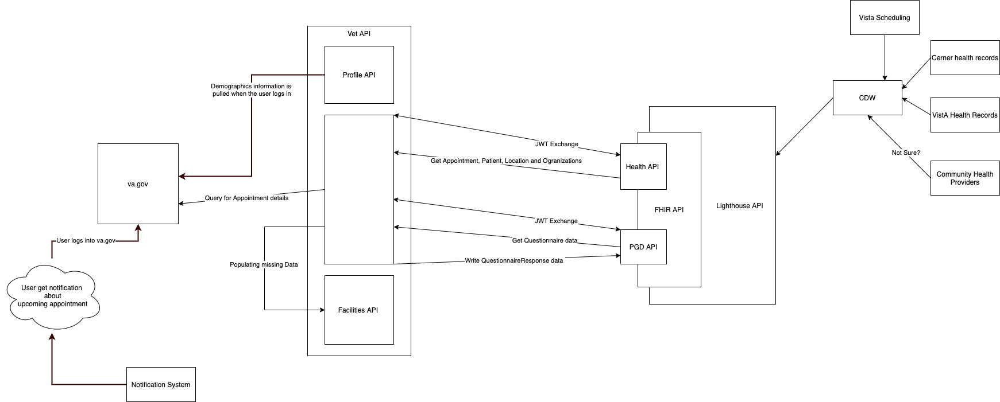

# Architecture Diagram [WIP ]

[link to draw.io diagram](https://app.diagrams.net/#G1fzAkVQ7snSI8eWeBemhIeCWT0TZKDQK1)

## Change Log

- No longer using MAP/MAS to get appointment data, We are now using Lighthouse. Lighthouse uses 24hr old CDW data.
- All data is storage is abstracted behind via Lighthouse.
- We are only using FHIR structures and APIs.
