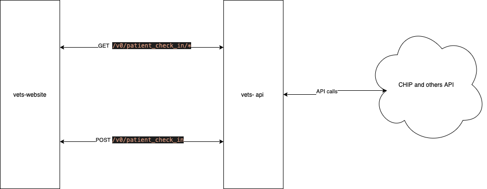

# Required data for the UI

This document will serve as a place to document the needed information in the UI for an the day of check in process and where we the data is coming form. This is just for appointment data, not questionnaire data.

## Required Data

This is what is required for the UI

- LoROTA UUID
- Some Unique Id to pass back on check in (could be the LoROTA UUID)
- Appointment
  - time
  - date
- Clinic
  - Name
  - Phone Number

## Diagram

## Endpoints and Structures

### Validate

> GET  /v0/patient_check_in/:uuid

- called when the app is first loaded

Params (in url)

- uuid that created in LoROTA and embedded in the link in the text message

Returns:

- A unique identifer to pass back
- Appointment Details
- Clinic Details

### Check in

> POST /v0/patient_check_in

- Called on the check in button
  
Params (in body)

- UUID

Returns

- Status of the check in.
