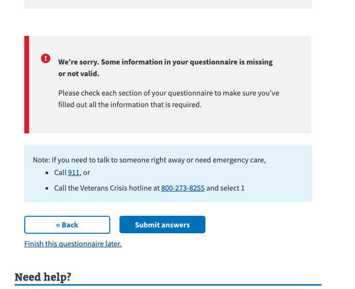
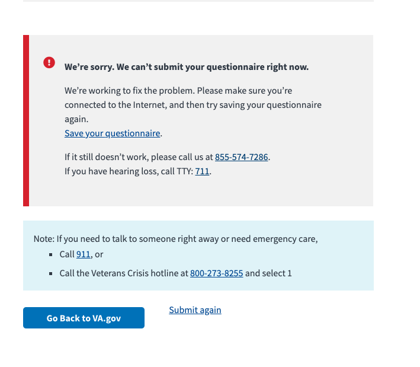

# Error States

This is a audit and review of the questionnaires form error states

## Summary of audit

The team and platform have done a good job of covering the use cases of errors so far. There are some more edge cases to work through.

In general, most of the errors are around what happens when a API service is down. This is hard to test and validate for a non technical person.

## Summary of action items

Use case that need to be covered by design

- [ ] Our Service is down, crash
- [ ] Form field validation messaging
- [ ] PDF Creation Errors
- [ ] Submitting an answer

Implementations to be handled by engineering

- [ ] Downtime Notifier and Page Duty implementation
- [ ] Designs from the design team from the above use cases

## Places in Flow that could have errors

### Missing appointment id

#### Error

The questionnaire does not what appointment this form is for . takes place when there is no appointment id. This can happen when  No appointment ID being returned

#### Technical error

The appointment id is missing from the url `/health-care/health-questionnaires/questionnaires/answer-questions/introduction`

#### How the UI reacts

The form will redirect back to the questionnaire list. No message to the user

#### Steps to reproduce

1. In a new browser tab
2. Navigate to `/health-care/health-questionnaires/questionnaires/answer-questions/introduction`

### Invalid appointment id

#### Error

The appointment id that is supplied to the form in the url is not a valid appointment id. This means the appointment cannot be found for that user.

#### Technical error

The appointment id that is from the url `/health-care/health-questionnaires/questionnaires/answer-questions/introduction?id=not-a-valid-id` does not exist for that user.

#### How the UI reacts

The form will redirect back to the questionnaire list. No message to the user

#### Steps to reproduce

1. In a new browser tab
2. Navigate to `/health-care/health-questionnaires/questionnaires/answer-questions/introduction?id=not-a-valid-id`

### Vets API has crashed

Not sure on this one, early tests show that this is big failure on the website as a whole.

This might be out of scope for our team

### Our Service is down, crash

if one of API calls result in a 500, we need to display an error message.

The places that need new messaging are:

- [ ] Introduction page, after a user is signed in
- [ ] Printing a PDF

### Our Service is down, maintenance

- We use [PagerDuty](https://department-of-veterans-affairs.github.io/veteran-facing-services-tools/platform/tools/downtime-notifications) to schedule downtime. This will wrapped our questionnaire and list.
- Any users coming to our app will see the downtime message
-  
- There is a downtown notifier and system to put into place

#### Testing

We can using the pager duty ui to test in staging

#### Questions

- What happens if a user starts a form and then tries to submit during a peroid of downtime
- Can we test downtime locally?

#### Action Items

- [Implement Page Duty](https://department-of-veterans-affairs.github.io/veteran-facing-services-tools/platform/tools/downtime-notificationshttps://department-of-veterans-affairs.github.io/veteran-facing-services-tools/platform/tools/downtime-notifications)

### Booking note is missing

Appointments **should** have a booking note, that has a reason for visit and a reason for visit description.

#### Current behavior

If that is missing, we are not showing the reason for visit and asking the user to supply the reason for visit description

### Form field validation errors (we only really have one required form field)

We have the `required`  for the `reason for visit description`. This is handled by the form library. Currently the message is

And can be customized

#### Question

- Should we change this message?

### PDF creation errors

This will be a custom experience, since we are not using any platform UI libraries for the downloading of the PDF.

The errors we can run into:

1. There is not data found for that questionnaire
2. There is scheduled downtime.

### Time out errors

*Assuming this is session timeout due to user inactivity* This is handled at the platform level and out our scope. This is not customizable per form. The Save in Progress system is already saving the data so no data is getting lost.

#### Recommendation

No action here

### Introduction Form Page

I feel confident that we got all the message for the introduciton of the form.

### Submitting an answer

1. Missing data on the review page has its own alert box

2. The server failing, for any reason, gives this screen

According the code, that awkard submit again link does not appear in production and should not be worried about
