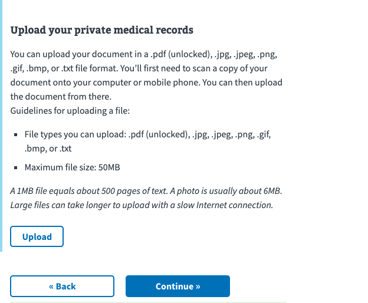

# Image Uploads

## Use Case

As a veteran, 
I want to be able to upload a photo during my form, 
So that I can better explain my concerns to the clinic staff. 

## Details 

> Slack thread: [https://dsva.slack.com/archives/CBU0KDSB1/p1604417622437200](https://dsva.slack.com/archives/CBU0KDSB1/p1604417622437200)

- There is already helpers set up for the front end. 
- We need a endpoint on the vets-api to accept the file and return an id
- Seems to get sent to the server when the file is uploaded orginally, not at the end of the form
- The id is now treated like any sort of information in the form


## Front end

- Seems just just another component in the library. 
- need to define labels, and other basic details (size, types, etc) 
  
Code Examples: 

Schema
``` js
 "childAdditionalEvidence": {
          "type": "object",
          "properties": {
            "view:additionalEvidenceDescription": {
              "type": "object",
              "properties": {}
            },
            "supportingDocuments": {
              "$ref": "#/definitions/files"
            }
          }
        }
```

uiSchema: 
[UI](https://github.com/department-of-veterans-affairs/vets-website/blob/main/src/applications/disability-benefits/686c-674/config/chapters/add-a-child/add-child-additional-evidence/addChildAdditionalEvidence.js#L14)


Sample implementation 



## Back end

- We have a S3 bucket that we store the uploaded file. 
- The endpoint accepts the form data
- Returns an id that can be used later to access the file on S3

sample request: 

```
curl 'https://staging-api.va.gov/v0/upload_supporting_evidence' \
  -H 'Connection: keep-alive' \
  -H 'Pragma: no-cache' \
  -H 'Cache-Control: no-cache' \
  -H 'sec-ch-ua: "Chromium";v="86", "\"Not\\A;Brand";v="99", "Google Chrome";v="86"' \
  -H 'X-CSRF-Token: x8o9NQLvo72bO4g9vIpnvALHvQwcN6fWhU9gS5BbQfMSDPjBq0DJbZxwDI58R5CA77JC3THT1M8HnDj1K4VJWg==' \
  -H 'X-Key-Inflection: camel' \
  -H 'sec-ch-ua-mobile: ?0' \
  -H 'User-Agent: Mozilla/5.0 (Macintosh; Intel Mac OS X 10_15_7) AppleWebKit/537.36 (KHTML, like Gecko) Chrome/86.0.4240.111 Safari/537.36' \
  -H 'Content-Type: multipart/form-data; boundary=----WebKitFormBoundaryiKrYyPxnuuA1unsQ' \
  -H 'Accept: */*' \
  -H 'Origin: https://staging.va.gov' \
  -H 'Sec-Fetch-Site: same-site' \
  -H 'Sec-Fetch-Mode: cors' \
  -H 'Sec-Fetch-Dest: empty' \
  -H 'Referer: https://staging.va.gov/disability/file-disability-claim-form-21-526ez/supporting-evidence/private-medical-records' \
  -H 'Accept-Language: en-US,en;q=0.9' \
  -H 'Cookie: _ga=GA1.2.391412143.1602790909; _vagovRollup=GA1.2.391412143.1602790909; _4c_mc_=0b9dc4dc-4043-4a38-ab45-fe4a812e33e5; cd_user_id=1755192ade8f0-0e76acc75fb2b2-163f6152-1fa400-1755192ade9773; dtCookie=v_4_srv_4_sn_FC566E528DCC2EE7C4485BEA9B9E24B3_perc_100000_ol_0_mul_1; _gid=GA1.2.1527254019.1604429704; _vagovRollup_gid=GA1.2.1408595771.1604429704; vagov_saml_request_staging=%7B%22timestamp%22%3A%222020-11-03T19%3A59%3A30%2B00%3A00%22%2C%22transaction_id%22%3A%22602a04af-c969-4832-b47a-525635a74c91%22%2C%22saml_request_id%22%3A%22_43405e2c-de3c-4567-baa5-84564da0820b%22%2C%22saml_request_query_params%22%3A%7B%7D%7D; TS0114998c=01c8917e486fdf4b34d60854603a3e41e1315ad5ca623bcfd3766ad9c714f5787bda7e9f2fe8b1f9ecdc2d8b10bf4af378594a3e32b0e4abf0e6fd925a63c35eeee21d6a4a0c0f2e044b8cc6933df55e739900bb18; api_session=wnLLwGSf84wH29px6f61KhRcmnWKEbfqFOmGCDUFMBax36CqzqgzJAtQpyj83C4UBj1%2Br0MliG%2BmSDC5BFgIm78EAMflOz%2F%2BVXbINpRuA%2Fnt7slNc5bEbiSmA2XRdigjdiCZBxemFY9k4RF%2B1umbdr48NvVLweYAnXj%2FR%2Frlr1lH2zw4FDXrReVyX5nJDLdeO3ahpi3v3TgxOHuXwIitWNf82mt20GqClMPaIU2NY8mjQGIOCQrYtuRjE8uLc6MG2DBgdtsmNYudtuse7D6OAetJcf5uZovaLGf1SP1G7n7gQfB82IY4c6fAG6%2FB4lrWQECBVY8jpGUmAoHY0ssAQqmpA8XaxxmFk8fUKFSiL9NLTRcSX9wvCw%2FAvn91oITurb%2Fcw4DZRFc7aT2DiedLVvma4pczU%2FPVzt%2FQAQWAAnJbNjUl4g%2BJjkgX%2B%2FzqmPaZ30lckAuECdf9cHTby%2BFvFzFqgmKXR4bB5%2BPlzWZcPiRseyqy989H0b%2BgZBftwCizYT%2BhH%2BUEhRWQ8spVXKxESevB5vioQXKmShBqxRJWfyRsMkHQQy3lNvCTB541ek9Mp8WEmKMaQYj4GnI4TWL2nlVkgf1J26VoalkMmobllhOwXkqr0TQQ1qw3eWz65yxW9hsTAYfHdaAzd7421ebv28K7lgpdJaFQgPgCCvkOE8GNtuWhhPHzNpM3dgTzoVk%2B5%2BAUcpL5OIBzdKAbE2QCIJS5FQIFQRF4wzi5isA1swQfFqZWJtRCQjIXsar3giuNjTyuxZAqZM06VHTeyibtYZnnLFf%2BvI2QDXd%2B43MW8g%3D%3D--cZkXpzaNz0y8RA5s--AOATqaV8x4%2BoFTG4mLFrsg%3D%3D' \
  --data-binary $'------WebKitFormBoundaryiKrYyPxnuuA1unsQ\r\nContent-Disposition: form-data; name="supporting_evidence_attachment[file_data]"; filename="architecture.v1.png"\r\nContent-Type: image/png\r\n\r\n\r\n------WebKitFormBoundaryiKrYyPxnuuA1unsQ--\r\n' \
  --compressed

  ```

  [Full code sample](https://github.com/department-of-veterans-affairs/vets-api/blob/master/modules/claims_api/app/controllers/claims_api/v0/forms/disability_compensation_controller.rb#L35)