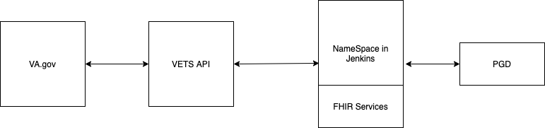

# Access Q&A

**attendees:** Stephen Barrs, Laurence Guild, Mark Dewey

**when:** Aug 31st, 2020 @ 1pm

**purpose:** To discuss the most recent accss to the sandbox

## Notes: 

The team was given access to the following services

| service|what is does|
|:--| :--|
|Jira| Ticketing system|
|Wiki| documentation|
|Bitbucket|source code access for MAP|
|Nexus| source control for higher level items, such as docker containers|
|Crowd| Higher level project management |
|Consul| key:value storage|
|Vault| sensitive key:value storage|
|Jenkins| the CI server for the sandbox. We are using this to gain access to a sandbox env for FHIR PGD

 

Stephen is working through setting up a `namespace` in `Jenkins`. This will allow us to have access to the MAP endpoints to work with PGD. 

The `namespace` in Jenkins gives us a URL for our API to communicate with MAP

Setting up the namespace may or may not need to be done ever so often (weekly/biweekly) because the sandbox resets at some interval. 

The system will look like: 

## Action Items

- [ ] Mark will document
- Stephen will continue to work on getting the namespace in Jenkins set up. 
