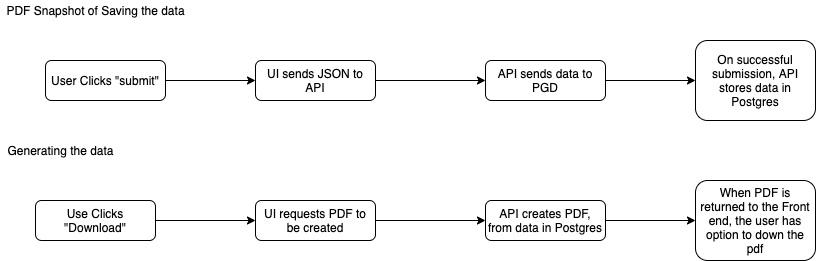

# Snapshot PDF

## Use Cases

- As a veteran, I want to print the answers of my questionnaire
- As a veteran, I should be able to print the answers after I submit the answers
- As a veteran, I should be able to print the answers of all my completed questionnaires
- As a veteran, When I print a questionnaire, the answers should reflect my details that are accurate at the time of the submission.

## Tech Architecture - v1

### Storing

In order to allow a veteran to see their data that was submitted, we need to store the submitted data as a snapshot of what was submitted. Since we are not storing appointment or demographics with the answers, and those details might change, we need to store the details of the user when the questionnaire is submitted so that we can recall the details that were submitted.

In order to do this, we must store a copy of the data when the user submits the Questionnaire to PGD.

This copy will be created when the questionnaire is submitted. After a successful submission to PGD, the vets api will store a copy of the answers, demographics and appointment details in the Postgres database. This data will be encrypted and stored in its own database table with the following structure:

- Questionnaire Response Id
- Appointment Id
- Body (as JSON string) including Demographics,  Appointment and Questionnaire Response (as Blob)
- Datetime Created

### Retrieving

To retrieve the information, the front end will make a call to the back via a GET request that will look like

```
GET /api/health_quest/v0/questionnaire_manager/print?id=[questionnaire-response-id]
```

*NOTE: the url is not final*

This call can be a long call, so a `generating PDF` message will show to the user. This API endpoint will return the PDF data ([API code sample](https://github.com/department-of-veterans-affairs/vets-api/blob/master/app/controllers/v0/caregivers_assistance_claims_controller.rb#L29)). This call will return the a stream of data of the PDF

questionnaire response id

On the front end, once the data is received, then a `download link` will be shown. Once a user clicks that link a new window will open in the browser with the PDF available to be seen or downloaded. Relevant [FE code sample](https://github.com/department-of-veterans-affairs/vets-website/blob/master/src/applications/caregivers/components/SubmitError/DownloadLink.jsxhttps://github.com/department-of-veterans-affairs/vets-website/blob/master/src/applications/caregivers/components/SubmitError/DownloadLink.jsx)



## Outstanding Questions

- (Stephen) Is this okay from a legal perspective?
- What is the time table for document storage to be ready?
- Does PGD return the Questionnaire Response ID on creation?

## Tech Architecture - v2

*NOTE: subject to change when Lighthouse implements the document storage*

Long term we want to store the PDFs PGD. In the FHIR specification there is a resource type called [DocumentReference](https://www.hl7.org/fhir/documentreference.html). We can store the PDF in the `content.attachment` field of a `document reference` as a base64 encoded string.

We will still create the PDF on submission. Instead of storing the data in Postgres, we will store the PDF already generated in Lighthouse. And retrieving will still follow the same flow, but instead of loading the data from Postgres we will use Lighthouse

We will move to using Lighthouse to store PDFs when the functionality is complete.

## Migration from v1 to v2

Migration shouldn't be that complex. A one-time run batch job to move the data to PGD would have to be run

Once we get answer the questions answered, we will create tickets
