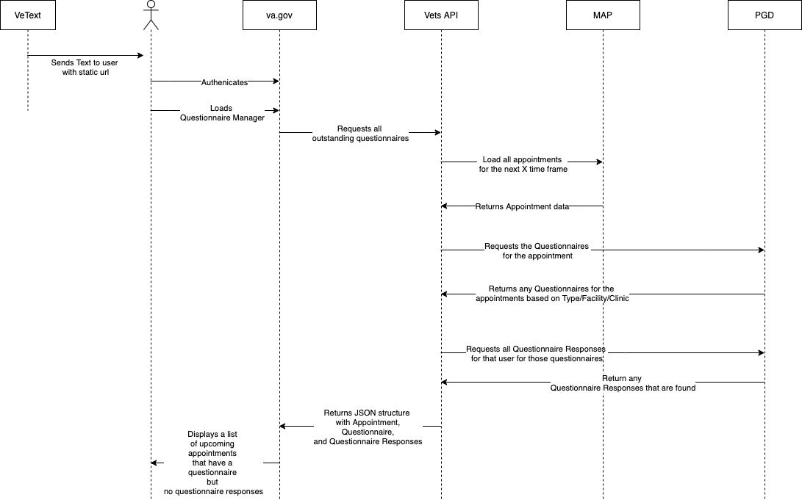

# MVP

For a MVP, we are going to keep things are simple as possible.

THis document is the high level explanation of the trigger and and notification system. This is broke out into more details in [notification](notification.md) and [trigger](trigger.md). 

- [MVP](#mvp)
  - [Use Case](#use-case)
  - [Next Steps](#next-steps)
  - [Outstanding Questions](#outstanding-questions)
  - [High Level](#high-level)
  - [Diagram](#diagram)
  - [Notes](#notes)
  - [End points being used](#end-points-being-used)
    - [Vets API](#vets-api)
    - [MAP/MAS](#mapmas)
    - [PGD](#pgd)
  - [Storing the association](#storing-the-association)
    - [Problem  / use case](#problem--use-case)
    - [Option 1: Store In the FHIR questionnaire](#option-1-store-in-the-fhir-questionnaire)
    - [Option 2: Store in Vets-API](#option-2-store-in-vets-api)

## Use Case

As a veteran,
I need to know what questionnaires I need to fill out for my upcoming appointment,
so that I can give my healthcare provider better information. 

## Next Steps

- [X] Create notes
- [X] Create Diagram
- [X] FHIR structure
- [ ] Answer where can we store the association? 
- [X] Verify Endpoints exist on MAP and PGD.
- [X] Present to team
- [X] Determine Next steps
- [ ] Tickets

## Outstanding Questions

- For a FHIR expert, does this sound reasonable to use the identifier in such a way? [The docs](https://www.hl7.org/fhir/questionnaire.html) suggest we can do this, and its even encouraged in the examples.
- Is there a specific use case that we need to know when an appointment is booked? Or is it more, we need to know if the user has an upcoming questionnaire?
- How many facilities/clinics do we plan to roll this out to over time (MVP, beta, full rollout, etc)
- Are there a base set of questions that all appointments will need, or are all questions going to be specific to appointment type/facility/clinic?
- Do we have a URL shortener service with va.gov?
- What does the unauthenticated flow look like? 
- With the id strategy, is an issue with having a questionnaire per clinic. Maybe there is a better way to store the id. 
- What page will the veteran land on? The Drupal page or the questionnaire manager page?
- What is the character limit for the text message.

## High Level

We plan on using VeText to aid in the notification of the vets of their appointment. They are already doing it and we want to leverage them.

For this, once we figure out the pilot sites, we have VeText update the template to include a static url. That URL will link the users to their questionnaire manager page. This static link will be the same for each veteran. It will be something like `va.gov/healthcare/questionnaire/mananger` (or something shorter with a URL shortener). This will make that notification easier since the url is not changing per user or per questionnaire.

Once a user gets to that page and logs in, we can then check if they have a questionnaire to fill out. We can do this because we have the user's ICN number. Using that ICN number we can get their upcoming appointments. We can then check those appointments against the [Questionnaire](https://www.hl7.org/fhir/questionnaire.html) and  [Questionnaire Responses](https://www.hl7.org/fhir/questionnaireresponse.html) we are storing in PGD. If the appointment (based on type, facility and clinic) has a Questionnaire and the user doesn't have Questionnaire Response, then we can mark that a questionnaire needed fill out. This will show up in the tabbed layout we can show the users and highlight upcoming questionnaires.

This solution is only a first step. Ideally, the notification that the veteran gets already knows, but that requires more developer work on other teams than we want to currently do or have sprints for.

## Diagram



[draw.io link](https://drive.google.com/file/d/1jM5Wc3-jWCfylWVqn8CbMshw_3T2yYs0/view)

## Notes

- The association is a unique combination of `Appointment Type`, `Clinic Id`, and `Facility Id`.
- We can turn on this feature per facility/clinic, under the assumption that VetText can customize the message per facility/clinic.
- This will make an API call per appointment to the FHIR API. This *could* have an impact to performance. As usual performances issues are not an issue until they are issue. A working slow solution is better than no solutions, but a fast solution is always preferred.

## End points being used

### Vets API

*NOTE:* this details for this endpoint are still up in the air, but this is the general gist

GET 
/questionnaires

in:
user session

out:
a list (an array) of all a users questionnaires

```json
{
  "data":[{
    "appointment":"",
    "questionnaire":{
      "status:???
    }
  }]
}

```

### MAP/MAS

| **Endpoint Called**                                                             | **HTTP Action** | **Mobile/External Service** | **Description**                                                                                                                          |
| :------------------------------------------------------------------------------ | :-------------- | :-------------------------- | :--------------------------------------------------------------------------------------------------------------------------------------- |
| /patients/{icn}/appointments                                                    | GET             | mobile-appointment-service  | Retrieves appointments for the given user                                                                                                |

### PGD

| **Endpoint Called**                                                             | **HTTP Action** | **Mobile/External Service** | **Description**                                                                                                                          |
| :------------------------------------------------------------------------------ | :-------------- | :-------------------------- | :--------------------------------------------------------------------------------------------------------------------------------------- |
| /smart-pgd-fhir/v1/Questionnaire?id={questionnaire-id}                       | GET             | smart-pgd-fhir              | Retrieves a Questionnaire with matching id, which is used as a reference in subsequent QuestionnaireResponse requests to SMART PGD FHIR. |
| /smart-pgd-fhir/v1/QuestionnaireResponse?subject={appointment-id}               | GET             | smart-pgd-fhir              | Retrieves a QuestionnaireResponse, where the subject is equal to a given appointment id, from SMART PGD FHIR                             |
| /smart-pgd-fhir/v1/QuestionnaireResponse?author={user-id}                       | GET             | smart-pgd-fhir              | Retrieves all QuestionnaireResponses, where the QuestionnaireResponse.author field is equal to the user id, from SMART PGD               |

## Storing the association

This is the section that needs the most hashing out, we have a couple of options

### Problem  / use case

Every unique questionnaire in our system has a unique combination of appointment type (stop code), facility id, and clinic id. We need a place to store that combination.

### Option 1: Store In the FHIR questionnaire

This should be plan A. The idea here is that would store the association in a searchable field inside the FHIR spec for a questionnaire. First idea is that we could have the  the `identifier` (id) field be a combination of the above fields

This could be one of two things: a parsable format or a hashed computed field

For a parsable formated strucutre. the `identifier` (id) would look something like this : `questionnaire:{version number}:{facility code}:{clinic id}:{stop code}`. For example: `questionnaire:1.0:983:848:323`

Just to note, this doesn't have to be the final form of the id, just an example of what this could look like.

The other option is that we store a hash of the combination as the id. This would also work, but may not be as readable and might add more complexity, but provides a little more uniqueness and privacy. 

### Option 2: Store in Vets-API 

This is a our plan B. Using the local database in the vets-api (postgres). This is fine and we can control all the finer details easily enough and can be the most agile, but then its also our responsibility to maintain this and potentially make it accessible to other systems. 

