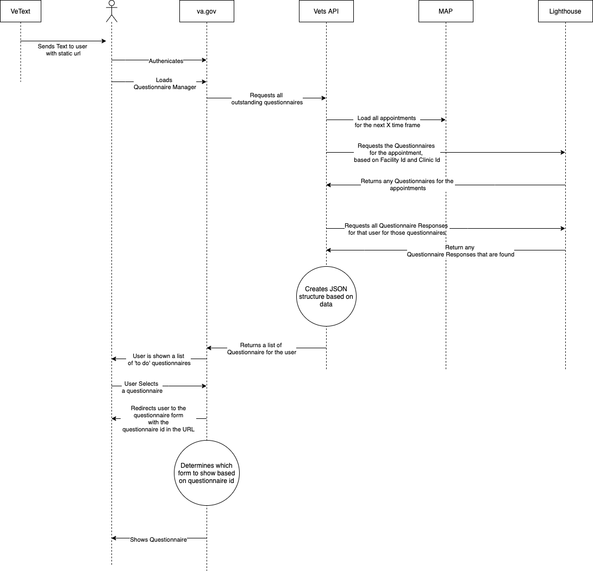

# Engineering Sync about trigger

- Attendees: Dillo Raju, Mark Dewey, Stephen Barrs

## Summary

### Trigger

- The Questionnaire Id is unique number with no semantic meaning behind it
- The Trigger, will be in the Use Context
  - We will store the Facility Id and Clinic Id in the Use Context
- This will allow us to query to see if a questionnaire exists for an appoitment at a facility
- On questionnaire list load, using the appointment data from MAP, we will build a query for PGD to check is the facility and clinic have a questionnaire.

### For MVP

- We will have one questionnaire (Primary Care) for both Hawaii and Loma Linda.
- The API will query for available Questionnaires based on Facility Id and Clinic ID
- The API will also check for in progress applications.
- The Front end will dynamic select the appropriate questionnaire based on a "mapping" on the front end
- The Front end will move from using appointment Id to using questionnaire id to identify the questionnaire
- This questionnaire will select from a list of one, which questionnaire to show.
  - Current We only have one questionnaire, Primary care, but this is future proofing the design

The high level one sentence:
>By querying the PGD dynamically and using a mapping on the front end, this is simulating the effort, pitfalls, and paths forward for when we add more locations and more questionnaires.

## Flow Diagram



## Outstanding Questions

- Can we query PGD for multiple questionnaires at once.
- How does the second form look like?
- How does medications fit in the the existing form?

## Action Items

- Mark
  - create notes
  - Send to team
- Stephen
  - None
- Dillo
  - Ask questions to Lighthouse

## Raw Notes

- questionnaire id is a unique number, with no meaning

- mapping for UX

- Use Context will have Facility Id and Clinic Id

- Questionnaire Query answer optimize sending a complex query to reduce the number of calls,

- not worried about parsing, but about calls

- how are medications

hard code a look up to load Form A or Form B

based on questionnaire id which to show to the user

API will

- get all appointments
- query for the questionnaire, using the context
- create the structure
- return the questionnaires & appointment data

Front will

- display questionia
- use questionnaire id instead of appoinment id
- show the one quesitonnaire based on questionnaire id

Good way to measure for optimaztions

** Action items

- create tickets to reflect the work
  - front end refactor
  - front end look up
  - API stuff (dillo)
- Ask questions to Light house
- create diagram

``` the flow
text ->
list ->
API (get appts and questionnaires and creates structure) -> front end displays questionnaires ->
user clicks on link with questionnaire id ->
questionnaire is loaded from the questionnaire id based on a look up table in the front end.
```

Big concerns around data load times and pulling all data on page load.
