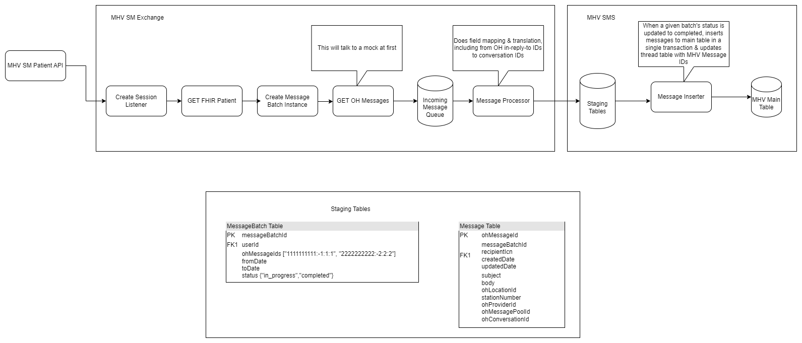
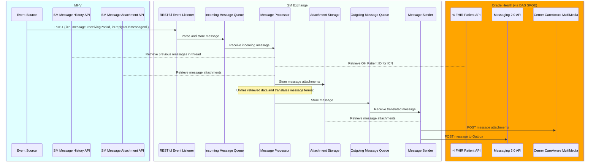

# [WIP] SM Exchange

## Assumptions (Need to be validated and Open to challenged)

- ✅ MHV is the source of truth for all Messaging data
- ✅ We need to map OH data into our own model to support capabilities that are not supported by OH
- ✅ Between the FHIR APIs and OH SM APIs we have all the data we need
- ✅ The existing MHV SM API (the one used by va.gov today) can be reused for the SM Exchange
  - Or at least that's the goal
- ✅ OH is sending data to an URL via a webhook in an Atom feed format
- The only reason we are sending data back to OH is so that the message shows up in the OH clinician UI
- ✅ The correct data is available through the process (example: we can get the facility information at the correct time)
- The SM Exchange and MHV and OH communicate using RESTful APIs

## Technical Measures of Success

- The SM Exchange is an isolated system between MHV and OH
- The Messaging backend (MHV) is fully abstracted away from the SM Exchange
- The SM Exchange does not have any knowledge or dependency on MHV database structure or the OH database structure
- The architecture is scalable, monitorable and resilent 

## Work in Progress 

- OCTO, BCG, BL working to define architecture and requirements
- BCG working on reference docs + prototypes
- BL working through  the bones of the SM Exchange

## MVP Target

- Load patient historical data on first time log in. 

## Unknowns to work through

### First time

How are we triggering the first time? 

### What API are using? 

There is a timeline vs API problem. What API are using during the roll out of the SM? 

Current plan
- Using Messaging 2.0 for the Pilot
- Moving to New Public API when its ready and for the actual roll out 

###  Auth between MHV and SM Exchange

- With the MHV APIs and SM Exchange being different systems, how are we going to perform authentication? 
- Does the Existing MHV API support system to system authentication?

### OH ATOM Feed

- Whats the first step in getting a webhook added? 
- How does the OH Atom feed handle a failed push?
  - We found a thing called `msvc_retry_message_publication`, how we can configure this?
- With messages getting retried, we need to figure out how to handle a duplicate message being sent
  - This should be an extreme use case, and doesn't need to be solved this iteration
  - Does the existing MVH API (the one used by va.gov) do any duplicate message handling? Should it?
  - Ideas include:
    - query the MHV API with OH MessageId
    - The MHV API does some locking/checking before inserting into the MHV datastore

### Threads Creation

- How can get the conversation Id? 
- For a new message when does the thread Id get created?
  - How can get a Thread Id? 
    - MVH API? 
      - API endpoint that accepts a OH Message Id and returns a MHV Core Thread id
    - Asking for it <- preferred ->
    - Sending it in without a thread Id and Core MHV handles that

## High Level diagram

.png)

## MVP Diagram

### Goals

- Provide infrastructure for the pipeline between OH and MHV
- Send a message to OH (or a cURL)
- Send a message from OH to MHV 

## More detailed diagrams

### Detailed Exchange Diagram 

### New Message Received

### Create Session

### Most Detail Diagram

- Still to coming with reference implementation 

### Notes

- All communication between the SM Exchange and MVH are RESTful API Calls
- All communication between the SM Exchange and OH are RESTful API Calls
- Using a Queue to handle the parsing and translation of messages
  - Since this will be a longer running task, a queue provides a resilient way to handle messages
  - Keeps the action of recieving a message light and fast
- * for the connection between the SM exchange and MHV, there might be a need a queue to retry failures
- Services that need to be mocked 
  - OH FHIR APIs
  - OH Messaging 2.0 API
  - OH Atom Feed
  - OH Public Messaging API (The New API)

## Sequence

### Create Session 

### MHV to OH 

### OH to MHV 

## APIs needed

### MHV

- [MHV Secure Messaging ICD 2.0.0](https://github.com/department-of-veterans-affairs/va.gov-team-sensitive/blob/master/teams/sm/ICDs/SM-API%20Interface%20Control%20Document%202.0.0%20Veteran.doc.docx)

### Cerner

- OH Messaging API 2.0 docs: https://wiki.cerner.com/pages/releaseview.action?pageId=1962423118
- Understanding Messaging API Considerations doc: https://wiki.cerner.com/display/public/reference/Understand+Messaging+REST+2.0+Considerations+for+Consumers
- Info on translating from VA.gov user `CRNR200` id to OH FHIR Patient Identifier: https://dsva.slack.com/archives/CMT4MFPS6/p1701186719575159?thread_ts=1701184169.148299&cid=CMT4MFPS6

###  FHIR APIs

- Patient API 
- Encounter API
- Location API 
