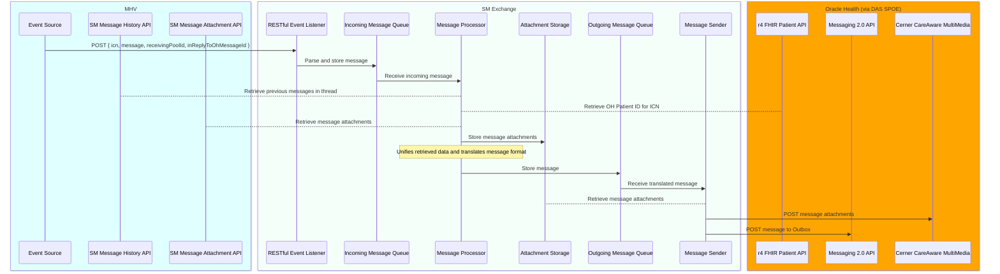

# Architecture Analysis and Decisions

## North Stars

- Create a system focused on resiliency, performance, and monitorability 
- Deliver a seamless experience no matter what underlying system the Veteran is using
- Unified Experience is a must; the Veteran **must** not know about what EHR they are using

## Current Approach

Check out [the README](../README.md)

.png)

### TL;DR; Summary of Design

- MHV first approach
- MHV knows a bunch about OH
  - such as Storing data and adding columns that are *just* for OH
- Two sources of truth

### Risks

- Two sources of truth
- Maintaining system data and feature parity will be a big challenge. 
- OH has limited feature sets
- Big Data synchronization is going to be a Problem
  - The ATOM *only* does new message, not deleted or any other status updates (such as if the message is read or deleted)
- MHV is embodying quite a bit of knowledge of OH and becoming tightly coupled
- MHV has two decades of technical debt
  - including performance issues, downtown, sub-par monitoring, and slow release and planning cycles

### Gains

- Allows the reuse of the functionality and data structures of MHV
- Provide a single inbox for the Veteran
- Leans on existing resources to help aid in development
- Allows for solving the integration problems first while being able to deliver *something*.
- Leadership has bought in

## The Big Idea

### What

- Create a VA SM Messaging Service that acts as the source of truth for all things Message Data 
- The VAMS becomes the SoT for all things. Messages meta-data (such as status, folders, tags, threading) are stored here, and we provide interfaces that client systems (such as OH and MHV) can send messages

### TL;DR; Summary of Design

### Why

After implementing a prototype in PI13, we uncover many risks and warning flags.

Ideally, MHV knows nothing about OH, but as we dig into the problem, we are slowly becoming more tightly coupled with OH. 

**Why this is bad:** It will be hard to maintain When looking at this on a `years` level. In the presumed future state of **OH being the only EHR for VA**, the SM API will end up having unused functionality and code that has to be either maintained or pulled out. While it isn't a tricky thing to do, having built-in functionality runs the risk of railroading the design to align more with a system that is going away instead of letting the new problems and system drive the design

### Risks

- Building something greenfield is a Big Non-trivial risk
   - Are we *just* rebuilding MHV without the current MHV baggage? 
- The political/contracting landscape might make this a hard-sell
- Again, a new thing === significant risk, big enough to call out twice. 
- Not enough resources to drive this approach until contracts cycle in/out, or we can hire a team internally

### Gains

- OCTO has more control over the architecture and UX
- The current MHV does not bind us for messaging features and iterations
- This is modeled after email clients, a proven multiple-system messaging model

### To say it out loud

There is a world in which the existing MHV SM API iterates into this new idea, and that might be the long-term play :shruggie:
