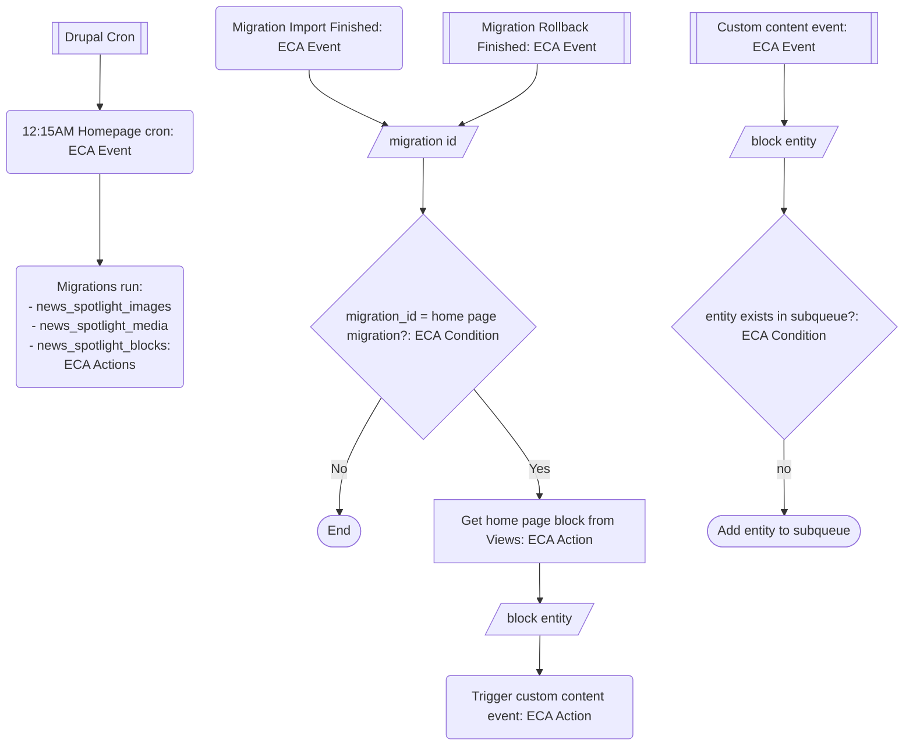

## Homepage news spotlight block automation

## TDLR
[VACMS-20923: Homepage news spotlight block automation](https://github.com/department-of-veterans-affairs/va.gov-cms/pull/20976), related to [#20923](https://github.com/department-of-veterans-affairs/va.gov-cms/issues/20923) completes end-to-end automation for homepage news spotlights. It adds a new ECA workflow that automates placing News Spotlight blocks into the home page entityqueue/subqueue, which the FE already pulls from to create the news block on the homepage. No further actions are necessary to automate the process. 

## Business Case
The Home Page News Promo spot was designed to provide the most relevant and helpful news in a prominent location on the VA.gov homepage. In reality, the news promo spot was often stagnant and led to lower engagement with Veterans, their caregivers, family members or survivors. To make it easier to feature relevant "homepage-worthy" content, we implemented an ECA flow so that it will automatically display current news from VA News (https://news.va.gov//wp-json/wp/v2/posts?categories=18505). 

## ECA Workflows

There are 4 "buckets" of workflows that run independently from each other, but work together to form the complete homepage news promo automation.

### Run Migrations
1. Drupal cron runs every ~15 minutes triggered by Jenkins
2. ECA Event: ECA cron event. At 12:15AM this event will trigger actions below (running the migrations)
   1. ECA Action: Execute migration import of news_spotlight_images
   2. ECA Action: Execute migration import of news_spotlight_media
   3. ECA Action: Execute migration import of news_spotlight_blocks. This ends this phase of the workflow.

#### Gather News Block
3. ECA Event: Migration import finished. Listens for migrations that have completed import.
   1. ECA Condition: Compare two scalar values. Uses the 'migration_id' token from the previous event and compares it to the text `news_spotlight_block` and returns true if they match.
   2. ECA Action: Views: Home page news spotlight block. This queries a new View that returns the most recently created block and creates a 'results' token which will be an array containing a single block entity.
   3. ECA Action: Trigger Custom Event: News Spotlight Block. This is a custom ECA event trigger that is 'entity aware'. It passes the block entity from Views to a Custom ECA Event which is also 'entity aware'.

#### Add Block to Subueue
4. ECA Event: Content Aware Event: News Spotlight Block. This is the event that step 3.iii triggered. The block entity is available as the 'entity' token.
   1. ECA Condition: Entity is in Subqueue. This condition checks to see if the current block from the 'entity' token is already in the entityqueue. If so, the next action is not taken.
   2. ECA Action: Add Item to a Subqueue. This action takes the block from the 'entity' token and places it in the `home_page_news_spotlight` entityqueue. This is the final action for automating homepage news spotlights.

#### Rollback Safeguard
**Without this workflow, a migration rollback would empty the entityqueue, since the entity in the subqueue would most likely be from a the migration, and that entity would be deleted as part of a rollback.**

5. ECA Event: Migration rollback finished. This listens for migrations that have completed rollback. 
   1. ECA Condition: Compare two scalar values. Uses the same condition from 3.i to only trigger following activities if the `news_spotlight_block` migration has completed a rollback.
   2. ECA Action: Views: Home page news spotlight block. Runs the same Views query from 3.ii.
   3. ECA Action: Trigger Custom Event: News Spotlight Block. This is the same event as 3.iii. This would then cause 4.i to fire, which would update the entityqueue with the most recently created block that remains, which should be the current news story created by an editor.

## ECA Workflow Diagram:

## Additional Info
The ECA module needed a [patch](https://www.drupal.org/project/eca/issues/3515195) in order to pickup the migration_id as a token so that we could take actions if only the `news_spotlight_block` migration had fired. This has been merged into the 2.x dev branch, and will get added to the next ECA release. We should update ECA at that point and remove the patch.
