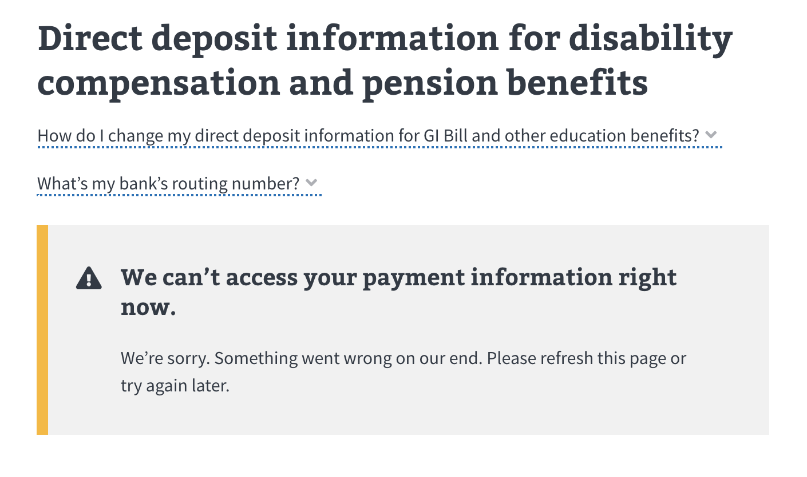
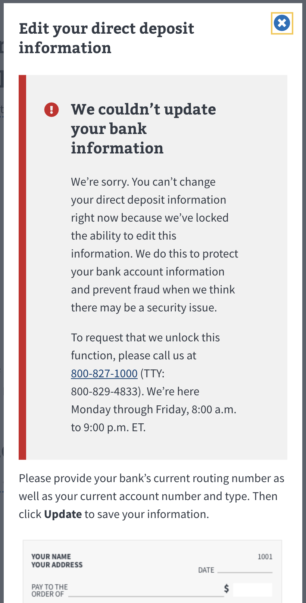
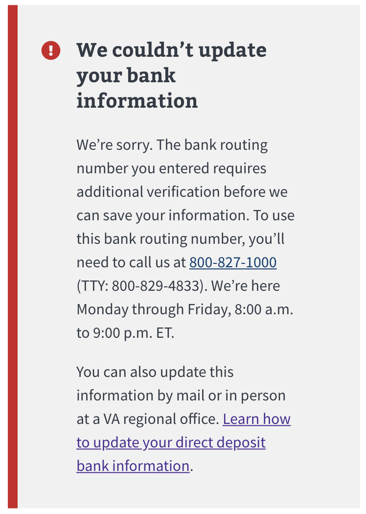
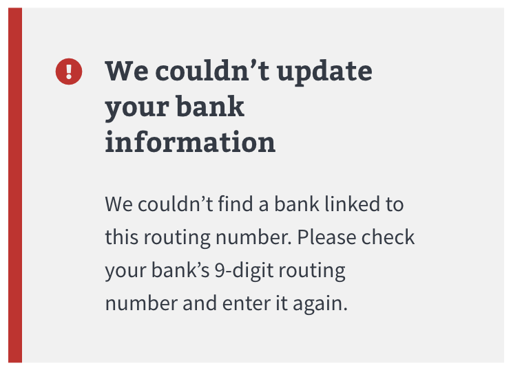
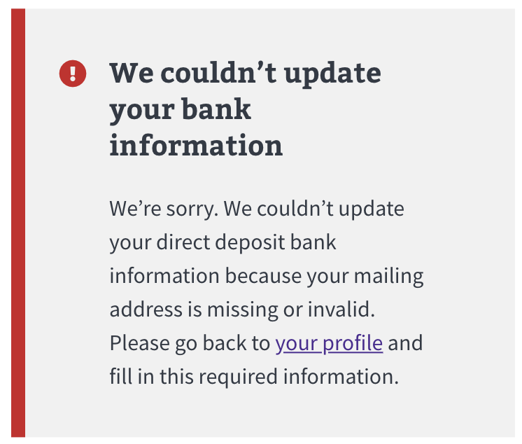
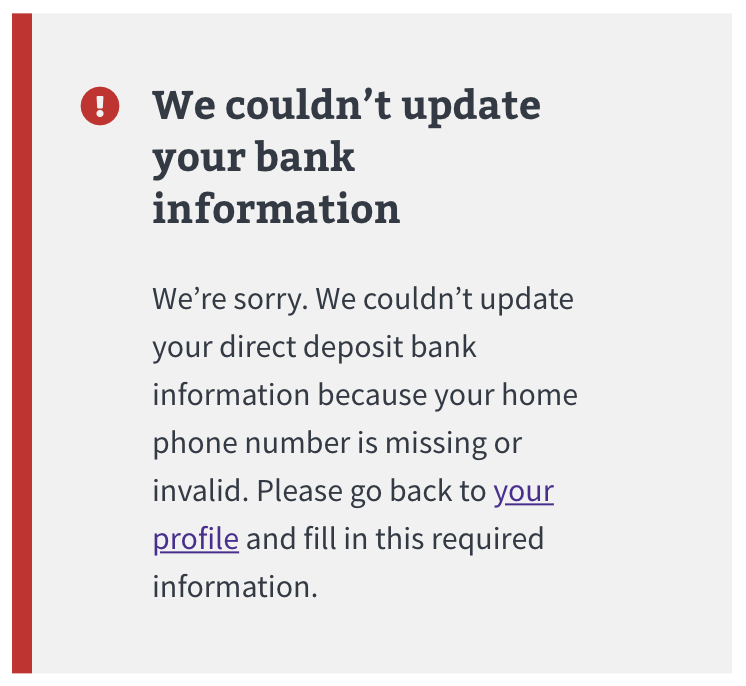
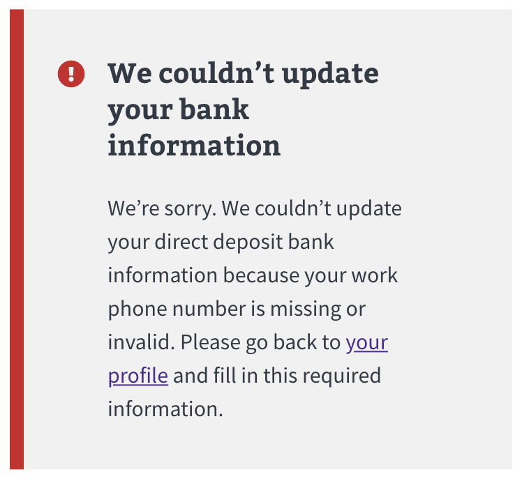
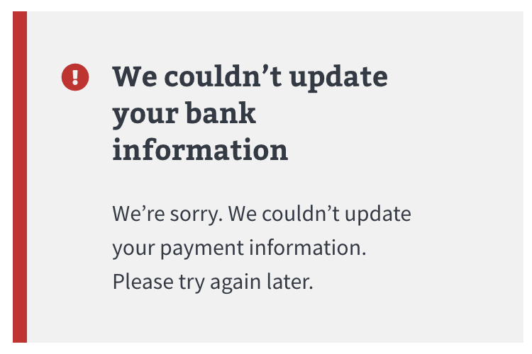

# Direct Deposit Error Handling

## Showing direct deposit bank info

**Endpoint:** `GET ppiu/payment_information`

For any errors we get when trying to get the user's current direct deposit info, we show the following error message:

## Updating direct deposit bank info

**Endpoint:** `PUT ppiu/payment_information`

We also show error messages if errors come back from this endpoint. Depending on the error `key`s, and in some cases the `text`s, we get back, we might show special error messages.

### Flagged Account Error
If we get a `key` value of either `'cnp.payment.flashes.on.record.message'` or `'payment.restriction.indicators.present'` we show the following error:

### Flagged Routing Number Error
If we get a `key` value of `'payment.restriction.indicators.present'`we show the following error:

### Invalid Routing Number Error
If we get a `key` value of `'payment.accountRoutingNumber.invalidCheckSum'` or a `key` value of `'cnp.payment.generic.error.message'` _and_ a `text` value that contains `'Invalid Routing Number'` we show the following error:

### Invalid Address Error
If we get a `key` value of `'cnp.payment.generic.error.message'` _and_ a `text` value that contains `'address update'` we show the following error:

### Invalid Home Phone Number Error
If we get a `key` value of `'cnp.payment.generic.error.message'` _and_ a `text` value that contains `'night phone number'` or `'night area number'` we show the following error:

### Invalid Work Phone Number Error
If we get a `key` value of `'cnp.payment.generic.error.message'` _and_ a `text` value that contains `'day phone number'` or `'day area number'` we show the following error:

### Generic Error
If we get a response error that doesn't meet any of the above requirements we show the following error:

