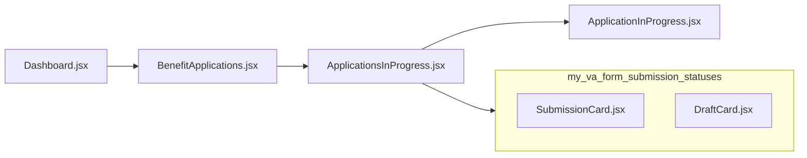
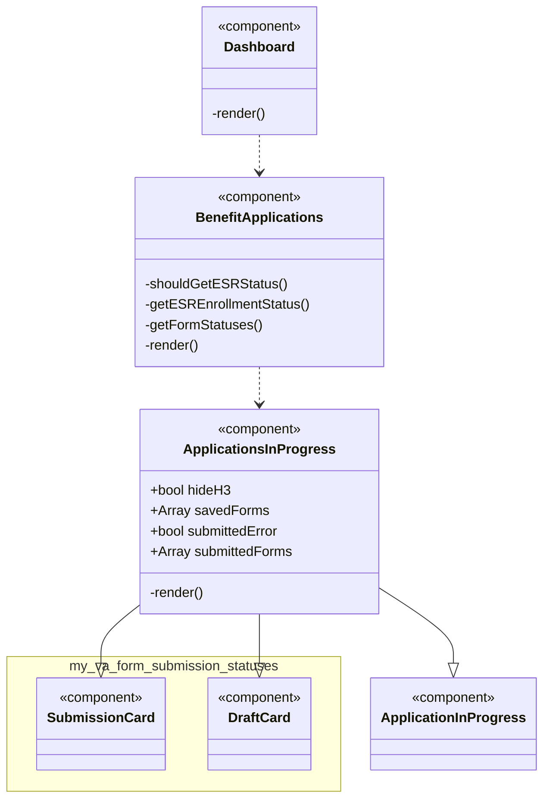

# Benefit applications and forms

**Last updated:** October 11, 2024

## Sequence

```mermaid
  flowchart LR
      A[Dashboard.jsx] --> B[BenefitApplications.jsx]
      B --> C[ApplicationsInProgress.jsx]
      C --> D[ApplicationInProgress.jsx]
      subgraph my_va_form_submission_statuses
      E[SubmissionCard.jsx]
      F[DraftCard.jsx]
      end
      C --> my_va_form_submission_statuses
```

## Class diagram

```mermaid
    classDiagram
      Dashboard ..> BenefitApplications
      <<component>> Dashboard
      Dashboard : -render()

      BenefitApplications ..> ApplicationsInProgress
      <<component>> BenefitApplications
      class BenefitApplications {
        -shouldGetESRStatus()
        -getESREnrollmentStatus()
        -getFormStatuses()
        -render()
      }
      
      <<component>> ApplicationsInProgress
      class ApplicationsInProgress {
        +bool hideH3
        +Array savedForms
        +bool submittedError
        +Array submittedForms
        -render()
      }

      ApplicationsInProgress --|> ApplicationInProgress
      <<component>> ApplicationInProgress

      ApplicationsInProgress --|> SubmissionCard
      <<component>> SubmissionCard

      ApplicationsInProgress --|> DraftCard 
      <<component>> DraftCard
      
      namespace my_va_form_submission_statuses { 
        class SubmissionCard
        class DraftCard
      }
```
