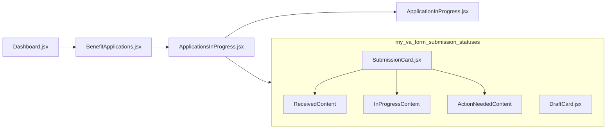
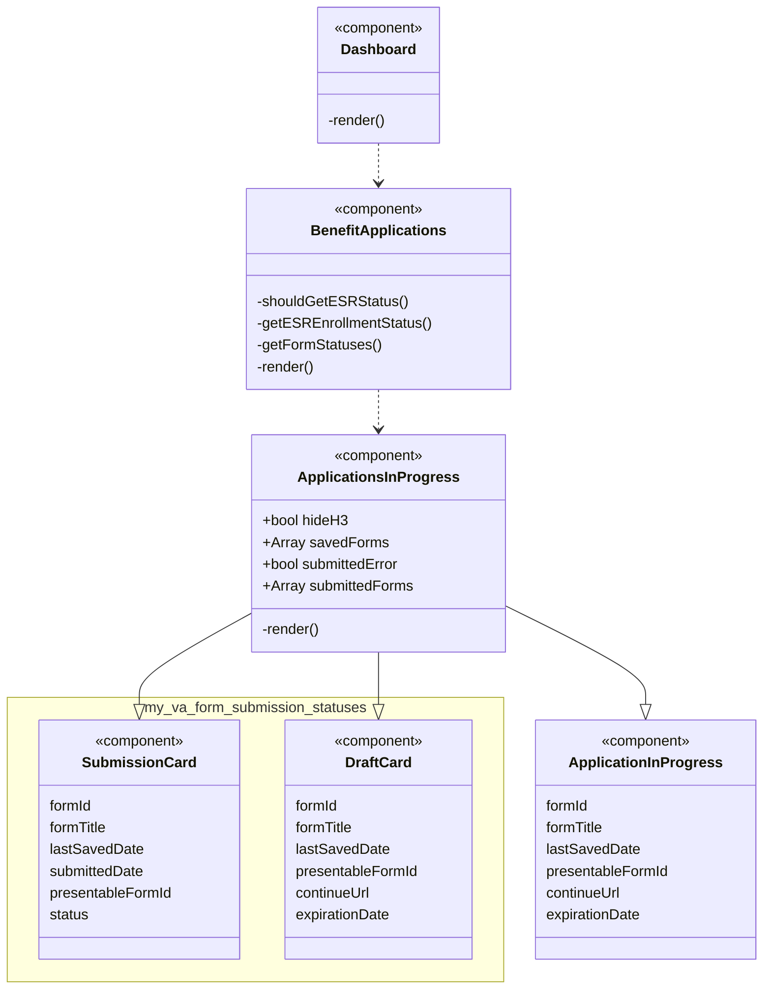

# Benefit applications and forms

**Last updated:** October 18, 2024

## Overview

The **Benefit applications and forms** section (formerly known as Saved applications) appears on My VA where user can:

- check which **draft** forms they have started and not completed
  - continue their application
- check **submitted** forms 
  - see status of their submitted application
  - see call center phone number

The FE entry point lives at
- [BenefitApplications.jsx](https://github.com/department-of-veterans-affairs/vets-website/blob/main/src/applications/personalization/dashboard/components/benefit-application-drafts/BenefitApplications.jsx)

## Data fetching 

| Form type | Endpoint | Data fetched | Swagger link |
| -- | -- | -- | -- |
| Draft | `/v0/user` | `data.attributes.in_progress_forms` | [Link](https://department-of-veterans-affairs.github.io/va-digital-services-platform-docs/api-reference/#/user/getUser) |
| Submitted | `/v0/my_va/submission_statuses` | `data.type`, `data.attributes.id`, `data.attributes.status`, `data.attributes.form_type`, `data.attributes.created_at`, `data.attributes.updated_at` | [Link](https://department-of-veterans-affairs.github.io/va-digital-services-platform-docs/api-reference/#/my_va/getSubmissionStatuses) | 


## Redux store

**user.profile.savedForms**

- array of Draft forms 
- each item in the `savedForms` array has the shape:

```
{
  form
  lastUpdated
  metadata: {
    version
    returnUrl
    savedAt
    createdAt
    expiresAt
    lastUpdated
    inProgressFormId
  }
}
```

**submittedForms**

- contains array of submitted forms, error array (for total failure case), errors array (for partial failure case)
- each item in the `forms` array has the shape:

```
{
  id
  type
  attributes: {
    id
    detail
    formType
    message
    status
    createdAt
    updatedAt
  }
}
```

## Errors 


## Analytics events

TK

---

## Diagrams

### Sequence diagram


### Class diagram


## Other docs
- [Project outline: Forms status MVP](https://github.com/department-of-veterans-affairs/va.gov-team/tree/master/products/identity-personalization/my-va/forms-status-on-My-VA)
- [Frontend documentation](https://github.com/department-of-veterans-affairs/va.gov-team/blob/master/products/identity-personalization/my-va/forms-status-on-My-VA/FE-documentation-MVP.md)
- [Backend documentation (sensitive repo)](https://github.com/department-of-veterans-affairs/va.gov-team-sensitive/blob/master/products/identity-personalization/my-va/form-status/backend_documentation.md)
