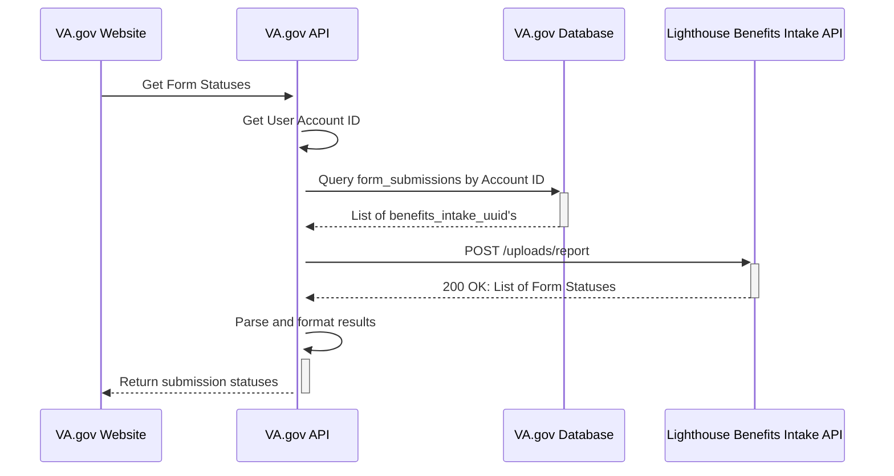
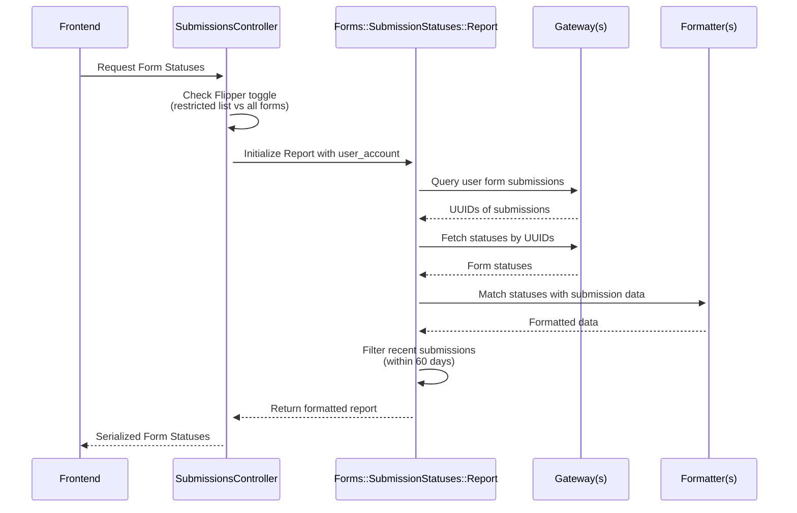

# Adding A non-Lighthouse Benefits Intake API Form [WIP]
## Introduction
Currently, we have two types of forms that are already able to show the Form Status:
- Online forms
- Uploadable forms

There are only four (4) statuses that a form should display:

1. DRAFT
2. SUBMISSION IN PROGRESS
3. RECEIVED
4. ACTION NEEDED

This guide will allow you to display statuses 2 - 4 because the DRAFT status is handled within the SiP implementation ([Save-in-Progress Platform guide](https://depo-platform-documentation.scrollhelp.site/developer-docs/va-forms-library-how-to-set-up-save-in-progress-si))

### Form Status Card
There are two options for how the status card will display the title/heading for the form.
These depend on whether the form is an uploadable form or if the form has the SiP feature.

| Uploadable Form | Form with SiP |
|-----------------|---------------|
|  |  |

Uploadable forms will use a fallback title for the status card which follows the general format: "VA Form XX-XXXX". 
Forms that have implemented the SiP feature will have a title/heading as defined in vets-website and a subheading "VA Form XX-XXXX" (details in [the "Instructions for teams" -> step 3](https://depo-platform-documentation.scrollhelp.site/developer-docs/va-forms-library-how-to-set-up-save-in-progress-si))

To familiarize yourself with the high level flow that currently exists to show the status for LH Benefits Intake API forms, please see this diagram ([original source](https://github.com/department-of-veterans-affairs/va.gov-team-sensitive/blob/7693b23eafaabac7c52a288ce89ae04d45972170/products/identity-personalization/my-va/form-status/backend_documentation.md#form-status-workflow)):

### Form Status Workflow (High Level)


### Form Status Workflow (`vets-api`)

Now let's zoom in strictly to the vets-api (VA.gov API) portion:



## Existing Pattern: Lighthouse Benefits Inatake API Forms
#### Feature Toggle: `my_va_display_all_lighthouse_benefits_intake_forms`
#### List of Known Forms

| Form Name                                        | Form ID            | Included in MVP| Included with Feature Toggle | Included in FE's VA_FORM_IDS |
|:-------------------------------------------------|:-------------------|:---------------|:-----------------------------|:-----------------------------|
| Request personal records                         | 20-10206           |✅              |                              | ✅ |
| Priority Processing                              | 20-10207           |✅              |                              | ✅ |
| Authorization to Release third party information | 21-0845            |✅              |                              | ✅ |
| Alternate Signer                                 | 21-0972            |✅              |                              | ✅ |
| Lay/witness Statement                            | 21-10210           |✅              |                              | ✅ |
| Request Private Medical Facilities               | 21-4142 & 21-4142a |✅              |                              | ✅ ❌|
| Request to be a substitute claimant              | 21P-0847           |✅              |                              | ✅ |
| Intent to File                                   | 21-0966            |❌              | ❌                           | ✅ |
| Application for Veterans Pension                 | 21P-527EZ          |❌              | ✅                           | ✅ |
| Presidential Memorial Certificate Request Form   | 40-0247            |❌              | ✅                           | ✅ |
| Report of Income from Property or Business       | 21P-4185-UPLOAD    |❌              | ✅                           | ✅ |
| Certification of School Attendance or Termination| 21-8960-UPLOAD     |❌              | ✅                           | ✅ |
| Court Appointed Fiduciary's Account              | 21P-4706c-UPLOAD   |❌              | ✅                           | ✅ |
| Employment Questionnaire                         | 21-4140-UPLOAD     |❌              | ✅                           | ✅ |
| School Attendance Report                         | 21-674b-UPLOAD     |❌              | ✅                           | ✅ |
| Statement of Dependency of Parent(s)             | 21-509-UPLOAD      |❌              | ✅                           | ✅ |
| Request for Details of Expenses                  | 21P-8049-UPLOAD    |❌              | ✅                           | ✅ |
| Information Regarding Apportionment of Beneficiary's Award | 21-0788-UPLOAD |❌        | ✅                           | ✅ |
| Improved Pension Eligibility Verification Report (Child or Children) | 21P-0519C-1-UPLOAD  | ❌ |  ✅                 | ✅ |
| Veteran's Application for Increased Compensation Based on Unemployability | 21-8940-UPLOAD | ❌ |  ✅                 | ✅ |
| State Application for Interment Allowance (Under 38 U.S.C. Chapter 23) | 21P-530a-UPLOAD   | ❌ |  ✅                 | ✅ |
| Improved Pension Eligibility Verification Report (Veteran with Children) | 21P-0517-1-UPLOAD | ❌    | ✅             | ✅ |
| Certificate of Balance on Deposit and Authorization to Disclose Financial Records | 21P-4718a |❌    | ✅             | ✅ |
| Improved Pension Eligibility Verification Report (Veteran with No Children) | 21P-0516-1-UPLOAD | ❌        | ✅      | ✅ |
| Application for Benefits for a Qualifying Veteran's Child Born with Disabilities | 21-0304-UPLOAD | ❌      | ✅      | ✅ |
| Examination for Housebound Status or Permanent Need for Regular Aid and Attendance | 21-2680-UPLOAD |❌     | ✅      | ✅ |
| Request for Employment Information in Connection with Claim for Disability Benefits | 21-4192-UPLOAD | ❌   | ✅      | ✅ |
| Request for Nursing Home Information in Connection with Claim for Aid and Attendance | 21-0779-UPLOAD | ❌  | ✅      | ✅ |
| Improved Pension Eligibility Verification Report (Surviving Spouse with Children) | 21P-0519S-1-UPLOAD | ❌ | ✅      | ✅ |
| Application for Pre-Need Determination of Eligibility for Burial in a VA National Cemetery | VA40-10007 | ❌| ✅      | ✅ |
| Notice of Waiver of VA Compensation or Pension to Receive Military Pay and Allowances | 21-8951-2-UPLOAD |❌| ✅      | ✅ |
| Improved Pension Eligibility Verification Report (Surviving Spouse with No Children) |  21P-0518-1-UPLOAD | ❌ | ✅   | ✅ |
| Election of Compensation in Lieu of Retired Pay<br/> or Waiver of Retired Pay to Secure Compensation<br/>from Department of Veterans Affairs (38 U.S.C. 5304(a)-5305) | 21-651-UPLOAD |❌| ✅ | ✅ |
| Notice to Department of Veterans Affairs of Veteran or Beneficiary Incarcerated in Penal Institution | 21-4193-UPLOAD |❌ | ✅ | ✅ |
| Statement in Support of Claimed Mental Health Disorder(s) Due to an In-Service Traumatic Event(s) | 21-0781 | ❌ | ❌ | ❌ |
| Application for Burial Benefits                  | 21P-530EZ          |❌              | ⚠️                           | ✅ |
| Personalized Career Planning and Guidance/Chapter 36 | 27-8832        |❌              | ⚠️                           | ✅ |

⚠️ These forms need further investigation on why they're not showing a status card upon successful submission (https://github.com/department-of-veterans-affairs/va.gov-team/issues/117244)

## Begin Implementation for non-Benefits Intake API forms

Your team will have to make a a few decisions by answering these question:
- Do we want to show the status for all forms within this new Forms API?
- Do we want to use the restricted list already present to only show specific form IDs?
- Will we use a Flipper toggle?
- Are we the first form for the Form API in question?
  - Is there an existing Gateway and Formatter for the Form API that can return the status for my form?
  - example: `BenefitsIntakeGateway` and `BenefitsIntakeFormatter`
- Does your Form API use form statuses that do not match the statuses above?
  - If your form has different form statuses you will need to match/map them to the ones listed in the link above
  - The status mapping is handled in vets-website `src/applications/personalization/dashboard/helpers.jsx` under `SUBMISSION_STATUS_MAP`  

From this point, you will fall in one of the following categories:
- You are the first form team wanting to display the status for your particular Form API
  - example: Form 21-0781 is submitted to the Lighthouse Documents Intake API
- You are not the first form team wanting to display the status for your particular Form API
  - This will be determined by a previous decision of only showing the status for the form in question vs for all forms withing the Form API  

### Using `restricted_list_of_forms`

If you are not the first form team for your Form API and you do not see a form status for your form upon successful submission, it is likely that whoever was first decided to use the restricted list of forms approach.
The good news is that the Gateway and Formatter are likely already created for you - but confirm both exist.
You can continue with the same approach, or discuss with your team if it makes sense to not restrict the list (example: Lighthouse Benefits Intake API forms when the feature toggle is enabled).


ℹ️ In our `app/controllers/v0/my_va/submission_statuses_controller.rb` we have a list of Allowed Forms.
```
      def restricted_list_of_forms
        %w[
          20-10206
          20-10207
          21-0845
          21-0972
          21-10210
          21-4142
          21-4142a
          21P-0847
        ] + uploadable_forms
      end
```

1️⃣ Add the new form ID (ex: Statement in Support of Claim 21-4138) to the list of form IDs seen above or make sure it's already part of the `uploadable_forms` list

2️⃣ Update or add any necessary tests in the respective Formatter/Gateway spec 

3️⃣ Test locally to confirm that your form shows a form status card

### Brand new Form API connection

If there is no existing Gateway and Formatter for your Form API, congratulations! You get to be the first 🎉

ℹ️ Please refer to the diagram focused on the vets-api flow for a refresher on the flow/pattern you will be adding to.

1️⃣ Create a Gateway to connect with your Form API and fetch the status(es)

2️⃣ You will add that Gateway to the gateways list in `lib/forms/submission_statuses/report.rb` 
```
      def initialize(user_account:, allowed_forms:)
        @gateways = [
          { service: 'lighthouse_benefits_intake',
            gateway: BenefitsIntakeGateway.new(user_account:, allowed_forms:) }
            # determine a service name - this will make sure the correct formatter is used for your data
            # add the gateway here
        ]
      end
```

3️⃣ Create a Formatter for your data.
- Example data that comes into the `BenefitsIntakeFormatter`
  ```
    # Submissions data that comes form the FormSubmission query
    submissions = [
      {
        benefits_intake_uuid: "123",
        form_type: "526EZ",
        created_at: "2023-01-01"
      }
    ]
    
    # Intake statuses data that comes from the BenefitsIntakeGateway
    statuses = [
      {
        "attributes" => {
          "guid" => "123",
          "detail" => "Processing",
          "message" => "Form received",
          "status" => "pending",
          "updated_at" => "2023-01-02"
        }
      }
    ]
  ``` 
- This formatter must output your data in the following structure:
  ```
  [
    OpenStruct.new(
      id: "123", # this should be the ID in the Form API
      form_type: "526EZ",
      created_at: "2023-01-01",
      updated_at: "2023-01-02",
      detail: "Processing",
      message: "Form received",
      status: "pending",
      pdf_support: true # determined by PdfUrls class
    )
  ]
  ```
  
4️⃣ Add your formatter to the formatter list in `lib/forms/submission_statuses/report.rb` 
```
      FORMATTERS = {
        # use the service name you determined in the gateway list
        'lighthouse_benefits_intake' => Formatters::BenefitsIntakeFormatter.new
      }.freeze
```

5️⃣ Update or add any necessary tests in the respective Formatter/Gateway spec 

3️⃣ Test locally to confirm that your form shows a form status card


----------------------------------------


**Other References:**
- [Project outline: Forms Status on My VA MVP](https://github.com/department-of-veterans-affairs/va.gov-team/tree/master/products/identity-personalization/my-va/forms-status-on-My-VA)
  - This document will provide context for the MVP of Form Status 
- [Form Submission Status: Backend Documentation](https://github.com/department-of-veterans-affairs/va.gov-team-sensitive/blob/7693b23eafaabac7c52a288ce89ae04d45972170/products/identity-personalization/my-va/form-status/backend_documentation.md)
  - This document hold the final and current backend implementation of the Form Status
  - You can reference this document if you want more insight into how we work with the Lighthouse Benefits Intake API to retrieve the status of submitted forms
- [VA Forms Library - How to set up Save In Progress (SiP)](https://depo-platform-documentation.scrollhelp.site/developer-docs/va-forms-library-how-to-set-up-save-in-progress-si#VAFormsLibrary-HowtosetupSaveInProgress(SiP)-MyVAPage) 
