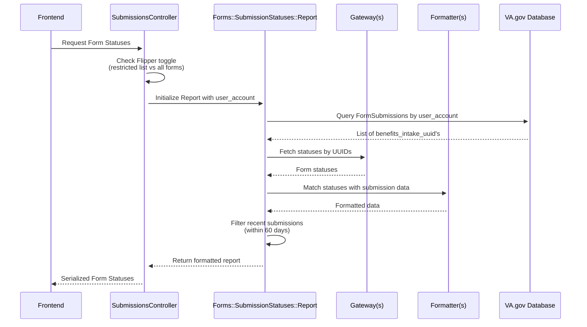

# Display Form Status for a non-Lighthouse Benefits Intake API Form
## Table of Contents
1. [Introduction](#introduction)
2. [Form Status Card](#form-status-card)
3. [Form Status Workflow](#form-status-workflow)
    - [High-Level Workflow](#high-level-workflow)
    - [`vets-api` Workflow](#vets-api-workflow)
4. [Existing Pattern: Lighthouse Benefits Intake API Forms](#existing-pattern-lighthouse-benefits-intake-api-forms)
    - [Feature Toggle](#feature-toggle)
    - [List of Known Forms](#list-of-known-forms)
5. [Begin Implementation for Non-Benefits Intake API Forms](#begin-implementation-for-non-benefits-intake-api-forms)
    - [Initial Decisions](#initial-decisions)
    - [Using `restricted_list_of_forms`](#using-restricted_list_of_forms)
    - [Continue with the restricted approach](#continue-with-the-restricted-approach)    
    - [Brand New Form API Connection](#brand-new-form-api-connection)
    - [Restricted vs Unrestricted](#restricted-vs-unrestricted)
    - [Unrestricted Implementation](#unrestricted-implementation)
6. [Team Implementations Tracker](#team-implementations-tracker)
7. [Other References](#other-references)


## Introduction
Currently, we have two types of forms that are already able to show the Form Status:
- Online forms
- Uploadable forms

Forms can display **four statuses**:

1. **DRAFT**  
2. **SUBMISSION IN PROGRESS**  
3. **RECEIVED**  
4. **ACTION NEEDED**

> This guide covers statuses **2–4**, as **DRAFT** is handled by the Save-in-Progress (SiP) implementation.  
> For more details, see the [SiP guide](https://depo-platform-documentation.scrollhelp.site/developer-docs/va-forms-library-how-to-set-up-save-in-progress-si).


### Form Status Card
There are two title/heading display options for the status card, depending on whether the form is uploadable or has the SiP feature:

| Uploadable Form | Form with SiP |
|-----------------|---------------|
|  |  |

- **Uploadable forms** use a fallback title: `"VA Form XX-XXXX"`  
- **SiP forms** use the title defined in `vets-website` with a subheading: `"VA Form XX-XXXX"` (for details see [Instructions for teams, step 3](https://depo-platform-documentation.scrollhelp.site/developer-docs/va-forms-library-how-to-set-up-save-in-progress-si))  


## Form Status Workflow

### High-Level Workflow

> Refer to the [original diagram](https://github.com/department-of-veterans-affairs/va.gov-team-sensitive/blob/7693b23eafaabac7c52a288ce89ae04d45972170/products/identity-personalization/my-va/form-status/backend_documentation.md#form-status-workflow) for a visual overview.


### `vets-api` Workflow

> Use this workflow when implementing API-level status retrieval.



----------------------------------------

## Existing Pattern: Lighthouse Benefits Intake API Forms

### Feature Toggle

`my_va_display_all_lighthouse_benefits_intake_forms`

### List of Known Forms

| Form Name                                        | Form ID            | Included in MVP| Included with Feature Toggle | Included in FE's VA_FORM_IDS |
|:-------------------------------------------------|:-------------------|:---------------|:-----------------------------|:-----------------------------|
| Request personal records                         | 20-10206           |✅              |                              | ✅ |
| Priority Processing                              | 20-10207           |✅              |                              | ✅ |
| Authorization to Release third party information | 21-0845            |✅              |                              | ✅ |
| Alternate Signer                                 | 21-0972            |✅              |                              | ✅ |
| Lay/witness Statement                            | 21-10210           |✅              |                              | ✅ |
| Request Private Medical Facilities               | 21-4142 & 21-4142a |✅              |                              | ✅ ❌|
| Request to be a substitute claimant              | 21P-0847           |✅              |                              | ✅ |
| Intent to File                                   | 21-0966            |❌              | ❌                           | ✅ |
| Application for Veterans Pension                 | 21P-527EZ          |❌              | ✅                           | ✅ |
| Presidential Memorial Certificate Request Form   | 40-0247            |❌              | ✅                           | ✅ |
| Report of Income from Property or Business       | 21P-4185-UPLOAD    |❌              | ✅                           | ✅ |
| Certification of School Attendance or Termination| 21-8960-UPLOAD     |❌              | ✅                           | ✅ |
| Court Appointed Fiduciary's Account              | 21P-4706c-UPLOAD   |❌              | ✅                           | ✅ |
| Employment Questionnaire                         | 21-4140-UPLOAD     |❌              | ✅                           | ✅ |
| School Attendance Report                         | 21-674b-UPLOAD     |❌              | ✅                           | ✅ |
| Statement of Dependency of Parent(s)             | 21-509-UPLOAD      |❌              | ✅                           | ✅ |
| Request for Details of Expenses                  | 21P-8049-UPLOAD    |❌              | ✅                           | ✅ |
| Information Regarding Apportionment of Beneficiary's Award | 21-0788-UPLOAD |❌        | ✅                           | ✅ |
| Improved Pension Eligibility Verification Report (Child or Children) | 21P-0519C-1-UPLOAD  | ❌ |  ✅                 | ✅ |
| Veteran's Application for Increased Compensation Based on Unemployability | 21-8940-UPLOAD | ❌ |  ✅                 | ✅ |
| State Application for Interment Allowance (Under 38 U.S.C. Chapter 23) | 21P-530a-UPLOAD   | ❌ |  ✅                 | ✅ |
| Improved Pension Eligibility Verification Report (Veteran with Children) | 21P-0517-1-UPLOAD | ❌    | ✅             | ✅ |
| Certificate of Balance on Deposit and Authorization to Disclose Financial Records | 21P-4718a |❌    | ✅             | ✅ |
| Improved Pension Eligibility Verification Report (Veteran with No Children) | 21P-0516-1-UPLOAD | ❌        | ✅      | ✅ |
| Application for Benefits for a Qualifying Veteran's Child Born with Disabilities | 21-0304-UPLOAD | ❌      | ✅      | ✅ |
| Examination for Housebound Status or Permanent Need for Regular Aid and Attendance | 21-2680-UPLOAD |❌     | ✅      | ✅ |
| Request for Employment Information in Connection with Claim for Disability Benefits | 21-4192-UPLOAD | ❌   | ✅      | ✅ |
| Request for Nursing Home Information in Connection with Claim for Aid and Attendance | 21-0779-UPLOAD | ❌  | ✅      | ✅ |
| Improved Pension Eligibility Verification Report (Surviving Spouse with Children) | 21P-0519S-1-UPLOAD | ❌ | ✅      | ✅ |
| Application for Pre-Need Determination of Eligibility for Burial in a VA National Cemetery | VA40-10007 | ❌| ✅      | ✅ |
| Notice of Waiver of VA Compensation or Pension to Receive Military Pay and Allowances | 21-8951-2-UPLOAD |❌| ✅      | ✅ |
| Improved Pension Eligibility Verification Report (Surviving Spouse with No Children) |  21P-0518-1-UPLOAD | ❌ | ✅   | ✅ |
| Election of Compensation in Lieu of Retired Pay<br/> or Waiver of Retired Pay to Secure Compensation<br/>from Department of Veterans Affairs (38 U.S.C. 5304(a)-5305) | 21-651-UPLOAD |❌| ✅ | ✅ |
| Notice to Department of Veterans Affairs of Veteran or Beneficiary Incarcerated in Penal Institution | 21-4193-UPLOAD |❌ | ✅ | ✅ |
| Statement in Support of Claimed Mental Health Disorder(s) Due to an In-Service Traumatic Event(s) | 21-0781 | ❌ | ❌ | ❌ |
| Application for Burial Benefits                  | 21P-530EZ          |❌              | ⚠️                           | ✅ |
| Personalized Career Planning and Guidance/Chapter 36 | 27-8832        |❌              | ⚠️                           | ✅ |

> ⚠️ These forms need further investigation on why they're not showing a status card upon successful submission (https://github.com/department-of-veterans-affairs/va.gov-team/issues/117244)

## Begin Implementation for Non-Benefits Intake API Forms

### Initial Decisions

Before implementation, discuss and answer the following:

- Show status for **all forms** in the new Form API or a restricted list?  
- Use a **Flipper toggle**?  
- Are you the **first form** for this Form API?  
  - Existing Gateway & Formatter available?  
  - Example: `BenefitsIntakeGateway` + `BenefitsIntakeFormatter`  
- Do your form statuses **match the standard statuses**?  
  - Map any different statuses in `vets-website/src/applications/personalization/dashboard/helpers.jsx` under `SUBMISSION_STATUS_MAP`.

> Depending on your answers, you will fall into one of two categories:
> 1. **First form team for this API** (e.g., Form 21-0781 → Lighthouse Documents Intake API)  
> 2. **Not the first form team** (follow existing restrictions or patterns)  

---

### Using `restricted_list_of_forms`

To use this path, ensure the following exist:
  ```
       ✔️ Gateway matching your Form API
    
       ✔️ Formatter matching your Gateway
   ```

If your form status **does not appear** upon successful submission, the first team likely used the restricted approach.

You can continue with the same approach or discuss removing restrictions and allowing all forms for your Form API to show a status.

### Continue with the restricted approach

ℹ️ In our `app/controllers/v0/my_va/submission_statuses_controller.rb` we have a list of Allowed Forms.

```ruby
      def restricted_list_of_forms
        %w[
          20-10206
          20-10207
          21-0845
          21-0972
          21-10210
          21-4142
          21-4142a
          21P-0847
        ] + uploadable_forms
      end
```

Implementation Steps:

1.	Add your form ID (e.g., 21-4138) or ensure it’s in uploadable_forms.
2.	Update or add tests in the respective Formatter/Gateway spec.
3.	Test locally to confirm the form status card appears.

### Brand New Form API Connection

ℹ️ Please refer to the diagram focused on the [`vets-api` Workflow](#vets-api-workflow) for a refresher on the flow/pattern you will be adding to.

If no Gateway/Formatter exists for your Form API, congratulations! You get to be the first 🎉:

1.	Create a Gateway to fetch status from your Form API.
2.	Add the newly created Gateway to `lib/forms/submission_statuses/report.rb`:
   - determine a service name, this will make sure the correct formatter is used for your data

```ruby
  def initialize(user_account:, allowed_forms:)
    @gateways = [
      { service: 'lighthouse_benefits_intake',
        gateway: BenefitsIntakeGateway.new(user_account:, allowed_forms:) },
      { service: 'your_new_service_name',
        gateway: YourNewGateway.new() }
    ]
  end
```
        
3.	Create a Formatter for your API data

Example input in `BenefitsIntakeFormatter`:

  ```ruby
    # Submissions data froms from the FormSubmission query
    submissions = [
      {
        benefits_intake_uuid: "123",
        form_type: "526EZ",
        created_at: "2023-01-01"
      }
    ]
    
    # Intake statuses data that comes from the BenefitsIntakeGateway
    statuses = [
      {
        "attributes" => {
          "guid" => "123",
          "detail" => "Processing",
          "message" => "Form received",
          "status" => "pending",
          "updated_at" => "2023-01-02"
        }
      }
    ]
  ```

Output format must match the following example structure:

```ruby
    [
        OpenStruct.new(
          id: "123", # this should be the ID in the Form API
          form_type: "526EZ",
          created_at: "2023-01-01",
          updated_at: "2023-01-02",
          detail: "Processing",
          message: "Form received",
          status: "pending",
          pdf_support: true # determined by PdfUrls class
        )
    ]
```
  
4.	Add Formatter to `lib/forms/submission_statuses/report.rb`:
   - use the service name you determined in the gateway list
   
```ruby
      FORMATTERS = {
        'lighthouse_benefits_intake' => Formatters::BenefitsIntakeFormatter.new,
        'your_new_service_name' => Formatters::YourNewFormatter.new
      }.freeze
```

5. Update/add tests and test locally to confirm the status card displays correctly.
6. Test locally to confirm the form status card appears

### Restricted vs Unrestricted

You will still need to decide if you want to follow the [restricted (add to the list)](#using-restricted_list_of_forms) vs unrestricted (show all forms) approach.

#### Unrestricted Implementation

If you have made the connection to your Forms API and don't use the restricted path, then the default will be to show all status for the forms of your Form API.

This is possible by passing `nil` for `allowed_forms` in `app/controllers/v0/my_va/submission_statuses_controller.rb`:

```ruby
      def show
        report = Forms::SubmissionStatuses::Report.new(
          user_account: @current_user.user_account,
          allowed_forms: forms_based_on_feature_toggle
        )

        result = report.run

        render json: serializable_from(result).to_json, status: status_from(result)
      end

      def forms_based_on_feature_toggle
        return nil if display_all_forms?

        restricted_list_of_forms
      end
```

----------------------------------------

## Team Implementations Tracker

This table is a shared resource for tracking each team’s implementation path, the forms they’ve added, and any notes that may help us and future teams provide better support.
If you are unable to edit this document to add your team's decisions, please let us know.

 <details>
  <summary>Click to expand: Team Implementations Tracker</summary>

| Team Name | Form API | First Team for API? | Restricted or Unrestricted? | Form(s) Added | Epic/Ticket Link | Notes / Useful Info |
|-----------|----------|----------------------|-----------------------------|---------------|------------------|----------------------|
| Example Team A | Lighthouse Benefits Intake | Yes | Unrestricted | All | Epic-1234 | Used feature toggle `flipper_name` |
| Example Team B | Forms API XYZ | No | Restricted | 21-4138 | Ticket-5678 | Continuing restricted path |
| Example Team C | Forms API ABC | Yes | Restricted | 20-10206, 21-4142 | Epic-9876 | `#slack-team-channel` |

 </details>


----------------------------------------


## Other References:
- [Project outline: Forms Status on My VA MVP](https://github.com/department-of-veterans-affairs/va.gov-team/tree/master/products/identity-personalization/my-va/forms-status-on-My-VA)
  - This document will provide context for the MVP of Form Status 
- [Form Submission Status: Backend Documentation](https://github.com/department-of-veterans-affairs/va.gov-team-sensitive/blob/7693b23eafaabac7c52a288ce89ae04d45972170/products/identity-personalization/my-va/form-status/backend_documentation.md)
  - This document hold the final and current backend implementation of the Form Status
  - You can reference this document if you want more insight into how we work with the Lighthouse Benefits Intake API to retrieve the status of submitted forms
- [VA Forms Library - How to set up Save In Progress (SiP)](https://depo-platform-documentation.scrollhelp.site/developer-docs/va-forms-library-how-to-set-up-save-in-progress-si#VAFormsLibrary-HowtosetupSaveInProgress(SiP)-MyVAPage)
- [VA Design System Submission Status Pattern](https://design.va.gov/patterns/help-users-to/stay-informed-of-their-application-status#for-asynchronous-submissions)
