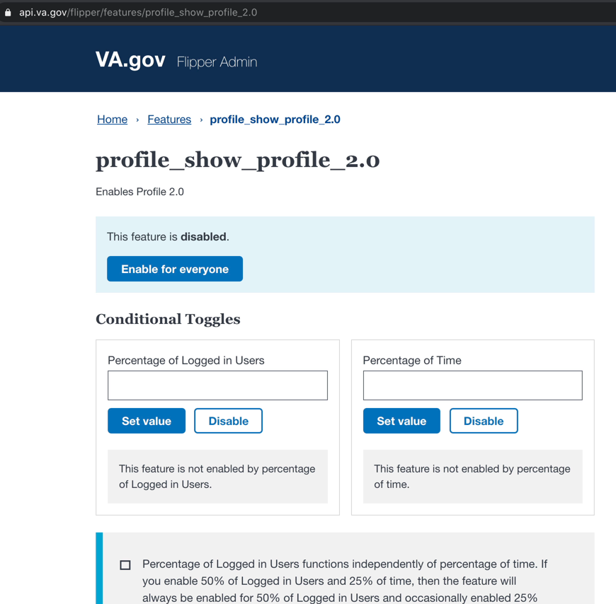
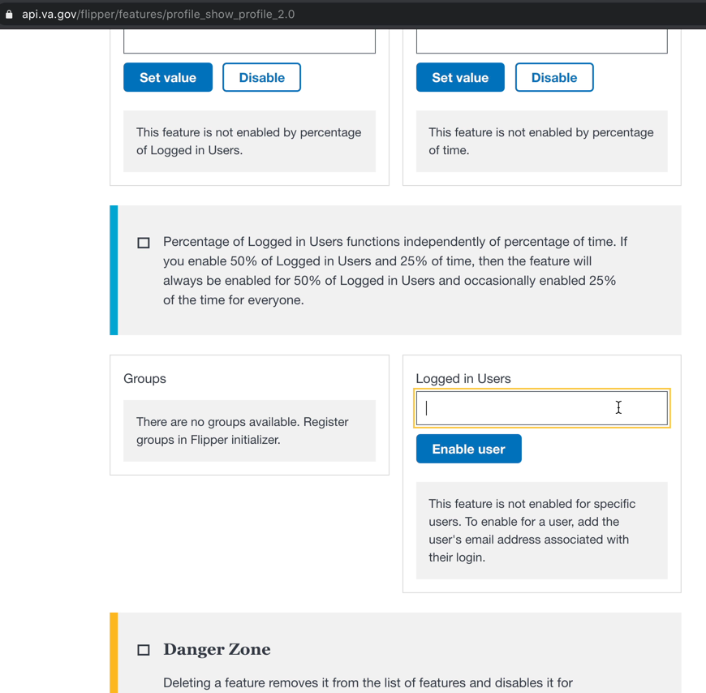
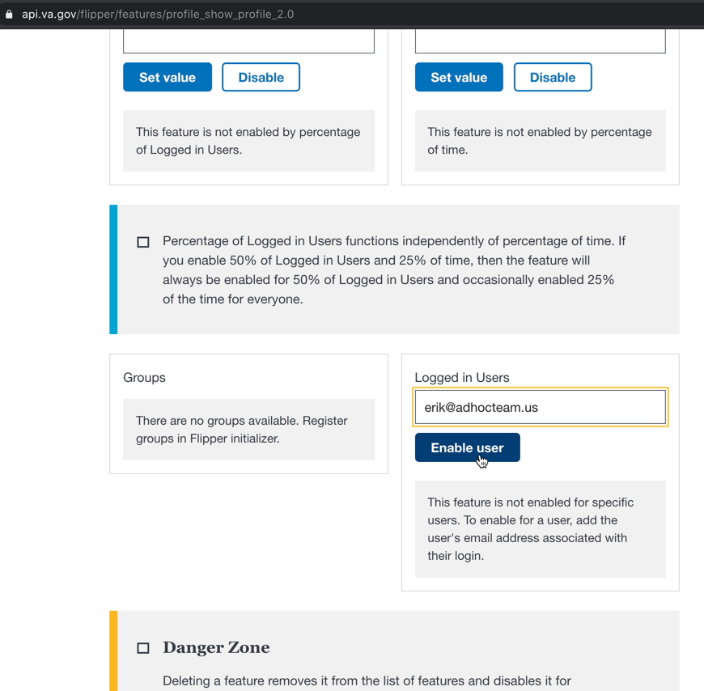
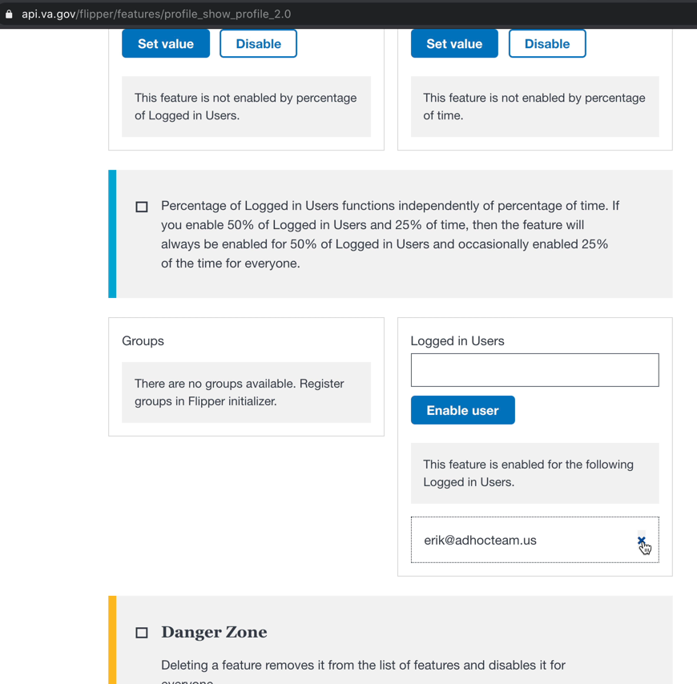

# How to turn on Profile 2.0 for a specific user for UAT

> Before you get started, the following two items must be true:
> 
> - [ ] You have an identity-verified (LOA3) ID.me account that you use to sign into VA.gov. If you do not have one, you can create one.
> - [ ] The email address you use for your LOA3 ID.me account is added to the list of `admin_user_emails` in the `vets-api config/settings.yml` file: <https://github.com/department-of-veterans-affairs/vets-api/blob/master/config/settings.yml#L458>

Once you have an LOA3 account set up and you are authorized to modified the Flipper feature flags, do the following to turn on Profile 2.0 for a specific user:

1. Sign into VA.gov with your LOA3 account
1. Go to https://api.va.gov/flipper/features/profile_show_profile_2.0:

1. Scroll down to the `Logged In Users` section:

1. Enter the email address the user signs into VA.gov with and click the `Enable user` button:

1. When you finished with UAT for the specific user, remove them from the list of users by clicking on the `X` next to their name:

## If you do not already have an LOA3 ID.me account to sign into VA.gov:

1. Create an ID.me account:
	1. Go to VA.gov and click the Sign In button in the upper right corner
	1. Click the `Create an ID.me account` button
	1. Follow the steps to create an account. I'd suggest using your work email address to create this account, but it's up to you.
1. Verify your identity:
	1. Sign into VA.gov with your ID.me account
	1. Go to https://www.va.gov/verify to start the identity verification process

## If your LOA3 account email address is not on the list of `admin_user_emails`:

1. Open a PR into `vets-api` to get your sign in email added to the list of `admin_user_emails`. You can ask an engineer to do this for you.
