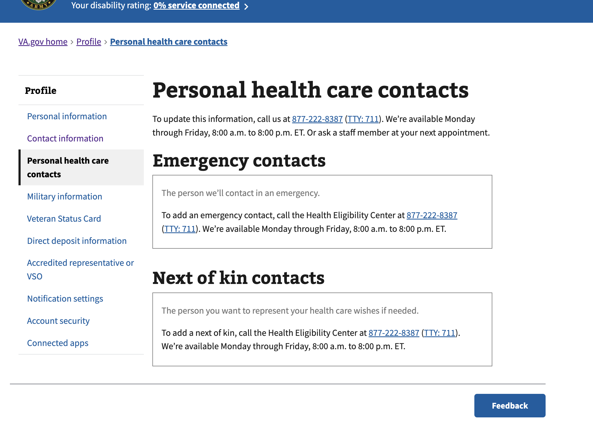

# va.gov/profile/contacts

Next-of-Kin/Emergency Contact (NOK/EC), aka Personal health care contacts within VA.gov Profile


## Diagram

```
Veteran
  ->
[vets-website]
url: va.gov/profile/contacts
  ->
[vets-api]
url: api.va.gov/v0/profile/contacts
  ->
[VA Profile API | Health Benefit Bio]
url: fwdproxy.vfs.va.gov/profile-service/profile/v3/:oid/:icn_aaid
body: { bios: [{ bioPath: 'healthBenefit' }] }
```


## Timeline

- 20250827 ~12PM ET -- Heather Justice reports `va.gov/profile/contacts` are not visible in staging or production. [[dsva.slack.com discussion](https://dsva.slack.com/archives/C04DRS3L9NV/p1756310274836819)] [[github issue](https://github.com/department-of-veterans-affairs/va.gov-team/issues/118368)]



- 20250828 11:30AM ET -- Heather Justice reports VA Profile API is able to surface data for user+27 (meaning vets-api code is the likely culprit). [[dsva.slack.com discussion](https://dsva.slack.com/archives/C04DRS3L9NV/p1756394950657739?thread_ts=1756310274.836819&cid=C04DRS3L9NV)]


## Details

```json
// response from staging-api.va.gov/v0/profile/contacts

{"errors":"Access token body does not match signature"}

// indicates JWT.decode() failed in vets-api/app/services/sign_in/access_token_jwt_decoder.rb
```

```json
// response from api.va.gov/v0/profile/contacts

{"data":[]}
```


## Possibilities

- Authenticating with incorrect identifier (using ID.me/Login.gov UUID when we should be using EDIPI or ICN)
- Response comes back with `camelCaseKeys` and is not converted to `snake_case_keys`
- Call to `Sentry.set_extras()` breaks the code -- unlikely
- `VAProfile::Profile::V3::Service#get_health_benefit_bio()` calls `VAProfile::Profile::V3::HealthBenefitBioResponse.new()` and fails to parse the response body correctly.


## Questions

- How can I see what the response is from the VA Profile API? -- **In staging environment, log VA Profile response**
- How can I add metadata about the response from VA Profile API to the response from api.va.gov? -- **Add `meta:` output to response in controller**


## Resources

- [VA Profile | Swagger/OpenAPI Docs](https://dvagov.sharepoint.com/sites/OITEPMOVAPROPUB/SitePages/Swagger-UI-Links.aspx)
- [GitHub | Staging test accounts](https://github.com/department-of-veterans-affairs/va.gov-team-sensitive/blob/master/Administrative/vagov-users/staging-test-accounts-next-of-kin-emergency-contact.md)
- [Datadog | VA.gov Profile](https://vagov.ddog-gov.com/dashboard/86m-u8e-z5x/authenticated-experience-profile)
- [Datadog | Logs](https://vagov.ddog-gov.com/logs)
  - search: `source:vets-api @http.referer:"https://www.va.gov/profile/contacts" status:error`
  - search: `source:vets-api VAProfile\:\:Profile\:\:V3\:\:Service`
  - search: `source:vets-api VET360\_*`

---

### Bug | NoMethodError: undefined method 'dig' for an instance of String

- 20251002 - Discovered when searching logs

```
v3/health_benefit_bio_response.rb:18:in `initialize': undefined method `dig' for an instance of String (NoMethodError)
```

Frequency: 7 occurences over 15 days.

Write a spec to handle when `response.body` is a string.
